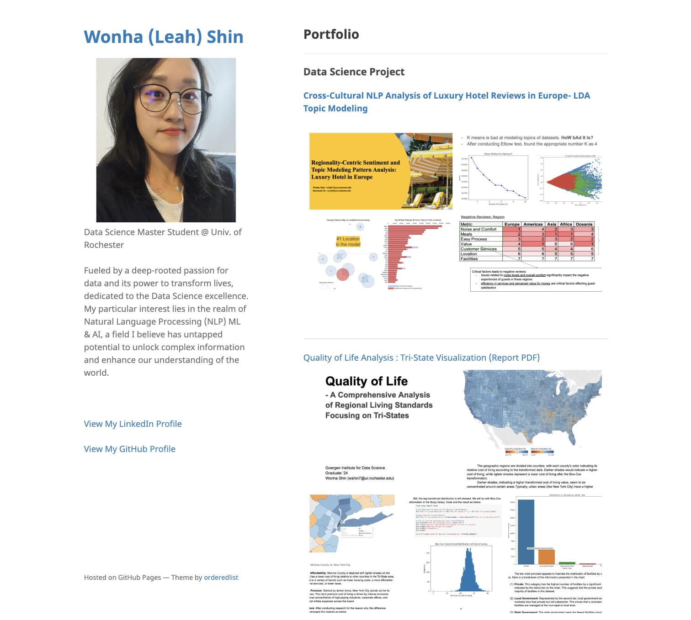

# [Leah's Data Science Journey 🚀]

***Obsessed with data—because who isn't?*** :smile:  

Studied International Trade & Economics from Busan, South Korea, worked at Accounting Dept from a skincare company located in NYC, and then, now began a new journey as Data Scientist. Pursuing to unlock ML/AI power for complex information to enhance our understanding of the world.
Driven by an unquenchable thirst for data, and fueled by the belief that a good dataset can solve more problems than a superhero.  
  
:sparkles: See my portfolio here. [[Portfolio Blog]](https://leahnote01.github.io/)  
**Please take a look on my projects and the most updated resume✨**

  
## Contents
- Data Science Cheatsheets
- Today What I Learned for 40 days in Summer, 24
- 🤔 More to be added

  

---

####  License
The MIT License (MIT)
Copyright (c) 2013-2020 Michael Rose and contributors
