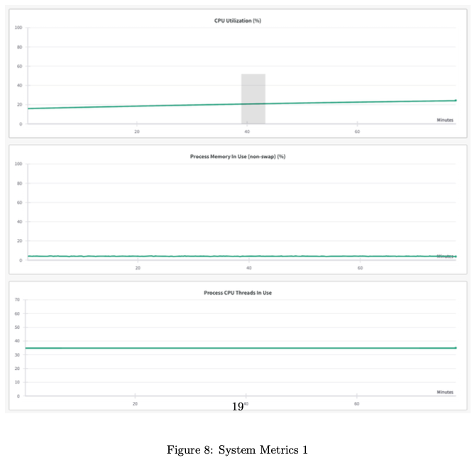
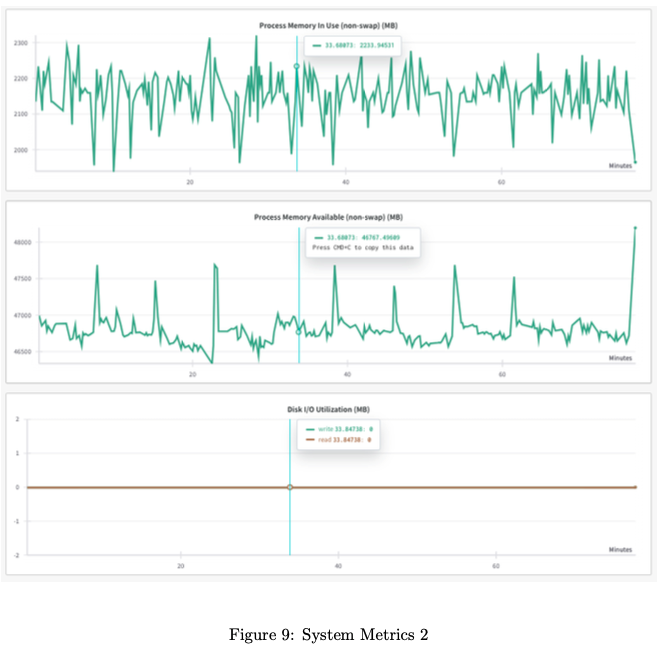

# Optimization through Data Loading, Profiling, & Scailing, and Comparison of Data Parallel & Distributed Data Parallel

<Br><br>

Effective management of data and resource optimization is essential in deep learning processes. In my latest research for Homework 3 of this course, I focused on optimizing data loading settings, employing mixed precision training, and implementing scaling strategies to enhance both speed and memory efficiency. I'll start by discussing the main insights and lessons learned. 

### Optimizing Data Loading with `num_workers`

> This task aimed to analyze the impact of the `num_workers` parameter in PyTorch's `DataLoader` on data loading speed and efficiency. We aimed to identify **the optimal configuration for faster data handling** by varying the number of subprocesses used for <u>data loading.</u>

#### Methodology

- **Dataset:** A preloaded training dataset with moderate complexity was used.
- **Experiment Setup:**
  - Created a script focused solely on iterating through all training batches.
  - Varied the `num_workers` parameter from 1 to 10.
  - Measured the total runtime for loading all batches.
- **Default Behavior:**
  - When `num_workers=0`, data loading is performed sequentially in the primary process, typically the slowest setting.<br><Br>


#### Result

1. **Runtime Trends:**
   - Performance Gains: Data loading time significantly decreased as `num_workers` increased from 0 to 2.
   - Optimal Setting: The fastest runtime was observed at `num_workers=2`.
   - Performance Plateau: Increasing `num_workers` beyond 2 leads to diminishing returns and even **slight performance degradation due to overhead** from managing additional processes. 

2. **Insights**
   - For <u>small datasets or less complex tasks,</u> the **default** setting (`num_workers=0`) is adequate.
   - Using **parallel data loading with multiple workers** significantly **enhances efficiency** for larger datasets. <br><br>
     
   - The plot illustrates the relationship between `num_workers` and data loading time. It shows a clear performance peak at 2 workers. Beyond this point, the additional overhead outweighed the benefits of parallelism. <br><br>


#### Conclusion

The experiment emphasized the significance of adjusting the `num_workers` parameter according to **dataset size and system capacity**. Although the ideal value may differ among tasks, <u>comprehending its effect is essential for enhancing efficiency in data-intensive pipelines.</u> <br><br>


### Exploring Mixed Precision Training

> This task focused on implementing and analyzing mixed precision training through PyTorch's `torch.amp` module. The objective was <u>to grasp how mixed precision decreases memory usage and speeds up training while ensuring numerical stability.</u> 


#### Methodology

- **Implementation**
  - Enabled mixed precision using `torch.cuda.amp.autocast()` for the forward pass and `GradScaler` to prevent gradient underflow during backpropagation.
  - Compared mixed precision training with full precision training using W&B logs.
- **Metrics Evaluated**
  - **Training Loss Dynamics**: Tracked for convergence behavior.
  - **System Metrics:** Included GPU memory usage, total runtime, and hardware utilization. <br><br>

#### Results

1. **Training Loss Dynamics**
   - Training loss decreased steadily and stabilized at ~0.33 <u>in both mixed and full precision.</u>
   - No significant loss of precision was observed with mixed precision.
2. **System Metrics**
   - Memory Usage: Mixed precision reduced GPU memory consumption by ~30%.
   - Runtime Efficiency: Training time per epoch was reduced by ~20%, demonstrating the computational benefits of FP16 operations on NVIDIA Tensor Cores.
3. **Challenges** 
   - Validation loss and accuracy trends suggested overfitting, potentially due to insufficient model capacity or suboptimal hyperparameters. <br><br>

#### Key Learnings

- **Memory Efficiency**

  - Mixed precision uses <u>FP16 for most computations</u> while retaining FP32 for critical operations, <u>reducing memory requirements by nearly half.</u>
  - This allows training larger models or using larger batch sizes on the same hardware.

- **Speedup**

  - Hardware optimized for FP16 (e.g., Tensor Cores) delivers significant performance gains in training throughput.

    

    


#### Conclusion

Mixed precision training is a powerful technique for improving resource efficiency in deep learning. By carefully integrating AMP into training pipelines, <u>we can achieve faster runtimes and lower memory usage without sacrificing model performance.</u> <br><br>


### Multi-GPU Training in PyTorch

> Multi-GPU training speeds up deep learning model training by distributing computations. Two popular PyTorch methods for multi-GPU training are DataParallel and DistributedDataParallel (DDP). In this section, I could evaluate the differences between these methods, concentrating on the effort required to modify code, runtime efficiency, and flexibility.


#### Data Parallel

- **Overview**
  - A straightforward way to parallelize training across GPUs.
  - <u>Automatically splits data across GPUs and aggregates gradients on the primary GPU</u>.<br><br>


- **Code Modification**: Minimal changes are needed to adapt a single-GPU script for DataParallel. We only use `torch.nn.DataParallel.` (This is the significant advantage we gain when using DataParallel compared to DDP.)

  ```python
  # Single GPU
  model = ToyModel()
  
  # Using DataParallel
  model = torch.nn.DataParallel(model)
  ```

- **Dataloader**: <u>No changes required.</u><br><Br>


#### Distributed Data-Parallel (DDP)

- **Overview** 

  - Requires <u>a distributed process group</u>, where each GPU handles its process.
  - Gradients are aggregated in a distributed manner, improving performance.<Br><br>

- **Code Modification**: <u><I>DDP involves additional steps</I></u>

  1. **Initialize Process Group**

     ```python
     import torch.distributed as dist
     dist.init_process_group(backend='gloo', rank=rank, world_size=world_size)
     ```

     

  2. **Assign GPU to Process**

     ```python
     model = ToyModel().to(rank)
     ddp_model = torch.nn.parallel.distributedDataParallel(model, device_ids=[rank])
     ```

     

  3. **Use Distributed Sampler**

     ```python
     sampler = torch.utils.data.distributed.DistributedSampler(dataset)
     dataloader = DataLoader(dataset, sampler=sampler)
     ```

     <br><Br>

#### Comparison





1. **Workload to Modify Code**

   - DataParallel: Easier to implement with fewer modifications.
   - DDP: **More** **complex** <u>due to process group initialization and sampler adjustments.</u> 

2. **Runtime Efficiency**

   - DataParallel: Less efficient for large-scale training due to bottlenecks when aggregating gradients on the primary GPU.
   - DDP: **Faster** <u>for large datasets and complex models as gradient computation is distributed.</u> 

3. **Flexibility**

   - DataParallel: Suitable for small-scale tasks <u>where simplicity is prioritized.</u>

   - DDP: Ideal for large-scale distributed training <u>in multi-node environments.</u> <Br><br>

     

#### Conclusion

For small-scale experiments, **DataParallel** is an excellent starting point due to its simplicity. However, for large-scale training or multi-node experiments, **DistributedDataParallel** offers unparalleled efficiency and scalability. Understanding the trade-offs between these methods helps tailor the training pipeline to specific hardware and performance needs. 

<Br><br>


