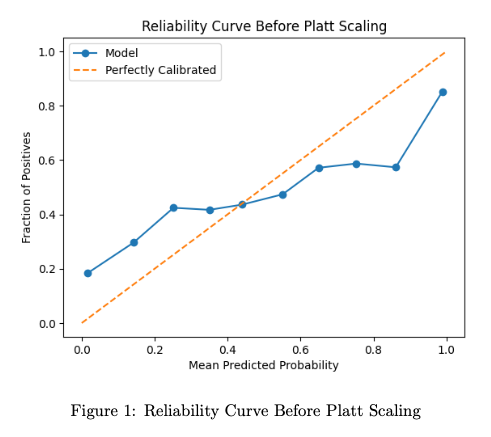
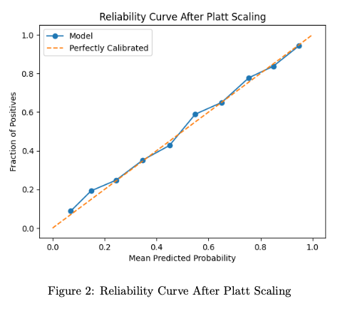

# Model Calibration (Platt Scaling & Label Smoothing) and Conformal Prediction (Naive and Adaptive Predictions Sets)

<br><br>

**Model Calibration** ensures that predicted probabilities align with actual likelihood, which is crucial in high-stakes applications like medical diagnosis, finance, and autonomous systems. A well-calibrated model provides accurate <u>uncertainty estimation</u>, improving reliability and trustworthiness.

In this posting, I will explore:

1. **Model Calibration**: Using **Platt Scaling** and **Label Smoothing** to adjust a model's confidence levels.
2. **Conformal Prediction (CP)**: Generating **prediction sets** instead of single predictions to quantify uncertainty.<br><Br>


## 1. Model Calibration

Model calibration ensures that a model's predicted probabilities **match real-world occurrences.** For example, if a model predicts **a 90% likelihood of an event**, that event should happen **90% of the time.** <br><br>

### Metrics for Calibration

- **Reliability Curve**: A plot of **predicted probabilities** vs. **actual frequencies.**
- **Expected Calibration Error (ECE):** Measures the difference between predicted probabilities and actual frequencies.
- **Maximum Calibration Error (MCE):** The worst-case calibration error.


#### 1.1 Platt Scaling

Platt Scaling is a post-processing method that applies logistic regression to recalibrated probabilities. It refines raw model output ($z$) into well-calibrated probabilities using:

<center>
  $P(y=1 \vert z) = \frac{1}{1+e^{A_z + B}}$ <br><br>
</center>

where, $A,B$ are learned from a validation set.


##### Implementation Steps

1. **Train a ResNet-18 binary classifier** on the **CIFAR-10 (dog vs. cat) dataset.**
2. **Extract logits** from a validation set.
3. **Fit a logistic regression model** to the logits to learn $A,B$.
4. **Apply the transformation** to obtain calibrated probabilities.
5. **Plot reliability curves** before and after Platt Scaling. <br><br>

##### **Results**

<center>
  <br><br>
  <br><br>
</center>

- **Before Platt Scaling**: The reliability curve <u>deviated from the diagonal,</u> indicating <u>overconfidence</u>. 

- **After Platt Scaling:** The curve <u>aligned closely with the diagonal,</u> demonstrating improved calibration.

- **Conclusion**: The curve aligned closed with the diagonal, demonstrating improved calibration.

  ```python 
  # Obtain logits and labels from the validation set
  
  model.eval()
  val_logits = []
  val_labels = []
  with torch.no_grad():
    for inputs, labels in val_loader:
      inputs = inputs.cuda()
      outputs = model(inputs)
      val_logits.extend(outputs.cpu().numpy().ravel())
      val_labels.extend(labels.numpy())
  
  # Fit logistic regression for Platt Scaling
  val_logits = np.array(val_logits).reshape(-1, 1)
  val_labels = np.array(val_labels)
  platt_scaler = LogisticRegression(solver=’lbfgs’)
  platt_scaler.fit(val_logits, val_labels)
  
  # Apply Platt Scaling to obtain calibrated probabilities
  def platt_scaled_probability(logit):
    logit = np.array(logit).reshape(-1, 1)
    return platt_scaler.predict_proba(logit)[:, 1]
  ```

  <br><Br>

#### 1.2 Label Smoothing

<u>Label Smoothing **modifies one-hot labels** by redistributing probability mass, preventing the model from becoming overconfident.</u>

Instead of assigning 100% probability to the correct class ($y=1$), label smoothing adjusts it to:

<center>
  $y_{smooth} = (1-a)y + \frac{\alpha}{K}$ <br><br>
</center>

where $\alpha$ controls the smoothing factor and $K$ is the number of classes. <br><br>

##### Implementation Steps

1. **Train a ResNet-18 model** from scratch with <u>smoothing values of 0.1, 0.2, and 0.3.</u>
2. **Evaluate reliability curves** for different smoothing values.
3. **Compare smoothing with and without Platt Scaling.**<br><Br>


##### Results

- Apply Label Smoothing After Training 

  | Smoothing | Reliability Curve Alignment | Overconfidence Reduction      |
  | --------- | --------------------------- | ----------------------------- |
  | 0.1       | Slight improvement          | Still overconfident           |
  | 0.2       | Best balance                | <u>Reduced overconfidence</u> |
  | 0.3       | Close to ideal, but noisy   | Might underfit                |

  - Smoothing **0.2** provides the best balance, significantly reducing overconfidence while maintaining model accuracy.


- Train the Model from Scratch Using Label Smoothing

  | Smoothing | Reliability Curve Alignment                               | Overconfidence Reduction |
  | --------- | --------------------------------------------------------- | ------------------------ |
  | 0.1       | Improved, but still some deviations in high-probabilities | Still overconfident      |
  | 0.2       | <u>Best balance</u>                                       | Reduced overconfidence   |
  | 0.3       | Close to ideal, but slightly fluctuating                  | Might underfit           |

  - Applying smoothing at levels **0.2 and 0.3** enhances calibration, <u>but Platt Scaling from the previous section (Apply label smoothing after training) demonstrates an even diagonal reliability curve.</u> <br><br>

- Comparison with Platt Scaling and Label Smoothing
  - While label smoothing (especially at 0.2 and 0.3) improves calibration, Platt Scaling directly aligns the reliability curve with the diagonal. Platt Scaling is a more targeted post-processing approach for calibration. In contrast, <u>label smoothing is integrated during training.</u>
  - After training without label smoothing, <u>Platt Scaling achieves the closest alignment to the perfect calibration line</u>. However, <u>training from scratch with label smoothing (0.2 or 0.3) provides a reasonable alternative</u>, yielding a well-calibrated model **without post-processing.**<br><Br>


### **1.3 Combining Platt Scaling with Label Smoothing**

- **<u>Smoothing values of 0.2 and 0.3, combined with Platt Scaling, provide the most accurate calibration.</u>** They align the model's predictions closely with actual outcomes, even in the higher probability regions.
- **Higher smoothing values (0.2 and 0.3)** help with initial calibration, mainly <u>before Platt Scaling</u> is applied, making the model less overconfident in its predictions.
- Also, Platt Scaling effectively improves the model’s calibration for all levels of label smoothing, ensuring that the reliability curves closely match the perfectly calibrated line.<br><Br>


## 2. Conformal Prediction

Uncertainty quantification is essential to deep learning applications, especially in critical domains like healthcare and autonomous systems. I explored **Conformal Prediction (CP)**, a framework that provides prediction sets with reliable coverage guarantees. The object was implementing **Naive and Adaptive Prediction Sets Algorithms** using a pre-trained ResNet Model.  <br><br>


### Understanding Conformal Prediction

Traditional deep learning models provide a single-point prediction with a confidence score (e.g., softmax probability). However, these confidence scores can be **miscalibrated** and fail to deliver reliable uncertainty estimates. **Conformal Prediction** addresses this limitation by generating **multiple possible prediction sets** while guaranteeing a **confidence level.** 

Mathematically, conformal prediction ensures that:  

<center>
$1-\alpha \leq P(Y \in \tau(X)) \leq 1-\alpha + \frac{1}{(n+1)}$ <br><Br>  
</center>

Where:

- $\alpha$ is the significance level,
- $X$ is the input,
- $Y$ is the true label,
- $\tau (X)$ is the prediction set.

The main concept is <u>to utilize a scoring function</u> to assess how closely the model's predictions align with the actual labels and then establish **quantiles** to form prediction sets. <br><br>

#### 2.1 the Naïve Prediction Set Algorithm

The naïve method constructs a prediction set by including classes until the cumulative probability surpasses a predefined threshold. 

**Implementation Steps**

1. **Prepare the datasets**

   - Used `softmax_outputs.npy` for predicted probabilities.
   - Used `correct_classes.npy` for ground-truth labels. 

2. **Split the data**

   - The first **2000 samples** are used for **calibration**.
   - The remaining samples are for **validation**.

3. **Calculate scores**

   - The score function is simply the probability assigned to the true class: 

     <center>
       $s(X,Y) = 1-\hat{f}(X)_Y$ <br><br>
     </center>

   - Compute the quantile threshold $\hat{q}$ using:
     <center>
       $\hat{q} = Quantile(s_1, \dots, S_n; 1- \alpha $
     </center>

4. **Generate prediction sets**

   - Include the top $k$ classes until their cumulative probability exceeds $1-\hat{q}$.
   - **Iterate through softmax outputs** until the **cumulative probability surpasses** the threshold.  <br><Br>

**Results**

- **Empirical coverage: 98.66%**
- **Key observation:** The **naïve method** produces **small prediction sets** but can occasionally miss the true class, affecting reliability. 
- Coverage slightly below **99**% meaning some samples were **miclassified** without correction. <Br><br>


#### 2.2 the Adaptive Prediction Set Algorithm

The  ensures that the true label is always included by dynamically adjusting the prediction set.

**Implementation Steps**

1. **Score function:**

   - Instead of considering **only** the probability of the true label, accumulate **probabilities** until the true label is reached. 

   - **Ensure** that the true label is **always present.**  

     

     <center>
      $ s(X,Y) = \sum_{j=1}^k \hat{f}(X)_{\pi_j}$ <br><br>
     </center>


2. **Compute quantile threshold**
   - Compute the quantile threshold $\hat{q}$ based on the sorted scores.

3. **Generate Adaptive Prediction Sets**
   - **Continue adding classes** until the <u>true label is included.</u> <br><br>


**Results**

- **Empirical Coverage:** 99.72%
- **Higher coverage** than naïve method, ensuring the true label is always included.
- **Larger prediction sets,** which <u>reduces interpretability.</u><br><br>


#### **2.3 Comparing Naïve vs. Adaptive Methods**

| Aspect              | Naïve Method                    | Adaptive Method                      |
| :------------------ | ------------------------------- | ------------------------------------ |
| Coverage            | 98.66%                          | 99.72%                               |
| Prediction Set Size | Smaller                         | Larger                               |
| Reliability         | Occasionally misses true labels | **Always** includes true labels      |
| Efficiency          | Faster                          | Slightly slower due to set expansion |

**Main Insights**

1. **Naïve method is efficient but unreliable**
   - It <u>sometimes omits</u> the true label, leading to <u>misclassification risks.</u>
   - <u>Smaller sets</u> improve interpretability, but at the cost of <u>lower coverage.</u>
2. **Adaptive method ensures full coverage but at a cost**
   - Always includes the <u>correct label</u>, making it more <u>reliable</u>.
   - <u>Larger sets reduce interpretability</u>, as multiple labels might be included unnecessarily.
3. **Trade-off: Interpretability vs. Coverage**
   - If <u>interpretability</u> is crucial, the <u>naïve</u> method is preferable.
   - If <u>accuracy</u> is the prority, the <u>adpative</u> method is the best choice. <br><br>

### Conclusion

Conformal Prediction provides a mathematically rigorous approach to **uncertainty quantification.** Through this homework, I could learn:

- <u>How to implement naïve and adaptive prediction sets.</u> 
- The <u>importance of quantile calibration</u> in deep learning.
- <u>Trade-offs</u> between compactness and reliability.

As deep learning models become increasingly deployed in real-world applications, techniques like conformal prediction will e essential for making reliable and interpretable AI systems. <br><Br>
