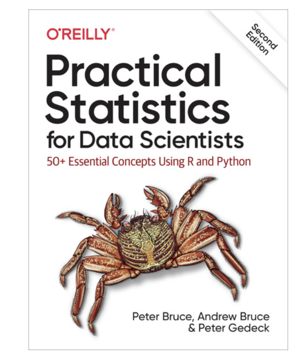

# The Ongoing Chronicles of TIL25 — A Motivating Expedition as a Data Scientist & AI/ML Engineer Candidate

    
  <I><Image: Busan, South Korea; Captured by myself></I>  

> <i><b>"There are always moments that feel like a disaster before they happen, but afterward, I never regret having gone through them." -From my developer diary...</b></i>

When summer arrived last year, I faced a storm of challenges. *Despite pouring my hopes into landing an internship, I was met with three interview rejections and countless silent rejections—no callbacks, no updates.* At the same time, I was navigating my first year in the Master of Data Science program at the University of Rochester, and often found myself feeling lost.

Looking back, I now admit:  
<i>I barely coded. I used machine learning libraries without a deep understanding of how they worked. The math behind the algorithms? A blur.</i>  

So I made a choice—**to start again from the ground up.**

I launched the **TIL_24 Project: Today I Learned**, dedicating myself to revisiting the core fundamentals of data science—statistics, probability, and machine learning. *I immersed myself in libraries, cafes, and cozy corners, determined to rebuild my foundation. I documented each day of learning, from code snippets to conceptual summaries, all organized into a long-form, structured format.*

What started as a summer project for "just 40 weekdays" grew into a full-blown journey—**over 80 days** of learning during the break, and eventually **108 days in total** across the year. TIL25 extended through my fall semester, where I tackled Deep Learning topics alongside formal lectures. 

And I’ll never forget the ***spark*** I felt when abstract math and code finally clicked together—when I understood not just how an algorithm worked, but *why*.

 

## 📘 Kicking Off 2025 with a New Chapter

Now, as I continue this journey into 2025, I’m bringing a new focus to the TIL series—**statistical thinking for real-world applications**. To guide me, I’ve chosen a fantastic book:

### _Practical Statistics for Data Scientists (2nd Edition)_ 

[O'Reilly Book](https://learning.oreilly.com/library/view/practical-statistics-for/9781492072935/)

    

This book is a **treasure chest of applied insights**. It doesn’t just explain statistical concepts in theory—it **shows how they power real-world data science workflows**. It connects <u>the dots between foundational methods and the tools we use in practice. From Python & R's various packages to resampling techniques and statistical tests, it offers bite-sized, example-rich explanations that feel directly usable.</u>
- Exploratory data analysis
- Probability distributions and statistical testing
- Regression, classification, and resampling
- Statistical machine learning foundations

I’m excited to explore this book in parallel with hands-on coding and real datasets—building statistical fluency, one chapter at a time.

 

## 🌱 Keeping the Dream Alive

This project is personal. It’s my way of moving one step closer to that **dream job in AI/ML**—a role where I can turn my passion for machine learning and NLP into systems that genuinely make an impact.

So here’s to TIL25 and beyond.  
Here’s to staying consistent, curious, and hopeful.  
Here’s to building, learning, and dreaming big—day by day.

**Let’s keep this rolling. 🚀**

Thank you for being part of this journey.

*Warmly,*  
**Wonha Shin**
