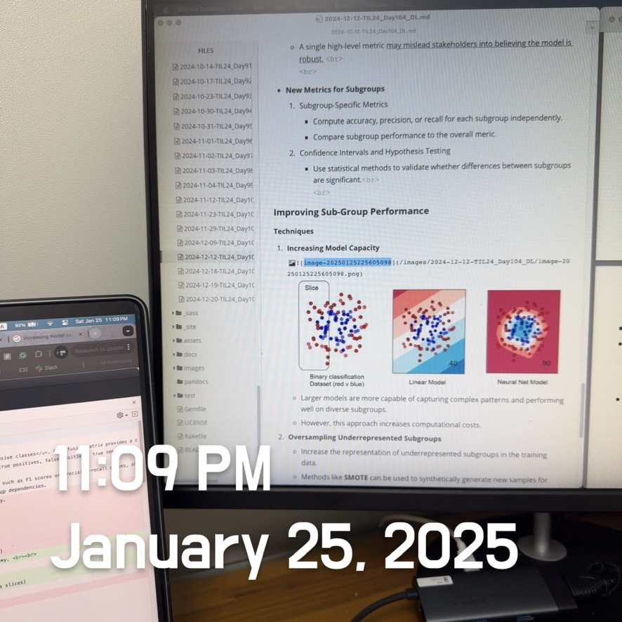

# Practical Statistics of Data Scientists: Elements of Statistical Terminologies- Structured Data, Rectangular Data, etc.

  

*Book Source: Practical Statistics for Data Scientists, 2nd Edition, by Peter Bruce, Andrew Bruce, Peter Gedeck / Released May 2020 / Publisher(s): O'Reilly Media, Inc.*

> Statisticians commonly refer to an "*estimate*" as a value derived from the available data, clearly distinguishing between observed data and the theoretical actual state of affairs. In contrast, data scientists and business analysts call this value a "*metric*." 

### Elements of Structured Data

#### **Key Terms for Data Types**

- **Numeric**: Data that are expressed on a numerical scale
  - **Continuous**: Data that can take on any value in an <u>interval</u>. (Synonyms: interval, float, numeric)
  - **Discrete**: Data that can take on only <u>integer values,</u> such as counts. (Synonyms: integer, count)

- **Categorical:** Data that can take on <u>only a specific set of values</u> representing a set of possible categories <u>(Synonyms: Enums, enumerated, factors, nominal)</u>
  - **Binary**: A special case of categorical data with <u>just two categories</u> of values, e.g., 0/1, true/false. <u>(Synonyms: dichotomous, logical, indicator, boolean)</u>
  - **Ordinal**: Categorical data that has an explicit ordering (Synonym: ordered factor)  

### Rectangular Data

> Rectangular data is the **general term** for a **two-dimensional matrix** with rows indicating records (cases) and columns indicating features (variables); **data frame** is the specific format in R and Python.

The data doesn't always start in this form: unstructured data(e.g., text) must be processed and manipulated to represent a set of features in the rectangular data.

#### Key Terms for Rectangular Data

- **Data Frame**: Rectangular data (like a spreadsheet) is the basic data structure for statistical and machine learning models.
- **Feature**: A column within a table is commonly called a feature.
  - Synonyms: attribute, input, predictor, variable
- **Outcome**: Many data science projects focus on predicting outcomes, frequently in a yes/no format. Features are sometimes employed to **predict** results in experiments or studies.
  - Synonyms: dependent variables, response, target, output
- **Records**: A row within a table is commonly called a record.
  - Synonyms: case, instance, observation, pattern, sample

##### Data Frames and Indexes

- In *Python*, with the *pandas* library, the basic rectangular data structure is a *DataFrame* object. 
  - Default: an automatic integer index is created
- In *R*, the basic rectangular data structure: *data.frame* object.
  - Default: an implicit integer index

##### Nonrectangular Data Structure

- **Time Series Data**: raw material for statistical forecasting methods such as IoT.
- **Spatial Data**: Used in mapping and location analytics 
  - Object: the focus of the data is an object (e.g., a house) and its spatial coordinates
  - Fiield: focuses on small units of space and the value of a relevant metric (e.g., pixel brightness)
- **Graph or Network**: physical, social, and abstract relationships  

### Estimates of Location

#### Key Terms for Estimates of Location

- **Mean**: The sum of all values divided by the number of values.
  - = average
- **Weighted mean**: The sum of all values times a weight <u>divided by the sum of the weights.</u>
  - = weighted average
- **Median**: The value such that <u>one-half of the data</u> lies above and below. 
  - = 50% percentile
- **Percentile**: The value such that $P$ percent of the data lies below.
  - = quantile
- **Weighted median:** The values are defined such that <u>one-half of the sum of the weights</u> lies above and below the sorted data.
- **Trimmed mean**: The average of all values after dropping a fixed number of extreme values.
  - = truncated mean.
- **Robust**: Not sensitive to extreme values.
  - = resistant
- **Outlier**: A data value that is very different from most of the data
  - = extreme value  

##### Median and Robust Estimates

- **Median**: Unlike the mean, which considers all observations, <u>the median focuses solely on the central values of sorted data.</u> Although this might appear to be a drawback, given that the mean is more responsive to variations, there are numerous cases where the median serves as a more effective measure of central tendency. 
  - The same applies to the **Weighted Mean**.
- **Weighted Median**: Similar to calculating the median, we start by sorting the data and assigning each value a specific weight. Rather than identifying the middle number, <u>the weighted median represents a value where the total of the weights is balanced between the lower and upper halves of the ordered list.</u> 
  - Like the median, the weighted median is robust to the outliers.  

### Estimates of Variability

> Commonly known as *dispersion*, it assesses whether data values are *closely grouped or widely distributed.*

At the core of statistics is variability, which involves **measuring**, **reducing**, and **differentiating between random and genuine variability**. It also includes **identifying** the various sources of true variability and making informed decisions in its presence. 

#### Key Terms for Estimates of Variability

- **Deviations**: The difference between the observation and estimate of the location.
  - = errors, residuals
- **Variance**: The sum of squared deviations from the mean divided by $n-1$ where $n$ is the number of data values.
  - = mean-squared-error
- **Standard deviation:** The square root of the variance
- <u><b>Mean Absolute Deviation</b>: The mean of the absolute values of the deviations from the mean.</u>
  - <u>= L1-norm, Manhattan Norm</u>
- **Mean absolute deviation from the median**: The median of the absolute values of the deviations from the median.
- **Range**: The difference between the <u>largest and the smallest</u> value in a data set.
- **Order statistics**: Metrics based on the data values sorted from smallest to biggest.
  - = ranks 
- **Percentile**: The value such that $P$ percent of the values take on this value or less, and $(100-P)$ Percent take on this value or more.
  - = quantile
- **Interquartile Range**: The difference between the 75th percentile and the 25th percentile
  - = IQR
- 

