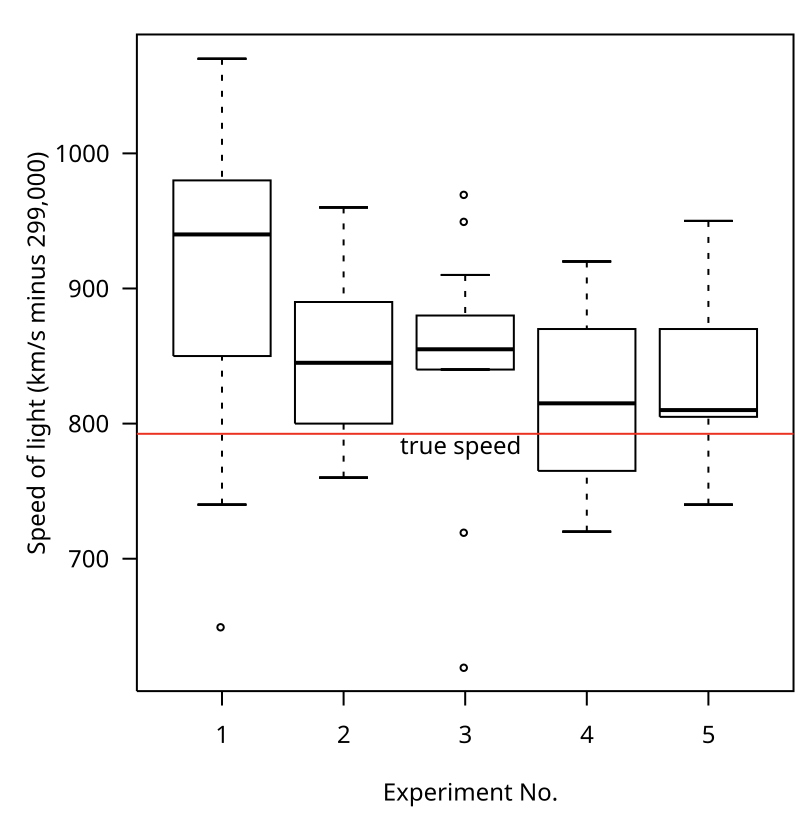
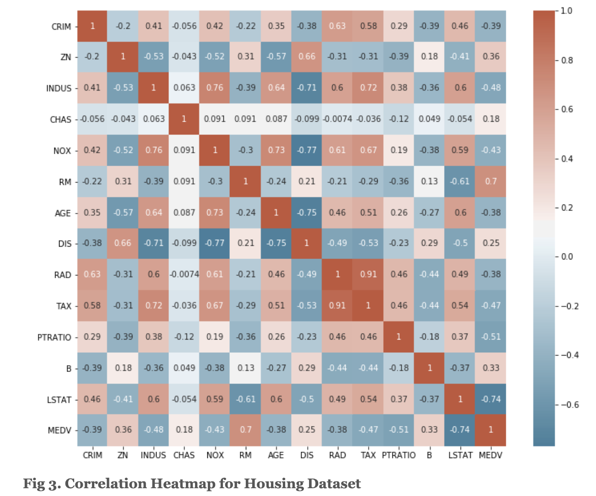
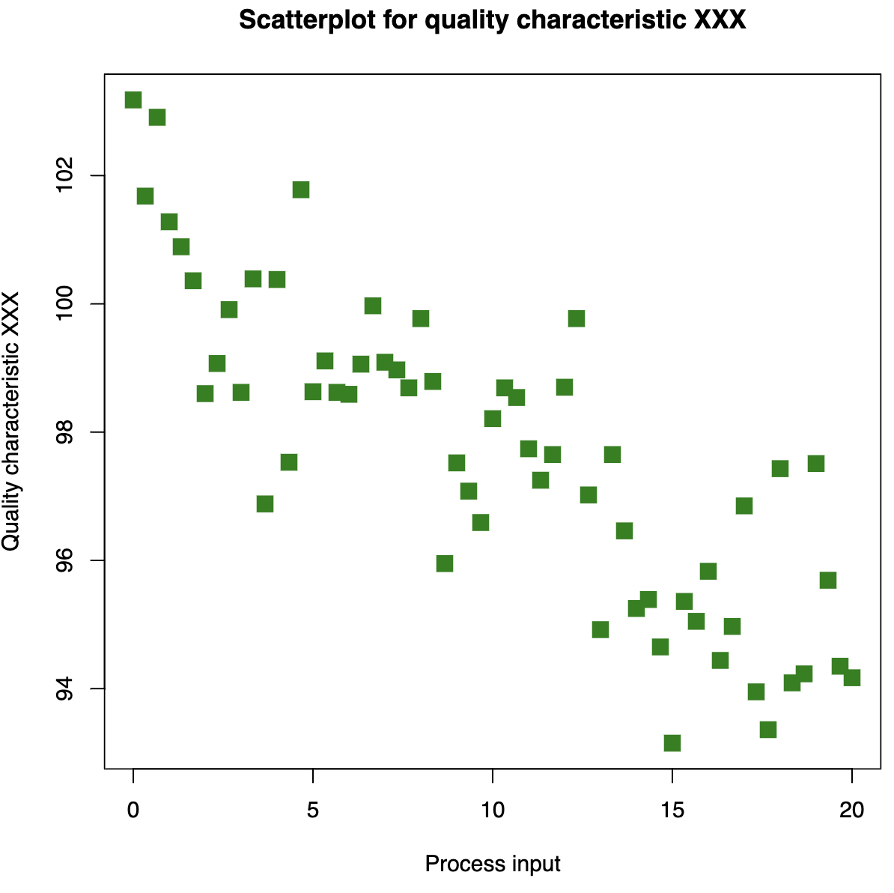
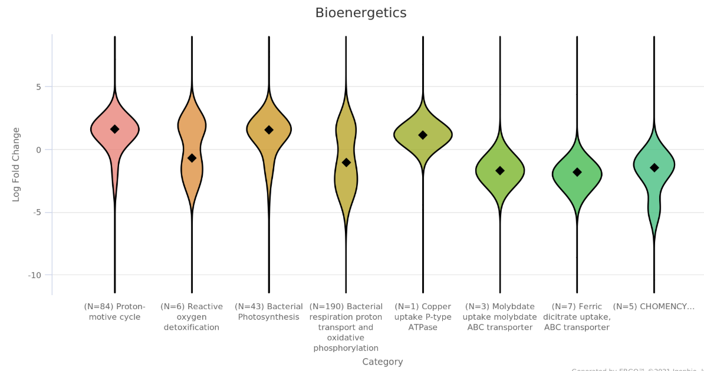
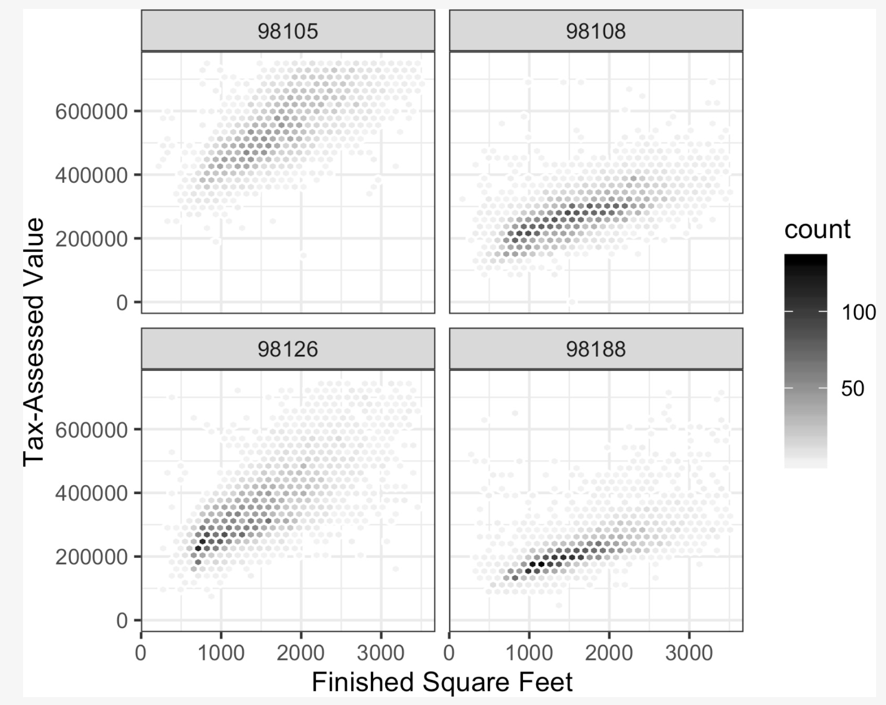

# Practical Statistics of Data Scientists: Data Distribution, Correlation, and Various Data Visualization Plots

 <bR><Br>

*Book Source: Practical Statistics for Data Scientists, 2nd Edition, by Peter Bruce, Andrew Bruce, Peter Gedeck / Released May 2020 / Publisher(s): O'Reilly Media, Inc.*

### Data Distribution

#### Key Terms for Exploring the Distribution

- **Boxplot**: a plot to visualize the distribution of data
  - = box and whiskers plot
- **Frequency Table**: A tally of the count of numeric data values with a set of bins
- **Histogram**: A plot of a frequency table with the bins on the x-axis and count on the y-axis.
- **Density Plot**: A smooth version of the histogram.<br><br>

#### Percentiles and Boxplots

Boxplots are based on percentiles and give a quick way to visualize the data distribution. The code snippet below is an example of R and Python, respectively.

- In R, with the `quantile` function and use `boxplot`

  ```R
  quantile(state[['Murder.Rate']], p=c(.05, .25, .5, .75, .95))
  
  boxplot(state[['Population']]/1000000, ylab='Population (millions)')
  ```

- In Python, `pandas` dataframe provides it with `quantile` and `plot.box()`

  ```python
  state['Murder.Rate'].quantile([0.05, 0.25, 0.5, 0.75, 0.95])
  
  ax = (state['Population']/1_000_000).plot.box()
  ax.set_ylabel("Population (millions)")
  ```

  <br><Br>

##### How to Read Boxplot

- The top and bottom of the box are the <u>75th and 25th percentiles</u>, respectively.
- <u>The dashed lines,</u> called *whiskers*, extend from the top and bottom of the box to indicate the range for the bulk of the data.
- By default, the *R* function extends the whiskers to the furthest point beyond the box, except that <u>it will not exceed 1.5 times the IQR.</u>
- Outside of the whiskers, points are plotted as single points or circles. (outliers) <br><br>

<i>Image Source: [Wikipedia Boxplot](https://en.wikipedia.org/wiki/File:Michelsonmorley-boxplot.svg)</i>

<center>
  <br><br>
</center>


#### Frequency Tables and Histograms

- R

  ```R
  breaks <- seq(from=min(state[['Population']],
                  to=max(state[['Population']], length=11)
  pop_freq <- cut(state[['Population']], breaks=breaks. right=TRUE, include.lowest=TRUE)
  table(pop_freq)
  ```

- Python

  ```python
  binnedPopulation = pd.cut(state.['Population'], 10) # 10 bins
  binnedPopulation.value_counts()
  ```

- In a histogram, generally plotted such that:

  - Empty bins are included in the graph
  - Binsa re of equal width.
  - The number of bins (or, equivalently, bin size) is up to the user.
  - Bars are contiguous -- no empty space shows between bars, unless theere is an empty bin.<Br><Br>

### Binary and Categorical Data

#### Key Terms for Categorical Data

- **Mode**: The most commonly occurring category or value in a data set.
- **Expected Value**:  When the categories can be associated with a numeric value, this gives an average value based on a category's probability of occurrence.
- **Bar Chart**: The frequency or proportion for each category plotted as bars.
- **Pie Chart**: The frequency or proportion for each category plotted as wedges in a pie.


##### Example Code Snippet

- In R

  ```R
  barplot(as.matrix(dfw) / 6, cex.axis=0.8, cex.names=0.7,
          xlab='Cause of delay', ylab='Count')
  ```

- In Python

  ```python
  ax = dfw.transpose().plot.bar(figsize=(4, 4), legend=False)
  ax.set_xlabel('Cause of delay')
  ax.set_ylabel('Count')
  ```

  <br><br>

  

### Correlation

> In numerous modeling projects, exploratory data analysis focuses on **investigating correlations among predictors as well as between predictors and a target variable.** If both variable X and variable Y have measured data, they are considered positively correlated when high values of X correspond with high values of Y, and low values of X align with low values of Y. 

#### Key Terms for Correlation

- **Correlation Coefficient** 
  - A measure indicating <u>how closely numeric variables are related,</u> with a range from -1 to +1.

- **Correlation Matrix**

  - A table that displays variables along the rows and columns, with <u>cell values representing the correlations between them.</u>

- **Scatterplot**

  - A plot in which the x-axis is the value of one variable, and the y-axis the value of another.

- **Pearson's Correlation Coefficient** 

  - $r=\frac{\sum^n_{i=a}(x_i-\bar{x})(y_i-\hat{y})}{(n-1)s_x s_y}$

  - We multiply deviations from the mean for variable 1 times those for variable 2, and divide by the product of the standard deviations.

  - Note that we divide by $(n-1)$ , which is **the degree of freedom.**

  - The results always lies between $+1$ **(perfectly positive correlation)** and $-1$ (perfectly **negative** correlation); $0$ indicates **no** correlation.<br><br>

    Image Source: [Vitaflux : Correlation Heatmap with Seaborn](https://vitalflux.com/correlation-heatmap-with-seaborn-pandas/)

    <center>
      <br><br>
    </center>

- Other types of CoR CoE: *Spearman's rho* or *Kendall's tau*.<br><br>

  

#### Example Code Snippet

- In R, we can easily create with package `corrplot`.

  ```R
  etfs <- sp500_px[row.names(sp500_px) > '2012-07-01',
                  sp500_sym[sp500_sym$sector == 'etf', 'symbol']]
  library(corrplot)
  corrplot(cor(etfs), method='ellipse')
  ```

  

- In Python, the common packages do not provide an implementation to create the same graph; however, the most relevant option is using `seaborn.heatmap`.

  ```python
  etfs = sp500_px.loc[sp500_px.index > '2012-07-01',
                      sp500_sym[sp500_sym['sector'] == 'etf'][['symbol']]
  sns.heatmap(etfs.corr(), vmin=-1, vmax=1,
             cmap=sns.diverging_palette(20, 220, as_cmap=True)
  ```

<br><Br>

### Scatterplots

> The typical method for visualizing the relationship between two measured data variables is through a scatterplot.

- In R

  ```R
  plot(telecom$T, telecom$VZ, xlab='ATT (T)', ylab='Verizon (VZ)' )
  ```

- In Python

  ```python
  ax = telecom.plot.scatter(x='T', y='VZ', figsize(4, 4), marker='$\eff000')
  ax.set_xlabel('ATT (T)')
  ax.set_ylabel('Verizon (VZ)')
  ax.axhline(0, color='grey', lw=1)
  ax.axvline(0, color='grey', lw=1)
  ```

- Image Source: [Wikipedia - Scatterplot](https://en.wikipedia.org/wiki/Scatter_plot)

<center>
  <br><br>
</center>

<br><Br>

### Exploring Two or More Variables

#### Key terms for Two or More Variables

- **Contingency Table**  
  - A summary that counts occurrences for two or more categorical variables.  
- Hexagonal Binning  
  - A visualization of two numeric variables, where data points are grouped into hexagons.  
- Contour Plot  
  - A graphical representation of the density of two numeric variables, resembling a topographical map.  
- **Violin Plot**  
  - Comparable to a boxplot, but displays the distribution density across multiple values de

- **The suitable analysis type—bivariate or multivariate—relies on whether the data is numeric or categorical.** <Br><br>


#### Hexagonnal Binning and Contours (Numeric vs. Numeric)

- In R, the`ggplot2` package is excellent for conducting advanced exploratory visual analyses.

  ```R
  ggplot(kc_tx0, (aes(x=SqFtTotLiving, y=TaxAssessedValue))) +
  	stat_binhex(color='white') +
  	theme_bw() +
  	scale_fill_gradient(low='white'. high='black') +
  	labs(x="Finished Square Feet", y="Tax-Assesed Value")
  ```

  
  
- In Python, the `hexbin` method can be used.

  ```python
  ax = kc_tax0.plot.hexbin(x='SqFtTotLiving', y='TaxassessedValue',
                           gridsize=30, sharex=False, figsize=(5,4))
  ax.set_xlabel('Finished Square Feet')
  ax.set_ylabel('Tax Assessed Value')
  ```


For Contours, example code snippets as follows.

- In R, use `geom_density2d` function in `ggplot2`.

  ```R
  ggplot(kc_tx0, (aes(x=SqFtTotLiving, y=TaxAssessedValue))) +
  	stat_binhex(color='white') +
  	theme_bw() +
  	geom_point(alpha=0.1) + 
  	geom_density2d(color='white') +
  	labs(x="Finished Square Feet", y="Tax-Assesed Value")
  ```

- In Python, `seaborn kdeplot` can be used.

  ```python
  ax = sns.kdeplot(kc_tax0.SqFtTotLiving, kc_tax0.TaxAssesedValue, ax=ax)
  ax.set_xlabel('Finished Square Feet')
  ax.set_ylabel('Tax-Assessed Value')
  ```

  <br><br>


#### Two Categorical Variables

> A good method for visualizing two categorical variables is through a contingency table, which shows counts by category. We can also add column percentages and overall totals for further insight. 

- In R,  `CrossTable` function in the `descr` package is available.

  ```R
  library(descr)
  x_tab <- CrossTable(lc_loans$grade, lc_loans$status,
                     prop.c=FALSE, prop.chisq=FALSE, prop.t=FALSE)
  ```

- In Python, `pivot_table` method and `aggfunc` argument allow us to get the table.

  ```python
  crosstab = lc_loans.pivot_table(index='grade', columns'status',
                                 aggfunc=lambda x:len(x), margins=True) 
  #`margins` will add the cloumn and row sums
  
  df = crosstab.loc['A':'G', :].copy() # Create copy of the pivot table
  df.loc[:,'Charged Off':'Late'] = 
  	df.loc[:,'Charged Off':'Late'].div(df['All'],
                                       axis=0) # Devide the rows with the row sum
  df['All'] = df['All'] / sum(df['All'])  # Divide the 'all' column by sum
  perc_crosstab = df
  ```

  <br><br>

#### Categorical and Numerical Data

> **Boxplots** provide a straightforward method for visually comparing <u>the distributions of a numeric variable grouped by a categorical variable.</u> 

- In R

  ```R
  boxplot(pct_carrier_delay ~ airline, data=airline_stats, ylim=c(0, 50))
  ```

- In Python

  ```python
  ax = airline_stats.boxplot(by='airline', column='pct_carrier_delay')
  ax.set_xlabel('')
  ax.set_ylabel('Daily % of delayed Flights')
  plt.suptitle('')
  ```

<br><br>

Violin plots enhance boxplots by providing a density estimate along the y-axis. They reveal distribution nuances often missed by traditional boxplots. In contrast, boxplots effectively highlight outliers within the data set.

<center>
  <br><br>
</center>


### Visualizing Multiple Variables

Charts for comparing two variables—like scatterplots, hexagonal binning, and boxplots—can be easily adapted to multiple variables using the concept of *conditioning*. Once we receive results from the numerical values, we would like to delve deeper; we can incorporate multiple variables as shown below.<br><br>

Image source is from the book. (Practical Statistics for Data Scientists, 2nd Edition)

<center>
  </center>


<br><br>


