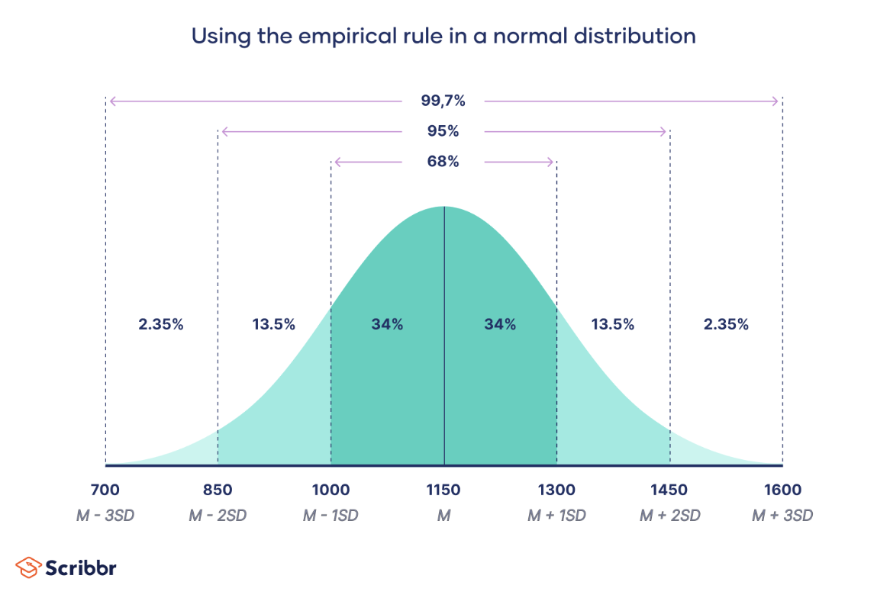

# Practical Statistics of Data Scientists: Bootstrap, Confidence Intervals, and Normal Distribution

<bR><Br>

### The Bootstrap

> Bootstrap is a straightforward and efficient method to estimate the sampling distribution of a statistic or model parameters, which involves **taking additional samples with replacement** from the original sample and <u>recalculating the statistic or model for each of these resamples.</u> 

#### Key Terms for the Bootstrap

- Bootstrap sample

  - A sample is taken with replacement from an observed data set. 

- Resampling

  - The process of taking repeated samples from observed data includes bootstrap and permutation (shuffling) procedueres. 

  

  Image source: [Medium: Resampling in Python -- Bootstrap by Wendy Hu](https://medium.com/@whystudying/resampling-with-python-bootstrap-50f21866d7c9)

<center>
  <br><br>
</center>


#### Key Essentials

**It's unnecessary to replicate the sample multiple times**. After every draw, we replace each observation, <u>sampling with replacement</u>. This creates an infinite population where the probability of drawing an element remains consistent. The bootstrap resampling algorithm for the mean, for a sample of size $ n$, is as follows:

1. Select a sample value, note it, and then replace it.
2. Repeat this process $n$ times.
3. Calculate the mean of the $n$ resampled values.
4. Perform steps 1-3 $R$ times.
5. Use the $R$ results to:
   1. Compute **their** **standard deviation** (this estimates the standard error of the sample mean).
   2. Create a **histogram** or **boxplot**.
   3. Determine a **confidence interval.** 

*R* denotes bootstrap iterations, chosen arbitrarily. More iterations yield a better estimate of standard error and confidence interval. This process results in sample statistics or estimated model parameters, which reflect their variability. 

Bootstrap **applies to multivariate data by sampling rows.**  For instance, a model can be run on this bootstrapped data to estimate the stability of parameters or enhance predictive power. 

**Using classification decision trees and averaging predictions from multiple bootstrap samples** produces better results than a single tree. This method is known as "*bagging*." 

Also, the bootstrap <u>does not address small sample sizes</u>, <u>create new data, or fill gaps in existing datasets</u>. It only indicates how more samples would behave.<br><br>


#### Sample Code Snippet 

- In *R,* the package `boot` combines these steps in one function.

  ```R
  library(boot)
  stat_fun <- function(x,index) median(x[idx])
  boot_obj <- boot(loans_income, R=1000, statistic=stat_fun)
  ```

- Python lacks built-in bootstrap implementations, but you can use the `scikit-learn` `resample` method to implement it.

  ```python
  results = []
  for nrepeat in range(1000):
    sample = resample(loans_income)
    results.append(sample.median())
  results = pd.Series(results)
  print('Bootstrap Statistics')
  print(f'original: {loans_income.median():')
  print(f'bias: {results.mean() - loans_income.median()}')
  print(f'std. error: {results.std{}}')
  ```

<br><br>

#### Resampling Vs. Bootstrapping

**Resampling** is often synonymous with '*bootstrapping*', but it also includes <u><b>permutation</b></u> methods, <u>where samples may be combined and drawn without replacement.</u> The term bootstrap specifically refers to sampling with replacement from observed data.<br><br>


### Confidence Intervals 

#### Key Terms for Confidence Intervals

- Confidence level
  - **The expected percentage** of confidence intervals, created identically from the same population, that will include the statistic of interest.
- Interval endpoints
  - The upper and lower bounds of the confidence interval. <br><br>


#### Key Essentials

Confidence intervals **have a coverage level**, expressed <u>as a percentage, such as 90% or 95</u>%. A 90% confidence interval *encloses the central 90% of the bootstrap sampling distribution of a sample statistic.* 

Typically, <u>a sample estimate's x% confidence interval should encompass similar sample estimates x% of the time, on average.</u> 

For a given sample size $n$, the algorithm for the bootstrap confidence interval is:

1. Take a <u>random sample of size $n$</u> with replacement from the dataset (<u>resampling</u>).
2. Document the statistic of interest for this resample.
3. Repeat the first two steps a large number of times $R$.
4. To create an $x$% confidence interval, <u>remove</u> $[\frac{(100-x)}{2}]$% of the $R$ resample results <u>from both distribution ends.</u>
5. The resulting trim points will serve as the endpoints for the $x$% bootstrap confidence interval. 

Image Source: [Math Blog: Statistics - Confidence Interval](https://mathblog.com/statistics/definitions/confidence-interval/95-ci/)

<center>
  <br><Br>
</center>

The confidence level, often denoted as a percentage (such as 95%), indicates the probability that **the true population parameter falls within the calculated interval.**

Also, the 95% confidence interval gives researchers a firm assurance that the true population parameter falls within the interval, balancing precision and practicality. This statistical tool facilitates valuable inferences and aids in evaluating estimability issues when modeling data across various fields.

<br><Br>

### Normal Distribution

#### Key Terms for Normal Distribution

- Error
  - The distinction between a data point and a predicted or average value.
  - Statistically, <u>it is the difference between an actual value and a statistical estimate like the sample mean.</u> 
- **Standardize**
  - <u>Subtract the mean and divide by the standard deviation.</u>
- **z-score**
  - <u>The result of standardizing an individual data point.</u>
- Standard Normal
  - A normal distribution with mean = 0 and standard deviation = 1.
- **QQ-Plot**
  - A plot to visualize how close a sample distribution is to a specified distribution, e.g., the normal distribution.<br><br>

#### Key Essentials

Image Source: [Sribbr: Statistics - Normal Distribution](https://www.scribbr.com/statistics/normal-distribution/)

<center>
  <br><Br>
</center>


In a normal distribution, 68% of the data lies within one standard deviation of the mean, and 95 lies within two standard deviations. 

It is a common misconception that the normal distribution is named so because most data follows a normal distribution—that is, it is the usual case. In reality, most variables used in a typical data science project, **in fact, most raw data overall, are not normally distributed.** 

The usefulness of the normal distribution comes from the observation that <u>many statistics follow a normal distribution in their sampling distribution.</u> <br><Br>


#### Standard Normal and QQ-Plots

> A standard normal distribution is one where the units on the <u>x-axis</u> are represented <u>as standard deviations from the mean.</u> 

Subtract the mean and divide by the standard deviation.  The transformed value is termed a *z-score*, and he normal distribution is called the *z-distribution*.

A *QQ-plot* visually assesses **how well a sample matches** a specified distribution, like the normal distribution. It plots *z-scores* from lowest to highest on the y-axis and the corresponding quantiles of a normal distribution on the x-axis. <u>Because the data is normalized, the units represent standard deviations from the mean.</u> **If the points fall near the diagonal line, the sample distribution is close to normal.**

<center>
  <br><Br>
</center>

- In R, we use the `qqnorm` function.

  ```R
  norm_samp <-rnorm(100)
  qqnorm(norm_samp)
  abline(a=0, b=1, col='grey')
  ```

- In *Python*, we use the method `scipy.stats.probplot` to create the QQ-plot.

  ```python
  fig, ax = plt.subplots(figsize=4, 4)
  norm_sample = stats.norm.rvs(size=100)
  stats.probplot(norm_sample, plot=ax)
  ```

  <br><Br>


> 
