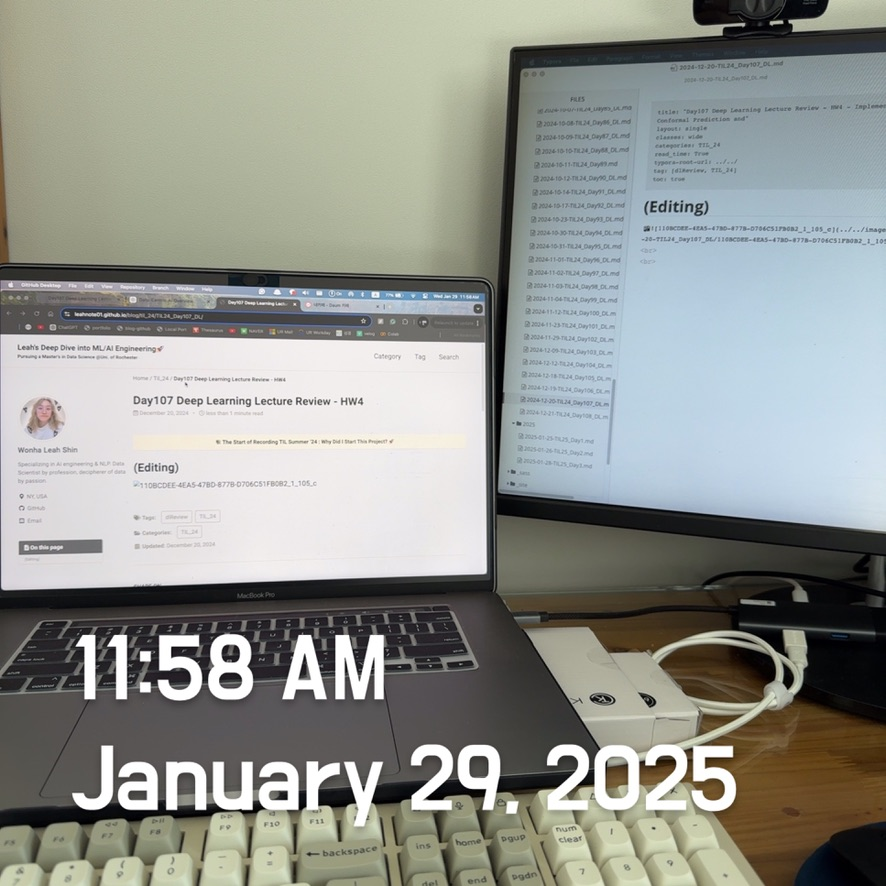

# Practical Statistics of Data Scientists: Bootstrap, Confidence Intervals, Normal Distribution, and t-Distribution

<bR><Br>

### The Bootstrap

> Bootstrap is a straightforward and efficient method to estimate the sampling distribution of a statistic or model parameters, which involves **taking additional samples with replacement** from the original sample and <u>recalculating the statistic or model for each of these resamples.</u> 

#### Key Terms for the Bootstrap

- Bootstrap sample

  - A sample is taken with replacement from an observed data set. 

- Resampling

  - The process of taking repeated samples from observed data includes bootstrap and permutation (shuffling) procedueres. 

  

  Image source: [Medium: Resampling in Python -- Bootstrap by Wendy Hu](https://medium.com/@whystudying/resampling-with-python-bootstrap-50f21866d7c9)

<center>
  <br><br>
</center>


#### Key Essentials

**It's unnecessary to replicate the sample multiple times**. After every draw, we replace each observation, <u>sampling with replacement</u>. This creates an infinite population where the probability of drawing an element remains consistent. The bootstrap resampling algorithm for the mean, for a sample of size $ n$, is as follows:

1. Select a sample value, note it, and then replace it.
2. Repeat this process $n$ times.
3. Calculate the mean of the $n$ resampled values.
4. Perform steps 1-3 $R$ times.
5. Use the $R$ results to:
   1. Compute **their** **standard deviation** (this estimates the standard error of the sample mean).
   2. Create a **histogram** or **boxplot**.
   3. Determine a **confidence interval.** 

*R* denotes bootstrap iterations, chosen arbitrarily. More iterations yield a better estimate of standard error and confidence interval. This process results in sample statistics or estimated model parameters, which reflect their variability. 

Bootstrap **applies to multivariate data by sampling rows.**  For instance, a model can be run on this bootstrapped data to estimate the stability of parameters or enhance predictive power. 

**Using classification decision trees and averaging predictions from multiple bootstrap samples** produces better results than a single tree. This method is known as "*bagging*." 

Also, the bootstrap <u>does not address small sample sizes</u>, <u>create new data, or fill gaps in existing datasets</u>. It only indicates how more samples would behave.<br><br>


#### Sample Code Snippet 

- In *R,* the package `boot` combines these steps in one function.

  ```R
  library(boot)
  stat_fun <- function(x,index) median(x[idx])
  boot_obj <- boot(loans_income, R=1000, statistic=stat_fun)
  ```

- Python lacks built-in bootstrap implementations, but you can use the `scikit-learn` `resample` method to implement it.

  ```python
  results = []
  for nrepeat in range(1000):
    sample = resample(loans_income)
    results.append(sample.median())
  results = pd.Series(results)
  print('Bootstrap Statistics')
  print(f'original: {loans_income.median():')
  print(f'bias: {results.mean() - loans_income.median()}')
  print(f'std. error: {results.std{}}')
  ```

<br><br>

#### Resampling Vs. Bootstrapping

**Resampling** is often synonymous with '*bootstrapping*', but it also includes <u><b>permutation</b></u> methods, <u>where samples may be combined and drawn without replacement.</u> The term bootstrap specifically refers to sampling with replacement from observed data.<br><br>


### Confidence Intervals 

