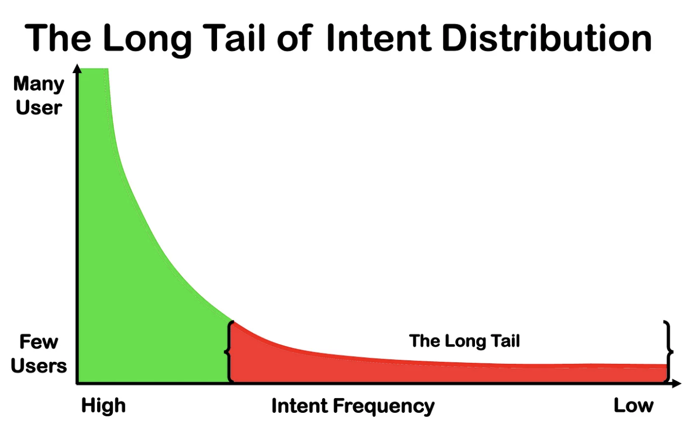
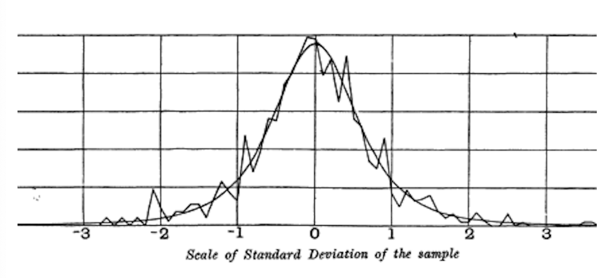
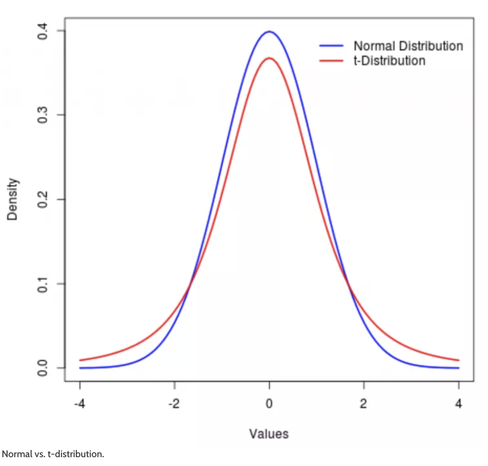

# Practical Statistics for Data Scientists: t-Dist, Binomial, Chi-Square, F-Dist, and Poisson Distribution. 


### Long-Tailed Distributions

> Although the normal distribution has historically been significant in statistics, data is typically not normally distributed, contrary to what its name might imply.

#### Key Terms for Long-Tailed Distributions

- Tail
  - The extended narrow portion of a frequency distribution, where relatively extreme values occur at low frequency.
- Skew
  - Where one tail of a distribution is longer than the other.<br><br>

#### Key Essentials


<I>[Image Source: Medium- Solving For the Long Tail of Intent Distribution by Cobus Greyling](https://cobusgreyling.medium.com/solving-for-the-long-tail-of-intent-distribution-24daa372fcc)</I>

<center>
  <br><br>
</center>


Although the normal distribution is frequently suitable and beneficial for error and sample statistics, <u>it generally doesn't accurately represent the raw data distribution.</u>

Distributions <u>can be skewed (asymmetric)</u>, like income data, or discrete, like binomial data. Both symmetric and asymmetric distributions may have long tails reflecting extreme values. Recognizing and guarding against long tails is essential in practical work. 

Unlike a normal distribution, the data points are significantly lower for low values and much higher for high values. <u>This suggests that the data does not follow a normal distribution, indicating a greater likelihood of encountering extreme values</u> than anticipated in a normal distribution. <br><br>


### Student's t-Distribution

> The *t-distribution* resembles a normal distribution **with thicker tails.** It's commonly used for **sample statistics.** Sample means typically follow a t-distribution that changes shape with sample size, approaching a normal shape as size increases. 

#### Key Terms for Student's t-Distribution

- n
  - Sample Size
- Degrees of Freedom
  - A parameter that allows the t-distribution to adjust to different sample sizes, statistics, and number of groups.

<b><i>"What is the sampling distribution of the mean of a sample drawn from a larger population?</i></b>-- The t-distribution is valuable for answering this question.<br><br>

Image Source: Gosset’s resampling experiment results and fitted t-curve (from his 1908 *Biometrika* paper)

<center>
  <br><br>
</center>

Different statistics can be compared, after standardization, to the t-distribution to estimate confidence intervals considering sampling variation. <u>Consider a sample of size $n$, for which the sample mean \( $\bar{x}$) has been calculated.</u> 

The t-distribution has been used as a reference for the distribution of a sample mean, the difference between two samples means, regression parameters, and other statistics.

Additionally, the t-distribution's accuracy in reflecting the behavior of <u>**a sample statistic requires that the distribution of that statistic for the sample approximates a normal distribution.**</u> <br><br>


#### T-Distribution vs. Normal Distribution 

<I>[Image & Explanation Source: Investopia: t-Distribution](https://www.investopedia.com/terms/t/tdistribution.asp)</I>

<center>
  <br><br>
</center>

Normal distributions are used <u>when the population distribution is assumed to be normal.</u> The t-distribution resembles the normal distribution but has fatter tails. Both distributions require a normally distributed population. Consequently, t-distributions **exhibit higher kurtosis than normal distributions.** The likelihood of obtaining values **far from the mean is greater** with a t-distribution than with a normal distribution. <br><br>


#### Limitations of Using a t-Distribution 

The t-distribution **may compromise accuracy** compared to the normal distribution, with its limitations becoming apparent <u>only when perfect normality is required</u>. It should be used <u>exclusively</u> **when the population standard deviation is unknown.** Conversely, <u>if the population standard deviation is known and the sample size is large enough, the normal distribution should be employed for more reliable results.</u> <Br><br>


### Binomial Distribution

> Yes/no outcomes are fundamental to analytics as they reflect decisions, such as buy/don’t buy or click/don’t click. The **binomial distribution** involves a series of trials, <u>each with two possible outcomes and specific probabilities.</u>

In statistics, it is customary to refer to the outcome "1" as the **success** outcome, and it is also common to assign "1" **to the less frequent outcome.** <br><Br>


#### Key Terms for Binomial Distribution

- Trial
  - An event with a discrete outcome (e.g., a coin flip).
- Success
  - The outcome of interest for a trial
  - = $1$ (as opposed to "$0$")
- Binomial
  - Having two outcomes
  - = yes/no, 0/1, binary
- **Binomial Trial**
  - A trial with two outcomes
  - **= Bernoulli Trial**
- Binomial Distribution
  - **Distribution of number($n$) of successes in $x$ trials with specified probability ($p$).**
  - = Bernoulli Distribution <br><br>


#### Example Code Snippet

*Q: If the probability of a click resulting in a sale is **0.02**, what is the **probability** of having <u>no sales in 200 clicks</u>?*

- In *R*, `dbinom` calculates binomial probabilities. 

  ```R
  dbinom(x=2, size=200, p=0.02)
  ```

  It would return **0.0176**.

- Often, we are interested in determining the probability of $x$ or fewer successes in $n$- trails. In this case, we use

  ```R
  pbinom(2, 5, 0.1)
  ```

  It would return **0.9914**, <u>the probability of observing two or fewer successes in five trials</u>, where the probability of success for each trial is 0.1

- In *Python*,  the `scipy.stats` module offers various statistical distributions. Use `stats.binom.pmf` and `stats.binom.cdf` for the binomial distribution:

  ```python
  stats.binom.pmf(2, n=5, p=0.1)
  stats.binom.cdf(2, n=5, p=0.1)
  ```

  <br><br>

#### Key Essentials

- The mean of binomial distribution is: $n \times p$
- The variance is: $n \times p(1-p)$<br><br>


### Chi-Square Distribution

A key statistical concept is departure from expectation, especially in <u>category counts</u>. Expectation signifies “*nothing unusual in the data*” (no correlations or patterns) and is called the “null hypothesis” or “null model.”  **The chi-square statistic measures deviation from the null hypothesis of independence by calculating the difference between observed and expected values, divided by the square root of the expected value squared, summed across categories.** This process standardizes the statistic for comparison with a reference distribution. Essentially, the chi-square statistic evaluates <u>how well observed values fit a specified distribution</u> (a “goodness-of-fit” test), useful for determining if multiple treatments (an “A/B/C… test”) differ in effects.<br><Br>


### F-Distribution

In scientific experimentation, testing multiple treatments—like various fertilizers on field blocks—resembles an A/B/C test in chi-square distribution but uses measured continuous values instead of counts. In this case, we are interested in the extent to which differences among group means are more significant than we might expect under normal random variation. 

> **The F-statistic measures this and is the ratio of the variability among the group means to the variability within each group.** This comparison is termed an analysis of variance (*ANOVA*).

The distribution of the F-statistic represents the **frequency distributio**n of all values generated by randomly permuting data where all group means are equal. <u>There are various F-distributions linked to different degrees of freedom</u>. 

The F-statistic is also used in linear regression to compare the variation the regression model explains **to the total variation in the data.** (In R and Python, it is produced automatically as a part of regression and ANOVA) <br><br>


### Poisson and Related Distributions

> Many processes produce **events randomly at a given overall rate**—like visitors arriving at a website or cars arriving at a toll plaza (events spread over time). 

#### Key Terms for Poisson and Related Distributions

- Lambda
  - The rare (per unit of time or space) at which events occur.
- **Poisson Distribution**
  - The frequency distribution of the number of events in sampled units of time or space.
- Exponential Distribution
  - The frequency distribution of the time or distance from one event to the next event.
- Weibull Distribution
  - A generalized version of the exponential distribution in which the event rate is allowed to shift over time.<br><Br>


#### Poisson Distributions

We can estimate the average number of events per unit of time and space from prior aggregate data. We also want to **analyze variations between units of time/space.** 

> The Poisson distribution shows the event distribution per time or space unit when sampling multiple units. 

It answers questions like, *"What capacity ensures 95% processing of all internet traffic to a server in five seconds?”*

The essential parameter in a Poisson Distribution is $\lambda$ (lambda), representing the <u>average number of events occurring</u> *in a specific time or space interval.* Additionally, the <u>variance</u> of a Poisson Distribution is equal to $\lambda$ as well.

- In R, the `rpois` function provides.

```R
rpois(100, lambda=2)
```


- In Python, we use `stats.possion.rvs` at `scipy` function. 

```python
stats.poisson.rvs(2, size=100)
```


This code generates 100 random numbers from a Poisson distribution with λ=2. For instance, **if customer service calls average two per minute, it simulates 100 minutes, showing the number of calls each minute.** <br><br>


#### Exponential Distribution

In addition to $\lambda$ used in the Poisson Distribution, we can also model **the time distribution between events,** *such as the time between visits to a website or the arrival of cars at a toll plaza.*

- In R

```R
rexp(n=100, rate=0.2)
```

- In Python, the `scipy` implementation specifies the exponential distribution using `scale` instead of rate.

```Python
stats.expon.rvs(scale=1/0.2, size=100)
stats.expon.rvs(scale=5, size=100)
```


This code generates 100 random numbers from an exponential distribution with a mean of 0.2. *It simulates 100 intervals in minutes between service calls at an average rate of 0.2 per minute.*


A **key assumption** in simulation studies for Poisson or exponential <u>distributions is that the rate, λ, remains constant</u>. For instance, traffic on roads or data networks varies by time of day and week. However, <u>periods or areas can often be segmented into sufficiently homogeneous parts, allowing valid analysis or simulation within them.</u><br><br>


#### Estimating the Failure Rate

In many applications, the event rate, $\lambda$ can be known or estimated from prior data, but not necessarily for rare events.

Aircraft engine failures are notably rare, <u>which means there may be limited data available to estimate the time between failures for a specific engine type.</u> Nevertheless, we can make some educated assumptions: **if no failures occur after 20 hours, it is reasonable to conclude that the failure rate is not one per hour**. <u>By using simulations or directly calculating probabilities, we can evaluate various hypothetical event rates and determine threshold values beneath which the occurrence rate is quite unlikely.</u> <br><br>


#### Weigbull Distribution

<u>When the event rate varies during an interval, exponential (or Poisson) distributions become ineffective</u>. This is often true in the context of mechanical failure, as the likelihood of failure grows over time. The *Weibull distribution is an extension of the exponential distribution in which the event rate is allowed to change.*

- In R, three arguments are required to implement the Weibull distribution: `n` (the number of values to be generated), `shape`, and `scale`. 

  ```R
  reweibull(100, 1.5, 5000)
  ```

  This code generates **100 random values** from a Weibull distribution, with a **shape parameter of 1.5** and a characteristic life of **5,000**.

- In Python, we use `stats.weibull_min.rvs` as below.

  ```python
  stats.weibull_min.rvs(1.5, scale=5000, size=100)
  ```

  

<br><Br>

