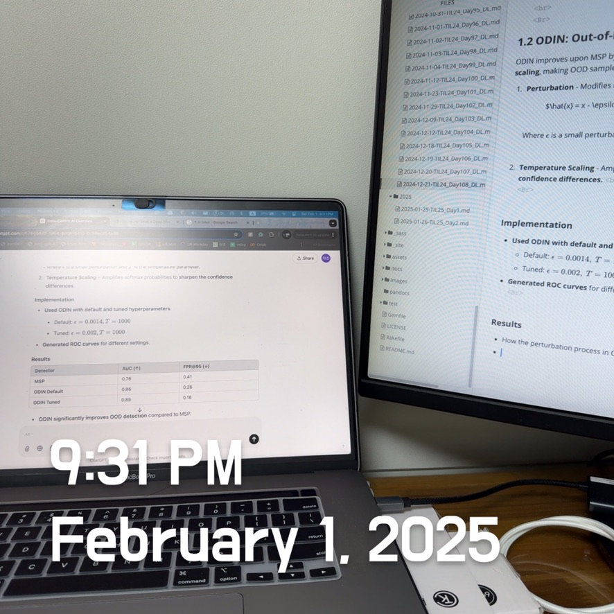
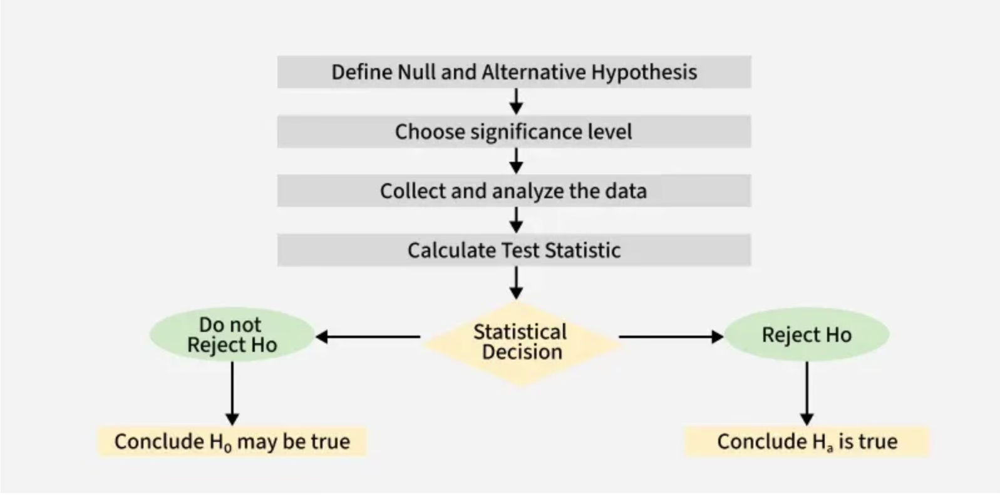

# Practical Statistics of Data Scientists: A/B Testing, Hypothesis Tests (One-Way & Two-Way)

> Experimental design is fundamental to statistics and applicable in nearly all research fields. It aims **to create an experiment that either confirms or refutes a hypothesis.**

Next, we will examine conventional experimental design and address several common challenges in data science.

In the statistical inference pipeline, the process begins with a hypothesis (e.g., "drug A is better than the existing standard drug" or “price A is more profitable than the existing price B”). An experiment, possibly an A/B test, is designed to test the hypothesis and is structured to hopefully yield conclusive results.  

[Image Source: Geeks for Geeks - Hypothesis Testing](https://www.geeksforgeeks.org/understanding-hypothesis-testing/)

    

### A/B Testing

An A/B test is an experiment involving **two group**s to determine which of two treatments, products, procedures, or similar <u>options is superior</u>. Typically, one treatment is the standard existing treatment or no treatment at all.

### Key Terms for A/B Testing

- Treatment
  - A subject is exposed to something (drug, price, web headline).

- Treatment Group
  - A group of subjects is exposed to a specific treatment.
- Control Group
  - A group of subjects was exposed to no (or standard) treatment.
- Randomization
  - The process of randomly assigning subjects to treatments.
- Subjects
  - The items (web visitors, patients, etc.) are exposed to treatments.
- Test Statistic
  - The metric is used to measure the effect of the treatment.

*A/B tests are standard in most design or marketing strategy analyses. For example,*

- Testing two soil treatments to determine which produces better seed germination.
- Testing two therapies to determine which suppresses cancer more effectively
- Testing two prices to determine which yields more net profit

We must also consider the *test statistic or* metric to compare groups A and B. Let’s say: click or no-click, buy or don’t buy, fraud or no fraud. Those results would be summed up in a **$2 \times 2$ table.**

The result may be presented differently if the metric is a **continuous** variable (such as purchase amount or profit) or a **count** (for example, days in the hospital or pages visited), <u>the result may be presented differently.</u>    

## Hypothesis Tests

> Hypothesis tests, or *significance tests*, are standard in the traditional statistical analysis of published research. They aim to help us understand whether random chance could account for an observed effect.

### Key Terms for Hypothesis Tests

- Null Hypothesis
  - The hypothesis that chance is to blame
- **Alternative Hypothesis** 
  - **Counterpoint to the null (what you hope to prove).**
- One-way Test
  - Hypothesis test that counts chance results only in one direction.
- Two-way Tests
  - Hypothesis test that counts chance results in two direction.

An A/B test is typically designed with a hypothesis in mind. 

In a well-structured A/B test, we gather data on treatments A and B so that the observed difference between them must result from either Random chance in the assignment of subjects or an actual difference between them.  

### One-Way Versus Two-Way Hypothesis Tests

In A/B testing, **a new option (B) is typically compared to a default option (A)**, with the expectation that the default will remain unless the new option demonstrates clear superiority.

If we would like to have a hypothesis test to protect us from being fooled 
