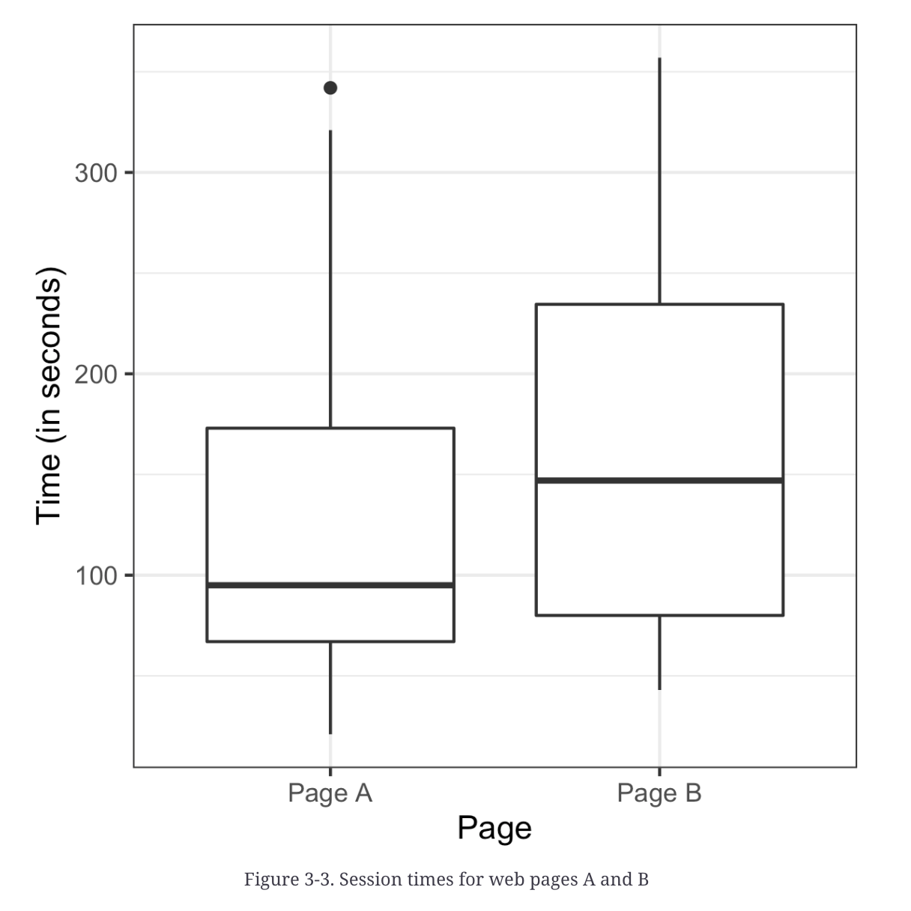
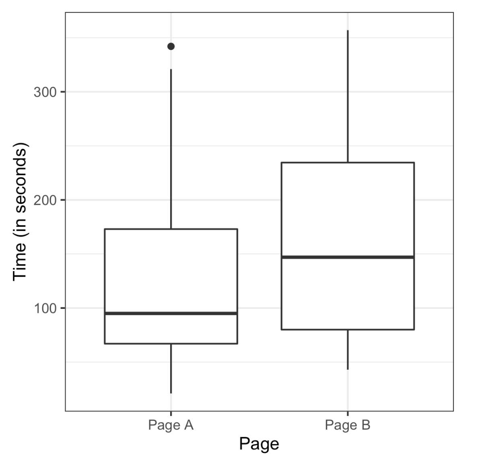
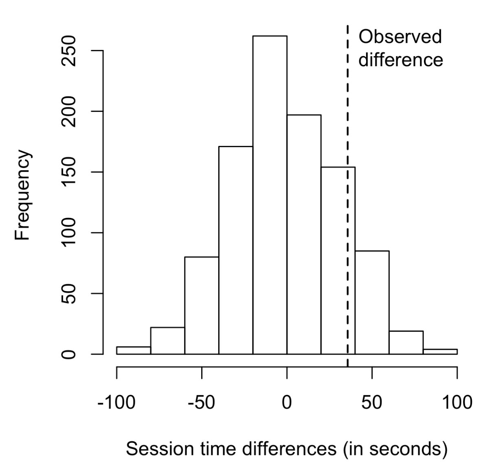

# Practical Statistics for Data Scientists: A/B Testing, Hypothesis Tests (One-Way & Two-Way), and Permutation Test


> Experimental design is fundamental to statistics and applicable in nearly all research fields. Its aim is to **create an experiment that confirms or refutes a hypothesis.**

Next, we will examine conventional experimental design and address several common challenges in data science.

In the statistical inference pipeline, the process begins with a hypothesis (e.g., "drug A is better than the existing standard drug" or “price A is more profitable than the existing price B”). An experiment, possibly an A/B test, is designed to test the hypothesis and is structured to hopefully yield conclusive results.<br><Br>

[Image Source: Geeks for Geeks - Hypothesis Testing](https://www.geeksforgeeks.org/understanding-hypothesis-testing/)

<center>
  <br><br>
</center>


### A/B Testing

An A/B test is an experiment involving **two group**s to determine which of two treatments, products, procedures, or similar <u>options is superior</u>. Typically, one treatment is the standard existing treatment or no treatment at all.


#### Key Terms for A/B Testing

- Treatment
  - A subject is exposed to something (drug, price, web headline).

- Treatment Group
  - A group of subjects is exposed to a specific treatment.
- Control Group
  - A group of subjects was exposed to no (or standard) treatment.
- Randomization
  - The process of randomly assigning subjects to treatments.
- Subjects
  - The items (web visitors, patients, etc.) are exposed to treatments.
- Test Statistic
  - The metric is used to measure the effect of the treatment.


*A/B tests are standard in most design or marketing strategy analyses. For example,*

- Testing two soil treatments to determine which produces better seed germination.
- Testing two therapies to determine which suppresses cancer more effectively
- Testing two prices to determine which yields more net profit


We must also consider the *test statistic or* metric to compare groups A and B. Let’s say: click or no-click, buy or don’t buy, fraud or no fraud. Those results would be summed up in a **$2 \times 2$ table.**

The result may be presented differently if the metric is a **continuous** variable (such as purchase amount or profit) or a **count** (for example, days in the hospital or pages visited), <u>the result may be presented differently.</u>  <br><br>


### Hypothesis Tests

> Hypothesis tests, or *significance tests*, are standard in the traditional statistical analysis of published research. They aim to help us understand whether random chance could account for an observed effect.

#### Key Terms for Hypothesis Tests

- Null Hypothesis
  - The hypothesis that chance is to blame
- **Alternative Hypothesis** 
  - **Counterpoint to the null (what you hope to prove).**
- One-way Test
  - Hypothesis test that counts chance results only in one direction.
- Two-way Tests
  - Hypothesis test that counts chance results in two direction.

An A/B test is typically designed with a hypothesis in mind. 

In a well-structured A/B test, we gather data on treatments A and B so that the observed difference between them must result from either Random chance in the assignment of subjects or an actual difference between them.<br><br>

#### One-Way Versus Two-Way Hypothesis Tests

In A/B testing, **a new option (B) is typically compared to a default option (A).** The default is expected to remain unless the new option demonstrates clear superiority.

To avoid being misled by chance, use a *bidirectional* alternative hypothesis (A is different from B, either bigger or smaller) and a two-tail test, <u>where extreme results in either direction impact the p-value.</u> A one-tail test suits A/B decision-making, as one option typically holds “default” status until the alternative proves superior. <br><Br>


### Resampling

> Resampling in statistics involves **repeatedly sampling** from observed data to evaluate random variability in statistics. 

It also helps improve accuracy in some machine-learning models, such as averaging predictions from decision tree models using a technique called *bagging*.<br><Br>


#### Key Terms for Resampling

- Permutation test
  - The process of merging two or more samples and randomly (or exhaustively) <u>reallocating the observations into resamples.</u>
  - = Randomization test, random permutation test, exact test
- Resampling
  - <u>Drawing additional samples (“resamples”)</u> from an observed data set.
- With or without replacement
  - In sampling, whether or not an item is returned to the sample before the next draw.<br><br>

#### Permutation Test

Permutation tests evaluate hypotheses for multiple groups, which we discuss here.

> In a permutation test, two or more samples are involved, usually in an A/B test. The word "permutate" means to reorder values.<u> The first step is to combine the results from groups A and B.</u>

Next, we validate the hypothesis <u>by randomly selecting groups from the combined set and analyzing their differences.</u> The procedure is as follows. 

1. Combine the results from the various groups into a single data set. 
2. Shuffle the combined data, then <u>randomly draw (without replacement)</u> a resample the same size as group A (this will include some overlapping data). 
3. From the remaining data, <u>randomly draw (without replacement) a resample of the same size as group B.</u> 
4. Repeat this for groups C, D, and so on. <u>We have now collected one set of resamples that reflect the sizes of the original samples.</u> 
5. Whatever statistic or estimate was calculated for the original samples (e.g., difference in group proportions), <u>calculate it now for the resamples and record;</u> this constitutes one permutation iteration. 
6. Repeat the previous steps R times to generate a permutation distribution of the test statistic.

Next, compare the observed difference between groups to the set of permuted differences. If the observed difference is within the range of permuted differences, we cannot draw any conclusions—it falls within the variation that chance can produce. <u>Conversely, if the observed difference is largely **outside** the permutation distribution, we can conclude that the difference is **statistically significan**t.</u> <Br><br>


#### Example: Web Stickiness

A high-value service company wants to determine which of two web presentations is more effective at selling. To evaluate this, the company will utilize a <I><b>proxy variable</b></I>, explicitly measuring the performance of the detailed interior page that outlines the service being offered.

A potential proxy variable is the number of clicks on the detailed landing page, but a better metric is the **average time spent.** Since longer attention leads to more sales, we compare pages A to B based on this metric.

Google Analytics, our tool for measuring average time on page, does not account for time on the last page during a session, <u>recording it as zero unless the user interacts</u> (clicks or scrolls). This rule applies to single-page sessions, requiring further data processing for accuracy. 

- In R, we use `ggplot`; we can visually compare the times using side-by-side boxplots.

  ```R
  ggplot(session_times, aes(x=page, y=Time)) +
  	geom_boxplot()
  ```

- In Python, the `pandas` `boxplot` command uses the keyword argument `by` to create it.

  ```python
  ax = session_times.boxplot(by='Page', column='time')
  ax.set_xlabel('')
  ax.set_ylabel('Time (in seconds)')
  plt.suptitle('')
  ```
  
  

<br><br>

<center>
  <br><Br>
</center>


The boxplot indicates that Page B leads to a more extended session than page A. The means for each group can be computed as below.

- In R

  ```R
  mean_a <- mean(session_times[session_times['Page'] == 'Page A', 'Time'])
  mean_b <- mean(session_times[session_times['Page'] == 'Page B', 'Time'])
  ```

- In Python, we filter the `pandas` dataframe.

  ```python
  mean_a = session_times[session_times.Page == 'Page A'].Time.mean()
  mean_b = session_times[session_times.Page == 'Page B'].Time.mean()
  mean_b - mean_a
  ```


Page B shows an average time of 35.67 seconds longer than Page A's. Therefore, the question arises as to whether this difference is within the range that random chance could produce, indicating statistical significance.

To answer this, we could use a permutation test: combining all the times and then repeatedly shuffling and dividing them by the number of each page. 

To apply a permutation test, we need a function to randomly assign the 36 times to a group of 21 (number of group of page A) and 15 (number of group of page B). 

- In R

  ```R
  perm_fun <- function(x, nA, nB)
  {
    n <- nA + nB
    idx_b <- sample(1:n, nB)
    idx_a <- setdiff(1:n, idx_b)
    mean_diff <- mean(x[idx_b]) - mean(x[idx_a])
    return(mean_diff)
  }
  ```

  

- In Python

  ```python
  def perm_fun (x, nA, nB):
    n = nA + nB
    idx_B = set(random.sample(range(n), NB))
    idx_A = set(range(n)) - idx_B
    return x.loc[idx_B].mean() - x.loc[idx_A].mean(0)
  ```

  <br><br>

  <center>
    <br><br>
  </center>
  
  
  

The difference between the two means is returned.

From here, we can create a histogram with bins to show that the mean difference of random permutations often exceeds the observed difference in times (indicated by the vertical line). In our results, this occurs in 12.6% of the cases.

<center>
  
</center>


- In R

  ```R
  mean(perm_diffs > (mean_b - mean_a))
  ---
  0.126
  ```

- In Python

  ```python
  np.mean(perm_diffs > mean_b - mean_a)
  ---
  0.121
  ```


This indicates that the noted difference in time between page A and page B falls well within the bounds of random variation and is, therefore, not statistically significant.<br><Br>

#### Permutation Tests: *The Bottom Line for Data Science*

Permutation tests are <u>effective heuristic tools for assessing the effects of random variation.</u> They are easy to code, interpret, and clarify. As a valuable alternative to the rigidness and "false determinism" found in formula-driven statistics, <u>they challenge the unwarranted certainty often suggested by formulaic "answers."</u>  

By comparing the observed value of a statistic to the <u>resampled distribution</u>, you can determine if the difference observed between samples may have happened by chance.

<br><Br>
