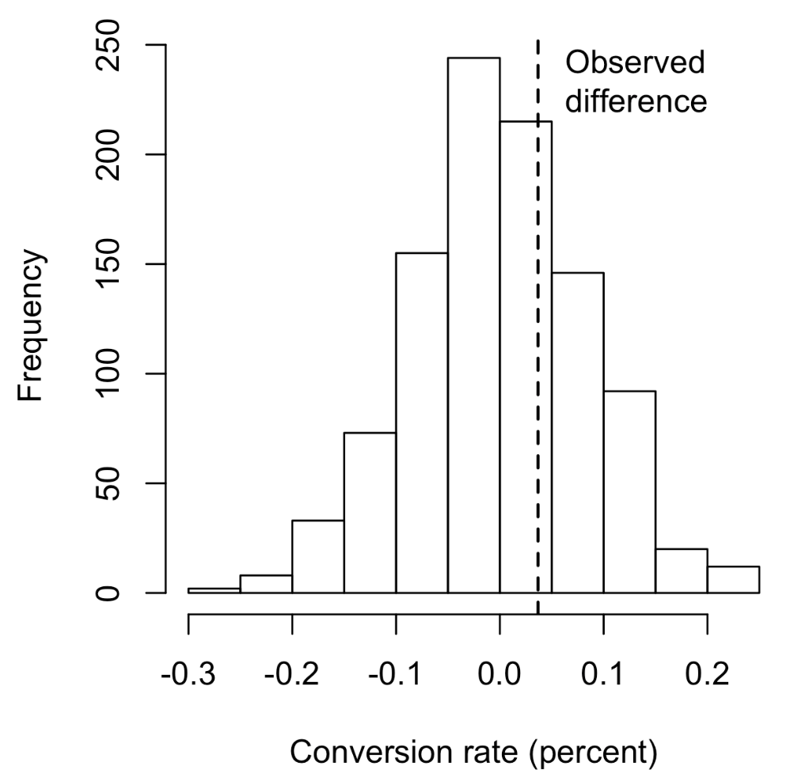
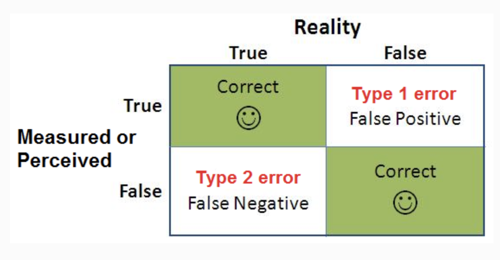

# Practical Statistics for Data Scientists: p-Values, Practical Applications, and Type I & Type II Errors

 <bR><Br>

### Statistical Significance and p-Values

> Statistical significance refers to **how statisticians evaluate whether an experiment's results are more extreme than what might occur by chance**. If the results fall outside the limits of chance variation, they are considered statistically significant. 

#### Key Terms for Statistical Significance and p-Values

- **p-value**
  - In a chance model illustrating the null hypothesis, the p-value reflects the **likelihood of obtaining results as unusual or extreme** as those observed.

- **Alpha** 
  - The probability threshold for "unusualness" that chance results must exceed for actual outcomes to be statistically significant.
- **Type 1 error**  
  - Incorrectly concluding that an effect is real when it is actually due to chance. 
- **Type 2 error**  
  - Incorrectly concluding that an effect is due to chance when it is, in fact, real.

<br><br>

Consider the table below as an example. 

| Outcome       | Price A | Price B |
| ------------- | ------- | ------- |
| Conversion    | 200     | 182     |
| No conversion | 23,539  | 22,406  |

Price A converts almost 5% better than price B ()($0.8425 \% = \frac{200}{(23539+200)} \times 100$) versus $0.8057 \% = \frac{182}{22406+182} \times 100$ $-$ a difference of $0.0368$ percentage points), big enough to be meaningful in a high-volume business. We have a quiet big data, but the conversion rates are so low (less than $1 \%$) than the actual meaningful values. 

By employing a resampling procedure, **we can assess whether the difference in conversions between prices A and B falls within the range of chance variation.**

By chance variation, we mean the random variation produced by a probability model that represents the null hypothesis, <u>which asserts that there is no difference between the rates (see “The Null Hypothesis”).</u> The following permutation procedure raises the question: *"If the two prices have the same conversion rate, could chance variation lead to a difference as significant as 5%?”* 

1. Place the cards labeled 1 and 0 into a box; this represents the supposed shared conversion rate of $382$ 1s and $45,945$ 0s, which equals $0.008246 = 0.8246 \%$.
2. Shuffle and draw a resample of size $23,739$  (same $n$ as price A) and record how many $1$s.
3. Record the number of $1$s in the remaining $22,588$ (same $n$ as price B).
4. Record the difference in proportions of $1$s.
5. Repeat steps 2 to 4.
6. How often was the difference $\geq 0.0368$?<br><br>


- In R, we can generate a histogram of the random permutations of conversion rate differences, like this.

  ```R
  obs_pct_diff <- 100 * (200 / 23739 - 182 / 22588)
  conversion <- c(rep(0, 45945), rep(1,382))
  perm_diffs <- rep(0, 1000)
  for (i in 1:1000) {
    perm_diffs[i] = 100 * perm_fun(conversion, 23739, 22588)
  }
  hist(perm_diffs, xlab='Conversion Rate (percent)', main='')
  abline(v=obs_pct_diff)
  ```


- In Python

  ```python
  obs_pct_diff = 100 * (200/23739 - 182/22588)
  print(f"observed difference: {obs_pct_diff}:.4f)%")
  conversion = [0]*45945
  conversion.extend([1]*382)
  conversion = pd.Series(conversion)
  
  perm_diffs = [100 * perm_fun(conversion, 23739, 22588)
               for _ in range(1000)]
  
  fig, ax = plt.subplots(figsize=(5,5))
  ax.hist(perm_diffs, bins=11, rwidth=0.9)
  ax.axvline(x=obs_pct_diff, color='black', lw=2)
  ax.text(0.06, 200, 'Observed\ndifference', bbox={'facecolor':'white'})
  ax.set_xlabel('Conversion rate (percent)')
  ax.set_ylabel('Frequency')
  ```

  The figure below is the frequency distribution for the difference in conversion rates between prices A and B. 

  <center>
    <br><br>
  </center>
  
  


#### p-Value

> The graph alone does not effectively measure statistical significance; **the p-value offers greater insight**. It indicates <u>how often the chance model generates more extreme results than those observed.</u> We **estimate the p-value from our permutation test by calculating the proportion of times** it yields a difference greater than or equal to the observed difference.

- In R

  ```R
  mean(perm_diffs > obs_pct_diff)
  ---
  [1] 0.308
  ```

- In Python

  ```python
  np.mean([diff > obs_pct_diff for diff in perm_diffs])
  ```

The p-value is 0.308, **indicating that we anticipate obtaining a result as extreme as this**, or an even more extreme one, by random chance more than 30% of the time. 

We didn’t need a permutation test to get a p-value in this case. Since we have a binomial distribution, we can approximate the p-value.

- In R code, we do this using the function `prop.test`.

  ```R
  prop.test(x=c(200, 182), n=c(23739, 22588), alternative='greater')
  ---
  	2-sample test for equality of proportions with continuity correction
  
  data:  c(200, 182) out of c(23739, 22588)
  X-squared = 0.14893, df = 1, p-value = 0.3498
  alternative hypothesis: greater
  95 percent confidence interval:
   -0.001057439  1.000000000
  sample estimates:
       prop 1      prop 2
  0.008424955 0.008057376
  ```

  

  

- In Python, `scipy.stats.chi2_contingency` takes values as follows. 

  ```python
  survivors = np.array([[200, 23739 - 200], [182, 22588 - 182]])
  chi2, p_value, df, _ = stats.chi2_contingency(survivors)
  
  print(f'p-value for single sided test: {p_value / 2:.4f}')
  ```
  
  


The expected approximation results in a p-value of $0.3498$, which is similar to the p-value obtained from the permutation test.


#### Alpha

> A threshold is set in advance, such as “*more extreme than 5% of the null hypothesis results*”; this threshold is referred to as *alpha*. Typical alpha levels are 5% and 1%.

<br>

#### p-value controversy

Recently, the use of the p-value has been widely discussed, as decisions based solely on it have resulted in the publication of flawed research. Typically, this is what we want the p-value to convey.

> The likelihood that the outcome is random.

We hope for a low p-value to conclude that we’ve demonstrated something. This is how many journal editors interpret the p-value. But here’s what the p-value signifies:

> The likelihood that, under a chance model, results as extreme as those observed could occur.

A significant p-value does not take you as far along the road to “proof” as it seems to promise. <u>The logical foundation for the conclusion of "statistically significant” is somewhat weaker when the true meaning of the p-value is understood.</u>

<br>

### Type 1 and Type 2 Errors

In assessing statistical significance, two types of errors are possible:

- A **Type 1** error occurs when you **incorrectly** conclude that an effect is **real** when, in fact, <u>it is merely a result of chance.</u>
- A **Type 2** error occurs when you **incorrectly** conclude that an effect is **not real** (i.e., due to chance) when it actually is real.<br><br>

[Image Source: ABTasty - Understanding Type 1 and Type 2 Errors](https://www.abtasty.com/type-1-and-type-2-errors/)

<center>
  <br><br>
</center>


<u>A Type 2 error is less of a mistake and more of a judgment indicating that the sample size is inadequate to detect the effect</u>. When a p-value fails to reach statistical significance (for example, it exceeds 5%), we essentially say, *"Effect not proven.”* <u>A larger sample could result in a smaller p-value.</u>

The primary purpose of significance tests (hypothesis tests) is to guard against being misled by random chance; therefore, **they are generally designed to minimize Type I errors.**


<br><br>
