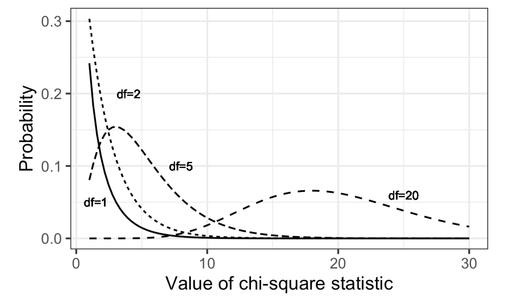

# Practical Statistics for Data Scientists: Chi-Square Theories, Fisher’s Exact Test, Multi-Arm Bandit Algorithm, and Power & Sample Size 

 <br><br>

### Chi-Square Test: Statistical Theory

Statistical theory indicates that a chi-square distribution approximates the chi-square statistic's distribution. The standard chi-square distribution is determined <u>by degrees of freedom</u>, which for a contingency table relates to the number of columns and rows as follows:

<center>
  $\text{degrees of freedom} = (r-1)(c-1)$ <br><br>
</center>

The chi-square distribution **is usually skewed with a long tail to the right**. Additionally, **the further** the observed statistic is from the chi-square distribution, **the lower** the p-value.

<center>
  <br><br>
</center>

The function `chisq.test` can compute the p-value using the chi-square distribution as a reference.

- In R

  ```R
  > chisq.test(clicks, simulate.p.value=FALSE)
  ---
  	Pearson's Chi-squared test
  
  data:  clicks
  X-squared = 1.6659, df = 2, p-value = 0.4348
  ```

  

- In Python, use the function `scipy.stats.chi2_contingency`:

  ```python
  chisq, pvalue, df, expected = stats.chi2_contingency(clicks)
  print(f'Observed chi2: {chi2observed:.4f}')
  print(f'p-value: {pvalue:.4f}')
  ```

The p-value is slightly **lower than the resampling p-value** <u>because the chi-square distribution approximates the statistic's actual distribution.</u>

<br><br>


### Fisher's Exact Test

The chi-square distribution approximates the shuffled resampling test previously described, **except when counts are very low (single digits, particularly five or fewer).** In these instances, <u>the resampling procedure will produce more accurate p-values.</u>

Most statistical software offers a method **for listing all possible arrangements (permutations), calculating their frequencies, and assessing the extremeness of the observed result.** This method is called *Fisher's Exact Test*.

- In R

  ```R
  > fisher.test(clicks)
  
  --
  
  	Fisher's Exact Test for Count Data
  
  data:  clicks
  p-value = 0.4824
  alternative hypothesis: two.sided
  ```

The p-value is very close to the p-value of 0.4853 obtained using the resampling method.

If **some counts are very low** <u>while others are quite high</u> (like the denominator in a conversion rate), it may be <u>better to use a shuffled permutation test instead of an exact test.</u> This is *because calculating all possible permutations can be difficult.* 

The R function has arguments for using the approximation (``simulate.p.value=TRUE or FALSE`), the number of iterations (`B=...`), and a constraint (`workspace=...`) for the extent of exact calculations. <br><br>

#### Relevance for Data Science

The chi-square test establishes significance in classical statistics, which is necessary before publishing a study. However, the aim is to find the best treatment. Multi-armed bandits provide a more comprehensive solution.

The **chi-square test**, particularly Fisher’s version, <u>helps determine sample sizes for web experiments in data science.</u> Researchers use these tests to find significant p-values for publication and to evaluate whether an effect needs further consideration, such as if crimes cluster in specific areas more than random chance.<br><Br>

### Multi-Arm Bandit Algorithm

> Multi-arm bandits provide a method for testing, particularly web testing, that **enables clear optimization and quicker decision-making** compared to the traditional statistical method of designing experiments. 

#### Key Terms for Multi-Arm Bandits

- Multi-arm Bandit
  - A fictional slot machine with various arms illustrates a multi-treatment experiment.
- Arm
  - A treatment in an experiment (e.g., "Headline A in a web test")
- Win
  - The experimental analog of a win at the slot machine (e.g., "customer clicks on the link"). <br><br> 

A traditional A/B test gathers data from an experiment to answer a specific question, like "*Which is better, treatment A or treatment B*?" However, this approach **can face challenges**. First, our answer may be inconclusive, leading to an "effect not proven"; the results **might indicate an effect, but our sample size may be too small to confirm it**. Second, we may want to utilize results obtained before the experiment finishes. Third, we might prefer the flexibility to adjust our approach based on additional data received after the experiment ends.

Bandit algorithms, which are very popular in web testing, allow us to test **multiple treatments simultaneously** and reach conclusions **faster** than traditional statistical designs.

Assuming our goal is to win as much money as possible, we identify and settle on the winning arm out of three more quickly. We pull A more often for its superiority, but still use B and C less frequently. If A continues to outperform, we keep shifting pulls away from B and C toward A. If C performs better and A declines, we can reallocate pulls to C. If one proves superior to A, previously hidden due to chance, it may emerge with more testing.

However, if one offer starts to outperform the others, it can be shown (“pulled”) more often. But what should the parameters of the algorithm that modifies the pull rates be? What “pull rates” should we change to, and when should we change them?

The epsilon-greedy algorithm for A/B testing: 

1. Generate a random number between 0 and 1. 
2. If it's ≤ epsilon (a small number), flip a coin: heads shows offer A, tails shows offer B. 
3. If it's > epsilon, show the offer with the highest response rate.

Bandit algorithms can effectively manage more than three treatments and progress towards the best selection. In contrast, traditional statistical testing procedures face significantly greater decision-making complexity with multiple treatments than conventional A/B testing, highlighting the considerable advantage of bandit algorithms. <br><br>


### Power and Sample Size

There is no universal guideline for determining a web test's duration (impressions per treatment); it primarily depends on how often the desired goal is achieved.

#### Key Terms for Power and Sample Size

- **Effect size**
  - The most minor effect we aim to detect in a statistical test such as “a 20% increase in click rates.”
- **Power**
  - <u>The likelihood of identifying a specific effect size with a particular sample size.</u>
- Significance level
  - The statistical significance level for conducting the test.

> Power refers to **the probability of detecting a specified effect size** given specific sample characteristics, including size and variability. 

For instance, we might hypothetically assert that the likelihood of differentiating between a $.330$ hitter and a $.200$ hitter across $25$ at-bats is $0.75$. In this case, the effect size is a difference of $.130$. Additionally, “detecting” means that a hypothesis test will reject the null hypothesis of “no difference” and conclude that there is a genuine effect. Therefore, the experiment involving $25$ at-bats $(n = 25)$ for the two hitters, with an effect size of $0.130$, hypothetically possesses a power of 0.75, or 75%.

Knowing approximately how much data to collect can help avoid collecting data with some effort, but the result is inconclusive.

Start with some hypothetical data that represents your best guess about the data that will result (perhaps based on prior data)—for example, a box with 20 ones and 80 zeros to represent a .200 hitter, or a box with some observations of “time spent on website.”

Create a second sample simply by adding the desired effect size to the first sample—for example, a second box with 33 and 67 zeros, or a second box with 25 seconds added to each initial “time spent on website.”

Draw a bootstrap sample of size n from each box.

Conduct a permutation (or formula-based) hypothesis test on the two bootstrap samples and record whether their difference is statistically significant.

Repeat the preceding two steps and determine how often the difference was significant—that’s the estimated power.


