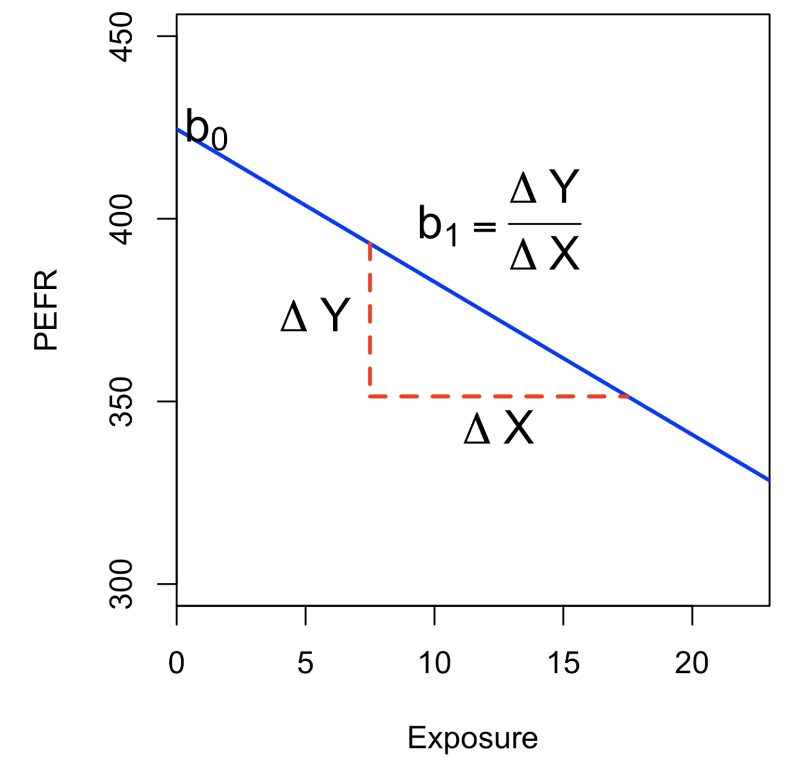

# Practical Statistics for Data Scientists: Simple Linear Regression, Least Squares, and Multiple Linear Regression


> The primary objective in statistics is to determine whether variable $X$ is related to variable $Y$, and if it is, to understand the nature of this relationship and its potential to predict $Y$.  Statistics refers to data science grounded in the objective of **forecasting an outcome (the target variable) using predictor variables.** 

This type of model training on known outcomes for future unknown data is called supervised learning. Additionally, statistics are firmly utilized in *anomaly detection* since regression diagnostics can identify unusual records when used for data analysis.<br><br>


### Simple Linear Regression

> Simple linear regression offers a model that describes <u>the relationship</u> <u>between the magnitude of one variable and another</u>. For example, as X increases, Y also increases (or as X goes up, so does Y). 

**Correlation** serves as another way to measure the relationship between two variables. <br><br>

#### Key Terms For Simple Linear Regression

- Response
  - The variable we aim to predict
  - = **dependent variable, $Y$ variable, target, outcome**
- Independent Variable
  - The variable used to predict the outcome. 
  - = **$X$ variable, feature, attribute, predictor**
- Record
  - The vector of predictor and outcome values for a specific individual or case.
  - = **row**, case, instance, example
- Intercept
  - The intercept of the regression line represents the predicted value when $X=0$.
  - = $b_0, \beta_{0}$
- **Regression Coefficient**
  - The **slope** of the regression line.
  - = slope, $b_1$, $\beta_{1}$, parameter estimates, weights
- **Fitted Values**
  - The **difference** <u>between the observed values and the fitted values.</u>
  - = errors
- Least Squares
  - The method of fitting a regression <u>by minimizing the sum of squared residuals.</u>
  - = ordinary least squares, OLS<br><br>


#### The Regression Equation

Simple linear regression estimates how much Y will change when X changes by a certain amount. With the correlation coefficient, the variable X and Y are interchangeable. With regression, we aim to predict the Y variable from X using a linear relationship as follows. 

<center>
  $Y = b_0 + b_1 X$<br><br>
</center>

where,

- $b_0$ : intercept (constant) and $b_1$: slope
- In R, both are appeared as *coefficients*


Let's say we have a dataset displaying the number of years a worker was exposed to cotton dust (`Exposure`), a measure of lung capacity(`PEFR` or `peak expiratory flow rate`). Then let's draw a "best" line to predict the response `PEFR` as a function of the predictor variable `Explosure`,

- In R, we utilize `lm` function to show a linear regression.

  ```R
  model <- lm(PEFR ~ Exposure, data=lung)
  ---
  Call:
  lm(formula = PEFR ~ Exposure, data = lung)
  
  Coefficients:
  (Intercept)     Exposure
      424.583       -4.185
  ```
  
  The intercept $b_0$ is $424.583$, and can be interpreted as the predicted `PEFR` for a worker with zero years exposure. The regression coefficient $b1$ can be interpreted as follows: for each additional year that a worker is exposed to cotton dust, the worker's `PEFR` measurement is reduced by $-4.185$. 


- In Python, `LinearRegression` from `Scikit-learn` package is used.

  ```python
  predictors = ['Exposure']
  outcome = 'PEFR'
  
  model = LinearRegression()
  model.fit(lung[predictors], lung[outcome])
  
  print(f'Intercept: {model.intercept_:.3f}')
  print(f'Coefficient Exposure: {model.coef_[0]:.3f}')
  ```

  <Br>

  The result will be shown as follows. 

<center>
  <br><br>
</center>


#### Fitted Values and Residualss

In real-world, the data doesn't fall exactly on the line, so the regression equation should include term $e_1$.

<center>
  $Y_i = b_0 + b_1 X_i + e_i$ <br><Br>
</center>


The fitted values (*predicted values*) are typically denoted by $\hat{Y}$. So, it will be updated as

<center>
  $\hat{Y_i} = \hat{b_0} + \hat{b_1} X_i$ <Br><bR>
</center>

The notation $\hat{b_0}$ and $\hat{b_1}$ indicates the coefficients are estimated values. 

We compute the residual with the equation below by subtracting the predicted values from the original data.

<center>
  $\hat{e_i} = Y_i - \hat{Y_i}$ <br><br>
</center>

- In R

  ```R
  fitted <- predict(model)
  resid <- residuals(model)
  ```

- In Python, we use `LinearRegression` model, `predict` function as follows.

  ```python
  fitted = model.predict(lung[predictors])
  residuals = lung[outcome] - fitted
  ```

  <br>


#### Least Squares

How is the model fit the data? To evaluate the model's performance, we use "$RSS$" whici is the sum of squared residual values. Our goal of this test is to minimize it.

<center>
  $\text{RSS} = \sum_{i=1} ^n \big( Y_i - \hat{Y_i}^2 \big) \\ =\sum_{i=1} ^n \big( Y_i - \hat{b_0} -\hat{b_1}X_i \big)^2$ <br><Br>
</center>


The estimates $\hat{b_0}$ and $\hat{b_1}$  are the values that minimize RSS.


The method of minimizing the sum of squard residuals is termed ***"Least Sqaures Regression"*** or ***"Ordinary Least Squares" (OLS)*** regression. 

With the advent of big data, computational speed is still an important factor. Least squares, like the mean, are sensitive to outliers, although this tends to be a significant problem only in small or moderate-sized data sets. <br><br>


#### Prediction Versus Explanation (Profiling)

Regression historically focuses on **identifying linear relationships** between predictor variables and outcomes, aiming to understand and express these relationships through the data. The estimated **slope** of the regression equation is essential. Additionally, economists want to understand broader variable relationships by analyzing the connection between two variables — consumer spending and GDP growth- to uncover. 

With the rise of big data’s rise, regression is often used to predict the modeling of new data rather than explain existing data. <u>The main focus is on fitted to values $</u>Y$. In marketing, regression forecasts revenue changes based on ad campaign size. Universities use regression to predict students’ GPA from SAT scores. <br><br>


### Multiple Linear Regression

For the multiple linear regression, the equation is extended as follows.

<center>
  $Y = b_0+b_1X_1+b_2X_2+ \dots +b_p X_p + e$ <br><br>
</center>

#### Key Terms For Multiple Linear Regression

- Root Mean Squared Error
  - The square root of the average squared error is the most widely used metric for comparing regression models.
  - = RMSE
- Residual Standard Error
    - The same as the root mean squared error, but adjusted for degrees of freedom.
    - = RSE
- R-Squared
    - The proportion of variance explained by the model varies between 0 and 1. 
    - = coefficient of determination, $R^2$
- **t-Statistic**
    - Dividing a predictor's coefficient by its standard error offers a way to <u>assess the significance of the variables</u> in the model.<br><br>


#### Example: King County Housing Data

An example of utilizing multiple linear regression is <u>estimating house values.</u> County assessors need to determine the value of a house for tax assessment purposes. Below is the example data of `house data.frame`.

```R
head(house[, c('AdjSalePrice', 'SqFtTotLiving', 'SqFtLot', 'Bathrooms',
               'Bedrooms', 'BldgGrade')])
Source: local data frame [6 x 6]

  AdjSalePrice SqFtTotLiving SqFtLot Bathrooms Bedrooms BldgGrade
         (dbl)         (int)   (int)     (dbl)    (int)     (int)
1       300805          2400    9373      3.00        6         7
2      1076162          3764   20156      3.75        4        10
3       761805          2060   26036      1.75        4         8
4       442065          3200    8618      3.75        5         7
5       297065          1720    8620      1.75        4         7
6       411781           930    1012      1.50        2         8
```


The objective is **to forecast the sales price based on the other variables.** 

- In R

  The `lm` function effectively <u>handles the multiple regression scenario by including additional terms</u> on the right side of the equation; the argument `na.action=na.omit` directs the model <u>to exclude records with missing values</u>. 

  ```R
  house_lm <- lm(AdjSalePrice ~ SqFtToLiving + SqFtLot + Bathrooms + Bedrooms + BldgGrade, data=house, na.action=na.omit)
  ```


- In Python

  `scikit-learn`'s `LinearRegression` can be used for multiple linear regression as well.

  ```python
  predictors = ['SqFtTotLiving', 'SqFtLot', 'Bathrooms', 'Bedrooms', 'BldgGrade']
  outcome = 'AdjSalePrice'
  
  house_lm = Linear.Regression()
  house_lm.fit(house[predictors], house[outcome])
  ```

  

Each model's results are as follows.

- In R

  ```R
  house_lm
  ---
  Call:
  lm(formula = AdjSalePrice ~ SqFtTotLiving + SqFtLot + Bathrooms +
      Bedrooms + BldgGrade, data = house, na.action = na.omit)
  
  Coefficients:
    (Intercept)  SqFtTotLiving        SqFtLot      Bathrooms
     -5.219e+05      2.288e+02     -6.047e-02     -1.944e+04
       Bedrooms      BldgGrade
     -4.777e+04      1.061e+05
  ```

- In Python

  For a LinearRegression model, the intercept and coefficients are represented by the fields `intercept_` and `coef_` of the fitted model.

  ```python
  print(f'Intercept: {house_lm.intercept_:.3f}')
  print('Coefficients':)
  for name, coef in zip(predictors, house_lm.coef_):
    print(f' {name}: {coef}')
  ```

  The interpretation of the coefficients is as with simple linear regression: the predicted value $\hat{Y}$ changes by the coefficient $b_j$ for each unit change in $X_j$ assuming all the other variables, $X_k$ for $k \neq j$, remaithe same. 

  The interpretation of the coefficients follows the same principle as in simple linear regression: the **predicted** value $\hat{Y}$ changes **by the coefficient $b_j$** for **each unit change in $X_j$**, <u>assuming all the other variables, $X_k$ for $k \neq j$, remain the same.</u> <br><Br>


