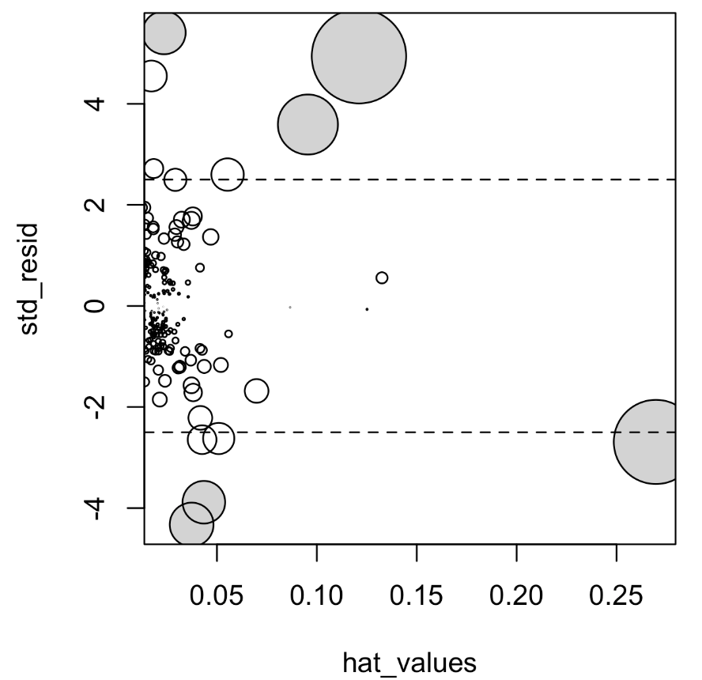
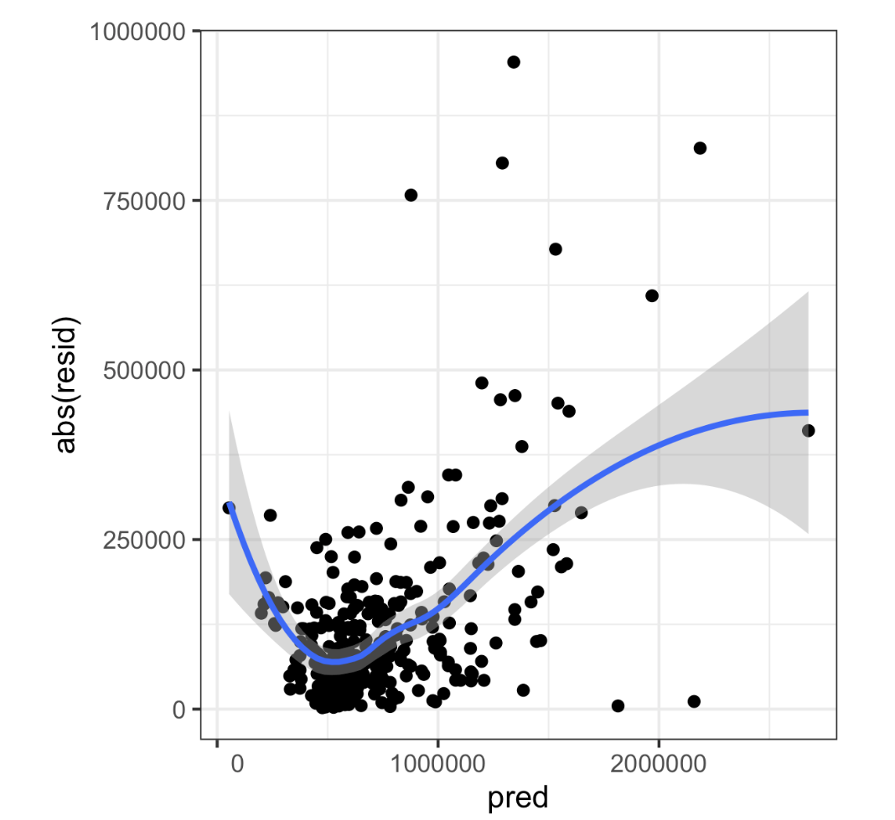

# Practical Statistics for Data Scientists: Regression Diagnostics- Outliers, Influential Observations, and Heteroskedasticity


### Regression Diagnostics

> In explanatory modeling, additional steps are taken to assess model fit, mainly through **residual analysis.** While these steps don't directly address predictive accuracy, <u>they offer valuable insights for predictions.</u> 

#### Key Terms for Regression Diagnostics

- Standardized Residuals
  - Residuals are divided <u>by the standard error of those residuals.</u> 
- **Outliers**
  - Records distant from the data (or the predicted outcome).
- Influential value
  - A value or record that significantly impacts the regression equation. 
- **Leverage**
  - The influence of a single record on a regression equation
  - = hat-value
- Non-normal Residuals
  - Non-normally distributed residuals may <u>violate specific technical regression criteria</u> but are typically not an issue in data science.
- **Heteroskedasticity**
  - When specific ranges of the **outcome display residuals with higher variance**, it may suggest that **a predictor is absent from the equation.**

- Partial Residual Plots
  - A diagnostic plot illustrates the <u>connection between the <b>outcome</b> variable and one <b>predictor</b>.</u>
  - = added variables plot<br><br>


#### Outliers

> An extreme value, an outlier, <u>is significantly distant from most other observations.</u> Outliers should be considered in **estimates of location** and **variability** as they can also cause problems in regression models. 

In regression analysis, an outlier is a data point that **significantly deviates from the predicted value.** We detect outliers using <u>the standardized residual, calculated by dividing the residual by its standard error.</u> Standardized residuals represent **how many standard errors** a data point is <u>from the regression line.</u>

<center>
  $\text{Standardized Residual =}\frac{\text{Residual}}{\text{Standard Error of Residuals}}$<br><br>
  $\text{Residual} = y_{actual} - y_{predicted}$ <br><br>
</center>

A common rule of thumb:

- **If a standardized residual is greater than ±3**, the observation is considered a **potential outlier**.
- More conservative thresholds, like **±2.5**, can also be used.


For example, let's utilize a dataset we used in prior postings to fit a regression model to the King County house sales data for all sales in zip code 98105. 

- In R

  ```R
  house_98105 <- house[house$ZipCode == 98105,]
  lm_98105 <- lm(AdjSalePrice ~ SqFtTotLiving + SqFtLot + Bathrooms
                 + Bedrooms + BldgGrade, data=house_98105)
  ```

- In Python

  ```python
  import statsmodels.api as sm
  import pandas as pd
  
  house_98105 = house.loc[house['ZipCode'] == 98105, ]
  
  predictors = ['SqFtTotLiving', 'SqFtLot', 'Bathrooms', 'Bedrooms',
               'BdgGrade']
  outcome = 'AdjSalePrice'
  
  house_outlier = sm.OLS(house_98105[outcome],
                        house_98105[predictors].assign(const=1))
  result_98105 = house_outlier.fit()
  ```


- In R, we use the `rstandard` function to extract standardized residuals and utilize the `order` function to identify the index of the smallest residual. 

  ```R
  sresid <- rstandard(lm_98105)
  idx <- order(sresid)
  ---
  sresid[idx[1]]
      20429
  -4.326732
  ```

- In Python, we use `statsmodels` and `OLSInfluence` to analyze the residuals.

  ```python
  from statsmodels.stats.outliers_influence import OLSInfluence
  
  influence = OLSInfluence(result_98105)
  sresiduals = influence.resid_studentized_internal # Standardized residuals
  
  # Identify the most extreme negative residual
  outlier_index = sresiduals.idxmin() # get the index of the most extreme outlier
  outlier_value = sresiduals.min() # get the residual value
  
  print(f'Index of most extreme negative residual: {outlier_index}')
  print(f'Standardized residual value: {outlier_value}')
  ```

<br>

- The biggest overestimate from the model is more than four standard errors above the regression line, corresponding to an overestimate of \$757,754. The original data record corresponding to this outlier is as follows in R:

  ```R
  house_98105[idx[1], c('AdjSalePrice', 'SqFtTotLiving', 'SqFtLot',
                'Bathrooms', 'Bedrooms', 'BldgGrade')]
  ---
  AdjSalePrice SqFtTotLiving SqFtLot Bathrooms Bedrooms BldgGrade
           (dbl)         (int)   (int)     (dbl)    (int)     (int)
  20429   119748          2900    7276         3        6         7
  ```

- In Python

  ```python
  outlier = house_98105.loc[sredisuals.idxmin(), :]
  print('AdjSalePrice', outlier[outcome])
  print(outlier[predictors])
  ```


For a **2,900 sq ft house**, a sale price of **\$119,748 is extremely low** for this zip code. Upon further investigation, it turns out that this sale only involved a partial interest in the property (e.g., a legal or financial transaction that does not reflect full ownership). **<u>This is a data issue and should be removed from the analysis.</u>**  <br><Br>


### Influential Observations

> An influential observation is a data point that, **if removed, would significantly alter the regression equation.** Unlike outliers, which exhibit large residuals, influential points do not necessarily have extreme residuals. Instead, they exert **substantial leverage on the regression model.** 

For example, consider a dataset with a general trend. <u>A single point far from the others in the x-direction but still close to the regression line pulls the line toward itself.</u> If this point were removed, the regression **line would shift significantly**. This is an influential point. 

That data value significantly impacts the regression, even though it is not associated with a substantial outlier (from the complete regression). **This data value is considered to have high leverage on the regression.**


#### **How to Detect Influential Observations?**

Statisticians use **leverage** and **Cook's distance** to measure influence. 

1. **Hat-Values (Leverage)**
   - Measures how far a point's **x-value** is from the mean of all x-values.
   - A high hat-value means the point has **high leverage**, which strongly affects the regression. (> $2(P+1)/n$)
2. **Cook's Distance**
   - Combines **leverage and residual size** to measure influence. 
   - A rule of thumb: <u>Cook's distance > $4/(n-P-1)$ indicates a highly influential observation.</u> 


We can visualize these metrics in a single plot.

- In R

  ```R
  std_resid <- rstandard(lm_98105)
  cooks_D <- cooks.distance(lm_98105)
  hat_values <-hatvalues(lm_98105)
  plot(subset(hat_values, cooks_D > 0.08), subset(std_resid, cooks_D > 0.08),
       xlab='hat_values', ylab='std_resid',
       cex=10*sqrt(subset(cooks_D, cooks_D > 0.08)), pch=16, col='lightgrey')
  points(hat_values, std_resid, cex=10*sqrt(cooks_D))
  abline(h=c(-2.5, 2.5), lty=2)
  ```

- In Python

  ```python
  influence = OLSInfluence(result_98105)
  fig, ax = plt.subplots(figsize=(5, 5))
  ax.axhline(-2.5, linestyle='--', color='C1')
  ax.axhline(2.5, linestyle='--', color='C1')
  ax.scatter(influence.hat_matrix_diag,
             influence.resid_studentized_internal,
             s=1000 * np.sqrt(influence.cooks_distance[0]),
             alpha=0.5)
  ax.set_xlabel('hat values')
  ax.set_ylabel('studentized residuals')
  ```

The hat values are plotted on the x-axis, the residuals are plotted on the y-axis, and the size of the points is related to the value of Cook’s distance.

<center>
  <br><Br>
</center>

Identifying influential observations is **useful mainly in smaller datasets** when fitting a regression to predict future data. In larger datasets, a single observation is unlikely to significantly impact the fitted equation, despite potential outliers. However**, it remains beneficial for anomaly detection.**<br><br>


#### Heteroskedasticity, Non-Normality, and Correlated Errors

**The distribution of residuals** mainly matters for the reliability of statistical inference, such as hypothesis tests and p-values, *which are less important for data scientists focused on predictive accuracy*. 

Normally distributed errors indicate a well-fitting model, while non-normally distributed errors suggest that <u>the model may be lacking some elements.</u> *For statistical inference to be valid, residuals should ideally be normally distributed, have constant variance, and be independent*. One important consideration for data scientists is the standard method of calculating confidence intervals for predictions, which relies on these assumptions about residuals.

In regression analysis, **residuals** (errors) are <u>the difference between the actual and predicted values.</u> While residual distribution doesn't always affect predictive accuracy, understanding residual patterns can help identify issues in the model.<br><br>


##### **Heteroskedasticity**

- **Heteroskedasticity** refers to the <u>lack of constant residual variance across all predicted values.</u> 
- **Homoskedasticity** is the ideal scenario <u>in which residual variance remains constant for all predicted values.</u>

A scatterplot of absolute **residuals vs. predicted values is a simple way** to visualize heteroskedasticity.

- The following codes in R plots the absolute residuals versus the predicted values for the `lm_98105` regression fit in previous sections.

  ```R
  df <- data.frame(resid = residuals(lm_98105), pred = predict(lm_98105))
  ggplot(df, aes(pred, abs(resid))) + geom_point() + geom_smooth()
  ```

  - `geom_point()` → Plots residuals.
  - `geom_smooth()` → Adds a smooth trend line to see variance patterns.

- In *Python*, the `seaborn` package has the `regplot` function to create a similar figure.

  ```python
  import numpy as np
  import matplotlib.pyplot as plt
  import seaborn as sns
  
  # Absolute residuals vs. predicted values
  fig, ax = plt.subplots(figsize=(5, 5))
  sns.regplot(result_98105.fittedvalues, np.abs(result_98105.resid),
              scatter_kws={'alpha': 0.25}, line_kws={'color': 'C1'},
              lowess=True, ax=ax)
  
  ax.set_xlabel('Predicted Value')
  ax.set_ylabel('Absolute Residual')
  ax.set_title('Residual vs. Predicted Plot')
  plt.show()
  ```

To interpret this:

- If the **residual spread widens** at higher values, it suggests <u>heteroskedasticity is present.</u> 
- Conversely, if the residuals **are evenly distributed**, there is <u>no significant evidence of heteroskedasticity.</u>

The figure below confirms that **the variance of the residuals generally rises** with higher-valued homes, though <u>it remains notable for lower-valued homes as well.</u> This plot shows that `lm_98105` exhibits heteroskedastic errors.

<center>
  <br><br>
</center>

#### Why Should Data Scientists Care About Heteroskedasticity?

- Heteroskedasticity may suggest that:  
  - <u>Prediction errors</u> fluctuate across various price ranges.  
  - Confidence intervals for predictions <u>may not be reliable.</u>  
  - An important variable might be missing from the model (e.g., a categorical variable like location).

<br><br>
