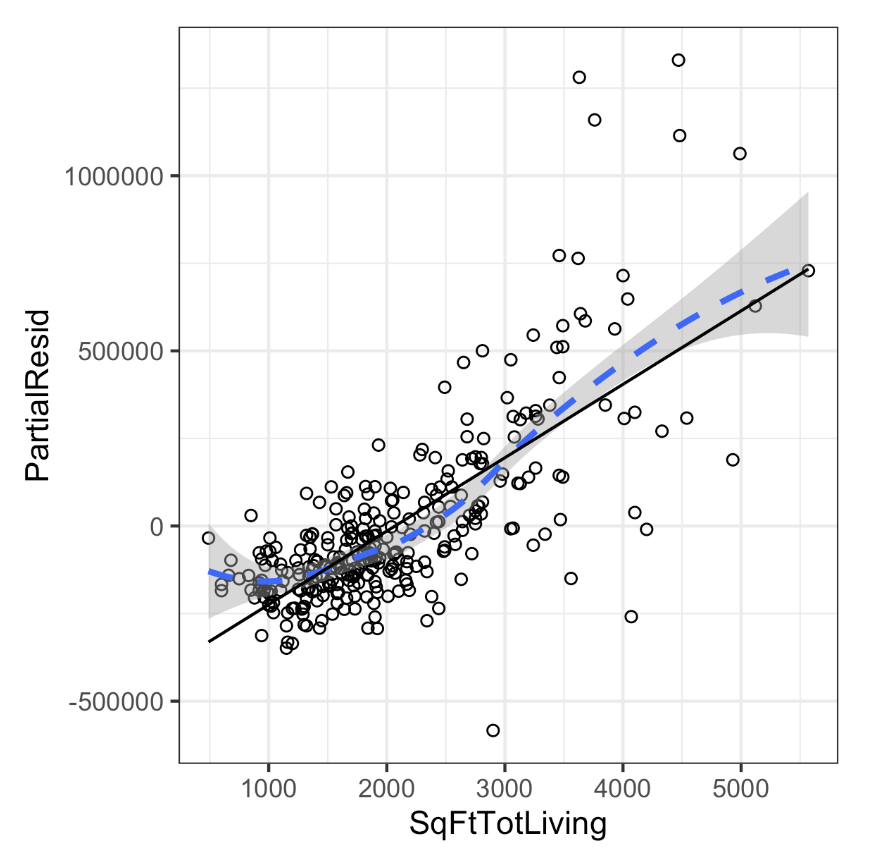
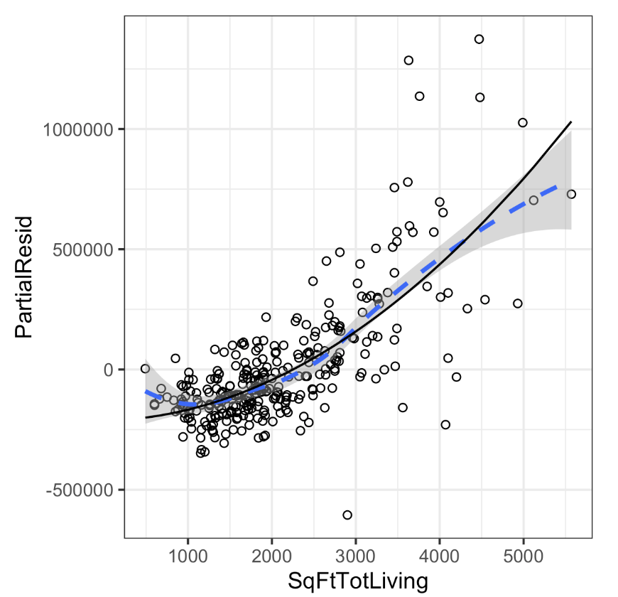
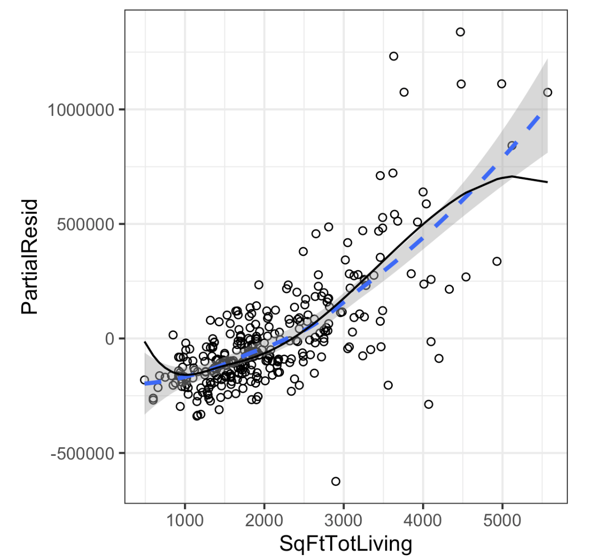
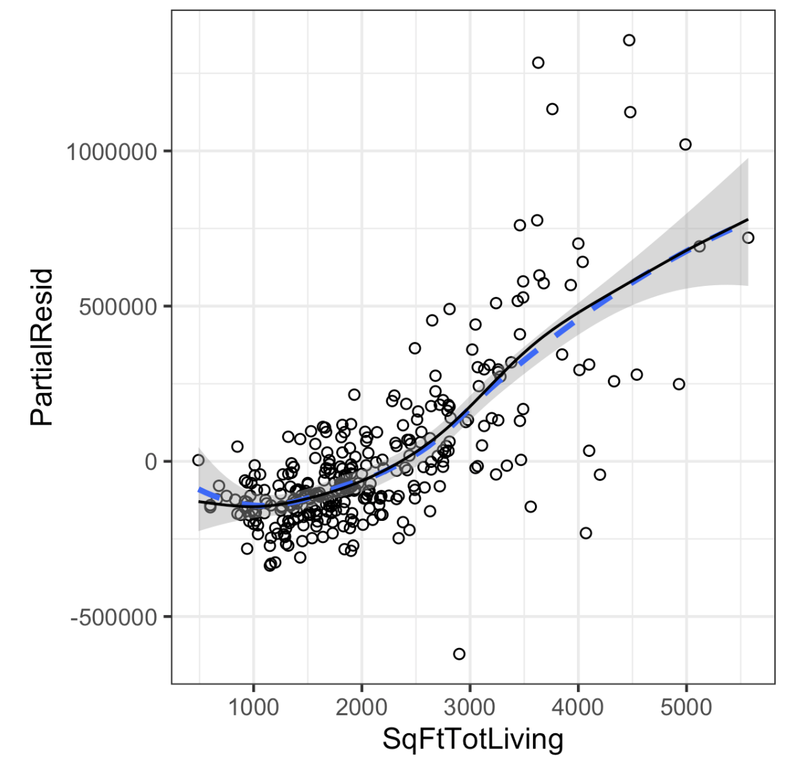

# Practical Statistics for Data Scientists: Partial Residual Plots and Nonlinearity, Polynomial & Spline Regression, and Generalized Additive Models

<br><br>

### Partial Residual Plots and Nonlinearity

> A partial residual plot helps **visualize how well a single predictor explains the relationship** <i><u>with the outcome after accounting for all other predictors.</u></I> This allows us <u>to detect nonlinearity in the predictor-response relationship.</u> 

A partial residual can be seen as a <u>“synthetic outcome"</u> value that combines the prediction of a single predictor with the **actual residual** from the full regression equation.

For predictor $X_i$, the partial residual includes the ordinary residual plus the regression term associated with $X_i$: 

<center>
  $\text{Partial Residual} = \text{Residual}+\hat{b_i}X_i$
</center>

Where:

- Residual: $\text{Residual} = y_{\text{actual}} - y_{\text{predicted}}$

- $\hat{\beta_j}X_j$ = Regression erm for the specific predictor.

This isolates the effect of $X_j$ on the response variable. 

##### **Example: King County Housing Data**  

Take the example of King County housing data. If **that variable SqFtTotLiving (representing house size)** truly exhibited a linear relationship, <u>the residual plot would appear as a straight line.</u> 

- In R, the `predict` function has an option to return the individual regression terms $\hat{b_i}X_i$.

  ```R
  terms <- predict(lm_98105, type='terms')
  partial_resid <- resid(lm_98105) + terms
  ```

  The partial residual plot displays the predictor $X_i$ on the x-axis and **the partial residuals on the y-axis**. Using ggplot2 allows for the addition of a smooth curve for the partial residuals.

  ```R
  df <- data.frame(SqFtTotLiving = house_98105[, 'SqFtTotLiving']
                  Terms = terms[, 'SqFtTotLiving'],
                  PartialResid = partial_resid[, 'SqFtTotLiving'])
  ggplot(df, aes(PSqFtTotLiving, PartialResid)) +
  	geom_point(shape=1) + scale_shape(solid = FALSE) +
  	geom_smooth(linetype=2) +
  	geom_line(aes(SqFtTotLiving, Terms))
  ```

- In Python, the `statsmodels` package includes the `sm.graphics.plot_ccpr` method for generating a partial residual plot.

  ```python
  sm.graphcis,plot_ccpr(result_98105, 'SqFtTotLiving')
  ```

<br>

<center>
  <br><br>
</center>


However, the actual plot reveals that the model **underestimates prices for small houses** (those under 1,000 sq ft) and **overestimates prices for medium-sized houses** (within the range of 2,000 to 3,000 sq ft). Furthermore, <u>the impact of adding 500 square feet to a small home is significantly greater than the same addition in a larger home.</u>

<br><br>


### Polynomial and Spline Regression

The relationship between a response variable and a predictor variable is not always linear. *For instance, the response to drug dosage is often nonlinear; doubling the dosage rarely leads to a doubled response.* *Similarly, product demand is not a linear function of marketing spending; demand often reaches saturation.* **Regression can be adjusted to account for these nonlinear effects.**

#### Key Terms For Nonlinear Regressions

- Polynomial Regression
  - **Adds polynomial terms** (squares, cubes, etc.) to a regression model.
- Spline Regression
  - Fits a smooth curve composed of **a series of polynomial segments.**
- Knots
  - Values that separate the segments of the spline.
- Generalized Additive Models
  - Spline models that automatically determine knots.
  - = GAM<br><br>

#### Polynomial

> **Polynomial regression** extends linear regression by adding **squared, cubic, or higher-order terms** of a predictor.

A **quadratic regression** (degree = 2) takes the form:

<center>
  $y= \beta_0 + \beta_1 X + \beta_2 X^2 + \epsilon$ <br><br>
</center>

A **cubic regression** (degree = 3) would add $X^3$, and so on.

- In R, polynomial regression can be performed using the `poly` function. For example, the following fits a quadratic polynomial for `SqFtTotLiving` with the King County housing data.

  ```R
  lm(AdjSalePrice ~ poly(SqFtTotLiving, 2) + SqFtLot +
     BldgGrade + Bathrooms + Bedrooms,
     data=house_98105))
  ---
  Call:
  lm(formula = AdjSalePrice ~ poly(SqFtTotLiving, 2) + SqFtLot +
     BldgGrade + Bathrooms + Bedrooms, data = house_98105)
  
  Coefficients:
             (Intercept)  poly(SqFtTotLiving, 2)1  poly(SqFtTotLiving, 2)2
              -402530.47               3271519.49                776934.02
                 SqFtLot                BldgGrade                Bathrooms
                   32.56                135717.06                 -1435.12
                Bedrooms
                -9191.94
  ```

- In Python, using `statsmodels`, we include the squared term in the model definition with `I(SqFtTotLiving**2)`:

  ```python
  import statsmodels.formula.api as smf
  
  # Quadratic (degree=2) polynomial regression
  model_poly = smf.ols(formula='AdjSalePrice ~  SqFtTotLiving + ' +
                  '+ I(SqFtTotLiving**2) + ' +
                  'SqFtLot + Bathrooms + Bedrooms + BldgGrade', data=house_98105)
  
  result_poly = model_poly.fit()
  print(result_poly.summary())
  ```

  The `statsmodels` implementation is limited to linear terms. The source code includes an implementation that works for polynomial regression as well.

  The intercept and polynomial coefficients **vary** from those in R because of different implementations. However, the other coefficients and predictions remain the same.

<center>
  <br>
  <I></I><br><br>
</center>


A polynomial regression fit for the variable `SqFtTotLiving` (**solid line**) is compared to a <u>smooth line (dashed line</u>). 

The model features **two coefficients** for `SqFtTotLiving`: one represents the linear effect ($X$) and **the other, the quadratic effect ($X^2$)**. If the $X^2$ *coefficient is significant*, this indicates a curved relationship. Polynomial regression enables us to fit curves while maintaining a linear model structure.<br><br>


#### Splines

> Polynomial regression can model curvature, but using higher-degree polynomials (like $X^3$, $X^4$, etc.) may result in **instability** and **overfitting**. In contrast, **splines provide a more reliable solution.**

The technical definition of a spline is **a sequence of piecewise continuous polynomials.** Polynomial pieces connect smoothly at fixed points, called *knots*. Splines are **more complex** than polynomial regression, with statistical software typically managing the fitting. The R package `splines` includes the function `bs` <u>to create a b-spline term</u> in regression models. For instance, this adds a b-spline term to the house regression model.

- In R

  ```R
  library(splines)
  knots <- quantile(house_98105$SqFtTotLiving, p=c(.25, .5, .75))
  lm_spline <- lm(AdjSalePrice ~ bs(SqFtTotLiving, knots=knots, degree=3) + 
                  SqFtLot + Bathrooms + Bedrooms + BldgGrade, data=house_98105)
  ```

  To set up the model, define two parameters: **polynomial degree** and **knot** locations. The predictor `SqFtTotLiving` uses a <u>cubic spline (degree=3)</u>. The `bs` function <u>places knots at boundaries</u>, **with extra knots at the lower quartile, median quartile, and upper quartile.**

- In Python, the `statsmodels` formula interface allows for using splines like in R. We define the b-spline using `df`, which represents the degrees of freedom.

  ```python
  from patsy import dmatrix
  
  # Create spline basis (df=6, degree=3)
  spline_basis = dmatrix("bs(SqFtTotLiving, df=6, degree=3)", data=house_98105)
  
  # Fit spline regression
  formula = 'AdjSalePrice ~ bs(SqFtTotLiving, df=6, degree=3) + 
  		SqFtLot + Bathrooms + Bedrooms + BldgGrade'
  model_spline = smf.ols(formula=formula, data=house_98105)
  result_spline = model_spline.fit()
  
  print(result_spline.summary())
  ```


<center>
  <br><br>
</center>


Unlike a linear term, where the coefficient has a clear interpretation, the coefficients for a **spline** term are **not easily understood**. Instead, <u>visual displays are more effective for conveying the nature of the spline fit.</u> Compared to the polynomial model, the spline model aligns **more closely with the data's smoothness**, <u>showcasing the greater flexibility of splines.</u> In this context, the spline fit better represents the data.

However, **this does not necessarily indicate that spline regression is a better model:** it doesn’t make economic sense for very small homes (less than 1,000 square feet) to have a higher value than slightly larger homes. This may be an artifact of a confounding variable.<br><br>


#### Generalized Additive Models

If you suspect a **nonlinear relationship** between the response variable and a predictor—whether based on prior knowledge or regression diagnostics—polynomial terms might lack the necessary flexibility, and spline terms require precise knot specification. In this context, **Generalized Additive Models (GAM)** offer <u>a flexible approach that can automatically fit a spline regression.</u>

- In R, we may use `mgcv` package to fit a GAM model to the housing data.

  ```R
  library(mgcv)
  lm_gam <- gam(AdjSalePrice ~ s(SqFtTotLiving) + SqFtLot +
                      Bathrooms +  Bedrooms + BldgGrade,
                      data=house_98105)
  ```

  The term `s(SqFtTotLiving)` tells the `gam` function to find the “best” knots for a spline term. 

- In python, we can use the `pyGAM` package.

  ```python
  import numpy as np
  import pandas as pd
  from pygam import LinearGAM, s, l
  
  # Define predictors and outcome
  predictors = ['SqFtTotLiving', 'SqFtLot', 'Bathrooms', 'Bedrooms', 'BldgGrade']
  outcome = 'AdjSalePrice'
  X = house_98105[predictors].values
  y = house_98105[outcome].values
  
  # Define GAM model: Apply a smooth function (s) to SqFtTotLiving, keep others linear (l)
  gam = LinearGAM(s(0, n_splines=12) + l(1) + l(2) + l(3) + l(4))
  
  # Perform grid search to optimize smoothing parameters
  gam.gridsearch(X, y)
  ```

  - `s(0, n_splines=12)`:
    - **The first predictor (SqFtTotLiving) is modeled nonlinearly using a spline.**
    - The number of splines (`n_splines=12`) controls smoothness.
  - `l(1) + l(2)+ l(3) + l(4)`:
    - Other variables (`SqftLot`, `Bathrooms`, etc.) **remain linear**

  <centeR>
    <br><br>
  </center>

The function automatically **finds the best shape** without manually choosing polynomial degrees or knots.<br><Br>

#### Comparing  GAM to Other Methods

| Method                | Pros                                   | Cons                                  |
| --------------------- | -------------------------------------- | ------------------------------------- |
| Linear Regression     | Simple, interpretable                  | Cannot capture nonliner trends        |
| Polynomial Regression | Models curvature                       | Overfits with high-degree polynomials |
| Splines               | Flexible, smooth                       | Requires **manual knot selection**    |
| GAMs                  | **Auto-select splines**, interpretable | Computationally heavier               |

GAMs are useful when relationships are nonlinear, but we don’t want to manually define transformations.<br><br>


### Summary

Regression is a widely used statistical method, built on a linear foundation, where each predictor variable has a coefficient indicating a linear relationship with the outcome. Advanced regression forms, like polynomial and spline regression, enable nonlinear relationships.

In data science, regression aims to predict new data values, using metrics based on predictive accuracy for out-of-sample data. Variable selection methods reduce dimensionality to create more compact models. 
