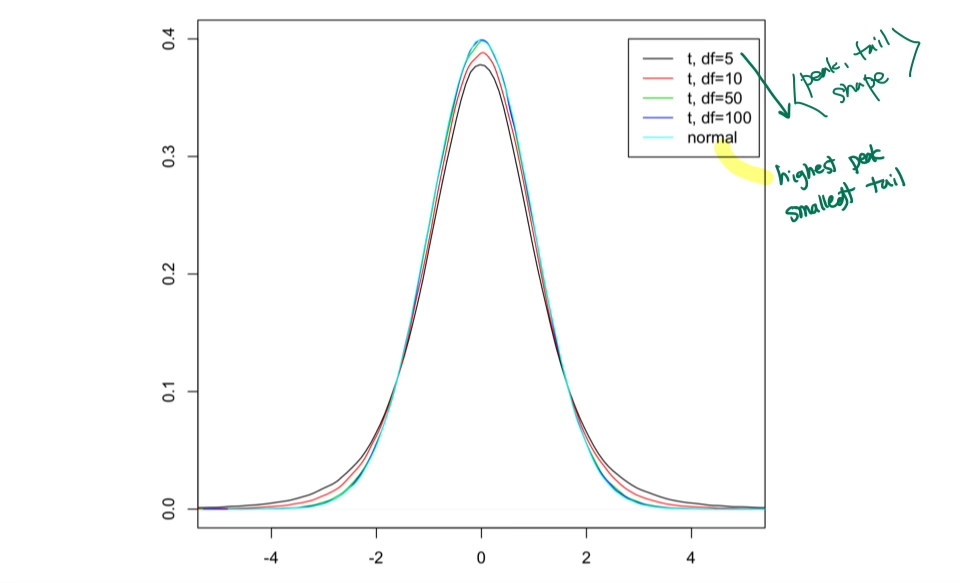

# Mathematical Principles: Hypothesis Testing, Paired Samples, Independent Samples, and additional concepts.

<br><br>

### Hypothesis Test

- **Confidence Intervals**: Unknown Mean, Unknown Variance
  - We often do not know what the variance $\sigma^2$ and the mean $\mu$ is. 
  - However, **we can estimate $\sigma^2$ with the sample variance $s^2$.**
  - But we must be a bit more careful here because the sampling distribution for $\bar{X}$ is more variable, and the values $s^2$ are likely to differ from sample to sample.
  - We can use the **Student’s t distribution.**<br><br>
- **Student t Distribution** 
  - Recall that, assuming $n$ is sufficiently large, then $Z = \frac{\bar{X}-\mu}{\sigma / \sqrt{n}} \approx N(0,1)$
  - If we replace $\sigma$ with s, **we get $t = \frac{\bar{X}-\mu}{s/ \sqrt{n}}$,** which is not a standard normal.
  - Instead, t has a Student’s distribution with $n-1$ degrees of freedom, denoted $t_{n-1}$<br><br>
- **Student’s t Distribution: Properties**
  - Intuition: Student’s t distribution is similar to a standard normal distribution <u>but has thicker tails (extreme values more likely).</u>
  - The t distribution is **unimodal** and **symmetric** about 0.
  - The shape of the t distribution reflects the extra variability introduced by estimating the variance.
  - The degrees of freedom (`df`) measure the amount of information in the data that can be used to estimate $\sigma^2$
    - **Because we lose one degree of freedom in estimating the mean (to estimate variance), we are left with $n-1$ df to estimate $\sigma^2$**. <br><br>
- Student’s t Distribution: **Degrees of Freedom**
  - For each possible value of the degrees of freedom, there is a different t-distribution
  - When the degrees of freedom are **low**, the distribution **is more spread out** with heavier tails (a worse estimate means more variability)
  - As the degrees of freedom approach infinity, the t distribution approaches the normal distribution.
    - Intuition: if $n$ is very large, our estimate of $s^2$ is essentially the same as knowing $\sigma^2$

<center>
  <br><br>
</center>


- Test Statistic
  - Once we formulate our hypotheses, we need to draw a **random sample of size $n$** from the population of interest. 
  - Calculate the **sample statistic** and compare it to the population parameter.
  - Use test statistics to determine the probability of seeing a sample as extreme or more extreme than the one observed, given that the null hypothesis is true.
  - Relies on the sampling distribution of the test statistics. <br><br>


- p-value
  - p-value is a statistical measurement used to validate a hypothesis against observed data.
  - A p-value measures the probability of obtaining the observed results, *assuming the null hypothesis is true.*
  - The **lower** the p-value, the **greater** the statistical **significance** of the observed difference.
  - A p-value of 0.05 or lower is generally considered statistically significant.
  - P-value can serve as an alternative to—or in addition to—preselected confidence levels for hypothesis testing.<br><br>


- Significance
  - We fail to reject the null hypothesis if it seems reasonable (i.e., not extremely unlikely) that the sample came from a population centered at the hypothesized mean. 
  - **P-value** calculates a probability to determine **how unlikely** it is to see your sample results if the null hypothesis is true.
  - If that probability is **less than** some pre-specified significance level, $\alpha$, then **reject** the null hypothesis <br><br>
  
  
- Significance level alpha 
  - Choosing the significance level $alpha$ allows us to specify the “**power**.”
  -  If we want to be more conservative, we can choose $\alpha=0.01$ <br><br>


- t-tests
  - When $\sigma^2$ is also **unknown,** we substitute the sample variance $s^2$ and use the t distribution instead of the normal distribution.
  - We determine the probability of seeing a test statistic t as extreme or more extreme as the one observed via a t_test.<br><br>


### Hypothesis Testing with Two Samples

- Comparison of two means
  - We used a hypothesis test to compare the unknown mean of a single population to some fixed, known value, $\mu_0$
  - Often, we want to **compare the means of two separate populations** where both means are unknown.
  - For example, is the average height of Americans equal to the average height of Canadians?<br><br>

- In two cases, samples are paired or independent
  - **Paired** weight before and after surgery for a group of men
  - **Independence**: heights of the Americans vs. Canadians<br><br>

- Paired Samples 
  - For each observation in the first group, there is a corresponding observation in the second group.
  - **Self-pairing**: measurements are taken on a single subject at two distinct time points (before and after)
  - **Matched pairing**: match two individuals with similar demographics/ characteristics and compare their differences in response
  - Depending on the setting, make the pair *as similar as possible* regarding **essential characteristics** (e.g., age, gender, socioeconomic status, etc.).
  - Use pairing to control for extraneous sources of variation that otherwise influence results. 
  - By measuring the sample, we remove natural biological variability between people.
  - If we pair based on a particular characteristic (e.g., age), we do not have to worry about that characteristic (age) influencing the results.
  - In general, paring makes comparisons more precise <br><Br>

- Paired Samples **Procedure**

  - The data is paired so that we can use the difference $d_i = b_i - a_i$ as the data
  - Reduces to the one-sample problem: compare differences to 0
  - Mean: $\bar{x_d} (unknown true $\mu_d$), Standard Deviation $s_d$ (unknown true $\sigma_d$)
  - **Standard Error** : $\frac{s_d}{\sqrt{n}}$ <br><br>

- Paired Samples: R Code

  ```R
  t.test(difference)
  t.test(before, after, paired=T)
  ```

  <Br><Br>


- **Independent Samples**
  - Suppose we have measurements on **two samples of subjects**
    - Heart rates for a group of people who have been sitting
    - Heart rates for a group of people who have been running
  - The two underlying populations are **independent** and **normally distributed**
  - The first population has mean $\mu_1$ and the second population has mean $\mu_2$
  - Test whether the two populations are identical
  - $H_0$ : $\mu_1 = \mu_2 $  vs.  $H_1$: $\mu_1 =\mu_2$

<br><br>
