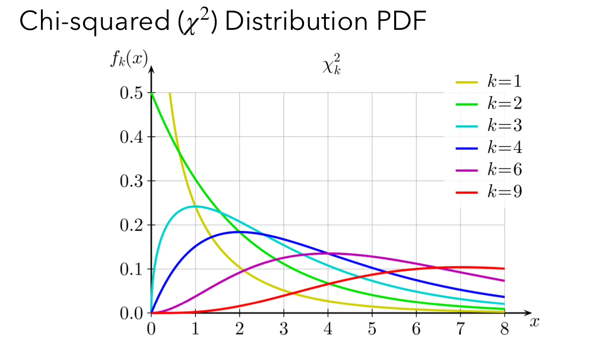
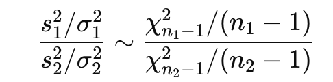
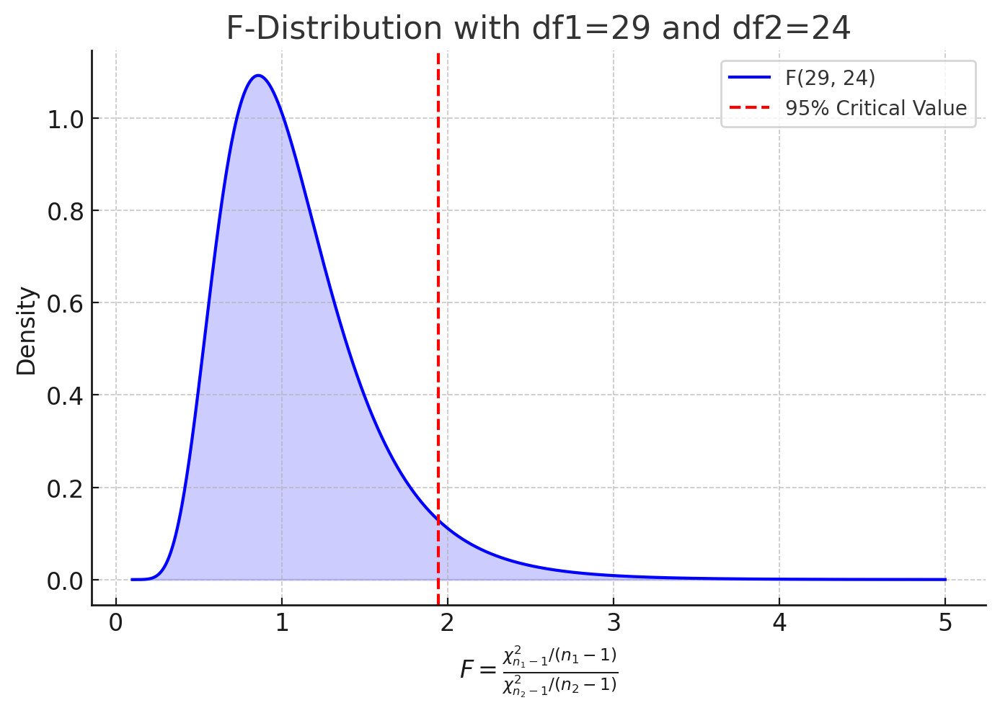

# Mathematical Principles: Inference for Variance, Chi-Squared Distribution, F-Statistics, and Inference on Proportions (Wald & Wilson)

<br><br>

## Inference for Variance

- Primarily, inference tends to focus on means.
- However, **variances** are essential to an inference of means.  
- We may be interested in determining:
  - Whether a population variance is equal to a predetermined value.
  - Whether two population variances are equal.

- **Chi-squared Distribution**

  - $Q = \sum_{i-1}^k Z_i^2 \sim \chi^2_k$ (Chi-squared distribution with <u>k degrees of freedom)</u>.<br><br>

  <center>
    <br><br>
  </center>

#### Sampling Distribution of Variance

- Returning to $\frac{s^2}{\sigma^2} = \frac{1}{n-1} \dot \sum_{i=1}^n Z_i^2$, where $Z_i$ is a standard normal random variable.

- Recall that we assumed we knew $\mu$; **we don’t know this and must use $\bar{x}$ as an estimate.**

- This means that $(n-1) \cdot \frac{s^2}{\sigma^2} \sim \chi^2_{n-1}$ **(chi-squared distribution with $n-1$ dof)**<br><br>

  

#### Hypothesis Test for **One Population Variance** 

- Can run both two-sided and one-sided tests given a null $\sigma_0^2$
- One-tailed lower hypothesis:
  - $H_0: \sigma^2 \geq \sigma_0^2$ vs. $H_1: \sigma^2 < \sigma_0^2$
- One-tailed upper hypothesis:
  - $H_0: \sigma^2 \leq \sigma_0^2$ vs. $H_1: \sigma^2 > \sigma_0^2$
- Two-tailed hypothesis:
  - $H_0: \sigma^2 = \sigma_0^2$ vs. $H_1: \sigma^2 \neq \sigma_0^2$ <br><Br>


#### **Test Statistics:**

- Recall that we know $(n-1) \cdot \frac{s^2}{\sigma^2} \sim \chi^2_{n-1}$, so it makes sense to define 
- $T = (n-1) \cdot \frac{s^2}{\sigma^2}$ **based on our null hypothesis.**
- Under the null hypothesis, $\sigma^2 = \sigma_0^2$, we have the following:
- $T_{obs} = (n-1) \cdot \frac{s^2}{\sigma^2_0} \sim \chi^2({n-1})$
- **Once we have our test statistic, we can compare to the chi-square distribution to calculate a p-value.**<br><br>

#### Finding p-values:

- One-tailed, lower hypothesis : $p= \text{Pr}(T<T_{obs})$
  - R: `pchisq(T_obs, n-1)`
- One-tailed, upper hypothesis: $p= \text{Pr}(T>T_{obs})$
  - R: `1-pchisq(T_obs, n-1)`
- Two-tailed hypothesis: $p = \text{Pr}( \vert T \vert \leq \vert T_{obs} \vert )$

- If the p-value is **less** than $\alpha$, **reject** the null hypothesis and conclude that the population variances are unequal.
- If the p-value is **more significant** than $\alpha$, **fail to reject** the null hypothesis and conclude that the population variances are equal to each other. <br><br>


#### Hypothesis Tests for Two Population Variances

- Let’s consider the case of wanting to **compare two populations.**

- We have explored testing whether the <u>means</u> of the <u>two independent populations are equal to each other.</u>

- We can also test whether <u>the variances of the two populations are equal to each other.</u>

- **Null hypothesis**: <u>Two population variances are equal.</u>

- Recall that for a single population, we have $\frac{s^2}{\sigma^2} \sim \frac{1}{n-1} \cdot \chi^2_{n-1}$

- When <u>comparing two populations,</u> it makes sense to look at the quantity $\frac{s_1^2 \sigma_1^2}{s_2^2 \sigma_2^2}$

  - Therefore, we have that 

    <center>
      <br><br>
    </center>
    
    $\Rightarrow$ **F distribution**

<center>
  <br><bR>
</center>


- **Positively skewed**
- Never negative (ratio of squares)
- **Skewness decreases with an increase in df1 and df2**
- As df1 and df2 increase, the distribution tends to become symmetrical.


#### **F-Statistics**

- To test such hypotheses, we use an F test statistic:
- $F_{obs} = \frac{s_1^2 / \sigma^2_1}{s_2^2 / \sigma^2_2} \sim F_{n_1-1, n_2-1}$
- This F statistic <u>follows an F distribution</u> with $n_1-1$ and $n_2-1$ degrees of freedom.
- Under the null hypothesis, $\sigma_1^2 = \sigma_2^2$, we have following:
- $F_{obs} = \frac{s_1^2}{s_2^2} \sim F_{n_1-1, \ n_2-1}$
- Once we have our test statistic, we can compare to the F distribution to calculate p-value.<br><br>


#### Finding p-value

- One-tailed, lower hypothesis: $p=\text{Pr}(F<F_{obs})$
- R: `pf(F_obs, n_1-1, n_2-1)`
- One-tailed, upper hyothesis: $p=\text{Pr}(F>F_{obs})$
- R: `1-pf(F_obs, n_1-1, n_2-1)`
- Two-tailed hypothesis: $p=\text{Pr}( \vert T \vert \geq \vert T_{obs} \vert)$<br><br>


#### Hypothesis Tests for Two Populations Variances in R

```R
var.test(x, y, ratio =1, 
         alternative = c(“two.sided”, “less”, “greater”), conf.level=0.95)
var.test(x, y, ratio=1, alt=“less”, conf.level=0.9)
```

<br><br>

## Inference on Proportions

So far, we have discussed inference for continuous data. We can also extend inferential methods to include count data. In particular, we are often interested in the proportion of times a dichotomous (i.e., yes/no) event occurs.<br><br>

####  Sampling Distribution of a Proportion

- Recall that the sample mean is distributed like $\hat{p} \sim N \big( p, \sqrt{\frac{(p(1-p)}{n}}$, given that $np \leq 5$ and $n(1-p) \leq 5$
- Thus, $Z = \frac{\hat{p}-p}{\sqrt{\frac{p(1-p)}{n}}}$<br><br>


#### Confidence Intervals for Proportions

- Confidence intervals for population proportions follow <u>the same procedure as what we used for population means.</u>

- Draw a sample of size $n$ and compute $\hat{p} = \frac{x}{n}$

- $\hat{p}$ is a point estimate of population proportions follows $p$

- We know from above that

  <center>
    $Z = \frac{\hat{p}-p}{\sqrt{\frac{p(1-p)}{n}}}$ <br><Br>
  </center>

   is a standard normal random variable, **given that $n$ is sufficiently large.**

- In R: for a standard normal distribution, 95% of possible outcomes lie <Br> between `qnorm(0.025) = -1.96` and `qnorm(0.975)=1.96`

- Thus, <Br>

  <center>
    $Pr \Big( -1.96 \leq \frac{\hat{p}-p}{\sqrt{\frac{p(1-p)}{n}}} \leq 1.96 \Big) = 0.95$<br><br>
  </center>
  
  
- This can be rearranged to give<br>

  <center>
    $Pr \big( \hat{p}-1.96 \sqrt{\frac{\hat{p}(1-\hat{p})}{n}} \leq p \leq \hat{p} + 1.96 \sqrt{\frac{\hat{p}(1-\hat{p})}{n}} \big) = 0.95$ <br><br>
  </center>
  
  
  
  

#### Confidence Intervals for Proportions

- So, how do we estimate $p$? Use $\hat{p}$, **our sample estimate (Wald).**
- Since $p$ is unknown, we estimate it using $\hat{p}$ , leading to the **Wald confidence interval.**
- The previous 95% confidence interval contains the true population proportion $p$.
- In general, an approximate two-sided $(1-\alpha) \cdot 100 \%$ confidence interval for $p$ is given by $\big( \hat{p}-z_{\alpha/2} \sqrt{\frac{\hat{p}(1-\hat{p})}{n}}, \hat{p}+z_{\alpha/2} \sqrt{\frac{\hat{p}(1-\hat{p})}{n}} \big)$ 
- For a **95% confidence interval,** we use $z_{\alpha/2} = 1.96$
- Thus, the **95% confidence interval** is $\hat{p} \ \pm \ 1.96 \sqrt{\frac{\hat{p}(1-\hat{p})}{n}}$<br><br>


#### Wald vs. Wilson Intervals

- Recall that we estimate $p$ using $\hat{p}$, our sample estimate.
- In general, this provides **poor coverage** when $\hat{p}$ is close to extremes (0 or 1)
  - **Less than $(1-\alpha) \cdot 100\%$ confidence interval.**
- While the Wald interval is simple, it performs poorly when:
  - $\hat{p}$ is **close to 0 or 1.**
  - The sample **size is small.**
  - The **true population proportion is near the extremes.**<br><br>

#### Wilson Score Interval (Better Alternative)

To address Wald’s problems, we use the **Wilson score interval**:


<center>
  $\hat{p} = \frac{x}{n}$ <br><br>
  $CI = \frac{\left(\hat{p} + \frac{z^2}{2n}\right) \pm z \sqrt{\frac{\hat{p}(1-\hat{p})}{n} + \frac{z^2}{4n^2}}}{1 + \frac{z^2}{n}}$ <br><Br>
</center>

- Unlike the **Wald Interval**, which directly uses $\hat{p}$, the Wilson method **adjusts the proportion** based on sample size and uncertainty.
  It **re-centers** the confidence interval using a **modified proportion**:

  <center>
    $\hat{p}^* = \frac{\hat{p} + \frac{z^2}{2n}}{1 + \frac{z^2}{n}}$<br><Br>
    </center>

- And **adjusts the margin of error** to avoid unreliable estimates.

  - The additional term **$\frac{z^2}{4n^2}$** accounts for **small-sample uncertainty**.
  - This makes the interval **wider for small $n$** and **shrinks it appropriately for larger $n$**.

<center>
  $M = z \sqrt{\frac{\hat{p}(1 - \hat{p})}{n} + \frac{z^2}{4n^2}}$
</center>


<br><br>
