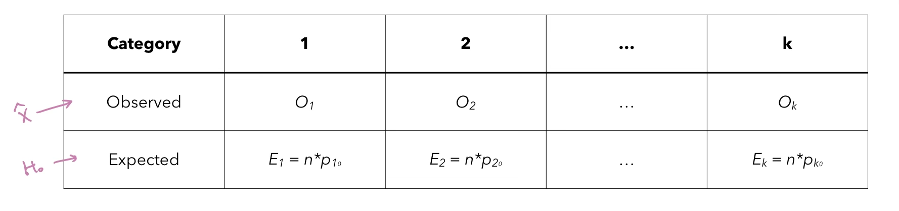

# Mathematical Principles: Inference on Proportions- Sample Size Estimation, Hypothesis Testing, Chi-Squared Test

<br><br>

## Inference on Proportions

#### Normal Approximations of Binomial Distributions

- Note that the actual distribution for proportions is binomial (number of “successes” out of the specific number of trials)
- However, **confidence intervals** are based on the **normal distribution**.
- <u>We are using the normal distribution as an approximation for a binomial distribution.</u> 
- Normal approximation (Wilson) confidence intervals can be calculated in R using `prop.test(x,n)`
- Exact binomial (Clopper-Pearson) confidence intervals can be calculated in R using `binom.test(x.n)` <br><br>

#### Sample Size Estimation for Proportions

- For confidence intervals on proportions, we have that the **margin of error** is <br>$m = z_{\alpha/2} \sqrt{\frac{\hat{p}(1-\hat{p})}{n}}$  <u>(half the length of the confidence interval)</u>
- Like before, if we want a certain margin of error at the same confidence level, we **can determine the number of subjects ($n$)** needed to get the desired results.
- Thus, $n= \lceil \frac{z^2_{\alpha/2}p(1-p)}{m^2} \rceil$
- *If we can estimate $p$ based on previous studies or information, use that.*
  - **Otherwise, use $p=0.5$** to get the most conservative estimate of the standard error (overestimate of the number of subjects needed)<br><br>

#### Hypothesis Testing for Proportions

- We can also test whether a population proportion is equal to some value.

- Consider a two-tailed test at the $\alpha=0.05$ significance level.

- $H_0: p = p_0$ vs. $H_1: p \neq p_0$

- <u>Draw a random sample of size $n$</u> observations from the underlying population (each observation is a dichotomous yes/no)

- Calculate a z-statistic: $z=\frac{\hat{p}-p_0}{\sqrt{\frac{p_0(1-p_0}{n}}}$

- For **sufficiently large** $n$ and when **$H_0$ is true,** we can compare $z$ to a standard normal distribution to calculate the probability of obtaining a proportion as extreme or more extreme than $\hat{p}$

- Calculate p-value in R by `p=2*pnorm(-abs(z))`

- If $p \leq 0.05$, **we reject the null hypothesis** and conclude that $p \neq p_0$

- If $p > 0.05$, **we fail to reject the null hypothesis** and conclude that there is not significant evidence to say that $p \neq p_0$.

  - <u>A very small p-value gives very strong evidence against $H_0$.</u>

  - If we have a set <u>significance level $\alpha$, reject $H_0$ if $p \leq \alpha$.</u>

    ```R
    prop.test(x, n, p = NULL, alternative = c(“two.sided’, “less”, “greater”), 
              conf.level=0.95, correct =TRUE)
    
    prop.test(x, n, alt=“greater”, conf.level=0.99, correct=F)
    ```
    
    <br><br>

## $\chi^2$ Tests

> In the previous posting, we explored inference for proportions. In this context, a **variable can have one of two values**. ***Which variable has more categories?*** Let’s say we are trying to determine what proportion of people have each season (winter, spring, summer, fall) as their favorite. *How can we make inferences in this context?*

#### Goodness-of-Fit

- Consider a categorical variable with multiple categories.
  - For example, colors: red, blue, yellow, or other.
- We want to test whether the true proportion of people falling into each category is equal to some value.
- Then, we use the **Goodness-of-Fit** test.
- Our hypotheses are as follows:
  - $H_0$ : $p_1= {p_1}_0$, $p_2= {p_2}_0$  $\dots$  $p_k= {p_k}_0$
  - $H_1$: at least one of these equalities does not hold.
- **Test the hypothesis using a chi-squared ($\chi^2$) test.**
- The test statistic is 
- $X^2 = \sum_{i=1}^k \frac{(O_i - E_i)^2}{E_i} \sim \chi^2_{k-1}$
- Here, $O_i$ is the number of people in category $i$.
- $E_i$ is the expected number of people who fall into category $i$ under the null hypothesis.
  - We calculate the test statistic using the following information.

<center>
  <bR><br>
</center>


- We are interested in the p-value of $\text{Pr}(\chi^2 > X^2)$

- We can find this p-value by using a $\chi^2$ distribution with $df = k-1$

  - In R: p=`1-pchisq(X2, df)`
  - Always **looking for upper tail probability** (probability of seeing an outcome that is as extreme or more extreme than what we observed.)

- If $p \leq \alpha$, we reject $H_0$

- If $p > \alpha$, we fail to reject $H_0$

  - **For this test to be valid, all the expected counts must be at least 5.** 

- In R

  ```R
  chisq.test(c(84,17,16,83), p=c(0.4, 0.1, 0.05, 0.45))
  ```

  <Br><br>

#### Contingency Table

- Let’s move on to the case of **two categorical variables.**
  - We used a normal approximation to the binomial distribution and formed a two-proportion z-test for binary variables.
- <u>A generalized technique for testing proportions is through $\chi^2$ test of independence for contingency tables.</u> <br><br>


#### Testing Whether Variables are Independent

- Setting:
  - Consider two categorical variables: favorite season (winter, spring, summer, fall) and whether or not someone has pets (yes, no)
  - We are interested in *whether a population’s favorite season is independent of whether or not* 
  - How can we test such a hypothesis?
- Idea:
  - **Extend the goodness-of-fit test to multiple dimensions.**<br><br>

#### $\chi^2$ Test of Independence

- We are testing the following hypotheses:
  - $H_0$: the two variables are independent.
  - $H_1$: the two variables are associated (not independent).
- Similar to the **goodness-of-fit test**, the test of independence compares the observed frequencies in each category of the contingency tables with the expected frequencies given that the null hypothesis is true. 
  - Let $O$ be the observed frequencies.
  - Let $E$ be the expected frequencies under the null hypothesis.
- Use the chi-square test to determine **whether the deviations between the observed and expected frequencies are too large to be attributed to chance.** 

- The chi-square test statistic is as follows for a contingency table with $r$ rows and $c$ columns.
- $X^2 = \sum_{i=1}^r \sum_{j=1}^c \frac{(O_{ij}-E_{ij})^2}{E_{ji}} $
- $X^2$ approximately follows a $\chi^2$ distribution with $(r-1)(c-1)$ degrees of freedom. 
- Find the p-value $p=$`1-pchisq(X^2, df)`
- If $p \leq \alpha$, then reject $H_0$
- If $p > \alpha$, then fail to reject $H_0$
  - For the $\chi^2$ distribution to be appropriate, <u>no cell should have an expected or observed frequency less than 5.</u>

- In R

  ```R
  x <- matrix(c(50,82,127,91), nrow=2, ncol=2)
  chisq.test(x, correct=F)
  ```

  <br><br>

