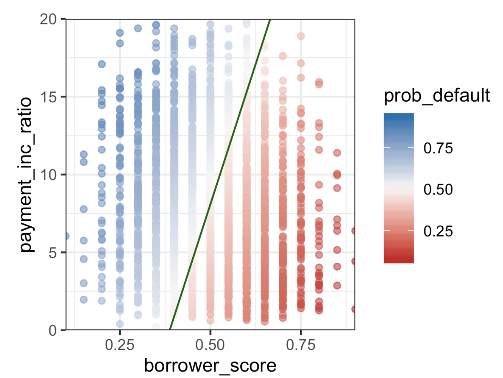

# Practical Statistics for Data Scientists: Discriminant Analysis (Covariance, Discriminant Function, and Application: Predicting Default Risk)

<br><br>

## Discriminant Analysis

Discriminant Analysis is one of the earliest statistical classification techniques, introduced by **R. A. Fisher in 1936**. It is used to distinguish between different **classes** in a dataset based on their features.

**When to Use Discriminant Analysis?**

- When the **predictor variables are continuous** (or categorical).
- When we want to classify observations into distinct groups.
- When we assume that the classes **follow a normal distribution** and have equal variance.<br><br>

#### Key Terms for Discriminant Analysis

- **Covariance**
  - It quantifies <u>how much one variable changes</u> concerning another, indicating <u>the direction and magnitude</u> of their relationship.
- **Discriminant Function**
  - The function **that maximizes class separation** when applied to the <u>predictor variables.</u>
- Discriminant Weights
  - The scores obtained from using the discriminant function **estimate the probabilities of belonging to one class or another.**  

Although discriminant analysis includes several techniques, the most frequently utilized at that time was *linear discriminant analysis (LDA)*. However, LDA has become less prevalent with the emergence of more advanced methods, such as tree models and logistic regression. However, we may still come across LDA in some applications, and it is connected to other more commonly used methods (like **principal components analysis**). <br><Br>


#### Covariance Matrix

Covariance measures **how two variables vary together**. If two variables <u>increase and decrease togethe</u>r, they have **positive covariance**; if <u>one increases while the other decreases</u>, they have **negative covariance**.

For two variables $X$ and $Y$, the covariance is calculated as:

<center>
  $\text{Cov}(X,Y) = \frac{\sum_{i-1}^n(X_i -\bar{X})(Y_i-\bar{Y})}{n-1}$<Br><br>
</center>

Where:

- $X_i, Y_i$ = individual values of $X$ and $Y$.
- $\bar{X}, \bar{Y}$ = means of $X$ and $Y$.
- $n$ = number of records.

The **covariance matrix** is a matrix that contains variances on the diagonal and covariances off the diagonal as follows.

<center>
  $\Sigma =
\begin{bmatrix}
\text{Var}(X_1) & \text{Cov}(X_1, X_2) & \dots & \text{Cov}(X_1, X_n) \\
\text{Cov}(X_2, X_1) & \text{Var}(X_2) & \dots & \text{Cov}(X_2, X_n) \\
\vdots & \vdots & \ddots & \vdots \\
\text{Cov}(X_n, X_1) & \text{Cov}(X_n, X_2) & \dots & \text{Var}(X_n)
\end{bmatrix}$ <br><br>
</center>

The covariance matrix is essential in **linear discriminant analysis (LDA)** because it helps measure **the distribution of different classes in feature space**. 

Similar to the **correlation coefficient** (refer to “Correlation”), positive values signify a positive relationship, while negative values denote a negative relationship. However, correlation is limited to a range of –1 to 1, whereas the scale of covariance depends on the scales of the variables   and  in question.<Br><br>

#### Fisher's Linear Discriminant

Let's focus on a classification problem where **we aim to predict a binary outcome (y**) using only <u>two continuous numeric variables, (x) and (z).</u> Theoretically, discriminant analysis assumes that the **predictor** variables are <u>normally distributed continuous variables</u>; however, in practice, the method performs well **even with non-extreme deviations from normality and for binary predictors.** 

Fisher’s linear discriminant separates **variation** <u>between groups</u> from <u>within-group</u> variation. Specifically, linear discriminant analysis (LDA) aims to **maximize the “between” sum of squares ($SS_{between}$)** relative to the “within” sum of squares ($SS_{within}$). 

Here, the two groups are the records ($𝑥_0,𝑧_0$) for $y = 0$ and ($𝑥_1,𝑧_1$) for y = 1. The method identifies t**he linear combination $w_xx+w_zz$ that maximizes this ratio:** $\frac{SS_{between}}{SS_{within}}$

1. Compute the **means** of each predictor variable for each class.
2. Compute the **within-group variance** and **between-group variance**.
3. Find a **linear combination of predictor variables** that **maximizes** the separation between the two classes. <br><Br>


#### Mathematical Formulation

LDA finds a **discriminant function** of the form:

<center>
  $Z=w_1X_1+w_2X_2+ \dots +w_nX_n$<br><br>
</center>

Where:

- $w_i$ are the **discriminant weights** (to be estimated).
- $X_i$ are the predictor variables.

The objective is **to identify $w$ that maximizes the distinction between the two groups**. Enhancing the distinction entails that LDA maximizes the ratio of "between-class variance" to "within-class variance."

<center>
  $\text{max} \big( \frac{\text{Between-Class Variance}}{\text{Within-Class Variance}} \big)$<Br><br>
</center>

Intuitively, this method yields the greatest separation between the two groups *by **maximizing** the between sum of squares* and <i><b>minimizing</b> the within sum of squares. </i><br><br>

### Example: Predicting Loan Default with LDA

Let's apply LDA to **the loan dataset**, where we predict whether a loan will be defaulted or paid off using the <b>Borrower's Credit Score & Payment-to-income Ratio. </b>

- In R, we use the `MASS` package.

  ```R
  library(MASS)
  
  loan_lda <- lda(outcome ~borrower_score + payment_inc_ratio, data=loan3000)
  loan_lda$scaling
  ---
                            LD1
  borrower_score 	   7.17583880
  payment_inc_ratio -0.09967559
  ```

  - A **higher borrower score** increases the likelihood of **paying off the loan**.
  - A **higher payment-to-income ratio** increases the likelihood of **defaulting**.<br><br>

- In *Python*, we can use the `LinearDiscriminantAnalysis` from `sklearn.discriminant_analysis`. 

  ```python
  from sklearn.discriminant_analysis import LinearDiscriminantAnalysis
  import pandas as pd
  
  # Prepare Data
  loan3000.outcome = loan3000.outcome.astype('category')
  
  predictors = ['borrower_score', 'payment_inc_ratio']
  outcome = 'outcome'
  
  X = loan3000[predictors]
  y = loan3000[outcome]
  
  # Train LDA Model
  loan_lda = LinearDiscriminantAnalysis()
  loan_lda.fit(X, y)
  
  # Print Discriminant Weights
  pd.DataFrame(loan_lda.scalings_, index=X.columns)
  ```

  The result is the same with R: it confirms that the <u>borrower_score and payment_inc_ratio have <b>opposing</b> roles in determining default risk.</u>

**Normalizing predictor variables before running LDA** allows the discriminator weights **to indicate variable importance**, providing an efficient approach for feature selection.<br><br>

#### Using LDA for Predictions

> LDA can **predict probabilities** for each class.

- In *R*

  ```R
  pred <- predict(loan_lda)
  head(pred$posterior)
  ---
     paid-off   default
  1  0.4464563 0.5535437
  2  0.4410466 0.5589534
  3  0.7273038 0.2726962
  ```

  - A **higher probability** for **default** means the borrower is likely to default.
  - A **higher probability** for **paid-off** means the borrower will likely pay the loan.

  <br>

- In *Python*

  ```python
  pred = pd.DataFrame(loan_lda.predict_proba(loan3000[predictors]),
                      columns=loan_lda.classes_)
  pred.head()
  ---
      default  paid off
  0  0.553544  0.446456
  1  0.558953  0.441047
  2  0.272696  0.727304
  ```

<Br>

#### Visualizing LDA Decision Boundary

LDA **divides the predictor space into two regions**. Borrowers on one side of the line are <u>predicted to default</u>, while those on the other side are predicted <u>to pay off their loans.</u> 


- In *R*

  ```R
  ggplot(data=lda_df, aes(x=borrower_score, y=paymnet_inc_ratio,
                         color=prob.default)) +
  	geom_point(alpha=.6) 
  	geom_abline(slope=slpe, intercept=intercept, color='darkgreen')
  ```

  <br>

- In *Python*

  ```python
  import numpy as np
  import seaborn as sns
  import matplotlib.pyplot as plt
  
  # Compute decision boundary
  center = np.mean(loan_lda.means_, axis=0)
  slope = - loan_lda.scalings_[0] / loan_lda.scalings_[1]
  intercept = center[1] - center[0] * slope
  
  # Plot
  sns.scatterplot(x='borrower_score', y='payment_inc_ratio', hue='default', data=lda_df)
  plt.plot([0, 1], [intercept, slope * 1 + intercept], linewidth=3, color='black')
  
  ```

  <br><Br>

  <center>
    <br><br>
  </center>

  Using the discriminant function weights, LDA divides the predictor space into **two regions**, as illustrated by the solid line. 

  - Predictions **farther away from the line** in either direction <u>have a higher confidence level</u> (i.e., a probability further from 0.5).<br><br>


#### Extension of Discriminant Analysis

Additional predictor variables: LDA performs **effectively with more than two predictor variables.** The primary constraint is the number of records, as estimating the covariance matrix requires an adequate number of records per variable. *However, this is usually not a concern in data science applications.*

**Quadratic discriminant analysis (QDA)** is a recognized form of discriminant analysis. Contrary to what its name suggests, <u>QDA functions as a linear discriminant</u>. The key distinction lies in the assumption about the covariance matrix: LDA assumes it is identical for both groups defined by $Y = 0$ and $Y = 1$, whereas **QDA allows for differences in the covariance matrix between the two groups.** <I> In most real-world applications, this difference usually has minimal impact. </I>

<br><br>
