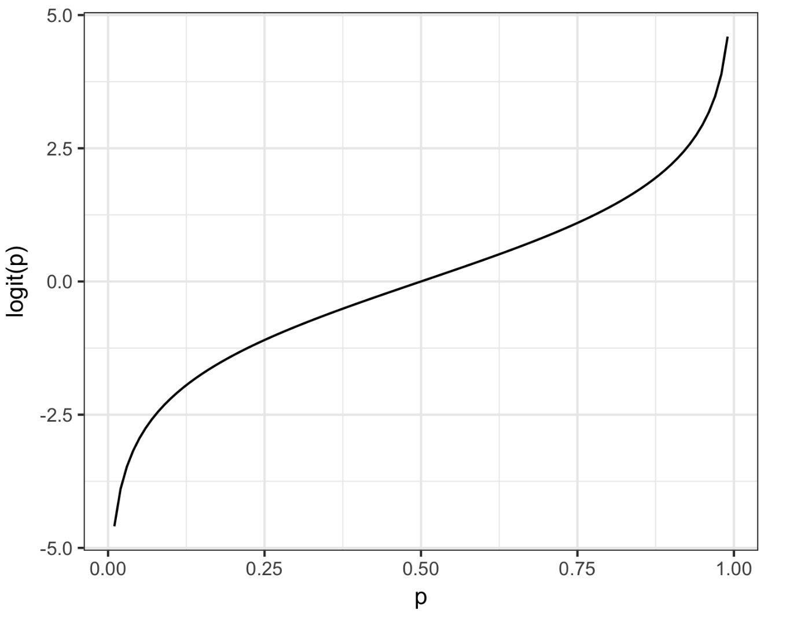

# Practical Statistics for Data Scientists: Logistic Regression (Mathematic Foundation: Odds, Logit Function, Formula, and Examples)

  

## Logistic Regression

> Logistic Regression is a widely used **classification** algorithm that predicts a **binary outcome** (e.g., 0 or 1, default or non-default, spam or not spam). It is similar to linear regression, <u>but instead of predicting continuous values</u>, it predicts probabilities using the **logistic function (sigmoid function)**.

Logistic regression is comparable to multiple linear regression but with a **binary outcome**. Transformations allow the fitting of a linear model. Unlike K-Nearest Neighbor and naive Bayes, it uses **a structured modeling approach** like discriminant analysis. Its speed and efficiency for scoring new data enhance its popularity.  

#### Key Terms for Logistic Regression

- Logit
  - The function that **maps class membership probability to a range from $\pm\ \infty$ (instead of 0 to 1).**
  - = Log odds
- Odds
  - The ratio of "success" (1) to "not success" (0).
- Log Odds
  - The response from the **linearized model** is <u>converted into a probability.</u>  

#### Logistic Response Function and Logit

> Instead of modeling probability \($p$) directly,  **we model log-odds.** The log-odds scale is **linear**, <u>making it easier to work with.</u> The model is **interpretable**: ($\beta_1$) r**epresents the change in log-odds for a one-unit increase.** 

 

##### Why Do We Need a Transformation?

In linear regression, we assume:

  $p =\beta_0 + \beta_1x_1 +\beta_2x_2+ \dots + \beta_qx_q$  

However, this **does not guarantee that $p$ will stay between 0 and 1,** which of modeling $p$ necessary since probabilities must always be in this range. Therefore, *instead of modeling $p$ directly,* we transform it using the **logistic (sigmoid) function.**  

##### The Logistic Response Function

The **logistic response function** (inverse logit function**) <u>transforms a linear combination of predictors into a probability.</u>

  $p=\frac{1}{1+e^{-(\beta_0+\beta_1x_1+ \dots + \beta_q x_q}}$  

We utilize the logistic function to keep predicted probabilities **within the (0,1) range**, allowing **a smooth transition** between class labels. This approach proves effective for **classification** problems.   

##### Interpreting the Function

- When ($\beta_0 + \beta_1 x_1 + \dots$) is **large (positive)**, $p$ approaches **1**.
- When ($\beta_0 + \beta_1 x_1 + \dots$) is **small (negative)**, $p$ approaches **0**.
- When ($\beta_0 + \beta_1 x_1 + \dots) = 0, \ p=0.5$ (the decision boundary).   

##### From Probability to Odds

Instead of working directly with probabilities, we **convert them into odds**. **Odds** represent <u>the ratio of the probability of success to the probability of failure.</u>

  $\text{Odds}(Y=1) = \frac{p}{1-p}$  

For example, 

- If a horse has a **50%** chance of winning $(p=0.5)$, then the odds are:

  

    $\frac{0.5}{1-0.5} = 1$   
  

  (The event is equally likely to happen or not happen). 

- If the probability increases to **75%**, the odds are:

  

    $\frac{0.75}{1-0.75} = 3$  
  

  (The event is **3 times more likely** to happen than not).

Converting to odds **does not limit the result to (0,1)** as probabilities do. Additionally, it facilitates a more precise interpretation of **multiplicative effects.**  

##### From Odds to Log-Odds (Logit)

To simplify calculations, we take the **logarithm of the odds**:

  $\text{log} \big( \frac{p}{1-p} \big) = \beta_0 + \beta_1 x_1 + \beta_2 x_2+ \dots \beta_q x_q$  

This **log-odds transformation** (called the **logit function**) maps probabilities in **(0,1)** to values in ($-\infty , +\infty$), making it suitable for linear modeling.

By taking the log, we can <u>convert a multiplicative relationship into an additive one</u> (easier to work with) and <u>remove the constraint on probabilities,</u> allowing for a **linear equation**.

For example,

- If odds = **3**, then $\log(3)=1.1$
- If odds=**0.5**, then $\log(0.5) =-0.69$   

##### The Logistic Regression Formula

Bringing everything together,

  $\log(\frac{p}{1-p}) = \beta_0+ \beta_1 x_1 + \dots + \beta_q x_q$  

The transformation circle is finalized. We employ a linear model to estimate a probability, which we then map to a class label using **a cutoff rule**—**any record with a probability exceeding this cutoff is classified as a 1.** The graph below of the logic function maps a probability to a scale that is suitable for a linear model. 

    

##### Mapping Probabilities to Class Labels

After estimating $p$, we use a **cutoff threshold** to classify records:  

  $\text{Class} =
\begin{cases}
1, & \text{if } p > 0.5 \\
0, & \text{if } p \leq 0.5
\end{cases}$   

We can customize the **cutoff**:

- If false negatives are costly (e.g., **disease detection**), we lower the threshold (e.g., classified as **1 if $p > 0.3$**).
- We raise the threshold **if false positives are costly** (e.g., fraud detection).

 

##### Logistic Regression vs. Linear Regression

| Feature        | Linear Regression              | Logistic Regression                               |
| -------------- | ------------------------------ | ------------------------------------------------- |
| Outcome Type   | Continuous (e.g., house price) | Binary  (0 or 1)                                  |
| Equation       | $y=b_0+b_1X_1 + \dots$         | $p=\frac{1}{e^{-(\beta_0 + \beta_1X_1 + \dots)}}$ |
| Method         | Ordinary Least Squares (OLS)   | Maximum Likelihood Estimation (MLE)               |
| Interpretation | Predicts actual values         | Predicts probabilities                            |
| Output         | Any real number                | Probability (0 to 1)                              |

  
