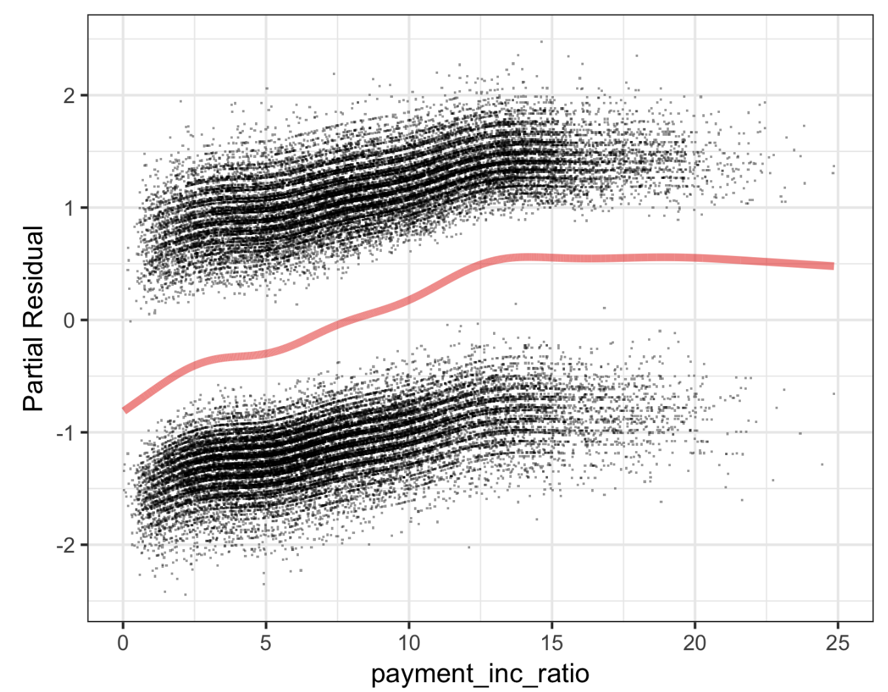

# Practical Statistics for Data Scientists: Logistic Regression (3) Assessing the Model


<br>

### Assessing the Model

> Once we've fit a logistic regression model, the next step is **model evaluation**—understanding **which predictors matter**, **how well the model fits the data**, and **how to interpret** what the model tells us.

<br>

Like other classification techniques, logistic regression is evaluated on its **accuracy** <u>in classifying new data.</u> Similar to linear regression, standard statistical tools are available to analyze and enhance the model. 

- *R* provides the estimated coefficients, standard error (SE), z-value, and p-value. 

  ```R
  summary(logistic_model)
  ---
  Call:
  glm(formula = outcome ~ payment_inc_ratio + purpose_ + home_ +
      emp_len_ + borrower_score, family = "binomial", data = loan_data)
  
  Deviance Residuals:
       Min        1Q    Median        3Q       Max
  -2.51951  -1.06908  -0.05853   1.07421   2.15528
  
  Coefficients:
                              Estimate Std. Error z value Pr(>|z|)
  (Intercept)                 1.638092   0.073708  22.224  < 2e-16 ***
  payment_inc_ratio           0.079737   0.002487  32.058  < 2e-16 ***
  purpose_debt_consolidation  0.249373   0.027615   9.030  < 2e-16 ***
  purpose_home_improvement    0.407743   0.046615   8.747  < 2e-16 ***
  purpose_major_purchase      0.229628   0.053683   4.277 1.89e-05 ***
  purpose_medical             0.510479   0.086780   5.882 4.04e-09 ***
  purpose_other               0.620663   0.039436  15.738  < 2e-16 ***
  purpose_small_business      1.215261   0.063320  19.192  < 2e-16 ***
  home_OWN                    0.048330   0.038036   1.271    0.204
  home_RENT                   0.157320   0.021203   7.420 1.17e-13 ***
  emp_len_ > 1 Year          -0.356731   0.052622  -6.779 1.21e-11 ***
  borrower_score             -4.612638   0.083558 -55.203  < 2e-16 ***
  ---
  Signif. codes:  0 ‘***’ 0.001 ‘**’ 0.01 ‘*’ 0.05 ‘.’ 0.1 ‘ ’ 1
  
  (Dispersion parameter for binomial family taken to be 1)
  
      Null deviance: 62857  on 45341  degrees of freedom
  Residual deviance: 57515  on 45330  degrees of freedom
  AIC: 57539
  
  Number of Fisher Scoring iterations: 4
  ```

<br>

- In Python, the `statsmodels` package includes implementing generalized linear models (`GLM`) that offer equally comprehensive information.

  ```python
  y_numters = [1 if yi == 'default' else 0 for yi in y]
  logit_reg_sm = sm.GLM(y_numbers, X.assign(const=1),
                        family=sm.families.Binomial())
  logit_result = logit_reg_sm.fit()
  logit_result.summary()
  ```

<br>

Interpreting the **p-value** comes with the same caveat as in regression. It should be seen more as a **relative indicator** of variable importance than a formal statistical significance measure. A logistic regression model with a binary response <u>lacks an associated RMSE or R-squared</u>. Instead, it is generally evaluated **using broader classification metrics.** 

Many concepts from linear regression **also apply to the context of logistic regression** (and other GLMs). For example, we can employ <u>stepwise regression, fit interaction terms, or include spline terms.</u> The same issues regarding <u>confounding</u> and <u>correlated variables</u> are relevant to logistic regression as well. 

- We can fit generalized additive models using the `mgcv` package in *R*

  ```R
  logistic_gam <- gam(outcome ~ s(payment_inc_ratio) + purpose_ +
                      home_ + emp_len_ + s(borrower_score),
                      data=loan_data, family='binomial')
  ```

- In *Python,* the formula interface of `statsmodels` also supports these extensions.

  ```python
  import statsmodels.formula.api as smf
  formula =('outcome ~ bs(payment_inc_ratio, df=4) + purpose_ + ' +
            'home_ + emp_len_ + bs(borrower_score, df=4)')
  model = smf.glm(formula=formula, data=loan_data, family=sm.families.Binomial())
  results = model.fit()
  ```

  

#### Analysis of Residuals

> One area where logistic regression differs from linear regression is in the analysis of the residuals. 

- As in linear regression, it is straightforward to compute partial residuals in R.

  ```R
  terms <- predict(logistic_gam, type='terms')
  partial_resid <- resid(logistic_model) + terms
  df <- data.frame(payment_inc_ratio = loan_data[, 'payment_inc_ratio'],
                   terms = terms[, 's(payment_inc_ratio)'],
                   partial_resid = partial_resid[, 's(payment_inc_ratio)'])
  ggplot(df, aes(x=payment_inc_ratio, y=partial_resid, solid = FALSE)) +
    geom_point(shape=46, alpha=0.4) +
    geom_line(aes(x=payment_inc_ratio, y=terms),
              color='red', alpha=0.5, size=1.5) +
    labs(y='Partial Residual')
  ```

  The resulting plot is as follows: the estimated fit, depicted by the line, lies between two sets of point clouds. **The upper cloud **represents a response of 1 (defaulted loans), while **the lower cloud** represents a response of 0 (loans paid off). This pattern is typical of residuals from a logistic regression, as the output is binary. 

<center>
  <br><br>
</center>

The **prediction** is a **logit** (the logarithm of the odds ratio), **always a finite value.** <u>Actual values (0 or 1) correspond to an infinite logit, leading to residuals that never equal 0.</u> Thus, **points group above or below the fitted line in the partial residual plot.** Although partial residuals in logistic regression are less valuable than in linear regression, they confirm nonlinear behavior and identify influential records.

<br><Br>
