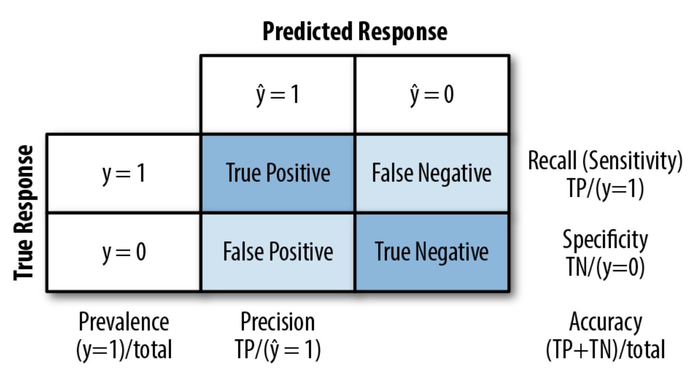
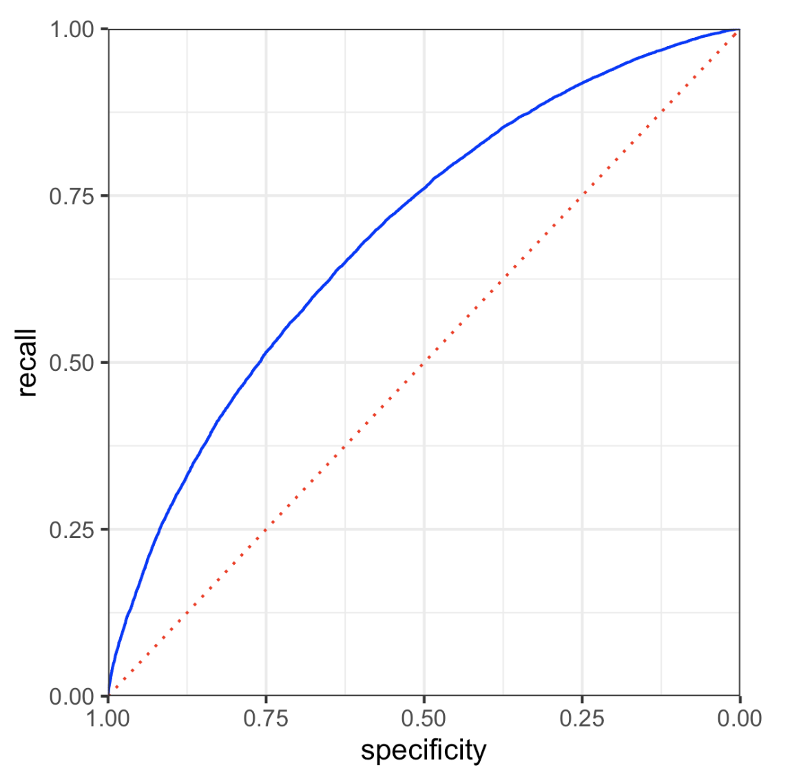
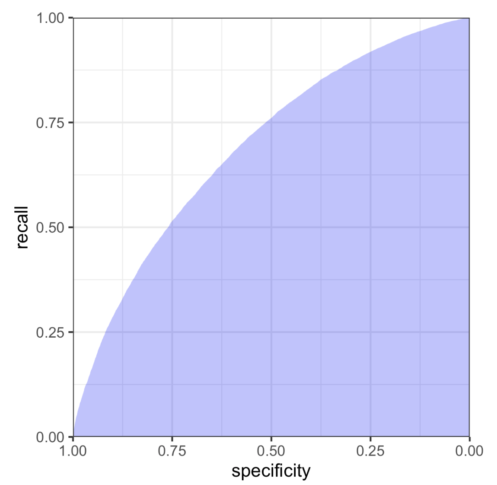

# Practical Statistics for Data Scientists: Evaluating Classification Models (Confusion Matrix, ROC-AUC & Lift)


<br>

### Evaluation of Classification Models

> Evaluating a classification model involves more than simply checking how many predictions are correct. Particularly in real-world scenarios where classes are imbalanced, such as fraud detection or disease diagnosis, **we need more nuanced metrics to assess a model's performance effectively.**

In predictive modeling, different models are trained and tested on holdout samples to evaluate performance. After tuning models, **a new holdout sample** can estimate how the selected model will perform **on unseen data.** Various disciplines may use the terms *validation* and *test* interchangeably for these holdout samples. **The goal is to determine which model yields the most accurate predictions.**

<Br>

#### Key Terms for Evaluating Classification Models

- **Accuracy**
  - The percent (or proportion) of cases classified correctly.
- **Confusion Matrix**
  - A tabular display (2 × 2 in the binary case) showing the record counts by their predicted and actual classification status.
- **Sensitivity**
  - The percentage (or proportion) of **all 1s** <u>correctly classified as 1s.</u>
  - = Recall
- **Specificity**
  - The percentage (or proportion) of **all 0s** is <u>correctly classified as 0s.</u>
- **Precision**
  - The percentage (or proportion) of **predicted 1**s that <u>are 1s.</u> 
- **ROC curve**
  - **A plot of sensitivity versus specificity**
- **Lift**
  - A measure of the **model's effectiveness** <u>in identifying (comparatively rare) 1s at various probability cutoffs.</u> 

<br>

#### 1. Accuracy

A crucial metric for evaluating classification is *accuracy*, defined as the ratio of total correct predictions to all predictions. The formula is simply as follows.

<center>

$$
\text{Accuracy} = \frac{TP+TN}{TP+TN+FP+FN}
$$

</center><Br>

Accuracy represents a measure of total error. In many classification algorithms, each case is given an "**estimated probability of being a 1**." The standard decision threshold, or cutoff, is usually set a**t 0.50 or 50%**. If the probability exceeds 0.5, the outcome is classified as "1"; if not, it is "0." Another possible default cutoff is **the common probability of 1s present in the data.** 

<br>

#### 2. Confusion Matrix

> At the core of classification metrics lies the confusion matrix, which is a table that displays the number of correct and incorrect predictions, organized by type of response. 

A 2×2 table (for binary classification):

| Actual \ Predicted | Predicted 1 (Yes) | Predicted 0 (No) |
| ------------------ | ----------------- | ---------------- |
| Actual 1 (Yes)     | TP (True Pos.)    | FN (False Neg.)  |
| Actual 0 (No)      | FP (False Pos.)   | TN (True Neg.)   |

From this table, we can define more detailed metrics. 

<center>
  <br><br>
</center>

To explain the confusion matrix, let's consider a `logistic_ gam` model trained **on a balanced dataset**, which includes an equal number of defaulted and paid-off loans. According to standard conventions, $Y = 1 $ signifies the event of **interest** (for example, default), whereas $Y = 0 $ indicates a **negative** or typical event (like a loan being paid off). 

- In *R*, the following computes the confusion matrix for the `logistic_gam` model applied to the entire (unbalanced) training set.

  ```R
  pred <- predict(logistic_gam, newdata=train_set)
  pred_y <- as.numeric(pred > 0)
  pred <- predict(logistic_gam, newdata=train_set)
  pred_y <- as.numeric(pred > 0)
  true_y <- as.numeric(train_set$outcome=='default')
  true_pos <- (true_y==1) & (pred_y==1)
  true_neg <- (true_y==0) & (pred_y==0)
  false_pos <- (true_y==0) & (pred_y==1)
  false_neg <- (true_y==1) & (pred_y==0)
  conf_mat <- matrix(c(sum(true_pos), sum(false_pos),
                       sum(false_neg), sum(true_neg)), 2, 2)
  colnames(conf_mat) <- c('Yhat = 1', 'Yhat = 0')
  rownames(conf_mat) <- c('Y = 1', 'Y = 0')
  conf_mat
  ---
        Yhat = 1 Yhat = 0
  Y = 1 14295    8376
  Y = 0 8052     14619
  ```
  
  

#### 3. **Recall (Sensitivity)**

- **Definition**: Proportion of actual 1s correctly predicted.
- **Formula**: $\text{Recall} = \frac{TP}{TP + FN}$

#### 4. **Specificity**

- **Definition**: Proportion of actual 0s correctly predicted.
- **Formula**: $\text{Specificity} = \frac{TN}{TN + FP}$

#### 5. **Precision**

- **Definition**: Proportion of predicted 1s that are actually 1s.
- **Formula**: $\text{Precision} = \frac{TP}{TP + FP}$

<br>

### The Rare Class Problem

In many applications, the minority class (e.g., fraud, disease, customer purchse) is the most important but underrepresented.

- For example, if only 0.1% of cases are class 1 (e.g., fraud), a model that always predicts class 0 is **99.9% accurate**, but **completely useless**.
  - In such cases, you **want high precision and high recall** for the minority class, even if overall accuracy drops.

<br>

### ROC Curve (Receiver Operating Characteristic)

- **Y-axis**: Recall (Sensitivity)
- **X-axis**: 1 - Specificity (False Positive Rate)
- **Purpose**: Shows the trade-off between correctly identifying 1s and avoiding false alarms.
- **Shape**: The **closer the curve is to the top-left corner**, the better the model.
- **Diagonal line**: Represents random guessing (AUC = 0.5)

<br>

- Computing the ROC curve in *R* is straightforward. The following code computes ROC for the loan data.

  ```R
  idx <- order(-pred)
  recall <- cumsum(true_y[idx] == 1) / sum(true_y == 1)
  specificity <- (sum(true_y == 0) - cumsum(true_y[idx] == 0)) / sum(true_y == 0)
  roc_df <- data.frame(recall = recall, specificity = specificity)
  ggplot(roc_df, aes(x=specificity, y=recall)) +
    geom_line(color='blue') +
    scale_x_reverse(expand=c(0, 0)) +
    scale_y_continuous(expand=c(0, 0)) +
    geom_line(data=data.frame(x=(0:100) / 100), aes(x=x, y=1-x),
              linetype='dotted', color='red')
  ```

- In *Python*, we can use the `scikit-learn` function `sklearn.metrics.roc_curve` to calculate the required information for the ROC curve. 

  ```python
  fpr, tpr, thresholds = roc_curve(y, logit_reg.predict_proba(X)[:,0],
                                  pos_label='default')
  ax = roc_df.plot(x='specificity', y='recall', figsize=(4, 4), legend=False)
  ax.set_ylim(0, 1)
  ax.set_xlim(1, 0)
  ax.plot((1, 0), (0, 1))
  ax.set_xlabel('specificity')
  ax.set_ylabel('recall')
  ```

  The dotted **diagonal** line represents a classifier that performs no better than **random chance**. An effective classifier, especially in medical diagnostics, shows an ROC curve close to the upper-left corner, accurately identifying many true positives without misclassifying too many true negatives.

  <center>
    <br><Br>
  </center>

  

### **AUC (Area Under the Curve)**

> While the ROC curve is a useful graphical tool, it doesn’t solely represent a classifier’s performance. However, <u>it can be utilized to calculate the area under the curve (AUC) metric.</u>

- A **single number** summary of the ROC curve.

- **Range**: 0.5 (random) to 1 (perfect)

- Result

  - AUC ≈ 0.7 = weak model
  - AUC ≈ 0.8–0.9 = good
  - AUC ≈ 0.95+ = excellent

  The model achieves an AUC of approximately 0.69, indicating it functions as a weak classifier.

<center>
  <br><br>
</center>


### Precision-Recall Curve

- Useful for **imbalanced data**
- Shows **precision vs. recall** as the cutoff changes
- Helpful to **understand model behavior** when 1s are rare

<br>

### **Python & R: Metric Calculation**

Both R and Python (`scikit-learn`) provide tools to compute:

- Confusion matrix
- Precision, Recall, Specificity
- ROC/AUC scores and curves

<br>

- In *Python*

  ```python
  from sklearn.metrics import confusion_matrix, roc_curve, roc_auc_score, precision_recall_fscore_support
  
  # Confusion matrix
  confusion_matrix(y_true, y_pred)
  
  # Precision, Recall, F1-score
  precision_recall_fscore_support(y_true, y_pred)
  
  # ROC curve
  fpr, tpr, thresholds = roc_curve(y_true, y_proba)
  
  # AUC
  roc_auc_score(y_true, y_proba)
  ```

### <br>Lift

**Lift** is a powerful and intuitive concept used to evaluate the performance of classification models—especially in **rare event prediction**, where the outcome of interest (class 1) is uncommon (e.g., fraud detection, loan default, campaign conversion, etc.).

Lift answers the question:

> “How much <u>better is my model at identifying positives (1s) than random guessing?”</u>

<br>

#### **Why Not Just Use Accuracy or AUC?**

- **Accuracy** doesn't help with **imbalanced data** (e.g., if only 1% of emails are spam, a model that always predicts “not spam” has 99% accuracy but is useless).
- **AUC** shows how well the model **separates classes** across different thresholds—but **doesn't tell you how much better your model is at finding 1s than chance**.
- **Lift** fills that gap: it shows **how concentrated the 1s are in the top predictions** from your model.

<br>

#### **Understanding Lift with an Example**

Imagine:

- Your model ranks all customers based on the probability they’ll respond to a campaign.
- You **only want to target the top 10%** (due to budget).
- Overall response rate = 1%
- But in the **top 10% ranked by your model**, the response rate is 3%.

Then:
$$
\textbf{Lift at 10\%} = \frac{3\%}{1\%} = 3
$$
Your model is 3× better than random targeting.

<br>

#### **How to Calculate Lift**

1. Rank all predictions by probability (from highest to lowest)
2. Divide records into bins (usually deciles — 10 equal groups)
3. For each decile:
   - Count the number of actual positives (1s)
   - Compare with the number you’d expect from random selection
4. Compute:

$$
\text{Lift} = \frac{\text{Observed Positive Rate in Decile}}{\text{Overall Positive Rate}}
$$

You can do this **decile-by-decile** (Lift Chart) or **cumulatively** (Gains Chart).

<br><br>
