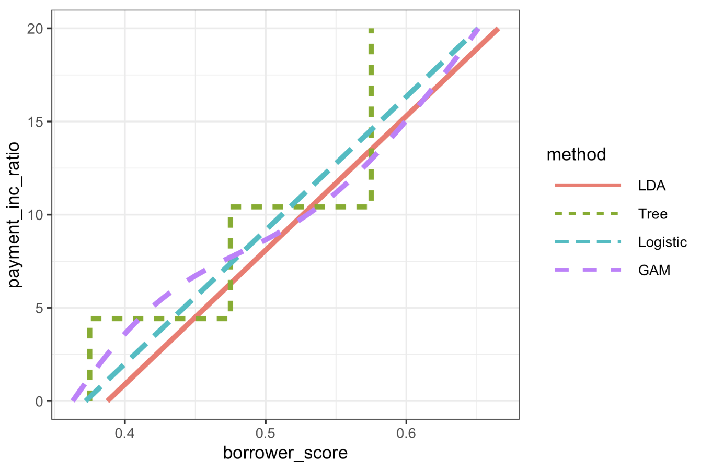

# Practical Statistics for Data Scientists: Strategies for Imbalanced Data (2) (Data Generation, Cost-Based Classification, and Exploring the Predictions)

  

### Data Generation

> *Data generation* through bootstrapping involves **creating new records** <u>by slightly altering existing ones</u>. Since we only have a limited number of instances, the algorithm lacks sufficient information to form robust classification rules. The algorithm can develop a more effective set of rules **by generating similar but distinct records.** (This notion is identical in ensemble statistical models such as boosting and bagging.)

The idea gained traction with the publication of the **SMOTE** algorithm, or “Synthetic Minority Oversampling Technique.” T<u>his algorithm finds a record similar to the record being upsampled.</u> It creates a synthetic record that is a **randomly** **weighted** **average** <u>of the original and neighboring records</u>, where the weight is generated separately for each predictor. 

Several SMOTE implementations exist in R. The `unbalanced` package effectively handles unbalanced data and includes various techniques, such as a **racing algorithm to select the best method**. Additionally, the simple SMOTE algorithm can be directly implemented in R using the `FNN` package.

The Python package `imbalanced-learn` offers a variety of methods through an API that is compatible with `scikit-learn`. It provides several techniques for over- and undersampling and supports <u>applying these methods to boosting and bagging classifiers.</u>

 

#### How SMOTE Works

For each example in the **minority class**, SMOTE:

- Finds its **nearest neighbors** (using KNN).
- Pick one of them at random.
- Create **a new synthetic point** that lies somewhere **in between** the original and the neighbor.

This is done by interpolating feature values. For example, if the original point has a feature value of 0.3 and the neighbor's feature value is 0.5, the synthetic point might be 0.4. 

 

#### SMOTE vs. Bootstrapping

| Method        | Description                                       |
| ------------- | ------------------------------------------------- |
| Bootstrapping | Randomly sample with replacement from existing 1s |
| **SMOTE**     | Create **new** 1s by blending nearby ones         |

- **Why it works**: It expands the "region" of minority class examples, helping models learn more robust boundaries between classes.

 

### Cost-Based Classification

**Accuracy and AUC are insufficient metrics for classifying rules.** Instead, <u>using estimated costs for false positives and negatives better determines the optimal cutoff for classifying 1s and 0s.</u> For example, if the expected default cost of a new loan is $C$ and the expected return from a paid loan is $R$, the expected return for that loan is:

  $\text{expected return} = P(Y=0) \times R 
  + P(Y=1) \times C$   

Rather than labeling a loan as defaulted or paid off **(instead of predicting 0 or 1), it's better to assess whether it has a positive expected return.** The predicted default <u>probability is only an intermediate step and should be factored in with the loan’s total value</u> to determine expected profit, the key metric for business planning. For instance, a smaller loan might be overlooked for a larger one, even with a slightly higher default probability. Therefore, we **approve** a loan **only** if the expected return is **positive**, not just because P(default) < 0.5. *This is more innovative business logic, focused on optimizing for actual outcomes like profits, savings, or risk mitigation.* 

 

### Exploring the Predictions

A single metric, such as `AUC`, **cannot assess all aspects of a model's suitability for a given situation.** The figure below illustrates **the decision rules** for four models fitted to the loan data using only two predictor variables: `borrower_score` and `payment_inc_ratio`. The models include linear **discriminant analysis (LDA**), logistic linear regression, logistic regression fitted with a **generalized additive model (GAM**), and a **tree model** (see “Tree Models”). 

    

The area to the upper left of the lines indicates **a predicted default**. <u>In this scenario, LDA and logistic linear regression yield nearly identical results.</u> The <u>tree model</u> produces the least consistent rule, consisting of two steps. Finally, <u>the GAM fit of the logistic regression finds a balance between the tree and linear models.</u>

 

### Summary of Key Ideas

| Technique         | Goal                             | Best For                  |
| ----------------- | -------------------------------- | ------------------------- |
| **Undersampling** | Reduce bias toward 0s            | Large datasets            |
| **Oversampling**  | Give model more 1s to learn from | Small datasets            |
| **SMOTE**         | Create new realistic 1s          | Moderate data + imbalance |
| **Weighting**     | Penalize misclassifying 1s more  | Almost all situations     |
| **Cost-based**    | Tie model to business impact     | Loan approvals, fraud     |

  
