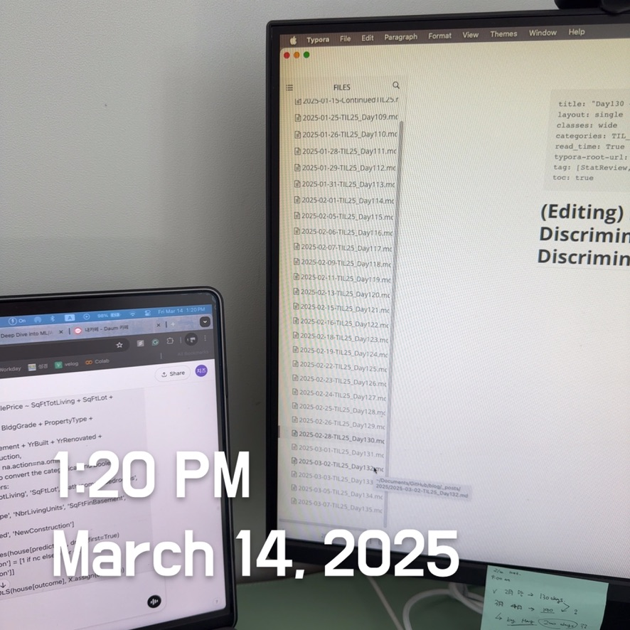

# (Editing) Practical Statistics for Data Scientists: Strategies for Imbalanced Data (2) (Data Generation, Cost-Based Classification, and Exploring the Predictions)

  

#### Adapting the Loss Function

Many classification and regression algorithms optimize specific criteria or loss functions. For instance, logistic regression aims to minimize deviance. In the literature, some researchers suggest modifying the loss function to address issues caused by rare classes. This can be challenging in practice: classification algorithms may be complex and complicated to change. Weighting presents a straightforward method to adjust the loss function by reducing the impact of errors from low-weight records in favor of those with higher-weighted ones.
