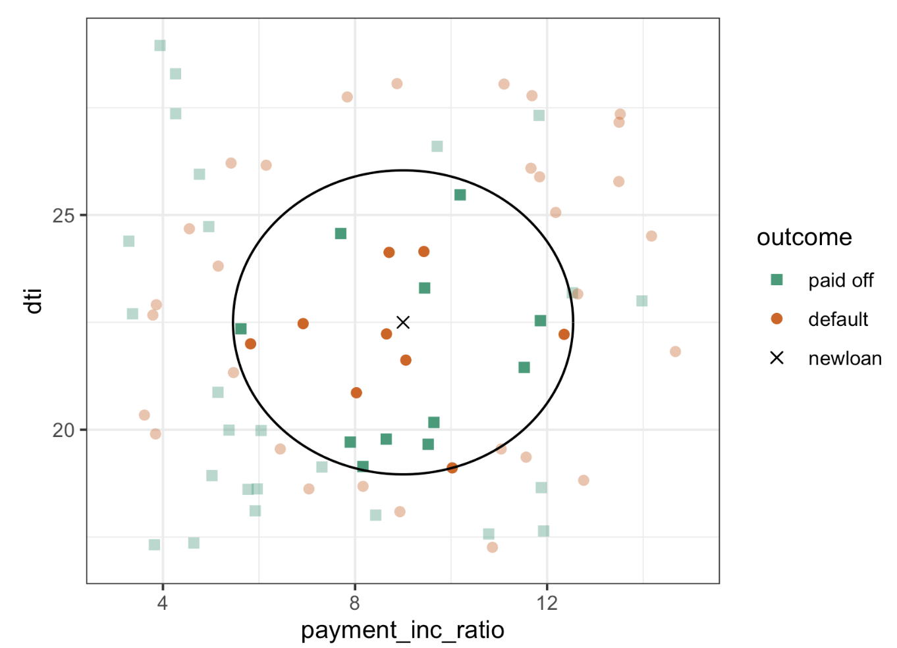

# Practical Statistics for Data Scientists: K-Nearest Neighbors (1) (Example, Distance Metrics, and One Hot Encoder)


<br>

## **What Is Statistical Machine Learning?**

**Statistical Machine Learning** refers to **data-driven, automated methods** used for prediction tasks like **classification** (e.g., "yes" vs. "no") and **regression** (predicting a continuous value).

- These techniques differ from **classical statistics**, which focuses on explaining relationships through fixed models (like linear regression).
- Instead, statistical machine learning methods let the data speak for itself without assuming a fixed structure (like linearity).

For examples,

- **K-Nearest Neighbors (KNN)**: Predict by looking at similar data points.
- **Ensemble Learning + Decision Trees**: Use multiple decision trees together (like Random Forests and Boosting) to get strong predictive results.


#### **Machine Learning vs. Statistics**

| Machine Learning                     | Statistics                           |
| ------------------------------------ | ------------------------------------ |
| Focuses on performance & scalability | Focuses on understanding & inference |
| Optimizes for predictive accuracy    | Explains underlying data structure   |
| Example: Boosting, Neural Nets       | Example: Generalized Linear Models   |

There's **no hard line** between them—both communities contribute to techniques like bagging and boosting.

<br>

### **K-Nearest Neighbors (KNN)**

KNN is a **simple** yet powerful technique. It doesn’t build a model—it **predicts directly from the data** by comparing a new point to nearby points in the training data.

- **How It Works:**
  1. For a new data point, find **$K$ nearest neighbors** (based on a distance metric).
  2. If **classification**: <u>assign the majority class</u> among those neighbors.
  3. If **regression**: <u>average the target values</u> of those neighbors.

#### Key Terms for K-Nearest Neighbors

- Neighbor
  - A record that has similar predictor values to another record.
- Distance Metrics
  - Measures that sum up i<u>n a single number how far one record is from another.</u>
- Standardization
  - Subtract the mean and divide by the standard deviation.
  - = Normalization
- z-score
  - The value that results after standardization. 
  - $\frac{x-\bar{x}}{s}$
- $K$
  - The number of neighbors considered in the nearest neighbor calculation.

##### Important Considerations:

- All features must be **numeric**.
- **Feature scaling is crucial**, or large-valued variables dominate.
- Value of **K** matters: small K = more noise; large K = more smoothing.

KNN is a **simple** classification method <u>that doesn't require model fitting like regression.</u> However, its application <u>can be complex</u> due to feature scaling, similarity measurement, and the chosen value of *K*. We will demonstrate KNN with a classification example.

<Br>

#### Example: Predicting Loan Default with KNN

In this example:

- Predict if a loan will **default or be paid off**.
- Features: `debt-to-income ratio (dti)` and `loan-payment-to-income ratio (payment_inc_ratio)`.

Both ratios are multiplied by 100. For a small set of 200 loans, designated as` loan200`, which includes known **binary outcomes** (either default or no-default, defined by the predictor `outcome200`), we set $K = 20$. The KNN estimate for **predicting a new loan,** referred to as `newloan`, with a `dti` of **22.5** and a `payment_inc_ratio` of **9** can be calculated in R as follows:

- In R

  ```R
  newloan <- loan200[1, 2:3, drop=FALSE]
  knn_pred <- knn(train=loan200[-1, 2:3], test=newloan, cl=loan200[-1, 1], k=20)
  knn_pred == 'paid off'
  ---
  [1] TRUE
  ```

  While *R* has a native `knn` function, the contributed `R` package `FNN`, for Fast Nearest Neighbor, scales more effectively to big data and provides more flexibility.

- In *Python*, Scikit-learn offers a fast KNN implementation.

  ```python
  predictors = ['payment_inc_ratio', 'dti']
  outcome = 'outcome'
  
  newloan = loan200.loc[0:0, predictors]
  X = loan200.loc[1:, predictors]
  y = loan200.loc[1:, outcome]
  
  knn = KNeighborsClassifier(n_neighbors=20)
  knn.fit(X, y)
  knn.predict(newloan)
  ```

The figure below gives a visual display of this example. The **predicted loan** is the **middle cross**. **Squares (paid off)** and **circles (default)** represent <u>training data</u>. The **large black circle** indicates the **boundary of the nearest 20 points,** containing **9 defaulted loans** and **11 paid-off loans**. <u>Thus, the predicted outcome is that the loan is paid off. However, considering only three nearest neighbors, the prediction would be a default.</u>

<center>
  <br><br>
</center>

- Majority is **paid off**, so KNN predicts **paid off**
- But we also get a **probability**: $\text{Probability of default} = \frac{9}{20} = 0.45$

Employing a **probability** score enables **the use of classification rules** beyond <u>simple majority votes (a probability of 0.5)</u>. This is particularly crucial in scenarios involving imbalanced classes.

KNN is a powerful baseline algorithm. It predicts new values based on similarity to previous examples. But its success **heavily depends on data preprocessing**, especially <u>scaling, choosing K wisely, and handling class imbalance properly</u>. <br><br>
