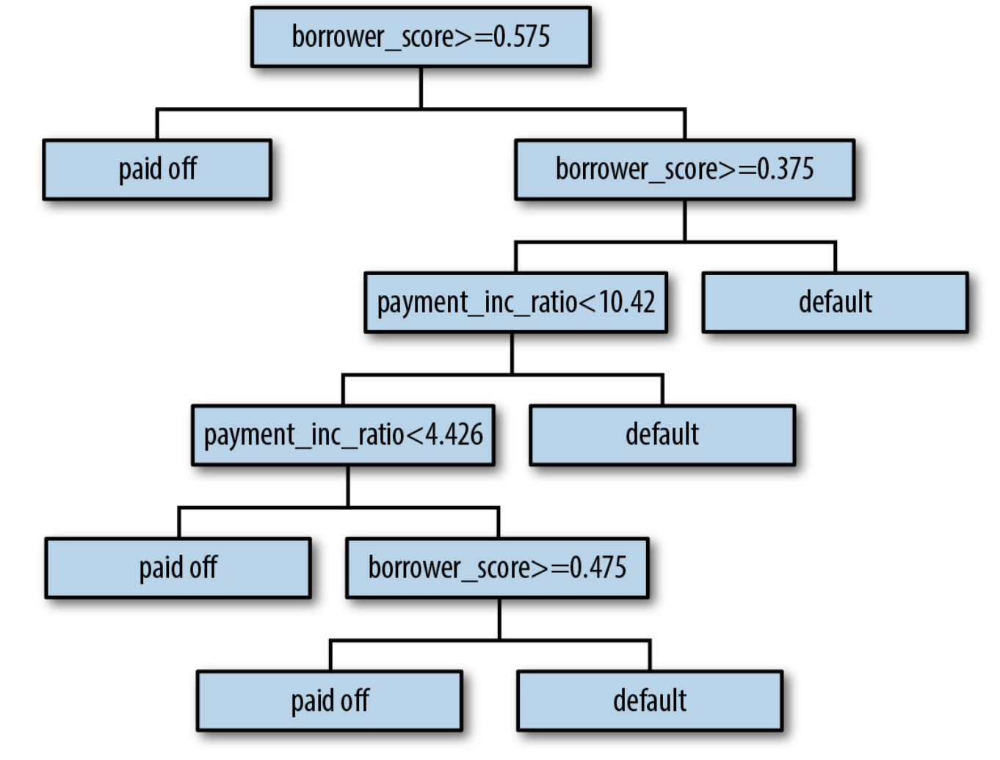
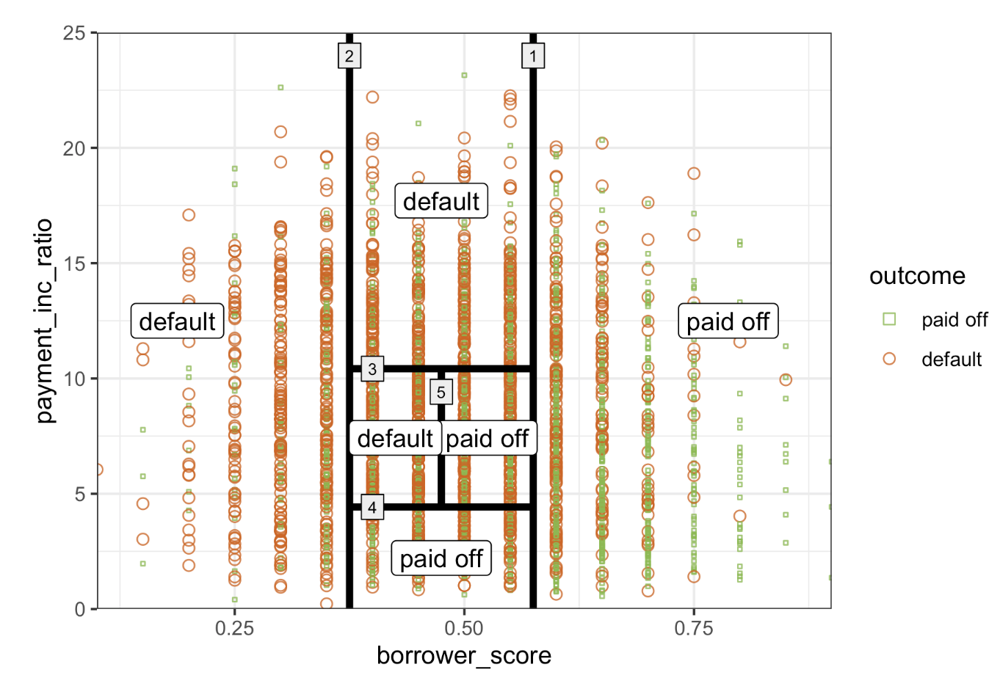
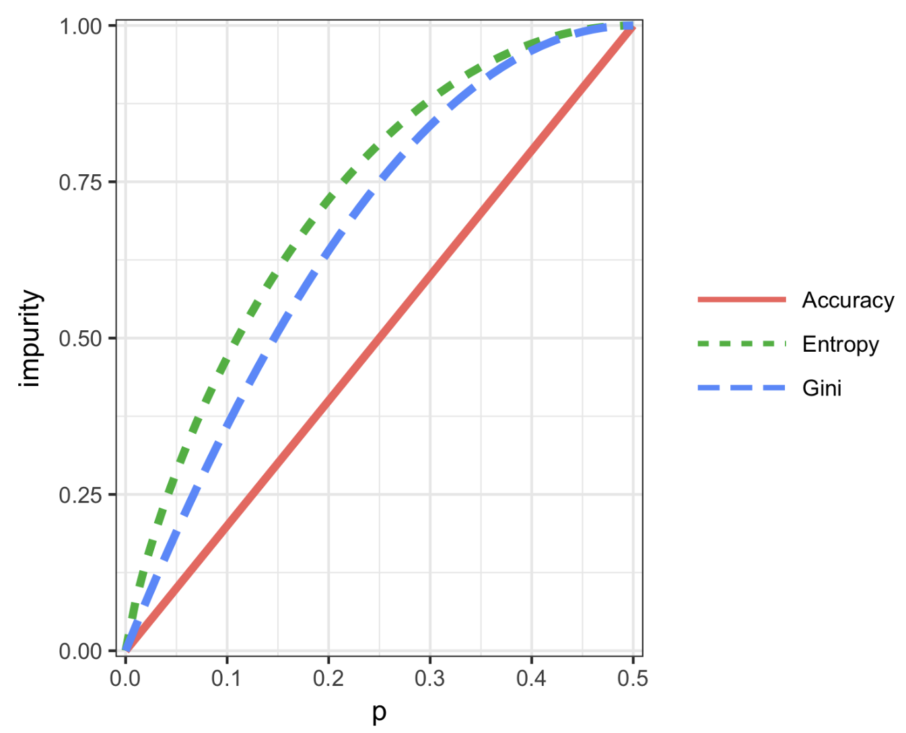

# Practical Statistics for Data Scientists: Tree Models (2) (A Simple Example, The Recursive Partitioning Algorithm, & Measuring Homogeneity or Impurity)


<Br>

> A **decision tree** is a flowchart-like structure used to make predictions. It **splits the dataset** into smaller and smaller groups <u>based on feature values until a final decision (prediction) is made.</u>

### A Simple Example

The main packages for fitting **tree** models in *R* are `rpart` and `tree`. The `rpart` package fits a model to a sample of 3,000 loan records, using `payment_inc_ratio` and `borrower_score`. 

- In *R*

  ```R
  library(rpart)
  
  loan_tree <- rpart(outcome ~ borrower_score + payment_inc_ratio, data=loan3000,
                     control=rpart.control(cp=0.005))
  plot(loan_tree, uniform=TRUE, margin=0.05)
  text(loan_tree)
  ```

- The `sklearn.tree.DecisionTreeClassifier` in Python implements a decision tree. The `dmba` package offers a function for visualization. 

  ```python
  predictors = ['borrower_score', 'payment_inc_ratio']
  outcome = 'outcome'
  
  X = loan3000[predictors]
  y = loan3000[outcome]
  
  loan_tree = DecisionTreeClassifier(random_state=1, criterion='entropy', 
                                     min_impurity_decrease=0.003) 
  loan_tree.fit(X, y)
  plotDecisionTree(loan_tree, feature_names=predictors, 
                   class_names=loan_tree.classes_)
  ```

  The result will look as follows.

  <center>
    <br><br>
  </center>

  The tree works like a series of **"if-then" rules**. For example:

  > If `borrower_score >= 0.575` → predict **paid off**

  > Else if `borrower_score < 0.575` and `payment_inc_ratio < 10.4` → check further splits...

  Each node shows:

  - **How many records** are in that node (n)
  - **Misclassifications (loss)** at that node
  - The **majority class prediction**
  - The **probability** of each class (e.g., (0.53 paid off, 0.47 default))

<br>

- From *R*, the result is as follows.

  ```R
  loan_tree
  ---
  n= 3000
  
  node), split, n, loss, yval, (yprob)
      * denotes terminal node
  
  1) root 3000 1445 paid off (0.5183333 0.4816667)
    2) borrower_score>=0.575 878  261 paid off (0.7027335 0.2972665) *
    3) borrower_score< 0.575 2122  938 default (0.4420358 0.5579642)
      6) borrower_score>=0.375 1639  802 default (0.4893228 0.5106772)
        12) payment_inc_ratio< 10.42265 1157  547 paid off (0.5272256 0.4727744)
          24) payment_inc_ratio< 4.42601 334  139 paid off (0.5838323 0.4161677) *
          25) payment_inc_ratio>=4.42601 823  408 paid off (0.5042527 0.4957473)
            50) borrower_score>=0.475 418  190 paid off (0.5454545 0.4545455) *
            51) borrower_score< 0.475 405  187 default (0.4617284 0.5382716) *
        13) payment_inc_ratio>=10.42265 482  192 default (0.3983402 0.6016598) *
      7) borrower_score< 0.375 483  136 default (0.2815735 0.7184265) *
  ```

  **The indent shows the depth of the tree.** <u>Each node corresponds to a provisional classification determined by the prevailing outcome in that partition</u>. The “**loss**” represents the number of **misclassifications** produced by the provisional classification within a partition. *For instance, in node 2, there were 261 misclassifications out of 878 records.* 

  **The values in parentheses** indicate the **proportion** of records that are either paid off or in default. *For instance, in node 13, which predicts default, over 60 percent of the records are loans currently in default.*

- In *Python*

  ```python
  print(textDecisionTree(loan_tree))
  --
  node=0 test node: go to node 1 if 0 <= 0.5750000178813934 else to node 6
    node=1 test node: go to node 2 if 0 <= 0.32500000298023224 else to node 3
      node=2 leaf node: [[0.785, 0.215]]
      node=3 test node: go to node 4 if 1 <= 10.42264986038208 else to node 5
        node=4 leaf node: [[0.488, 0.512]]
        node=5 leaf node: [[0.613, 0.387]]
    node=6 test node: go to node 7 if 1 <= 9.19082498550415 else to node 10
      node=7 test node: go to node 8 if 0 <= 0.7249999940395355 else to node 9
        node=8 leaf node: [[0.247, 0.753]]
        node=9 leaf node: [[0.073, 0.927]]
      node=10 leaf node: [[0.457, 0.543]]
  ```

  <br>

#### The Recursive Partitioning Algorithm

> The algorithm for constructing a decision tree, known as **recursive partitioning**, is straightforward and intuitive. The data is <u>repeatedly divided using predictor values that most effectively separate the data into relatively homogeneous partitions</u>.  

The figure below illustrates the partitions created for the tree we previously reviewed. **The first rule**, represented by rule 1, states that `borrower_score >= 0.575`, segmenting the right portion of the plot. **The second rule** states that `borrower_score < 0.375`, segmenting the left portion.

<center>
  <br><br>
</center>

1. **Start with the entire dataset**.
2. For each feature, check <u>all possible split points.</u>
3. For each possible split, compute:
   - How well it **separates the classes** (e.g., makes them more homogeneous).
4. Choose the **best feature and value** <u>that minimizes impurity (i.e., increases purity).</u>
5. Split the data into two subsets.
6. **Repeat** steps 2–5 recursively on each subset.

It stops when:

- <u>No more improvement in impurity</u>
- <u>Minimum samples per node are reached.</u>
- <u>Max depth is reached.</u>

Tree models predict binary outcomes and ***provide a probability estimate*** <u>based on the count of 0s and 1s.</u> This estimate is the sum of 0s or 1s <u>divided by the total number of observations in the partition.</u>

<center>

$$
\text{Prob}(Y=1) = \frac{\text{Number of 1s in the partition}}{\text{Size of the partition}}
$$

</center><br>

The estimated $\text{Prob}(Y=1)$ can then be converted to a binary decision; for example, set the estimate to $1$ if $\text{Prob}(Y = 1) > 0.5$.

<br>

### Measuring Homogeneity or Impurity

> Tree models partition records recursively into **sets**, A, predicting an outcome of $Y=0$ or $Y=1$. <u>We need a measure of <b>homogeneity</b> or <b>class purity</b> within each partition, or equivalently, the <b>impurity</b>.</u> 

Prediction accuracy is the proportion $p$ of misclassified records in a partition, <u>ranging from 0 (perfect) to 0.5 (random guessing).</u> However, accuracy is not an adequate measure of impurity. Instead, **the Gini impurity** and **information entropy** are two widely used metrics for impurity.

<br>

#### Gini Impurity — “How often would we misclassify a point?”

- Formula:

  <center>
    $Gini(p) = 1 - (p^2 + (1 - p)^2)$ <br><Br>
  </center>

  Or rewritten:

  <center>
    $Gini(p) = 2p(1 - p)$<br><br>
  </center>

This value:

- Is **0** when a node is **pure** (p = 0 or p = 1)
- Peaks at **0.5** <u>when the classes are <b>perfectly mixed</b></u>


Example Values:

| p (probability of class 1) | Gini(p) |
| -------------------------- | ------- |
| 0.0                        | 0.00    |
| 0.25                       | 0.375   |
| 0.5                        | 0.50    |
| 0.75                       | 0.375   |
| 1.0                        | 0.00    |


#### Entropy — “How uncertain are we about the class?”

- Formula:

  <center>
    $Entropy(p) = -p \log_2(p) - (1 - p) \log_2(1 - p)$<br><Br>
  </center>

  

- This comes from **information theory** — it measures a random variable's <u>average information content (surprise)</u>.

  - If we’re totally certain (p = 0 or 1), entropy = 0 → no surprise
  - <u>If we’re totally unsure (p = 0.5), entropy is highest → maximum uncertainty</u>


Example Values:

| p (probability of class 1) | Entropy(p) |
| -------------------------- | ---------- |
| 0.0                        | 0.00       |
| 0.25                       | 0.811      |
| 0.5                        | 1.000      |
| 0.75                       | 0.811      |
| 1.0                        | 0.00       |


#### Graph Comparison

<center>
  
</center>

If we plotted both functions, you could see:

- Both are **symmetric around 0.5.**
- Both hit **0** when the node is pure.
- Entropy grows **more sharply near p=0.5**, so it **penalizes impurity more harshly**.

This means <u><b>Entropy is more sensitive</b></u> to changes near p = 0.5, <u>whereas <b>Gini is smoother</b></u>

<br>

#### Which One Should We Use?

| Criterion          | Gini                                     | Entropy                              |
| ------------------ | ---------------------------------------- | ------------------------------------ |
| **Computation**    | Faster (no log computation)              | Slightly slower (uses log₂)          |
| **Interpretation** | Based on misclassification               | Based on information gain            |
| **Sensitivity**    | <u>Less harsh around p = 0.5</u>         | <u>More sensitive around p = 0.5</u> |
| **Effect**         | Tends to create **purer** nodes early on | May give **more balanced splits**    |

Please note that **scikit-learn** uses **Gini by default**, but we can easily switch to entropy.

<br><br>
