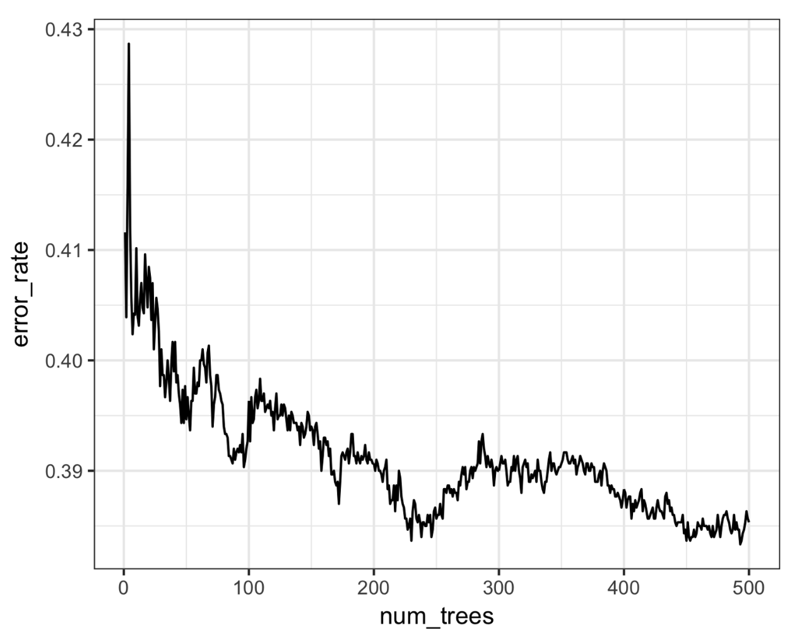
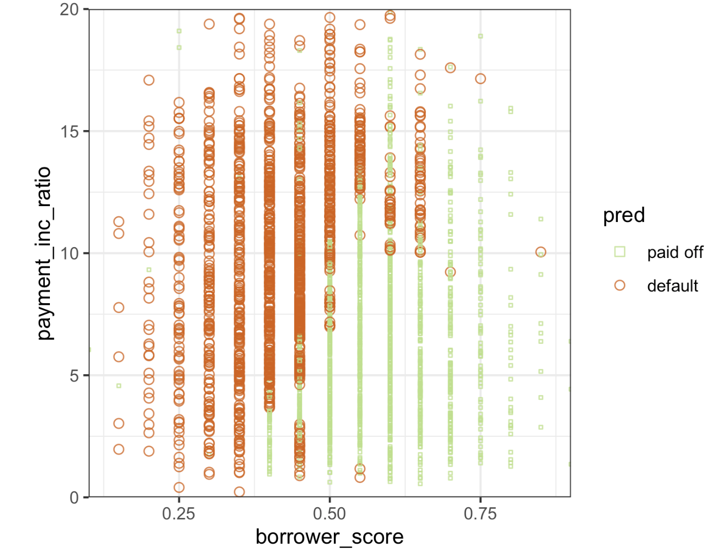
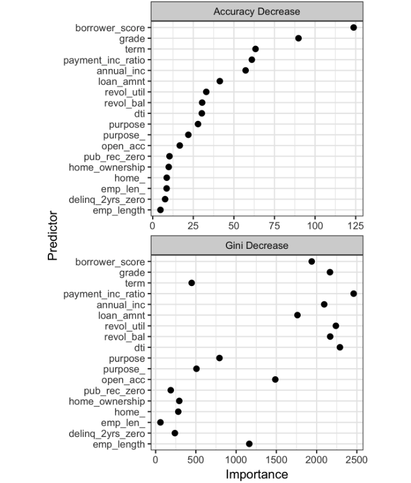

# Practical Statistics for Data Scientists: Bagging and the Random Forest (2) (Random Forest II & Variable Importance)


<br>

Continuing from the previous post... 

The *out-of-bag* (*OOB*) estimate of error is the error rate for the trained models applied to the data left out of the training set for that tree. 

- Using the output from the model, the OOB error can be plotted versus the number of trees in the random forest in *R*

  ```R
  error_df = data.frame(error_rate=rf$err.rate[,'OOB'],
                        num_trees=1:rf$ntree)
  ggplot(error_df, aes(x=num_trees, y=error_rate)) +
    geom_line()
  ```

- The `RandomForestClassifier` implementation does not easily calculate out-of-bag estimates as a function of the number of trees in the random forest. We can train a **sequence** of classifiers with an increasing number of trees and keep track of the oob_score_ values, but this method is not efficient.

  ```python
  n_estimator = list(range(20, 510, 5))
  oobScores = []
  for n in n_estimator:
      rf = RandomForestClassifier(n_estimators=n, criterion='entropy',
                                  max_depth=5, random_state=1, oob_score=True)
      rf.fit(X, y)
      oobScores.append(rf.oob_score_)
  df = pd.DataFrame({ 'n': n_estimator, 'oobScore': oobScores })
  df.plot(x='n', y='oobScore')
  ```

The result is shown in the figure below. The error rate rapidly decreases from over 0.44 before stabilizing around 0.385. The predicted values can be obtained from the `predict` function and plotted in *R* as follows.

<center>
  <br><br>
</center>

- In R

  ```R
  pred <- predict(rf, prob=TRUE)
  rf_df <- cbind(loan3000, pred = pred)
  ggplot(data=rf_df, aes(x=borrower_score, y=payment_inc_ratio,
                         shape=pred, color=pred, size=pred)) +
      geom_point(alpha=.8) +
      scale_color_manual(values = c('paid off'='#b8e186', 'default'='#d95f02')) +
      scale_shape_manual(values = c('paid off'=0, 'default'=1)) +
      scale_size_manual(values = c('paid off'=0.5, 'default'=2))
  ```

- In *Python*

  ```python
  predictions = X.copy()
  predictions['prediction'] = rf.predict(X)
  predictions.head()
  
  fig, ax = plt.subplots(figsize=(4, 4))
  
  predictions.loc[predictions.prediction=='paid off'].plot(
      x='borrower_score', y='payment_inc_ratio', style='.',
      markerfacecolor='none', markeredgecolor='C1', ax=ax)
  predictions.loc[predictions.prediction=='default'].plot(
      x='borrower_score', y='payment_inc_ratio', style='o',
      markerfacecolor='none', markeredgecolor='C0', ax=ax)
  ax.legend(['paid off', 'default']);
  ax.set_xlim(0, 1)
  ax.set_ylim(0, 25)
  ax.set_xlabel('borrower_score')
  ax.set_ylabel('payment_inc_ratio')
  ```

  


**The plot below clearly illustrates what the random forest is like.**

The random forest method is a “black box” technique, **offering more accurate predictions** than a simple tree, <u>though it loses intuitive decision rules</u>. **Predictions can be noisy**; some highly creditworthy borrowers may still receive default predictions <u>due to unusual data records, highlighting the risk of overfitting.</u>

<center>
  <br><br>
</center>

<br>

### Variable Importance

> The power of the random forest algorithm becomes evident **when building predictive models for data with numerous features and records.** 

It can automatically identify <u>significant predictors and uncover complex relationships</u> between predictors related to interaction terms. For example, it can fit a model to the loan default data with all columns included.

#### How Does Random Forest Find Important Variables?

- Splits the data **thousands of times** across all the trees.
- Each time it splits, it chooses **the best variable** that makes the classes (e.g., paid off or default) **more pure**.

Overtime:

- Some variables keep getting picked again and again for essential splits.
- Some variables barely ever get picked.

The most significant variables that help make good splits (leading to purer groups) are considered **more important**.

<br>

#### Two Ways to Measure Variable Importance in Random Forest

When we train a Random Forest, we often want to ask it:

> "Among all these dozens (or even hundreds) of **features**, <u>which ones are really making a difference in our predictions?"</u>

Random Forests answer this by **measuring Variable Importance** — there are two different ways to do it. 

1. ##### Decrease in Accuracy (The "What-If-You-Mess-It-Up" Test)

   Imagine we have a fully trained Random Forest that predicts remarkably well. Now, let's explore a small experiment.

   1. Pick one feature — say, "Annual Income."
   2. Scramble its value — shuffle them randomly among the borrowers.
   3. Ask the Random Forest to predict again.

   Now, we will observe as follows.

   - If **the model's accuracy drops a lot after scrambling Annual Income**, it means:

     > Annual income was significant. Without this, I can't predict correctly.

   - If the model's accuracy **barely changes**, it means:

     > Annual income wasn't helping much anyway. 

   This method <u>directly tests how much the model relies on a feature to make good predictions.</u> Because it uses **out-of-bag (OOB) samples** (data that wasn't used to build each tree), it's getting a **real, honest validation** — no bias from the training data.

   That's why **a decrease in accuracy** is considered **more trustworthy and reliable. **

2. ##### Decrease in Gini Impurity (The "How-Much-It-Helped-To-Split" Score)

   Now imagine constructing the Random Forest itself. *Each time the forest grows a tree*, **it selects a feature to split the data**. It checks, <u>"Does this split make the groups purer?"</u> In this context, "purer groups" refers to **groups where borrowers are predominantly defaults or paid off**. 

   Whenever a feature such as "Debt-to-Income Ratio" is utilized at a split, the split **reduces impurit**y, making the child nodes "cleaner" and less "mixed. " The model **tracks** the amount of impurity that is diminished. 

   Across hundreds of trees, <u>if a feature significantly reduces impurity, it is marked as critical</u>. Conversely, if a feature rarely helps, it is considered less critical.

   This method is **efficient** <u>as it captures information organically during the tree construction.</u> However, there's a **downside**: because <u>it computes values as the training data is fitted, it may exaggerate the significance of specific features</u>- particularly those that align closely with the noise in the training set. 

<br>

Let's start with checking the code source for variable importance in R & Python.  

- In *R*

  ```R
  rf_all <- randomForest(outcome ~ ., data=loan_data, importance=TRUE)
  rf_all
  ---
  Call:
   randomForest(formula = outcome ~ ., data = loan_data, importance = TRUE)
                 Type of random forest: classification
                       Number of trees: 500
  No. of variables tried at each split: 4
  
          OOB estimate of  error rate: 33.79%
  
  Confusion matrix:
           paid off default class.error
  paid off    14676    7995   0.3526532
  default      7325   15346   0.3231000
  ```

  

- In *Python*

  ```python
  predictors = ['loan_amnt', 'term', 'annual_inc', 'dti', 'payment_inc_ratio', 
                'revol_bal', 'revol_util', 'purpose', 'delinq_2yrs_zero',
                'pub_rec_zero', 'open_acc', 'grade', 'emp_length', 'purpose_',
                'home_', 'emp_len_', 'borrower_score']
  outcome = 'outcome'
  
  X = pd.get_dummies(loan_data[predictors], drop_first=True)
  y = loan_data[outcome]
  
  rf_all = RandomForestClassifier(n_estimators=500, random_state=1)
  rf_all.fit(X, y)
  ```

  The argument `importance=TRUE` requests that the `randomForest` stores additional information about the importance of different variables.

  

- In R, the function `varImpPlot` will plot the relative performance of the variables (relative to permuting that variable).

  ```R
  varImpPlot(rf_all, type=1)  # Decrease in Accuracy
  varImpPlot(rf_all, type=2)  # Decrease in Node Impurity
  ```

- In *Python*, the `RandomForestClassifier` collects information about feature importance during training and makes it available with the field `feature_importance_`. 

  ```python
  importance = rf_all.feature_importance_
  ```


The "Gini decrease" is available as the `feature_importance_` property of the fitted classifier. However, accuracy decrease is not available out of the box for *Python*. We can calculate it (`scores`) using the following code.

- In *Python*

  ```python
  rf = RandomForestClassifier(n_estimators=500)
  scores = defaultdict(list)
  
  # cross-validate the scores on a number of different random splits of the data
  for _ in range(3):
      train_X, valid_X, train_y, valid_y = train_test_split(X, y, test_size=0.3)
      rf.fit(train_X, train_y)
      acc = metrics.accuracy_score(valid_y, rf.predict(valid_X))
      for column in X.columns:
          X_t = valid_X.copy()
          X_t[column] = np.random.permutation(X_t[column].values)
          shuff_acc = metrics.accuracy_score(valid_y, rf.predict(X_t))
          scores[column].append((acc-shuff_acc)/acc)
  ```

The result is shown as follows. 

<center>
  <br><br>
</center>


The top and bottom panels show variable importance according to the decrease in accuracy and Gini impurity, respectively. The **decrease in accuracy ranks the variables in both panels. T**he variable importance scores produced by these two measures are quite different.

By default, `randomForest` **only calculates Gini impurity**, an inherent aspect of the algorithm. Further computations are necessary to evaluate model accuracy by variable, such as permuting data and making predictions. This extra computational effort may not be justified in production environments with multiple models. <u>The Gini decrease highlights which variables the random forest uses for splitting rules, information often hidden in a random forest compared to a simple tree.</u>

<br><br>
