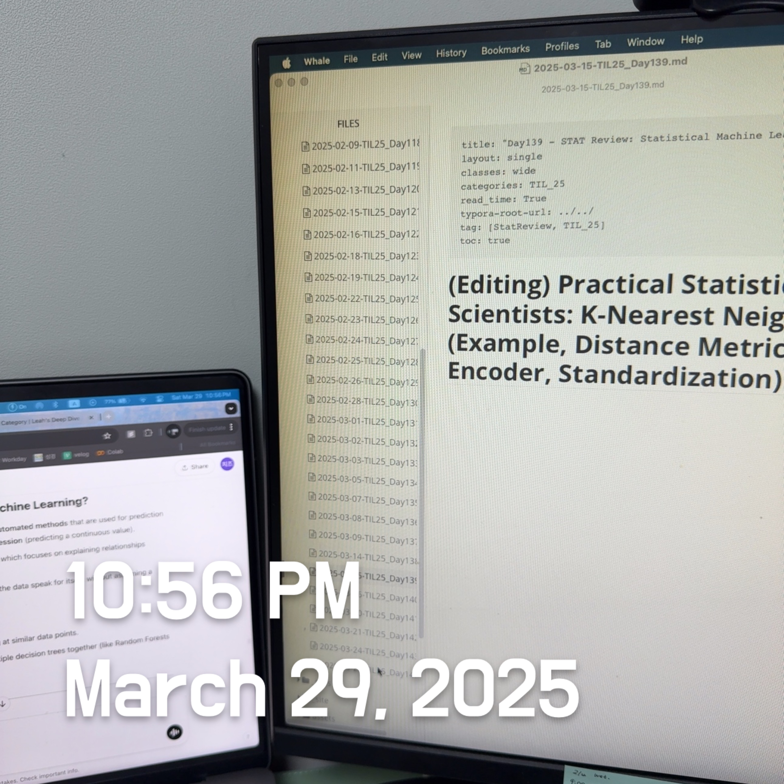

# Practical Statistics for Data Scientists: Bagging and the Random Forest (2) (Random Forest II & Variable Importance)



<br>

Continuing from the previous post... 

The *out-of-bag* (*OOB*) estimate of error is the error rate for the trained models applied to the data left out of the training set for that tree. 

- Using the output from the model, the OOB error can be plotted versus the number of trees in the random forest in *R*

  ```R
  error_df = data.frame(error_rate=rf$err.rate[,'OOB'],
                        num_trees=1:rf$ntree)
  ggplot(error_df, aes(x=num_trees, y=error_rate)) +
    geom_line()
  ```

- The `RandomForestClassifier` implementation does not easily calculate out-of-bag estimates as a function of the number of trees in the random forest. We can train a **sequence** of classifiers with an increasing number of trees and keep track of the oob_score_ values, but this method is not efficient.

  ```python
  n_estimator = list(range(20, 510, 5))
  oobScores = []
  for n in n_estimator:
      rf = RandomForestClassifier(n_estimators=n, criterion='entropy',
                                  max_depth=5, random_state=1, oob_score=True)
      rf.fit(X, y)
      oobScores.append(rf.oob_score_)
  df = pd.DataFrame({ 'n': n_estimator, 'oobScore': oobScores })
  df.plot(x='n', y='oobScore')
  ```

The result is shown in the figure below. The error rate rapidly decreases from over 0.44 before stabilizing around 0.385. The predicted values can be obtained from the `predict` function and plotted in *R* as follows.

- In R

  ```R
  pred <- predict(rf, prob=TRUE)
  rf_df <- cbind(loan3000, pred = pred)
  ggplot(data=rf_df, aes(x=borrower_score, y=payment_inc_ratio,
                         shape=pred, color=pred, size=pred)) +
      geom_point(alpha=.8) +
      scale_color_manual(values = c('paid off'='#b8e186', 'default'='#d95f02')) +
      scale_shape_manual(values = c('paid off'=0, 'default'=1)) +
      scale_size_manual(values = c('paid off'=0.5, 'default'=2))
  ```

- In *Python*

  ```python
  predictions = X.copy()
  predictions['prediction'] = rf.predict(X)
  predictions.head()
  
  fig, ax = plt.subplots(figsize=(4, 4))
  
  predictions.loc[predictions.prediction=='paid off'].plot(
      x='borrower_score', y='payment_inc_ratio', style='.',
      markerfacecolor='none', markeredgecolor='C1', ax=ax)
  predictions.loc[predictions.prediction=='default'].plot(
      x='borrower_score', y='payment_inc_ratio', style='o',
      markerfacecolor='none', markeredgecolor='C0', ax=ax)
  ax.legend(['paid off', 'default']);
  ax.set_xlim(0, 1)
  ax.set_ylim(0, 25)
  ax.set_xlabel('borrower_score')
  ax.set_ylabel('payment_inc_ratio')
  ```

  


