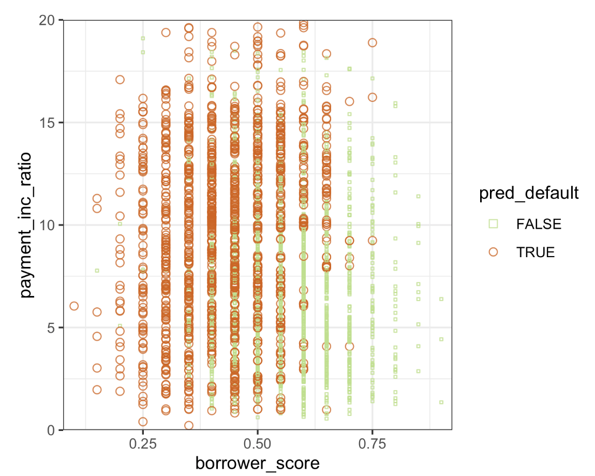

# Practical Statistics for Data Scientists: Boosting (1) (Key Concepts & XGBoost) 


<br>

## Boosting

Ensemble models have become essential in predictive modeling. *Boosting* is a broad method for forming an ensemble of models. Similar to bagging, boosting is primarily applied with decision trees. However, despite these similarities, **boosting adopts a distinct approach that involves many additional features and complexities.** As a result, <u>while bagging can be done with relatively little tuning, boosting requires much more excellent care in its application.</u> 

We already noticed that in Bagging (Iike in Random Forests):

- We build **various models independently.**
- Then, they combine their predictions at the end by **averaging or voting**. 

**Boosting**, on the other hand, adopts a distinctly different strategy. *Rather than constructing multiple models simultaneously*, **it develops them one at a time, sequentially, like a relay race.** Each model <u>learns from the mistakes</u> of the previous model. 

>  **Boosting = "Let’s focus more and more on the difficult cases."**

It’s like a team of doctors:

- The first doctor makes an initial diagnosis.
- The second doctor reviews the mistakes and corrects them.
- The third doctor improves on what the second missed.
- And so on.

**Each step learns from the previous step’s failures.** Several algorithm variants are commonly used: *Adaboost, gradient boosting*, and *stochastic gradient boosting*. Stochastic gradient boosting is the **most general and widely used.** Indeed, <u>the algorithm can replicate the random forest with the proper choice of parameters.</u> 

<br>

#### Key Terms for Boosting

- Ensemble 
  - Forming a prediction by using a collection of models.
  - = Model Averaging
- **Boosting**
  - A general technique for fitting a sequence of models **by assigning greater weight to the records with large residuals during each successive round.**
- Adaboost 
  - An early version of boosting that reweights the data based on the residuals. 
- Gradient Boosting
  - A broader approach to boosting is described **as minimizing a cost function.** 
- Stochastic Gradient Boosting
  - The broadest boosting algorithm **includes resampling records and columns during each iteration.** 
- Regularization
  - A technique to avoid overfitting **by adding a penalty term** <u>to the cost function based on the number of parameters in the model.</u> 
- Hyperparameters
  - **Parameters** that must be established **before fitting the algorithm.**

<br>

#### The Boosting Algorithm

There are various boosting algorithms, and the basic idea behind them is the same. 

##### Step-by-Step

1. Start simple: Train a basic model (for example, a small decision tree) on the full dataset.
2. **Check where we made mistakes**: Look at which examples were misclassified (or had significant errors).
3. **Focus harder on the mistakes**: Increase the importance (weights) of the misclassified examples.
   - It's like assigning to the model, "<u>Pay extra attention to these tricky cases next time."</u>
4. Train **the following model**: The subsequent model is now trained with the **updated weights.**<br>It <u>tries harder to predict the examples</u> that were missed previously.
5. **Repeat**: Keep adding models. Each one focused on **fixing the mistakes** of the ones before.
6. **Combine all models together**:<Br>The final prediction is a <u>weighted vote (classification) or weighted average (regression)</u> of all models.

<br>

#### Variants of Boosting

Boosting comes in several flavors, but they all follow this core idea of **sequential improvement.**

| Variant                          | Key Idea                                                     |
| -------------------------------- | ------------------------------------------------------------ |
| **Adaboost**                     | Increases the weight of misclassified points after each model. |
| **Gradient Boosting**            | Frames the problem as <u>minimizing a loss function</u> (like MSE, cross-entropy) step-by-step. |
| **Stochastic Gradient Boosting** | Adds randomness: <u>sample rows and features</u> at each step to make the process more robust and faster. |

<Br>

#### Boosting vs. Bagging: The Key Difference

| Aspect          | Bagging (Random Forest)                | Boosting                                              |
| --------------- | -------------------------------------- | ----------------------------------------------------- |
| **Training**    | Models are built <u>independently.</u> | Models are built <u>sequentially.</u>                 |
| **Focus**       | Reduce variance (stabilize models).    | **Reduces bias** (fix mistakes step by step).         |
| **Sensitivity** | More <u>stable and easy to run</u>.    | More sensitive and **powerful** but trickier to tune. |

<Br>

#### The Boosting Algorithm in Action (Example: Adaboost)

Imagine you have a set of loans, and you're predicting **default or paid off**. Here's how **Adaboost** would work:

- First tree: guesses 70% right, 30% wrong.
- We **increase the weights** on those wrong cases.
- **Second tree: trained more heavily on those 30% misclassified loans.**
- Now it gets 80% correct.
- **We boost again: the third tree focuses on what's still wrong.**
- And so on.

Each tree is like a **correction layer** for the previous mistakes.

<Br>

#### What About **Gradient Boosting**?

In **Gradient Boosting**, we **directly minimize a loss function** (like Mean Squared Error or Log Loss) <u>instead of manually adjusting observation weights.</u> Each new model **fits the residuals** (what’s left to be predicted after previous models).

> **Residual = True value - Current prediction**

Each new model <u>tries to predict the residuals (errors) from the previous step</u> — meaning it **keeps improving** prediction accuracy.

**Stochastic Gradient Boosting** goes even further. It adds **randomness** by training each model on a **random subset** of data and features. This makes it **faster** and reduces overfitting.

<br>

### XGBoost

The most widely used public domain software for boosting is **XGBoost**, "**Extreme Gradient Boosting.**" It is a high-speed, highly optimized boosting version that gained fame because <u>it works great on massive datasets and handles missing data nicely.</u> It also <u>supports regularization to avoid overfitting.</u> 

XGBoost operates similarly to traditional boosting by building models sequentially and correcting the errors of previous models. However, it i**ncorporates more efficient techniques** (such as **fast memory usage** and **parallel processing**), provides **greater flexibility** <u>(allowing for precise tuning)</u>, and includes **additional regularization** (<u>to minimize the risk of overfitting</u>). In short, 

> XGBoost is not a new algorithm but **an optimized, supercharged boosting implementation.**

<br>

#### Important Parameters in XGBoost

We must tune these parameters carefully to get the best result. 

- **Subsample** refers to the "fraction of rows randomly sampled for each tree." <u>It introduces randomness to improve generalization (similar to Random Forest).</u>
- **eta** (`learning_rate` in Python) refers to "shrinkage applied after each tree." <u>It controls how quickly the model learns; <b>small eta</b> results in <b>slower, more careful</b> learning, which helps avoid overfitting.</u>

<Br>

For instance, we will train XGBoost on the loan default data that we have used previously. 

- In *R*

  ```R
  predictors <- data.matrix(loan3000[, c('borrower_score', 'payment_inc_ratio')])
  label <- as.numeric(loan3000[, 'outcome']) - 1
  xgb <- xgboost(data=predictors, label=label, objective="binary:logistic",
                 params=list(subsample=0.63, eta=0.1), nrounds=100)
  ---
  [1]	train-error:0.358333
  [2]	train-error:0.346333
  [3]	train-error:0.347333
  ...
  [99]	train-error:0.239333
  [100]	train-error:0.241000
  ```

  `xgboost` does not support the formula syntax, so the predictors must be converted to `data.matrix`,  and the response needs to be converted to 0/1 variables. **The objective argument tells `xgboost` the problem; based on this**, <u>`xgboost` will choose a metric to optimize.</u> 

  Here’s what each part means:

  - **objective="binary:logistic"** → Binary classification (yes/no, default or not).
  - **subsample=0.63** → Use 63% of the data randomly for each tree.
  - **eta=0.1** → Small learning steps to avoid overfitting.
  - **nrounds=100** → Build 100 trees.

  As the boosting progresses, **the error on the training data decreases.**

- In *Python*, `xgboost` has two interfaces: a `scikit-learn` API (XGBoost has two APIs: `XGBClassifier` and `XGBRegressor`) and a more functional interface like in *R*. (`eta` will be replaced with `learning_rate` here).

  ```python
  predictors = ['borrower_score', 'payment_inc_ratio']
  outcome = 'outcome'
  
  X = loan3000[predictors]
  y = loan3000[outcome]
  
  xgb = XGBClassifier(objective='binary:logistic', subsample=0.63)
  xgb.fit(X:y)
  --
  XGBClassifier(base_score=0.5, booster='gbtree', colsample_bylevel=1,
         colsample_bynode=1, colsample_bytree=1, gamma=0, learning_rate=0.1,
         max_delta_step=0, max_depth=3, min_child_weight=1, missing=None,
         n_estimators=100, n_jobs=1, nthread=None, objective='binary:logistic',
         random_state=0, reg_alpha=0, reg_lambda=1, scale_pos_weight=1, seed=None,
         silent=None, subsample=0.63, verbosity=1)
  ```

  From each parts:

  - **learning_rate** = 0.1 by default (instead of eta — Python uses the newer naming).
  - The `objective` is set to "binary:logistic," meaning it's solving a binary classification task.

<br>

##### Predictions and Plotting

- In *R*, the predicted values can be obtained from the `predict` function and plotted versus the predictors since there are only two variables.

  ```R
  pred <- predict(xgb, newdata=predictors)
  xgb_df <- cbind(loan3000, pred_default = pred > 0.5, prob_default = pred)
  ggplot(data=xgb_df, aes(x=borrower_score, y=payment_inc_ratio,
                          color=pred_default, shape=pred_default, size=pred_default)) +
           geom_point(alpha=.8) +
           scale_color_manual(values = c('FALSE'='#b8e186', 'TRUE'='#d95f02')) +
           scale_shape_manual(values = c('FALSE'=0, 'TRUE'=1)) +
           scale_size_manual(values = c('FALSE'=0.5, 'TRUE'=2))
  ```

- The same figure can be created in *Python* using the code below. 

  ```python
  fig, ax = plt.subplots(figsize=(6, 4))
  
  xgb_df.loc[xgb_df.prediction=='paid off'].plot(
      x='borrower_score', y='payment_inc_ratio', style='.',
      markerfacecolor='none', markeredgecolor='C1', ax=ax)
  xgb_df.loc[xgb_df.prediction=='default'].plot(
      x='borrower_score', y='payment_inc_ratio', style='o',
      markerfacecolor='none', markeredgecolor='C0', ax=ax)
  ax.legend(['paid off', 'default']);
  ax.set_xlim(0, 1)
  ax.set_ylim(0, 25)
  ax.set_xlabel('borrower_score')
  ax.set_ylabel('payment_inc_ratio')
  ```

  

<center>
  <br><br>
</center>

