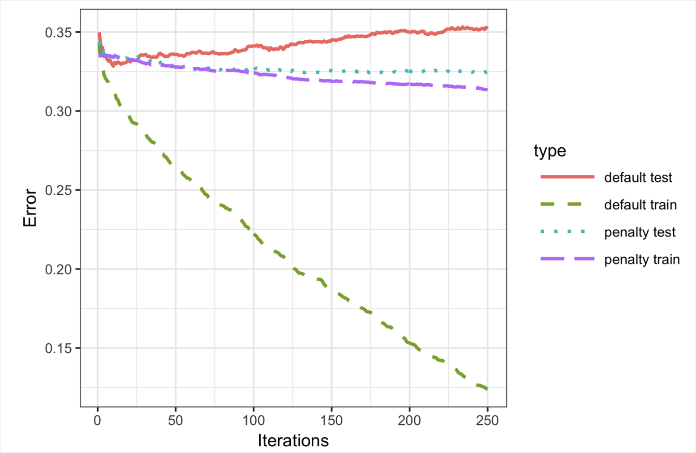

# Practical Statistics for Data Scientists: Boosting (2) (Regularization, Hyperparameters & Cross-Validation)

 

<br>

## Regularization

> Applying `XGBoost` without careful consideration can result in unstable models due to overfitting the training data. 

The issue of overfitting has two main aspects:

- The model's **accuracy** on new data not in the training set will be degraded.
- The **predictions** from the model are highly **variable**, leading to **unstable** results. 

All modeling methods can risk overfitting. For instance, **including excessive variables in a regression equation may lead to misleading predictions.** Fortunately, in most statistical approaches, <u>careful choice of predictor variables can help prevent overfitting</u>. Additionally, **random forests** typically yield a good model even without parameter adjustments. However, <u>overfitting in XGBoost can occur relatively quickly if we continue adding trees without managing the complexity.</u>

XGBoost provides two regularization parameters.

| Parameter | Name         | Type                                   | Effect                                                   |
| --------- | ------------ | -------------------------------------- | -------------------------------------------------------- |
| `lambda`  | `reg_lambda` | L2 Regularization (Euclidean distance) | Penalizes large feature weights smoothly.                |
| `alpha`   | `reg_alpha`  | L1 Regularization (Manhattan distance) | Encourages sparsity by forcing some weights to exactly 0 |

Easily, we could think as follows:

- **lambda** → "Don't allow any one feature **to have too much influence."**
- **alpha** → "Maybe some features **should have no influence at all."**

<br>

#### How Can We Spot Overfitting?

Let's consider an example to illustrate this. Fit the `xgboost` model to the loan data using a training set that includes **all the variables.**

- In *R*

  ```R
  seed <- 400820
  predictors <- data.matrix(loan_data[, -which(names(loan_data) %in%
                                         'outcome')])
  label <- as.numeric(loan_data$outcome) - 1
  test_idx <- sample(nrow(loan_data), 10000)
  
  xgb_default <- xgboost(data=predictors[-test_idx,], label=label[-test_idx],
                         objective='binary:logistic', nrounds=250, verbose=0)
  pred_default <- predict(xgb_default, predictors[test_idx,])
  error_default <- abs(label[test_idx] - pred_default) > 0.5
  xgb_default$evaluation_log[250,]
  mean(error_default)
  ---
  iter train_error
  1:  250    0.133043
  
  [1] 0.3529
  ```

- In *Python*

  ```python
  predictors = ['loan_amnt', 'term', 'annual_inc', 'dti', 'payment_inc_ratio',
                'revol_bal', 'revol_util', 'purpose', 'delinq_2yrs_zero',
                'pub_rec_zero', 'open_acc', 'grade', 'emp_length', 'purpose_',
                'home_', 'emp_len_', 'borrower_score']
  outcome = 'outcome'
  
  X = pd.get_dummies(loan_data[predictors], drop_first=True)
  y = pd.Series([1 if o == 'default' else 0 for o in loan_data[outcome]])
  
  train_X, valid_X, train_y, valid_y = train_test_split(X, y, test_size=10000)
  
  xgb_default = XGBClassifier(objective='binary:logistic', n_estimators=250,
                              max_depth=6, reg_lambda=0, learning_rate=0.3,
                              subsample=1)
  xgb_default.fit(train_X, train_y)
    
  pred_default = xgb_default.predict_proba(valid_X)[:, 1]
  error_default = abs(valid_y - pred_default) > 0.5
  print('default: ', np.mean(error_default))
  ```


The test set includes 10,000 random records, while the training set holds the rest. **Boosting** yields a **training error rate of 13.3%**, but the **test** set has a **higher** error rate of 35.3%. This discrepancy arises from overfitting; while boosting captures training variability, the rules do not generalize well to new data.

<br>

Boosting includes parameters **to prevent overfittings**, such as `eta` (`learning_rate`) and `subsample`. 

> Regularization modifies the cost function to penalize model complexity.

Decision trees minimize cost criteria like Gini's impurity score. In XGBoost, we can add a term to the cost function to measure a model's complexity.

XGBoost has two regularization parameters: `alpha` (L1-regularization) and `lambda`(L2-regularization). <u>Increasing these penalizes complexity and reduces tree size. For instance, setting `lambda` to <b>1000 in R</b> shows this effect.</u> 

- In *R*

  ```R
  xgb_penalty <- xgboost(data=predictors[-test_idx,], label=label[-test_idx],
                         params=list(eta=.1, subsample=.63, lambda=1000),
                         objective='binary:logistic', nrounds=250, verbose=0)
  pred_penalty <- predict(xgb_penalty, predictors[test_idx,])
  error_penalty <- abs(label[test_idx] - pred_penalty) > 0.5
  xgb_penalty$evaluation_log[250,]
  mean(error_penalty)
  ---
  iter train_error
  1:  250     0.30966
  
  [1] 0.3286
  ```

- We use `scikit-learn` API in *Python*, which has the parameters `reg_alpha` and `reg_lambda`.

  ```python
  xgb_penalty = XGBClassifier(objective='binary:logistic', n_estimators=250,
                              max_depth=6, reg_lambda=1000, learning_rate=0.1,
  														subsample=0.63)
  xgb_penalty.fit(train_X, train_y)
  pred_penalty = xgb_penalty.predict_proba(valid_X)[:, 1]
  error_penalty = abs(valid_y - pred_penalty) > 0.5
  print('penalty: ', np.mean(error_penalty))
  ```

The training error is only slightly lower than the test set error.

<br>

The predict method in *R* provides the `ntreelimit` argument **to restrict predictions to the first `i` trees.** <u>As more models are added, this allows direct comparison of in-sample and out-of-sample error rates.</u>

- In *R*

  ```R
  error_default <- rep(0, 250)
  error_penalty <- rep(0, 250)
  for(i in 1:250){
    pred_def <- predict(xgb_default, predictors[test_idx,], ntreelimit=i)
    error_default[i] <- mean(abs(label[test_idx] - pred_def) >= 0.5)
    pred_pen <- predict(xgb_penalty, predictors[test_idx,], ntreelimit=i)
    error_penalty[i] <- mean(abs(label[test_idx] - pred_pen) >= 0.5)
  }
  ```

- In *Python*, we can call the `predict_proba` method with the `ntree_limit` argument.

  ```python
  results = []
  for i in range(1, 250):
      train_default = xgb_default.predict_proba(train_X, ntree_limit=i)[:, 1]
      train_penalty = xgb_penalty.predict_proba(train_X, ntree_limit=i)[:, 1]
      pred_default = xgb_default.predict_proba(valid_X, ntree_limit=i)[:, 1]
      pred_penalty = xgb_penalty.predict_proba(valid_X, ntree_limit=i)[:, 1]
      results.append({
          'iterations': i,
          'default train': np.mean(abs(train_y - train_default) > 0.5),
          'penalty train': np.mean(abs(train_y - train_penalty) > 0.5),
          'default test': np.mean(abs(valid_y - pred_default) > 0.5),
          'penalty test': np.mean(abs(valid_y - pred_penalty) > 0.5),
      })
  
  results = pd.DataFrame(results)
  results.head()
  ```

The model's output shows errors for the training set in `xgb_default$evaluation_log`. Combining these with out-of-sample errors allows us to **plot errors against iterations.**

- In *R*

  ```R
  errors <- rbind(xgb_default$evaluation_log,
                  xgb_penalty$evaluation_log,
                  ata.frame(iter=1:250, train_error=error_default),
                  data.frame(iter=1:250, train_error=error_penalty))
  errors$type <- rep(c('default train', 'penalty train', 
                       'default test', 'penalty test'), rep(250, 4))
  ggplot(errors, aes(x=iter, y=train_error, group=type)) +
  	geom_line(aes(linetype=type, color=type))
  ```

- In *Python*, we can use the `pandas` plot method to create the line graph.

  ```python
  ax = results.plot(x='iterations', y='default test')
  results.plot(x='iterations', y='penalty test', ax=ax)
  results.plot(x='iterations', y='default train', ax=ax)
  results.plot(x='iterations', y='penalty train', ax=ax)
  ```


The result displayed in the figure below shows how the default model steadily improves the accuracy for the training set but actually worsens for the test set. The penalized model does not exhibit this behavior.

<center>
  <br><br>
</center>

In the plot, we could observe the following:

- **Default Model**:
  - <u>Training error steadily goes down (keeps fitting better and better).</u>
  - Validation error first goes down but **then starts to go back up** (classic sign of overfitting).
- **Penalized Model**:
  - <u>Training error goes down slower.</u>
  - Validation error **stays low and stable** (good generalization).

*Without regularization, XGBoost overfits fast.* **With strong regularization**, **XGBoost stays robust.**

<br>

### Hyperparameters

`xgboost` has many **hyperparameters**, and their selection can significantly impact model performance. To guide our choices amid numerous options, we can use **cross**-**validation**. This method splits the data into *K* groups or *folds*. For each fold, a model is **trained** on the data **outside** and **evaluated** on the fold data, *providing accuracy on out-of-sample data*. **The best hyperparameters are those resulting in the lowest average error across folds.**

We apply the technique to parameter selection for xgboost, focusing on the shrinkage parameter `eta` and the maximum tree depth `max_depth`. `Max_depth` sets **the maximum leaf depth from the root,** defaulting to six, which helps control overfitting since deeper trees can overfit the data. 

- First, we set up the folds and parameter list in *R*

  ```R
  N <- nrow(loan_data)
  fold_number <- sample(1:5, N, replace=TRUE)
  params <- data.frame(eta = rep(c(.1, .5, .9), 3),
                       max_depth = rep(c(3, 6, 12), rep(3,3)))
  ```

  Now we compute the error for each model and fold with five folds:

  ```R
  error <- matrix(0, nrow=9, ncol=5)
  for(i in 1:nrow(params)){
    for(k in 1:5){
      fold_idx <- (1:N)[fold_number == k]
      xgb <- xgboost(data=predictors[-fold_idx,], label=label[-fold_idx],
                     params=list(eta=params[i, 'eta'],
                                 max_depth=params[i, 'max_depth']),
                     objective='binary:logistic', nrounds=100, verbose=0)
      pred <- predict(xgb, predictors[fold_idx,])
      error[i, k] <- mean(abs(label[fold_idx] - pred) >= 0.5)
    }
  }
  ```

- This *Python* code generates all hyperparameter combinations and evaluates models for each.

  ```python
  idx = np.random.choice(range(5), size=len(X), replace=True)
  error = []
  for eta, max_depth in product([0.1, 0.5, 0.9], [3, 6, 9]):
      xgb = XGBClassifier(objective='binary:logistic', n_estimators=250,
                          max_depth=max_depth, learning_rate=eta)
      cv_error = []
      for k in range(5):
          fold_idx = idx == k
          train_X = X.loc[~fold_idx]; train_y = y[~fold_idx]
          valid_X = X.loc[fold_idx]; valid_y = y[fold_idx]
  
          xgb.fit(train_X, train_y)
          pred = xgb.predict_proba(valid_X)[:, 1]
          cv_error.append(np.mean(abs(valid_y - pred) > 0.5))
      error.append({
          'eta': eta,
          'max_depth': max_depth,
          'avg_error': np.mean(cv_error)
      })
      print(error[-1])
  errors = pd.DataFrame(error)
  ```

  Fitting 45 models takes time. Errors are stored in a matrix with models as rows and folds as columns. We compare error rates for different parameter sets using the `rowMeans` function:

  ```python
  avg_error <- 100 * round(rowMeans(error), 4)
  cbind(params, avg_error)
  ---
    eta max_depth avg_error
  1 0.1         3     32.90
  2 0.5         3     33.43
  3 0.9         3     34.36
  4 0.1         6     33.08
  5 0.5         6     35.60
  6 0.9         6     37.82
  7 0.1        12     34.56
  8 0.5        12     36.83
  9 0.9        12     38.18
  ```

  Cross-validation indicates that shallower trees combined with a lower `learning rate` of `eta` produce more accurate results. Given that these models demonstrate greater stability, the optimal parameters to consider are `eta=0.1` and `max_depth=3` (or potentially `max_depth=6`).

<br>

#### Important XGBoost Hyperparameters to Know

| Hyperparameter               | Purpose                                                      |
| ---------------------------- | ------------------------------------------------------------ |
| **`eta / learning_rate`**    | Shrinks the contribution of each new tree. Smaller values = slower learning but often better results. |
| **`nrounds / n_estimators`** | Number of boosting rounds. Need more if `eta` is small.      |
| **`max_depth`**              | Maximum depth of trees. Shallower trees (like depth 3) reduce overfitting. |
| **`subsample`**              | Use only a fraction of the data for each tree, helping to generalize better. |
| **`colsample_bytree`**       | Use only a fraction of features for each tree.               |
| **`lambda / alpha`**         | Regularization terms to **penalize complexity**. Helps avoid overfitting. |

<br><br>
