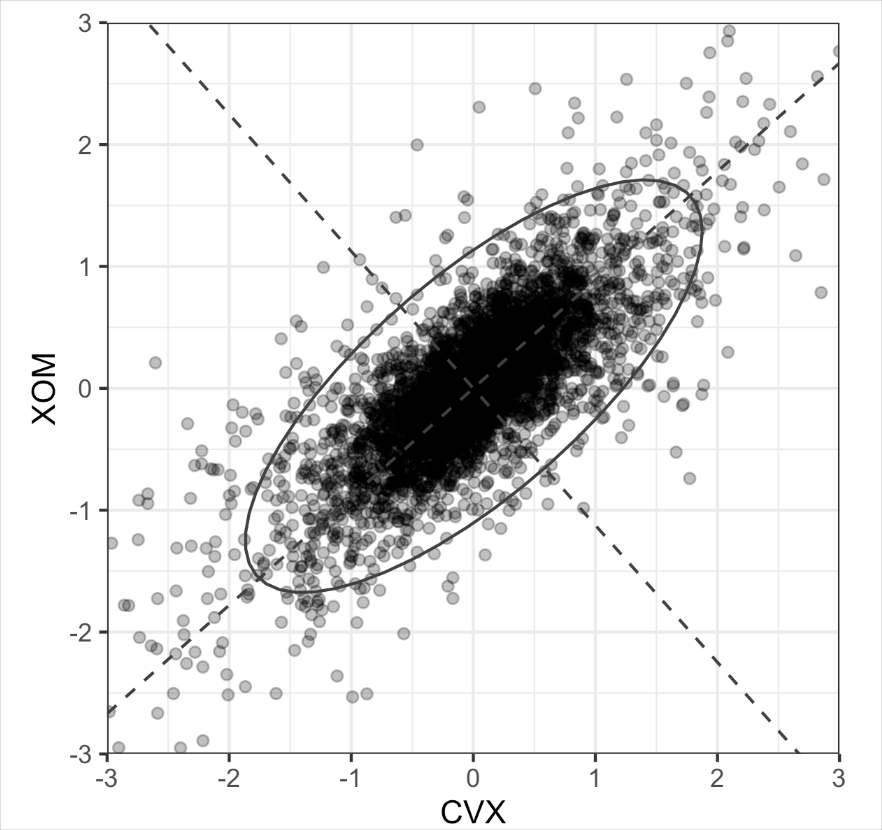

# Practical Statistics for Data Scientists: Principal Components Analysis (1) (Unsupervised Learning, A Simple Example and Computing the Principal Components)


<br>

## Unsupervised Learning

*Unsupervised learning* involves statistical methods to **extract** **meaning** from data **without** **labeled** **training**. Supervised learning aims to build a model that predicts a response variable using predictor variables. In contrast, unsupervised learning **constructs a model without distinguishing between response and predictor variables.**

Unsupervised learning can be used to achieve different goals. Sometimes, it can create a predictive rule without a labeled response. 

In **supervised learning** (previous postings), we:

- Have **labeled data** (e.g., emails labeled as spam or not spam).
- <u>Build models that <b>predict a known response</b>.</u>

In **unsupervised learning**, we:

- **Have no labeled output**.
- Only have **features** (inputs).
- <u>Aim to <b>discover patterns</b> and <b>relationships</b> hidden in the data without being told what to look for.</u>

Here are the primary unsupervised learning methodologies.

- **Clustering**: Group similar observations.
  - Example: Group customers based on their purchasing behavior.
- **Dimensionality Reduction**: Reduce many variables into a smaller, easier-to-handle set.
  - Example: Thousands of sensor readings → a few key features.
- **Exploratory Analysis**: Understand the structure of a complex dataset.
  - It is beneficial in big data scenarios.

<br>

### How Unsupervised Learning Connects to Prediction

Even though unsupervised learning **doesn't directly predict,** it **supports** predictive modeling. Sometimes, we want to predict a category without any labeled data. For example, we can **predict** an area's vegetation type from satellite sensory data. Since we don’t have a response variable to train a model, <u>clustering allows us to identify common patterns and categorize the regions.</u>

**Clustering** is crucial for the “*cold-start problem,*” <u>like launching new marketing campaigns or detecting new fraud types</u>. Initially, there's no data to train a model, but **we can develop a predictive model as we gather data.** Clustering accelerates learning by pinpointing population segments.

**Unsupervised learning** is vital for **regression** and **classification**. In big data, unrepresented <u>subpopulations</u> can lead to poor model performance. Clustering helps identify and label these subpopulations. Separate models can be created for each, or a unique feature can represent the subpopulation, allowing the main model to include subpopulation identity as a predictor. 

<br>

### Principal Component Anlalysis

Often, variables will vary together (covary), and some variation in one is duplicated by the variation in another (e.g., restaurant checks and tips). 

> **Principal components analysis (PCA)** is used to <u>discover how numeric variables covary.</u> 

When we have **many correlated variables**, they often <u>repeat similar information</u> (e.g., income and credit card limit). Principal Components Analysis (PCA) **creates new variables** (principal components) that are <u>linear combinations</u> of the original variables and <u>uncorrelated</u> (orthogonal). The main goal is to capture as much **variance** (spread) as possible with fewer variables.

<br>

#### Key Terms for Principal Components Analysis

- Principal component
  - A **linear combination** of the predictor variables.
- Loadings
  - The weights that transform the predictors into the components. 
  - = Weights
- **Scree-plot**
  - This graph illustrates the components' variances, <u>depicting their relative importance as either explained variance or the proportion of explained variance.</u>

PCA combines **multiple numeric predictors into a smaller set of variables,** or principal components, **which explain most of the variability** *while reducing the data dimensions*. The weights reveal the original variables' contributions to the principal components.

<br>

### A Simple Example

For two variables, $X_1$ and $X_2$, there are two principal components $Z_i (i=1\ or\ 2)$: $Z_i = w_{i,1} + w_{i,2}X_2$. The **weights** ($w_{i,1},\ w_{i,2}$) are known as the component *loadings*. These transform the original variables into the principal components. 

The first principal component, $Z1$, is the **linear combination that best accounts for the total variation**. The second principal component, $Z2$, is **orthogonal** to the first and **captures as much of the remaining variation as possible.** (If there were additional components, each additional one would be orthogonal to the others.)

Suppose we have two variables, say stock returns for **Chevron (CVX)** and **ExxonMobil (XOM)**. 

- In *R*

  ```R
  oil_px <- sp500_px[, c('CVX', 'XOM')]
  pca <- princomp(oil_px)
  pca$loadings
  ---
  Loadings:
      Comp.1 Comp.2
  CVX -0.747  0.665
  XOM -0.665 -0.747
  
                 Comp.1 Comp.2
  SS loadings       1.0    1.0
  Proportion Var    0.5    0.5
  Cumulative Var    0.5    1.0
  ```

- In *Python*, we can use the `scikit-learn` implementation `sklearn.decomposition.PCA`

  ```python
  pcs = PCA(n_components=2)
  pca.fit(oil_px)
  loadings = pd.DataFrame(pcs.components_, columns=oil_px.columns)
  loadings
  ```

The weights for CVX  and XOM in the first principal component are -0.747 and -0.665, respectively; for the second principal component, they are 0.665 and -0.747. The **first** principal component represents <u>an average of CVX and XOM, reflecting the correlation</u> between the two energy companies—the **second** principal component measures <u>when the stock prices of CVX and XOM diverge.</u> Let's create a visualization in R as follows. 

- In *R*

  ```R
  loadngs <- pca$loadings
  ggplot(data=oil_px, aes=(x=CVX, y=XOM)) +
  	geom_point(alpha=.3) +
  	stat_elipse(type='norm', level=.99) +
  	geom_abline(intercept = 0, slope = loadings[2,1]/loadings[1,1]) +
  	geom_abline(intercept = 0, slope = loadings[2,2]/loadings[1,2]) 
  ```

- The following code creates a similar visualization in *Python*

  ```python
  def abline(slope, intercept, ax):
      """Calculate coordinates of a line based on slope and intercept"""
      x_vals = np.array(ax.get_xlim())
      return (x_vals, intercept + slope * x_vals)
  
  ax = oil_px.plot.scatter(x='XOM', y='CVX', alpha=0.3, figsize=(4, 4))
  ax.set_xlim(-3, 3)
  ax.set_ylim(-3, 3)
  ax.plot(*abline(loadings.loc[0, 'CVX'] / loadings.loc[0, 'XOM'], 0, ax),
          '--', color='C1')
  ax.plot(*abline(loadings.loc[1, 'CVX'] / loadings.loc[1, 'XOM'], 0, ax),
          '--', color='C1')
  ```

<center>
  <Br><br>
</center>

The **dashed** **lines** indicate the direction of the two principal components: <u>the first aligns with the ellipse's long axis, while the second aligns with the short axis.</u> The **first** **principal component accounts for most of the variability in the two stock returns.** This is logical, <u>as energy stock prices generally move together.</u>

But we should note that: 

- **Signs don't matter**: The principal component remains the same if all loadings are flipped. For example, <u>using weights of $0.747$ and $0.665$ for the first principal component is equivalent to using the negative weights</u>; similarly, an infinite line defined by the origin and $(1, 1)$ is the same as one defined by the origin and $(-1,-1)$. 
- **PCA only works with numeric variables**.

<Br>

### Computing Principal Components

Going from two variables to more variables is straightforward. **For the first component**, <u>add predictor variables to the linear combination</u>, with **weights** that <u>optimize covariation for this principal component.

Calculating principal components is a classic statistical method using either the **correlation** or **covariance** **matrix**, and it executes quickly without iteration. As mentioned, principal components analysis <u>applies solely to numeric variables</u>, not categorical ones. The complete process follows: 

1. In creating the first principal component, PCA arrives at the **linear combination of predictor variables, maximizing the percentage of total variance explained.**
2. This linear combination then <u>becomes the first “new” predictor, <I>Z</I>1.</u>
3. PCA repeats this process, <u>using the same variables with different weights, to create a second new predictor, <I>Z</I>2.</u> The weighting is done such that <I>Z</I>1 and <I>Z</I>2 are uncorrelated.
4. The process continues until you have as many new variables, or <I>Z</I>i components, as original variables *X*i.
5. Choose <u>to retain as many components as are needed to account for most of the variance.</u>
6. The result so far is a set of weights **for each component**. The final step is to convert the original data into new principal component scores by applying the weights to the original values. These new scores can then be used as the reduced predictor variables.

<br><br>
