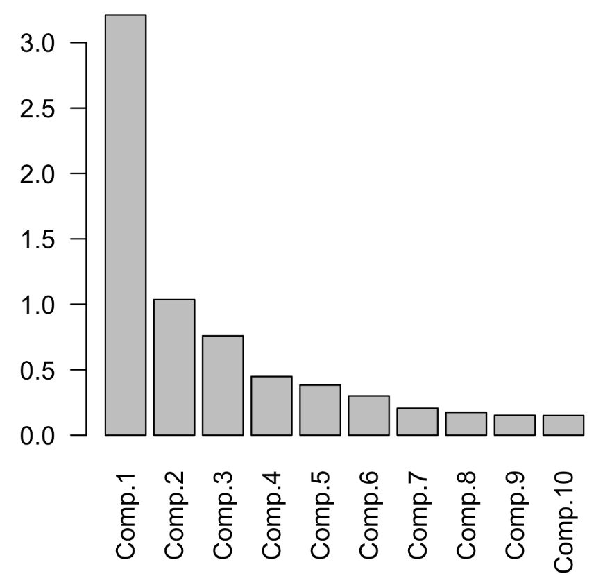
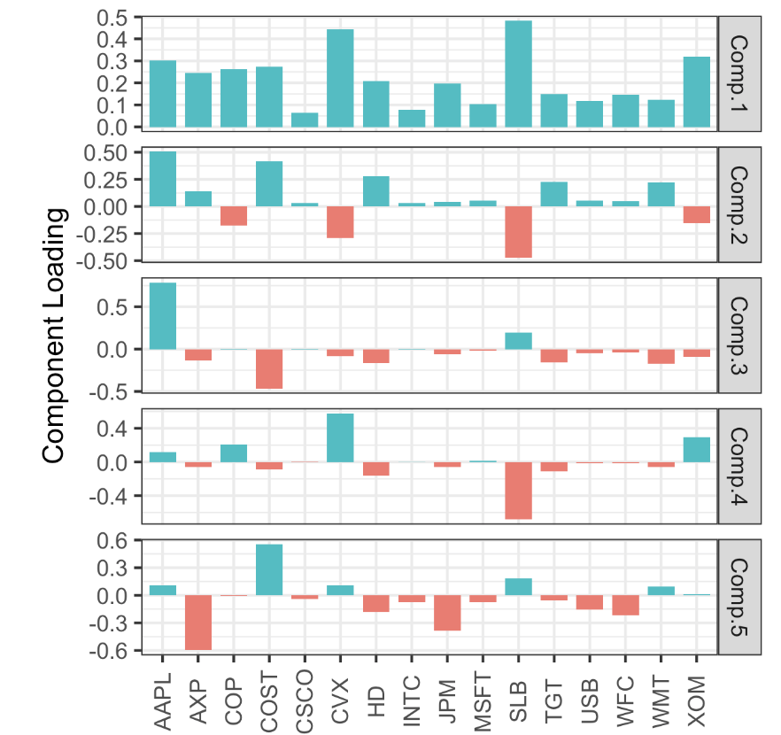

# Practical Statistics for Data Scientists: Principal Components Analysis (2) (Formal Definition, Interpreting Components & Correspondence Analysis) 


<br>

### **Formal Definition**

Given a data matrix $\mathbf{X} \in \mathbb{R}^{n \times p}$, where $n$ is the number of observations and $p$ the number of variables, PCA finds a new set of orthogonal axes (principal components) $\mathbf{Z} \in \mathbb{R}^{n \times p}$ such that:

- $\text{Var}(Z_1) \geq \text{Var}(Z_2) \geq \ldots \geq \text{Var}(Z_p)$

- Each component $Z_k$ is a **linear combination** of the original variables:
  <center>
    $Z_k = w_{k1} X_1 + w_{k2} X_2 + \cdots + w_{kp} X_p$<br><br>
  </center>
  
  where below is the weight (loading) vector.

$$
\mathbf{w}_k = [w_{k1}, \dots, w_{kp}]^\top
$$

<br>

### Step-by-Step Explanation of PCA

**Step 1: Standardize the Data** 

Each feature is transformed to have **zero mean and unit variance**.

- If $X_j$ is a feature, it is tranformed as:
  <center>
    $X_j^{\text{scaled}} = \frac{X_j-\mu_j}{\sigma_jp}$<br><Br>
  </center>
  
  where $\mu_j$ and $\sigma_j$ are the mean and standard deviation of feature $j$.
  
  So that the feature with larger scales don't dominate the principal components.

<br>

**Step 2: Compute the Covariance Matrix**

To capture the structure and relationships among variables, we calculate the **covariance matrix** $\mathbf{\Sigma}$ to understand how the variables vary with each other:

<center>
  $\mathbf{\Sigma} = \frac{1}{n-1} \mathbf{X}^\top \mathbf{X}$<Br><br>
</center>


Each element $\Sigma_{ij}$ represents the covariance between features $i$ and $j$.

<br>

**Step  3: Compute Eigenvalues and Eigenvectors**

Then, we solve the **eigenvalue decomposition** problem:

<center>
  $\mathbf{\Sigma} \mathbf{v}_k = \lambda_k \mathbf{v}_k$<br><Br>
</center>

- $\mathbf{v}_k$: the **eigenvector**, gives the **direction** of the principal component
- $\lambda_k$: the **eigenvalue**, measures the **amount of variance** captured by that component

Since eigenvectors define <u>the axes of the new feature space</u>; eigenvalues tell us how <u>important each axis is.</u> 

<br>

**Step 4: Select Top $k$ Principal Components**

We sort the eigenvalues $\lambda_1 \geq \lambda_2 \geq \cdots \geq \lambda_p$ and pick the top $k$ components that capture the most variance (e.g., 95%).

This defines a **projection matrix** $\mathbf{W}_k = [\mathbf{v}_1, \mathbf{v}_2, \ldots, \mathbf{v}_k]$.

<br>

**Step 5: Project the Data**

We project the original data onto the new principal component axes:

<center>
  $\mathbf{Z} = \mathbf{X} \cdot \mathbf{W}_k$<br><br>
</center>


Now $\mathbf{Z} \in \mathbb{R}^{n \times k}$ is the **transformed data**, retaining as much of the original variance as possible using fewer dimensions.

<Br>

### Interpreting Principal Components

**Principal Components Analysis (PCA)** is a dimensionality reduction technique and *an interpretive framework for uncovering latent structures within high-dimensional numerical data.* Extracting principal components generates a new orthogonal basis that preserves variance while minimizing redundancy, offering a compact representation of complex systems. 

> The nature of the principal components often reveals information about the structure of the data.

A few standard visualization displays can help us gain insights into principal components. One method is a ***screeplot***, <u>which shows the importance of these components (the name comes from its resemblance to a scree slope; the y-axis represents the eigenvalue).</u> 

- The following R code demonstrates this for top S&P 500 companies:

  ```R
  syms <- c( 'AAPL', 'MSFT', 'CSCO', 'INTC', 'CVX', 'XOM',
     'SLB', 'COP', 'JPM', 'WFC', 'USB', 'AXP', 'WMT', 'TGT', 'HD', 'COST')
  top_sp <- sp500_px[row.names(sp500_px)>='2005-01-01', syms]
  sp_pca <- princomp(top_sp)
  screeplot(sp_pca)
  ```

- In Python, the information needed to create a loading plot from the `scikit-learn` result is available in `explained_variance_`. Here, we convert it into a `pandas` DataFrame and use it to create a bar chart.

  ```python
  syms = sorted(['AAPL', 'MSFT', 'CSCO', 'INTC', 'CVX', 'XOM', 'SLB', 'COP',
                 'JPM', 'WFC', 'USB', 'AXP', 'WMT', 'TGT', 'HD', 'COST'])
  top_sp = sp500_px.loc[sp500_px.index >= '2011-01-01', syms]
  
  sp_pca = PCA()
  sp_pca.fit(top_sp)
  
  explained_variance = pd.DataFrame(sp_pca.explained_variance_)
  ax = explained_variance.head(10).plot.bar(legend=False, figsize=(4, 4))
  ax.set_xlabel('Component')
  ```

As we can confirm from the result in the figure below, **the variance of the first principal component is quite significant** (as is often the case). Still, **the other top principal components are also substantial.** 

<center>
  <br><br>
</center>

<u>Plotting the weights of the top principal components can be particularly insightful.</u> 

- One way to accomplish this in *R* is to use the gather function from the `tidyr` package along with `ggplot`

  ```R
  library(tidyr)
  loadings <- sp_pca$loadings[,1:5]
  loadings$Symbol <- row.names(loadings)
  loadings <- gather(loadings, 'Component', 'Weight', -Symbol)
  ggplot(loadings, aes(x=Symbol, y=Weight)) +
    geom_bar(stat='identity') +
    facet_grid(Component ~ ., scales='free_y')
  ```

- We can create the same visualization in *Python* as follows.

  ```python
  loadings = pd.DataFrame(sp_pca.components_[0:5, :], columns=top_sp.columns)
  maxPC = 1.01 * np.max(np.max(np.abs(loadings.loc[0:5, :])))
  
  f, axes = plt.subplots(5, 1, figsize=(5, 5), sharex=True)
  for i, ax in enumerate(axes):
      pc_loadings = loadings.loc[i, :]
      colors = ['C0' if l > 0 else 'C1' for l in pc_loadings]
      ax.axhline(color='#888888')
      pc_loadings.plot.bar(ax=ax, color=colors)
      ax.set_ylabel(f'PC{i+1}')
      ax.set_ylim(-maxPC, maxPC)
  ```

The loadings for the **top five components** are illustrated in the figure below. The loadings for the first principal component share the same sign, which is typical for data where all columns reflect a common factor (in this case, the overall stock market trend). The second component highlights the price changes of energy stocks in relation to other stocks. The third component mainly contrasts the movements of Apple and CostCo. The fourth component contrasts the movements of Schlumberger (SLB) with those of other energy stocks. Finally, the fifth component is primarily driven by financial companies.

<center>
  <bR><br>
</center>

### Selection of Components: Balancing Fidelity and Simplicity

Choosing how many principal components to retain involves both **statistical and substantive judgment**. Three prevailing strategies include:

1. **Eigenvalue Thresholding**: Retain components with eigenvalues greater than 1 (Kaiser’s rule).
2. **Variance Explained**: Retain sufficient components to account for a prespecified threshold (e.g., 80%) of total variance.
3. **Interpretability**: Retain components that can be meaningfully interpreted within the domain context.

> Advanced strategies include **cross-validation-based model selection**, providing a data-driven mechanism to determine dimensional sufficiency.

<br>

### Correspondence Analysis: PCA’s Analogue for Categorical Data

When the data matrix comprises **categorical or count-based variables**, PCA becomes inapplicable due to its reliance on Euclidean geometry and continuous variables. **Correspondence Analysis (CA)** extends similar geometric intuitions to **contingency tables**, allowing for the exploration of relationships among categorical features.

CA projects row and column categories into a **low-dimensional Euclidean space**, such that their spatial proximity reflects statistical association. The resulting **biplot** visualizes these associations, often revealing:

- Latent clusters of categories
- Orthogonal contrasts between variable groupings

For instance, in sociological studies (e.g., division of household labor), CA elucidates patterns of co-occurrence between tasks and agents (e.g., husband, wife, joint), enabling nuanced interpretive insights.

<br><Br>
