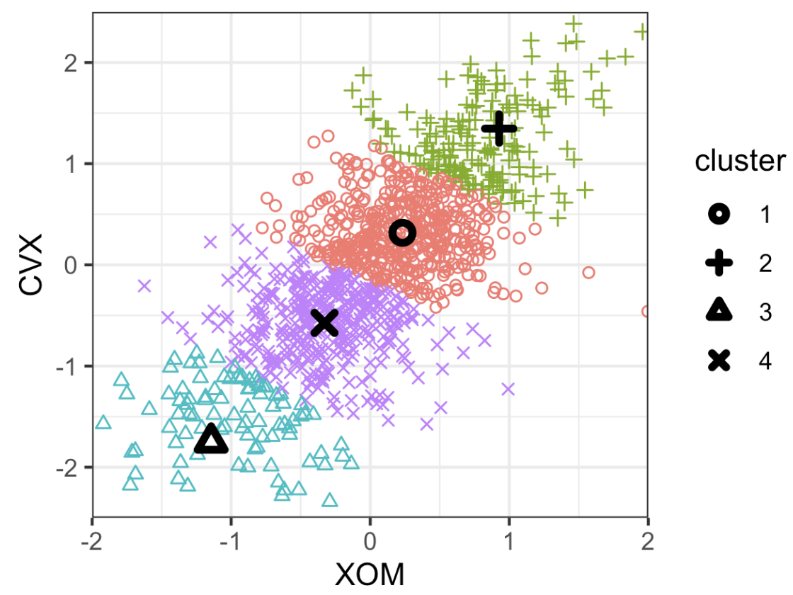

# Practical Statistics for Data Scientists: K-Means Clustering (1) (A Simple Example &  K-Means Algorithm Code Source)


<br>

## K-Means Clustering

> **K-Means Clustering** is an unsupervised learning algorithm used to divide a dataset into **K distinct, non-overlapping groups (clusters)**, such that the data points **within** each cluster are <u>as similar as possible</u> and as <u>different as possible</u> from points in other clusters.

The term "K" refers to the number of clusters we wish to find, and "means" refers to the mean (centroid) of each cluster. 

<br>

#### Key Terms for K-Means Clustering

- Cluster
  - A group of records that are similar.
- Cluster Mean
  - The center of a cluster; the average of all data points assigned to the cluster.
  - = Centroid
- K
  - The number of clusters.
- **Within-cluster sum of squares (WCSS)**	
  - **The sum of squared distances from each data point to its assigned cluster centroid.**

K-means **divides** the data into K clusters <u>by minimizing the sum of the squared distances of each record to the mean of its assigned cluster.</u> This is the *within-cluster sum of squares*, or within-cluster SS. K-means does not guarantee that the clusters will have the same size; instead, **it identifies the best-separated clusters.**

<br>

#### A Simple Example

Start by considering a data set with *n* records and only two variables, x and y. We want to divide the data into $K=4$ clusters. This entails assigning each record $(x_i,y_i)$ to a cluster $k$. Given an assignment of $n_k$ records to cluster $k$, the center of the cluster $(x_k,y_k)$ is the average of the points in the cluster as follows.

<center>
  $\bar{x}_k = \frac{1}{n_k} \sum_{i \in \\ \text{Cluster k}} x_i$<br><br>
    $\bar{y}_k = \frac{1}{n_k} \sum_{i \in \\ \text{Cluster k}} y_i$<br><br>
</center>

> In clustering records with multiple variables (the typical case), the term " cluster mean " refers not to a single number but to the vector of the variables' means.

The sum of squares within a cluster is given by the following.

<center>
  $SS_k=\sum_{i \in \text{Cluster k}}x_i-\bar{x}_k)^2 + y_i-\bar{y_k}^2$<br><br>
</center>

*K*-means identifies the assignment of records that **minimizes** the **within-cluster sum of squares across all four clusters**, $SS1 + SS2 + SS3 + SS4$:

<center>
  $\sum_{k=1}^4 SS_k$<br><br>
</center>


A typical use of clustering is identifying natural, distinct clusters within the data. Another application is **partitioning the data into a predetermined number of separate groups**, <u>ensuring the clusters are as different as possible.</u>

For example, suppose we want to **divide daily stock returns into four groups.** K-means clustering can separate the data into the best groupings. (*Note that daily stock returns are reported in a way that is, in effect, standardized; thus, we do not need to normalize the data.*)

- In R, K-means clustering uses the `kmeans` function. For example, the following identifies **four clusters** based on the daily stock returns for ExxonMobil (`XOM`) and Chevron(`CVX`). 

  ```R
  df <- sp500_px[row.names(sp500_px)>='2011-01-01', c('XOM', 'CVX')]
  km <- kmeans(df, centers=4)
  ```

- In *Python*, we use the `sklearn.clusters.KMeans` method from `scikit-learn`.

  ```python
  df = sp500_px.loc[sp500_px.index >= '2011-01-01', ['XOM', 'CVX']]
  kmeans = KMeans(n_clusters=4).fit(df)
  ```


The cluster assignment for each record is provided as the `cluster` component.

- In R

  ```R
  df$cluster <- factor(km$cluster)
  head(df)
  ---
                    XOM        CVX cluster
  2011-01-03 0.73680496  0.2406809       2
  2011-01-04 0.16866845 -0.5845157       1
  2011-01-05 0.02663055  0.4469854       2
  2011-01-06 0.24855834 -0.9197513       1
  2011-01-07 0.33732892  0.1805111       2
  2011-01-10 0.00000000 -0.4641675       1
  ```

- In *Python*, the cluster labels are available in the `labels_` field.

  ```python
  df['cluster'] = kmeans.labels_
  df.head()
  ```

  

The initial six records are allocated to either cluster 1 or cluster 2. The cluster means are also provided.

- In R

  ```R
  centers <- data.frame(cluster=factor(1:4), km$centers)
  centers
  ---
    cluster        XOM        CVX
  1       1 -0.3284864 -0.5669135
  2       2  0.2410159  0.3342130
  3       3 -1.1439800 -1.7502975
  4       4  0.9568628  1.3708892
  ```

- In `scikit-learn`, the cluster centers are available in the `cluster_centers_` field.

  ```python
  centers = pd.DataFrame(kmeans.cluster_centers_, columns=['XOM', 'CVX'])
  centers
  ```

Clusters 1 and 3 are “down” markets; clusters 2 and 4 are “up " markets.

K-means uses **random starting points**, <u>leading to differing results in subsequent runs and implementations</u>. **It's essential to ensure fluctuations remain manageable.**

In this example, with just two variables, it is straightforward to visualize the clusters and their means.

- In *R*

  ```R
  ggplot(data=df, aes(x=XOM, y=CVX, color=cluster, shape=cluster)) +
    geom_point(alpha=.3) +
    geom_point(data=centers,  aes(x=XOM, y=CVX), size=3, stroke=2)
  ```

- In Python, the `seaborn` `scatterplot` function simplifies coloring (`hue`) and styling (`style`) the points by a property. 

  ```python
  fig, ax = plt.subplots(figsize=(4, 4))
  ax = sns.scatterplot(x='XOM', y='CVX', hue='cluster', style='cluster',
                       ax=ax, data=df)
  ax.set_xlim(-3, 3)
  ax.set_ylim(-3, 3)
  centers.plot.scatter(x='XOM', y='CVX', ax=ax, s=50, color='black')
  ```

The result plot below shows the cluster assignments and the clustger means. 

<center>
  <br><br>
</center>

### K-Means Algorithm

In general, K-means can be applied to a data set with p variables $X_1,...,X_p$. Although the exact solution to K-means is computationally challenging, **heuristic algorithms offer an efficient method to compute a locally optimal solution.**

The algorithm begins with a user-specified $K$ and an initial set of cluster means, then iterates through the following steps:

1. **Assign** each record **to the nearest cluster mean,** as determined by squared distance. 
2. **Calculate** the **new** **cluster** **means** based on the record assignments.

The algorithm converges when the assignment of records to clusters does not change.

We should **specify an initial set of cluster means for the first iteration**. Typically, this is done by <u>randomly assigning each record to one of the <I>K</I> clusters and then calculating the means of those clusters.</u>

This algorithm may not find the best solution, ***so run it multiple times with different random samples for initialization***. The K-means result is based on the iteration with the lowest within-cluster sum of squares.

- In *R*, the `nstart` parameter of the kmeans function specifies the number of random starts. For example, the following code finds 5 clusters using 10 different starting cluster means:

  ```R
  syms <- c( 'AAPL', 'MSFT', 'CSCO', 'INTC', 'CVX', 'XOM', 'SLB', 'COP',
             'JPM', 'WFC', 'USB', 'AXP', 'WMT', 'TGT', 'HD', 'COST')
  df <- sp500_px[row.names(sp500_px) >= '2011-01-01', syms]
  km <- kmeans(df, centers=5, nstart=10)
  ```

  The function returns the best solution from 10 starting points. Use `iter.max` to set the maximum number of iterations for each random start.

- In *Python*, the `scikit-learn` algorithm runs 10 times by default (`n_init`). Use the `max_iter` argument (default 300) to control iterations.

  ```python
  syms = sorted(['AAPL', 'MSFT', 'CSCO', 'INTC', 'CVX', 'XOM', 'SLB', 'COP',
                 'JPM', 'WFC', 'USB', 'AXP', 'WMT', 'TGT', 'HD', 'COST'])
  top_sp = sp500_px.loc[sp500_px.index >= '2011-01-01', syms]
  kmeans = KMeans(n_clusters=5).fit(top_sp)
  ```

  <br><Br>
