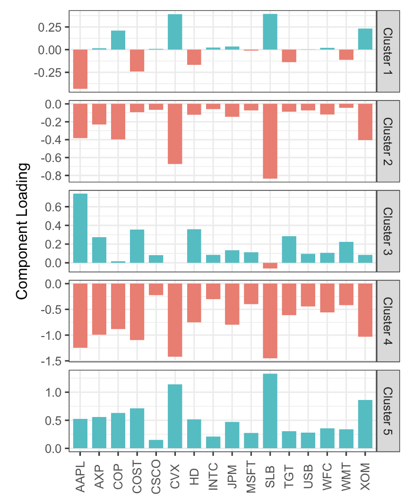
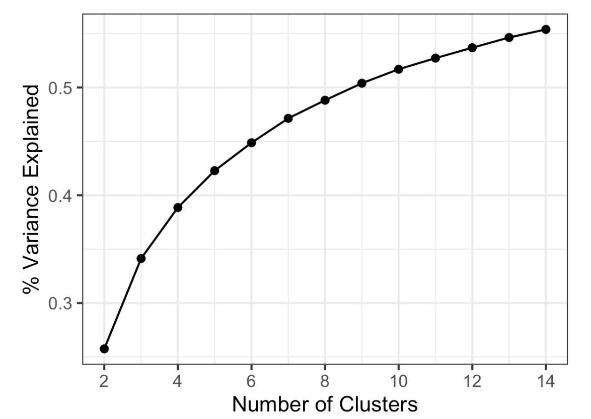

# Practical Statistics for Data Scientists: K-Means Clustering (2) (Interpreting Clustering Results & Determining the Optimal Number of Clusters K)


<br>

Continuing from the previous post...


### Interpreting K-Means Clustering Results

After performing K-means clustering, examining the number of data points in each cluster is essential. 

> Balanced cluster sizes indicate well-separated clusters, while significant imbalances suggest the presence of outliers or overlapping clusters. 

- This command in R provides the sizes of the resulting clusters in the previous post's example.

  ```R
  km$size
  [1] 106 186 285 288 266
  ```

- In Python

  ```python
  from collections import Counter
  
  Counter(kmeans.labels_)
  ---
  Counter({4: 302, 2: 272, 0: 288, 3: 158, 1: 111})
  ```

The cluster sizes are balanced. Imbalanced clusters may result from distant outliers or distinct record groups, both of which warrant further inspection.

- In *R*, we can plot the centers of the clusters using the `gather` function in conjunction with `ggplot` as follows.

  ```R
  centers <- as.data.frame(t(centers))
  names(centers) <- paste("Cluster", 1:5)
  centers$Symbol <- row.names(centers)
  centers <- gather(centers, 'Cluster', 'Mean', -Symbol)
  centers$Color = centers$Mean > 0
  ggplot(centers, aes(x=Symbol, y=Mean, fill=Color)) +
    geom_bar(stat='identity', position='identity', width=.75) +
    facet_grid(Cluster ~ ., scales='free_y')
  ```

- The Python code for generating this visualization resembles what we implemented for PCA.

  ```python
  centers = pd.DataFrame(kmeans.cluster_centers_, columns=syms)
  
  f, axes = plt.subplots(5, 1, figsize=(5, 5), sharex=True)
  for i, ax in enumerate(axes):
      center = centers.loc[i, :]
      maxPC = 1.01 * np.max(np.max(np.abs(center)))
      colors = ['C0' if l > 0 else 'C1' for l in center]
      ax.axhline(color='#888888')
      center.plot.bar(ax=ax, color=colors)
      ax.set_ylabel(f'Cluster {i + 1}')
      ax.set_ylim(-maxPC, maxPC)
  ```

The plot below shows each cluster's nature. Clusters 4 and 5 represent down and up market days, respectively. Clusters 2 and 3 illustrate up days for consumer stocks and down days for energy stocks, respectively. Cluster 1 captures days when energy stocks rose and consumer stocks fell. 

<center>
  <br><br>
</center>


#### Selecting the Number of Clusters

The K-means algorithm requires specifying the number of clusters, K, which is sometimes determined by the application. For example, a company managing a sales force may cluster customers into “personas” to guide sales calls. In these cases, managerial considerations dictate the desired number of segments; two may not yield helpful differentiation, while eight could be too many to manage.

A statistical method can be employed when practical or managerial constraints do not define a cluster number. However, there is no universally accepted method to determine the “best” number of clusters.

A widely used technique, known as *the elbow method*, focuses on determining when a group of clusters accounts for the majority of variance in the data. Introducing additional clusters beyond this point adds only marginally to the explained variance. The' elbow' refers to the point where the cumulative variance ceases to grow significantly after a steep increase, giving the method its name.

The figure below illustrates the cumulative percentage of variance accounted for by clusters ranging from 2 to 15. In this case, where can we identify the elbow? There isn't a clear candidate, as the incremental increase in explained variance tapers off gradually. This pattern is typical in data without distinct clusters, highlighting a limitation of the elbow method while also shedding light on the characteristics of the data.

- In *R*, the `kmeans` function doesn't provide a single command for applying the elbow method, but it can be readily applied from the output of `kmeans` as shown below. 

  ```R
  pct_var <- data.frame(pct_var = 0,
                        num_clusters = 2:14)
  totalss <- kmeans(df, centers=14, nstart=50, iter.max=100)$totss
  for (i in 2:14) {
    kmCluster <- kmeans(df, centers=i, nstart=50, iter.max=100)
    pct_var[i-1, 'pct_var'] <- kmCluster$betweenss / totalss
  }
  ```

- In *Python*, we obtain the information from the property `inertia_`. After converting it into a `pandas` DataFrame, we can use its `plot` method to create the graph. 

  ```python
  inertia = []
  for n_clusters in range(2, 14):
      kmeans = KMeans(n_clusters=n_clusters, random_state=0).fit(top_sp)
      inertia.append(kmeans.inertia_ / n_clusters)
  
  inertias = pd.DataFrame({'n_clusters': range(2, 14), 'inertia': inertia})
  ax = inertias.plot(x='n_clusters', y='inertia')
  plt.xlabel('Number of clusters(k)')
  plt.ylabel('Average Within-Cluster Squared Distances')
  plt.ylim((0, 1.1 * inertias.inertia.max()))
  ax.legend().set_visible(False)
  ```

  <center>
    <br><br>
  </center>

  If the curve flattens slowly and no apparent elbow appears, this means:

  - The data may **not** contain **distinct cluster boundaries**.
  - The structure may be more **continuous** or **overlapping**, which is common in real-world scenarios.

  That’s perfectly fine! It provides insight into the separation of your clusters.

Perhaps the most crucial test in evaluating **<u>how many clusters to retain is how likely they will be replicated on new data</u>**. *Are the clusters interpretable, and do they relate to a general data characteristic, or* *do they merely reflect a specific instance?* We can assess this, in part, using cross-validation; see “Cross-Validation.”

In general, no single rule will reliably guide how many clusters to produce.

<Br>

#### Other Methods (Briefly)

1. **Silhouette Score**

   - Measures how similar a point is to its cluster vs. other clusters.

   - Range: $-1$ to $+1$

   - Closer to $+1$ = better clustering.

     ```python
     from sklearn.metrics import silhouette_score
     
     for k in range(2, 10):
         kmeans = KMeans(n_clusters=k, random_state=42).fit(X)
         score = silhouette_score(X, kmeans.labels_)
         print(f"K={k}, Silhouette Score={score:.4f}")
     ```

     <br>

   

1. **Gap Statistic** (Tibshirani et al., 2001)

- Compares WCSS of your data with WCSS from uniformly random data.
- Less commonly used in practice due to complexity, but theoretically grounded.\

<br><br>
