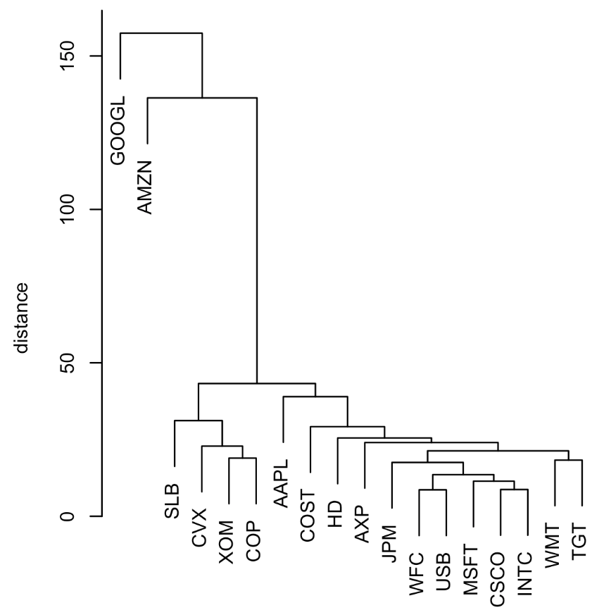
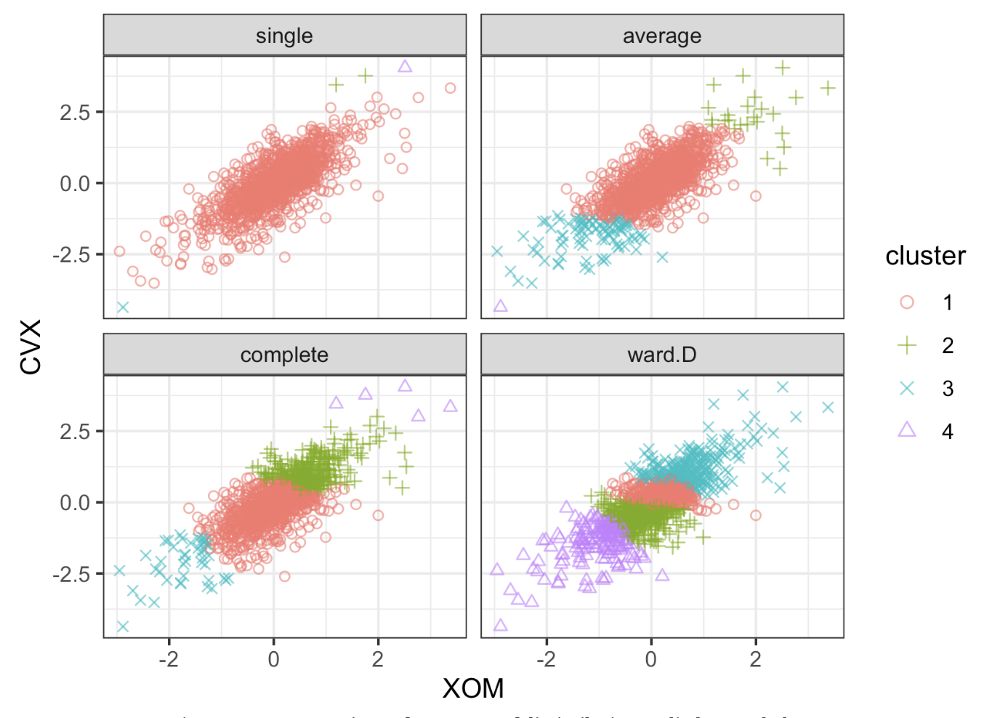

# Practical Statistics for Data Scientists: Hierarchical Clustering (A Simple Example, the Dendrogram, the Agglomerative Algorithm & Measures of Dissimilarity)


<Br>

## Hierarchical Clustering

> **Hierarchical clustering** is a key unsupervised learning method that organizes data into <u>a tree-like structure of nested clusters</u> without prior knowledge of the number of clusters. 

Unlike partitional methods like K-Means, it provides a multilevel dataset decomposition, enhancing understanding of relationships among observations. This method is ideal for exploratory data analysis with unknown structures and is highly valued for its interpretability via dendrogram visualization.

<Br>

#### Key Terms for Hierarchical Clustering

- Dendotram
  - **A tree diagram** illustrating the **sequence** of cluster merges or divisions.
- Distance
  - A mathematical function measuring the dissimilarity between two observations.
- Dissimilarity Measure
  - A function defining how the distance between clusters is computed (e.g., complete linkage, single linkage).

Hierarchical clustering’s flexibility has drawbacks; **it does not scale well to large data** **sets** with millions of records. Even modest-sized data with tens of thousands of records may demand extensive computing resources. **Most applications of hierarchical clustering focus on small data sets.**

<br>

#### A Simple Example

Hierarchical clustering works on a dataset with $n$ records and $p$ variables and is based on two basic building blocks:

- A distance metric, $d_{i,j}$ to measure the distance between two records $i$ and $j$.
- A dissimilarity metric, $D_{A,B}$ to measure the difference between two clusters $A$ and $B$ based on the distance $d_{i,j}$ between the members of each cluster.

<u>The **dissimilarity** metric is the most crucial choice for **numeric** data applications.</u> Hierarchical clustering starts with each record as a separate cluster and iterates to **merge the least dissimilar ones.**

- In R, the `hclust` function performs hierarchical clustering. One big difference with `hclust` versus kmeans is that it operates on pairwise distances of $d_{i,j}$ rather than the data itself. We compute these using the dist function.  For example, the following applies hierarchical clustering to stock returns for a set of companies. 

  ```R
  syms1 <- c('GOOGL', 'AMZN', 'AAPL', 'MSFT', 'CSCO', 'INTC', 'CVX', 'XOM', 'SLB',
             'COP', 'JPM', 'WFC', 'USB', 'AXP', 'WMT', 'TGT', 'HD', 'COST')
  # take transpose: to cluster companies, we need the stocks along the rows
  df <- t(sp500_px[row.names(sp500_px) >= '2011-01-01', syms1])
  d <- dist(df)
  hcl <- hclust(d)
  ```

  **Clustering algorithms will group the records (rows) of a data frame.** <u>To cluster the companies effectively, we must <I>transpose</I> the data frame and put the stocks along the rows and dates are in the columns.</u> 

- In *Python*, the `scipy` package provides various methods for hierarchical clustering found in the `scipy.cluster.hierarchy` module. We utilize the linkage function and the **"complete**" method in this example. 

  ```python
  syms1 = ['AAPL', 'AMZN', 'AXP', 'COP', 'COST', 'CSCO', 'CVX', 'GOOGL', 'HD',
           'INTC', 'JPM', 'MSFT', 'SLB', 'TGT', 'USB', 'WFC', 'WMT', 'XOM']
  df = sp500_px.loc[sp500_px.index >= '2011-01-01', syms1].transpose()
  
  Z = linkage(df, method='complete')
  ```

  <br>

#### The Dendogram

> Hierarchical clustering is naturally visualized as a tree structure, known as a **dendrogram**.

- In *R*, this can be easily generated using the plot command:

  ```R
  plot(hcl)
  ```

- In *Python*, we can use the `dendogram` method to plot the result of the `linkage` function. 

  ```python
  fig, ax = plt.subplots(figsize=(5, 5))
  dendrogram(Z, labels=df.index, ax=ax, color_threshold=0)
  plt.xticks(rotation=90)
  ax.set_ylabel('distance')
  ```

The figure below illustrates the results, highlighting that **we are now comparing similar companies rather than days**. Each **tree leaf** represents a **record**, while the **branch length** signifies the **dissimilarity** between clusters. Google and Amazon exhibit significant differences in their returns compared to each other and the remaining stocks. <u>The oil stocks (SLB, CVX, XOM, COP) form their own distinct cluster, Apple (AAPL) stands alone, and the other stocks are relatively similar.</u>

<center>
  <br><br>
</center>

Unlike K-means, it is **unnecessary to predefine the number of clusters**. Graphically, we can identify **different numbers of clusters with a horizontal line that moves up or down**; a cluster is defined wherever the horizontal line intersects the vertical lines. <u>To extract a specific number of clusters, we can use the `cutree` function as follows.</u>

- In *R*

  ```R
  cutree(hcl, k=4)
  ---
  GOOGL  AMZN  AAPL  MSFT  CSCO  INTC   CVX   XOM   SLB   COP   JPM   WFC
      1     2     3     3     3     3     4     4     4     4     3     3
    USB   AXP   WMT   TGT    HD  COST
      3     3     3     3     3     3
  ```

- In *Python*, we can achieve the same with the `fcluster` method as follows.

  ```python
  memb = fcluster(Z, 4, criterion='maxclust')
  memb = pd.Series(memb, index=df.index)
  for key, item in memb.groupby(memb):
      print(f"{key} : {', '.join(item.index)}")
  ```

The number of clusters to extract is set to 4, and **we can see that Google and Amazon each belong to their own cluster**. *All the oil stocks belong to another cluster, while the remaining stocks are in the fourth cluster.*

<br>

#### The Agglomerative Algorithm

The primary algorithm for hierarchical clustering is the agglomerative algorithm, which merges similar clusters iteratively. 

> The agglomerative algorithm starts with **each record** as its cluster and **gradually combines them into larger clusters.** 

It is a powerful method that does not require specifying the number of clusters in advance, and it is beneficial for discovering nested group structures in data.

The agglomerative process follows these general steps:

1. **Initialization**: Start with each data point as its **own cluster**.
2. **Distance Matrix Computation**: Compute **pairwise distances** between all records (using a distance metric such as Euclidean distance).
3. **Merging Step**:
   - Identify the **two clusters** with the smallest **dissimilarity**.
   - **Merge** them into a single cluster.
4. **Update Distances**:
   - Recalculate the distances between the new cluster and all remaining clusters.
5. **Repeat**:
   - Continue until all points are merged into one cluster (forming a tree or dendrogram structure).

The mathematical basis for this is that the **Distance Between Observations is defined as follows.** 

Let $x_i$ and $x_j$ be two observations. A **distance metric** $d(x_i, x_j)$ measures dissimilarity. A common choice is the **Euclidean distance**:

<center>
  $d(x_i, x_j) = \sqrt{ \sum_{k=1}^p (x_{ik} - x_{jk})^2 }$<br><Br>
</center>


where $p$ is the number of features.

<br>

**Dissimilarity Between Clusters** also utilized as well. 

To merge clusters, we need to define a **linkage method**, which determines how to compute the dissimilarity between clusters $A$ and $B$.


| Linkage              | Formula                                                      | Description                                                  |
| -------------------- | ------------------------------------------------------------ | ------------------------------------------------------------ |
| **Single linkage**   | $\min_{x \in A, y \in B} d(x, y)$                            | Distance between the **closest** pair (greedy; may produce chaining). |
| **Complete linkage** | $\max_{x \in A, y \in B} d(x, y)$                            | Distance between the **farthest** pair (produces tight, compact clusters). |
| **Average linkage**  | $d(A, B) = \frac{1}{\vert A\vert \vert B\vert } \sum_{x \in A} \sum_{y \in B} d(x, y)$ | Average of all pairwise distances                            |
| **Ward’s method**    | Increase in total within-cluster variance                    | Like K-Means; prefers similarly sized clusters.              |

<Br>

#### Visualization with a Dendrogram

As the algorithm proceeds, it **records the history** of merges. This information is visualized with a **dendrogram**, a tree diagram where:

- **Leaves** represent original data points.
- **Branches** represent clusters formed at each merge.
- **Heights** indicate the dissimilarity between merged clusters.

By **cutting** the dendrogram at a certain height, we can obtain a desired number of clusters without re-running the algorithm.

<center>
  <Br><br>
</center>

The results differ: the single linkage measure assigns almost all points to one cluster. Except for the minimum variance method (R: Ward.D; Python: ward), all measures have at least one cluster with a few outlying points. The minimum variance method resembles K-means clustering.

<br><br>
