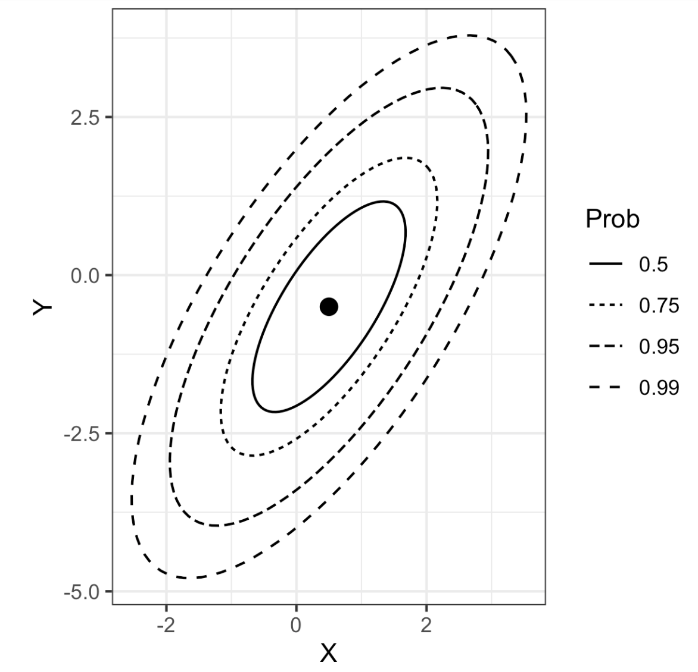
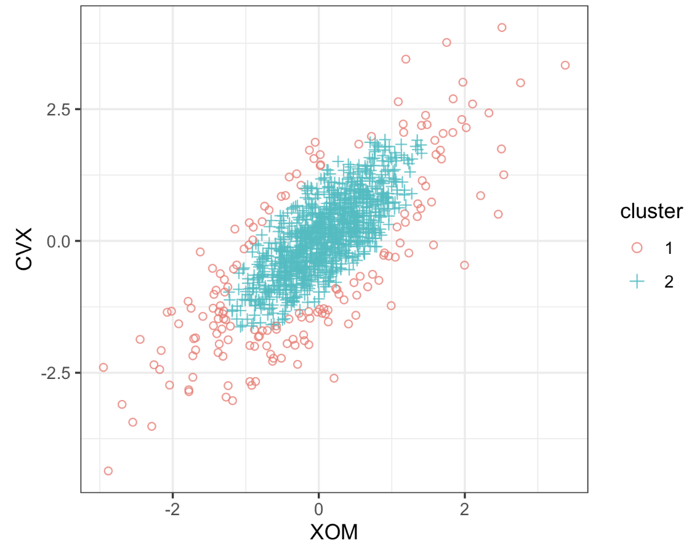
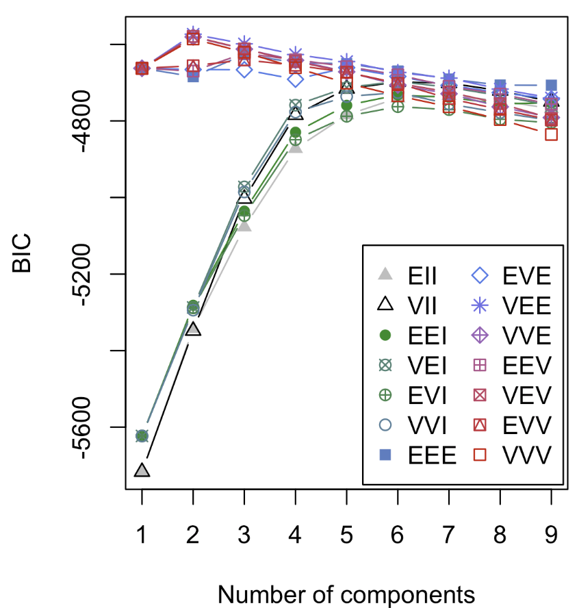

# Practical Statistics for Data Scientists: Model-Based Clustering (Multivariate Normal Distribution, Mixtures of Normals & Selecting the Number of Clusters)


<br>

## Model-Based Clustering

In contrast to heuristic clustering algorithms like K-Means and hierarchical clustering, which group data points based on geometric proximity, **model-based clustering** assumes that data are generated from a mixture of underlying probability distributions. These techniques offer a principled, statistical framework for discovering subpopulations in data. They are particularly well-suited to complex datasets where clusters differ in center, shape, size, and orientation.

One of the most widely used techniques in model-based clustering is the **Gaussian Mixture Model (GMM)**.

<br>

### Multivariate Normal Distribution

The most widely used model-based clustering methods are based on the *multivariate normal distribution*. The multivariate normal distribution **generalizes** the normal distribution to *p* variables. $X_1, X_2, \dots , X_p$. A set of means characterizes this distribution, $\mu = \mu_1, \mu_2, \dots, \mu_p$ and a covariance matrix $\Sigma$.

The **covariance** **matrix** measures <u>how the variables correlate with each other.</u> The covariance matrix $\Sigma$ consists of *p* variances $\sigma_1^2, \sigma_2^2, \dots, \sigma_p^2$ and covariances $\sigma_{i,j}$ for all pairs of variables where $i≠j$. The matrix appears as follows, with the variables arranged in rows and duplicated in columns.

<center>
  $
\Sigma =
\begin{bmatrix}
\sigma_1^2 & \sigma_{1,2} & \cdots & \sigma_{1,p} \\
\sigma_{2,1} & \sigma_2^2 & \cdots & \sigma_{2,p} \\
\vdots & \vdots & \ddots & \vdots \\
\sigma_{p,1} & \sigma_{p,2} & \cdots & \sigma_p^2 \\
\end{bmatrix}
$ <Br><Br>
</center>

The distribution is denoted by $(X_1, X_2, \dots, X_p) \sim N_p(\mu, \Sigma)$, which means that the variables are all normally distributed, and the overall distribution is fully described by the vector of variable means and the covariance matrix.

The figure below shows the probability contours for a multivariate normal distribution for two variables $X$ and $Y$ (The 0.5 probability contour, for example, contains 50% of the distribution.)

The means are $\mu_x = 0.5$ and $\mu_y = -0.5$, and the covariance matrix is 
$$
\Sigma =
\begin{bmatrix}
1 & 1 \\
1 & 2 \\
\end{bmatrix}
$$
<br>Since the covariance $\sigma_{xy}$ is positive, $X$ and $Y$ are positvely correlated.

<center>
  <br><Br>
</center>

<br>

#### Mixture of Normals

> The key idea behind model-based clustering is that each record is assumed **to be distributed as one of $K$ multivariate normal distributions**, where $K$ represents <u>the number of clusters</u>. Each distribution has a distinct **mean** $\mu$ and **covariance matrix** $\Sigma$.

*R* offers a comprehensive package for model-based clustering called `mclust`, which was originally developed by Chris Fraley and Adrian Raftery. With this package, we can apply model-based clustering to the stock return data we previously analyzed using *K*-means and hierarchical clustering.

- In *R*

  ```R
  library(mclust)
  df <- sp500_px[row.names(sp500_px) >= '2011-01-01', c('XOM', 'CVX')]
  mcl <- Mclust(df)
  summary(mcl)
  ---
  Mclust VEE (ellipsoidal, equal shape and orientation) model with 2 components:
  
  
   log.likelihood    n df       BIC       ICL
        -2255.134 1131  9 -4573.546 -5076.856
  
  Clustering table:
    1   2
  963 168
  ```

- In *Python*, `scikit-learn` has the `sklearn.mixture.GaussianMixture` class for model-based clustering.

  ```python
  df = sp500_px.loc[sp500_px.index >= '2011-01-01', ['XOM', 'CVX']]
  mclust = GaussianMixture(n_components=2).fit(df)
  mclust.bic(df)
  ```

Extracting the cluster assignments using the `predict` function, we can visualize the clusters.

- In *R*

  ```R
  cluster <- factor(predict(mcl)$classification)
  ggplot(data=df, aes(x=XOM, y=CVX, color=cluster, shape=cluster)) +
    geom_point(alpha=.8)
  ```

- In *Python*

  ```python
  fig, ax = plt.subplots(figsize=(4, 4))
  colors = [f'C{c}' for c in mclust.predict(df)]
  df.plot.scatter(x='XOM', y='CVX', c=colors, alpha=0.5, ax=ax)
  ax.set_xlim(-3, 3)
  ax.set_ylim(-3, 3)
  ```

The resulting plot is shown in the figure below. There are two clusters: one cluster in the middle of the data, and a second cluster at the outer edge of the data. 

<center>
  <br><br>
</center>

We can extract the parameters to the normal distributions using the `summary` function as follows.

- In *R*

  ```R
  > summary(mcl, parameters=TRUE)$mean
            [,1]        [,2]
  XOM 0.05783847 -0.04374944
  CVX 0.07363239 -0.21175715
  > summary(mcl, parameters=TRUE)$variance
  , , 1
            XOM       CVX
  XOM 0.3002049 0.3060989
  CVX 0.3060989 0.5496727
  , , 2
  
           XOM      CVX
  XOM 1.046318 1.066860
  CVX 1.066860 1.915799
  ```

- In *Python*

  ```python
  print('Mean')
  print(mclust.means_)
  print('Covariances')
  print(mclust.covariances_)
  ```

Both distributions exhibit comparable means and correlations; however, the second distribution features significantly larger variances and covariances. Because of the algorithm's inherent randomness, results may differ slightly across various runs.

<br>

#### Selecting the Number of Clusters

Unlike K-means and hierarchical clustering, `mclust` **automatically selects the number of clusters** in R, which in this case is two. It achieves this by choosing the number of clusters that **maximizes the Bayesian Information Criteria (BIC).** BIC operates <u>by selecting the model that fits best while imposing a penalty for the number of parameters involved.</u> In model-based clustering, **increasing the number of clusters will always enhance the fit,** *though it comes at the cost of adding more parameters to the model.*

`mclust` fits 14 different models **with an increasing number of components and automatically selects an optimal model.** We can plot the BIC values of these models using a function in `mclust`. 

- In *R*

  ```R
  plot(mcl, what='BIC', ask=FALSE)
  ```

  <center>
    <br><br>
  </center>

- In *Python*, the `GaussianMixture` implementation doesn't test various combinations. It’s easy to run multiple combinations in Python. This implementation defines BIC as usual, so the calculated BIC value is positive, and it needs to be minimized.

  ```python
  results = []
  covariance_types = ['full', 'tied', 'diag', 'spherical']
  for n_components in range(1, 9):
      for covariance_type in covariance_types:
          mclust = GaussianMixture(n_components=n_components, warm_start=True,
                                   covariance_type=covariance_type) 1
          mclust.fit(df)
          results.append({
              'bic': mclust.bic(df),
              'n_components': n_components,
              'covariance_type': covariance_type,
          })
  
  results = pd.DataFrame(results)
  
  colors = ['C0', 'C1', 'C2', 'C3']
  styles = ['C0-','C1:','C0-.', 'C1--']
  
  fig, ax = plt.subplots(figsize=(4, 4))
  for i, covariance_type in enumerate(covariance_types):
      subset = results.loc[results.covariance_type == covariance_type, :]
      subset.plot(x='n_components', y='bic', ax=ax, label=covariance_type,
                  kind='line', style=styles[i])
  ```

Model-based clustering techniques have limitations. They rely on an underlying data model, making results heavily dependent on that assumption. The computational requirements exceed those of hierarchical clustering, complicating scalability to large datasets. Additionally, the algorithm is more complex and less accessible than other methods.<br><br>

