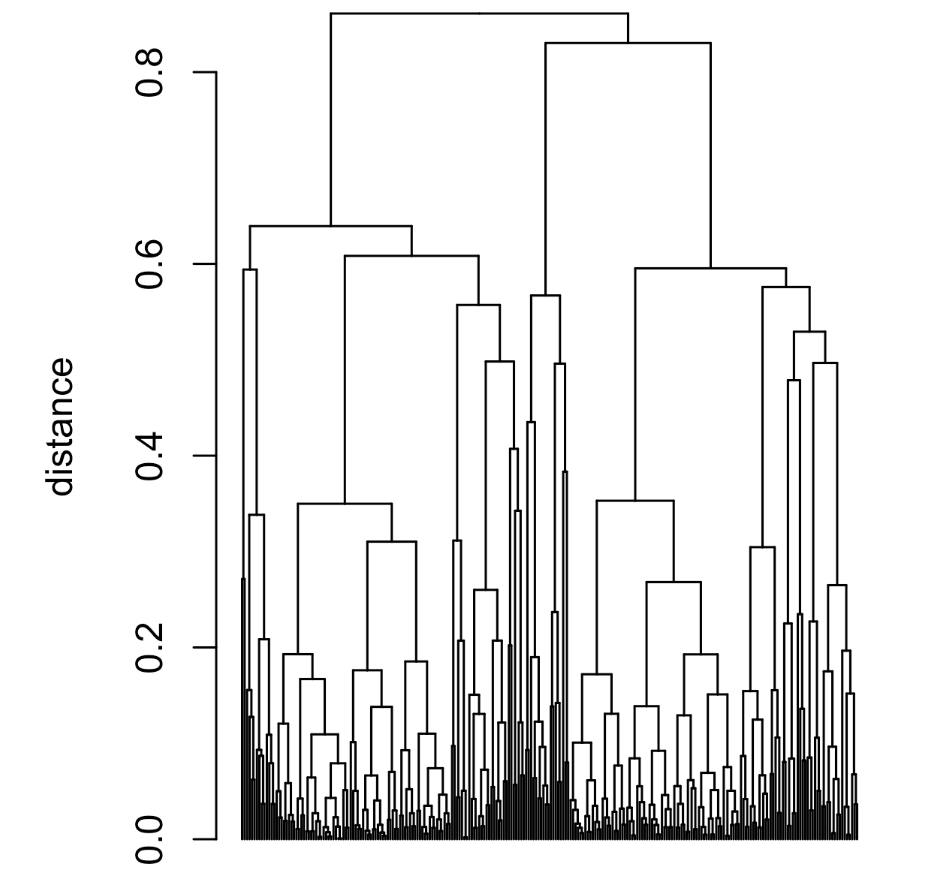

# Practical Statistics for Data Scientists: Scaling and Categorical Variables (Scaling the Variables, Dominant Variables, Categorical Data, and Gower's Distance)


<br>

## Scaling and Categorical Variables

Unsupervised learning techniques generally require that the data be appropriately scaled. This differs from many techniques for **regression** and **classification**, where **scaling is unimportant.** 

<br>

#### Key Terms for Scaling Data

- Scaling
  - Squashing or expanding data usually brings multiple variables to the same scale.
- Normalization
  - One scaling method involves subtracting the mean and dividing by the standard deviation.
  -  = Standardization
- Gower's distance
  - A scaling algorithm for mixed numeric and categorical data that normalizes variables to a 0-1 range.

<br>

For the personal loan data, variables vary in units and magnitudes. Some have small values (e.g., years employed), while others have large values (e.g., loan amount). Without scaling, PCA, K-means, and other clustering methods will be dominated by large-value variables, neglecting small-value ones. 

Categorical data poses challenges for clustering. Like K-Nearest Neighbors, unordered factor variables are transformed into binary (0/1) variables through one-hot encoding. These binary variables may scale differently than other data, and their two-value limit can disrupt methods like PCA and K-means.

<Br>

### Scaling the Variables

Variables with significantly different scales and units must be normalized before applying a clustering procedure. For example, let’s apply kmeans to a set of data on loan defaults without normalizing. 

- In *R*

  ```R
  defaults <- loan_data[loan_data$outcome=='default',]
  df <- defaults[, c('loan_amnt', 'annual_inc', 'revol_bal', 'open_acc',
                     'dti', 'revol_util')]
  km <- kmeans(df, centers=4, nstart=10)
  centers <- data.frame(size=km$size, km$centers)
  round(centers, digits=2)
  ---
     size loan_amnt annual_inc revol_bal open_acc   dti revol_util
  1    52  22570.19  489783.40  85161.35    13.33  6.91      59.65
  2  1192  21856.38  165473.54  38935.88    12.61 13.48      63.67
  3 13902  10606.48   42500.30  10280.52     9.59 17.71      58.11
  4  7525  18282.25   83458.11  19653.82    11.66 16.77      62.27
  ```

- Here is the corresponding *Python* code

  ```python
  defaults = loan_data.loc[loan_data['outcome'] == 'default',]
  columns = ['loan_amnt', 'annual_inc', 'revol_bal', 'open_acc',
             'dti', 'revol_util']
  
  df = defaults[columns]
  kmeans = KMeans(n_clusters=4, random_state=1).fit(df)
  counts = Counter(kmeans.labels_)
  
  centers = pd.DataFrame(kmeans.cluster_centers_, columns=columns)
  centers['size'] = [counts[i] for i in range(4)]
  centers
  ```

The variables `annual_inc` and `revol_bal` dominate the clusters, which vary significantly in size. Cluster 1 contains only 52 members, characterized by relatively high income and revolving credit balances. 

A common approach to scaling the variables is **to convert them to *z*-scores by subtracting the mean and dividing by the standard deviation.**

Observe the effects on the clusters when `kmeans` is applied to the normalized data.

- In *R*

  ```R
  df0 <- scale(df)
  km0 <- kmeans(df0, centers=4, nstart=10)
  centers0 <- scale(km0$centers, center=FALSE,
                   scale=1 / attr(df0, 'scaled:scale'))
  centers0 <- scale(centers0, center=-attr(df0, 'scaled:center'), scale=FALSE)
  centers0 <- data.frame(size=km0$size, centers0)
  round(centers0, digits=2)
  ---
    size loan_amnt annual_inc revol_bal open_acc   dti revol_util
  1 7355  10467.65   51134.87  11523.31     7.48 15.78      77.73
  2 5309  10363.43   53523.09   6038.26     8.68 11.32      30.70
  3 3713  25894.07  116185.91  32797.67    12.41 16.22      66.14
  4 6294  13361.61   55596.65  16375.27    14.25 24.23      59.61
  ```

- In Python, we can utilize `scikit-learn`’s `StandardScaler`. The `inverse_transform` method allows us to convert the cluster centers back to their original scale.

  ```python
  scaler = preprocessing.StandardScaler()
  df0 = scaler.fit_transform(df * 1.0)
  
  kmeans = KMeans(n_clusters=4, random_state=1).fit(df0)
  counts = Counter(kmeans.labels_)
  
  centers = pd.DataFrame(scaler.inverse_transform(kmeans.cluster_centers_),
                         columns=columns)
  centers['size'] = [counts[i] for i in range(4)]
  centers
  ```

The cluster sizes are more balanced, and the clusters are not dominated by `annual_inc` and `revol_bal`, which reveals a more interesting structure in the data.

<Br>

### Dominant Variables

Even in cases where the variables are measured on the same scale and accurately reflect relative importance (e.g., movement to stock prices), it can sometimes be beneficial to rescale the variables. 

Suppose we add Google (GOOGL) and Amazon (AMZN) to the analysis here. We see how this is done in *R* in below.

- In *R*

  ```R
  syms <- c('GOOGL', 'AMZN', 'AAPL', 'MSFT', 'CSCO', 'INTC', 'CVX', 'XOM',
            'SLB', 'COP', 'JPM', 'WFC', 'USB', 'AXP', 'WMT', 'TGT', 'HD', 'COST')
  top_sp1 <- sp500_px[row.names(sp500_px) >= '2005-01-01', syms]
  sp_pca1 <- princomp(top_sp1)
  screeplot(sp_pca1)
  ```

- In *Python*, we get the screeplot as follows.

  ```python
  syms = ['GOOGL', 'AMZN', 'AAPL', 'MSFT', 'CSCO', 'INTC', 'CVX', 'XOM',
          'SLB', 'COP', 'JPM', 'WFC', 'USB', 'AXP', 'WMT', 'TGT', 'HD', 'COST']
  top_sp1 = sp500_px.loc[sp500_px.index >= '2005-01-01', syms]
  
  sp_pca1 = PCA()
  sp_pca1.fit(top_sp1)
  
  explained_variance = pd.DataFrame(sp_pca1.explained_variance_)
  ax = explained_variance.head(10).plot.bar(legend=False, figsize=(4, 4))
  ax.set_xlabel('Component')
  ```

The screeplot shows **variances** <u>for the top principal components</u>. It reveals that the first two components have significantly larger variances than the others, indicating that one or two variables dominate the loadings, as demonstrated in this example.

- In *R*

  ```R
  round(sp_pca1$loadings[,1:2], 3)
        Comp.1 Comp.2
  GOOGL  0.781  0.609
  AMZN   0.593 -0.792
  AAPL   0.078  0.004
  MSFT   0.029  0.002
  CSCO   0.017 -0.001
  INTC   0.020 -0.001
  CVX    0.068 -0.021
  XOM    0.053 -0.005
  ...
  ```

- In *Python*, we use as follows.

  ```python
  loadings = pd.DataFrame(sp_pca1.components_[0:2, :], columns=top_sp1.columns)
  loadings.transpose()
  ```

GOOGL and AMZN primarily dominate the first two principal components. This is because the stock price movements of GOOGL and AMZN account for most of the variability.

To manage this situation, we can either include them as they are, rescale the variables, or exclude the dominant variables from the analysis and address them separately.

<center>
  <Br><Br>
</center>

<br>

### Categorical Data and Gower's Distance

> Categorical data must be **converted to numeric data**, either by ranking or encoding as binary (dummy) variables. For mixed continuous and binary variables, **scaling** is often necessary to align their ranges. A popular method for this is **Gower's distance.** 

The basic idea behind Gower's distance is to apply a different distance metric tgo each variable depending on the type of data:

- Distance is calculated as the absolute value of the difference between two records (Manhattan Distance) for numeric variables and ordered factors.
- For categorical variables, the distance is 1 if the categories of two records differ, and the distance is 0 if the categories are identical. 

*Gower's distance is computed as follows...*

1. Compute the distance $d_{i,j}$ for all pairs of variables $i$ and $j$ for each record.
2. Scale each pair $d_{i,j}$ so the minimum is 0 and the maximum is 1.
3. Add the pairwise scaled distance between variables together, using either a simple or a weighted mean, to create the distance matrix.

Gower's distance is illustrated in *R* as follows.

- In *R*

  ```R
  x <- loan_data[1:5, c('dti', 'payment_inc_ratio', 'home_', 'purpose_')]
  x
  ---
  # A tibble: 5 × 4
      dti payment_inc_ratio   home            purpose
    <dbl>             <dbl> <fctr>             <fctr>
  1  1.00           2.39320   RENT                car
  2  5.55           4.57170    OWN     small_business
  3 18.08           9.71600   RENT              other
  4 10.08          12.21520   RENT debt_consolidation
  5  7.06           3.90888   RENT              other
  ```

  The function `daisy` in the `cluster` package in *R* can be used to compute Gower’s distance:

  ```R
  library(cluster)
  daisy(x, metric='gower')
  ---
  Dissimilarities :
            1         2         3         4
  2 0.6220479
  3 0.6863877 0.8143398
  4 0.6329040 0.7608561 0.4307083
  5 0.3772789 0.5389727 0.3091088 0.5056250
  
  Metric :  mixed ;  Types = I, I, N, N
  Number of objects : 5
  ```

All distances range from 0 to 1. **The pair of records with the largest distance is 2 and 3:** neither shares the same values for `home` and `purpose`, and they exhibit very different levels of `dti` (debt-to-income) and `payment_inc_ratio`. Records 3 and 5 have the smallest distance because they have identical values for home and purpose.

We can pass Gower’s distance matrix calculated from `daisy` to `hclust` for hierarchical clustering. 

- In *R*

  ```R
  df <- defaults[sample(nrow(defaults), 250),
                 c('dti', 'payment_inc_ratio', 'home', 'purpose')]
  d = daisy(df, metric='gower')
  hcl <- hclust(d)
  dnd <- as.dendrogram(hcl)
  plot(dnd, leaflab='none')
  ```

  <center>
    <br><br>
  </center>

  This subtree consists entirely of owners with a loan purpose labeled as “debt_consolidation.” While strict separation is not true for all subtrees, this illustrates that the categorical variables tend to be grouped together in the clusters.

<Br>

The main tools for dimension reduction of numeric data are principal components analysis or K-means clustering. Both require attention to proper data scaling to ensure meaningful data reduction.

All methods likely yield similar results for clustering highly structured data with well-separated clusters. Each technique has advantages. K-means efficiently handles extensive data and is easy to understand. Hierarchical clustering accommodates mixed data types—numeric and categorical—and offers an intuitive display via the dendrogram. Model-based clustering relies on statistical theory for a more rigorous approach than heuristics. For large datasets, K-means is the preferred method.

Noisy data, like loan and stock data, presents a stark choice. K-means, hierarchical clustering, and model-based clustering yield different solutions. How should a data scientist proceed? Unfortunately, no simple rule guides the choice; ultimately, the method depends on data size and application goals.

<br><Br>
