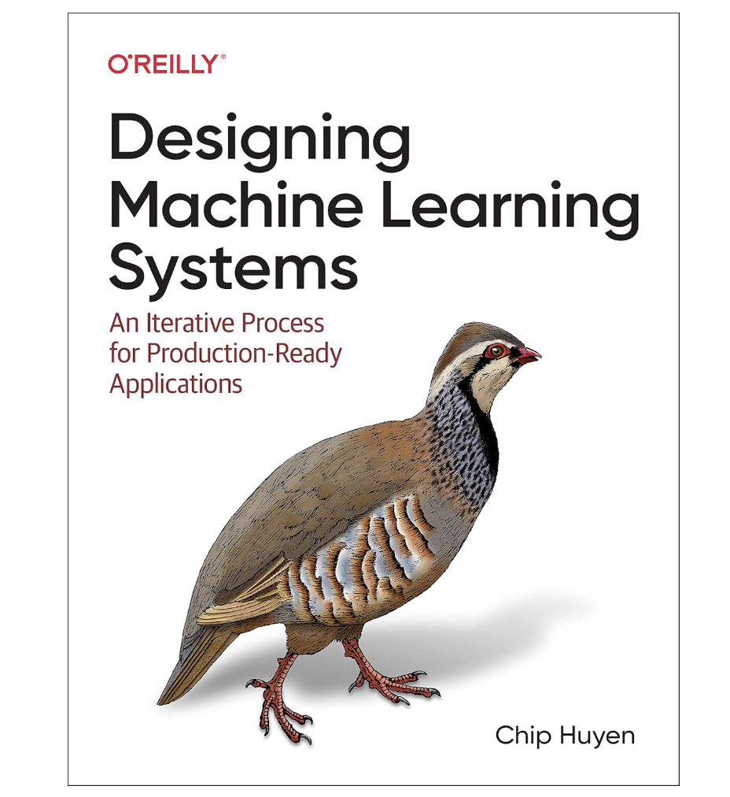

# Designing Machine Learning Systems (MLOPs) Review Begins!

    
  <I>Image: The scenery of Jersey City taken by me.</I>  

After several weeks (*actually, it was several months, though*) of consistent posting, I’m wrapping up my TIL25_StatReview series, which focused on **revisiting the foundations of statistics and probability.** This journey <u>sharpened my intuition and reconnected me to the mathematical backbone of modern machine learning</u>. From revisiting central limit theorems to power laws in error analysis, every post helped reinforce concepts I had once taken for granted.

 

📚 With that chapter now concluded, I’m excited to continue posting challenges with a brand-new learning journey centered around the book _Designing Machine Learning Systems_ by **Chip Huyen**.

    

This book is more than just a technical manual—it's a **field guide** for anyone serious about building ML systems & MLOps that work in the real world. While academic models are often clean and bounded, real production systems are anything but. This is where the book shines:  
- It explores how to **design, deploy, and maintain machine learning (ML) systems** end-to-end.  
- It touches on often-overlooked aspects like **data collection strategy, feedback loops, monitoring, CI/CD, and system iteration**.  
- It blends **MLOps best practices with product thinking**, emphasizing that building a model is just a small part of building a successful system.

 

🚀 Over the coming weeks, I’ll be summarizing key lessons from each chapter while layering in my reflections, primarily through the lens of real-time NLP systems, which I’ve been actively developing.

The **TIL25_MLOps series** will focus on:
- End-to-end ML system lifecycle
- Trade-offs in system design
- Scalable architecture patterns
- Real-world failure modes and debugging
- Building maintainable, reliable, and adaptable ML pipelines

 

If you're interested in **bridging the gap between modeling and deployment** or want a peek into how production-grade ML is done, this series is for you.

Let the journey begin! ✨

 

***Wonha Shin***
