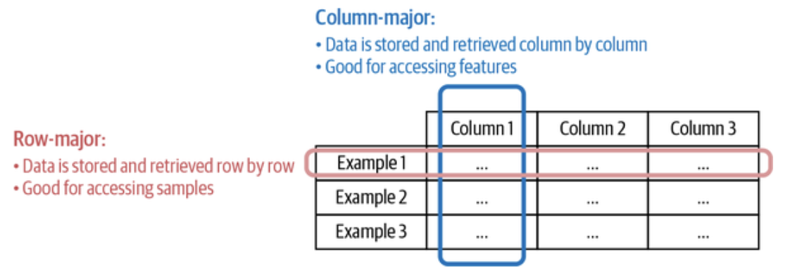
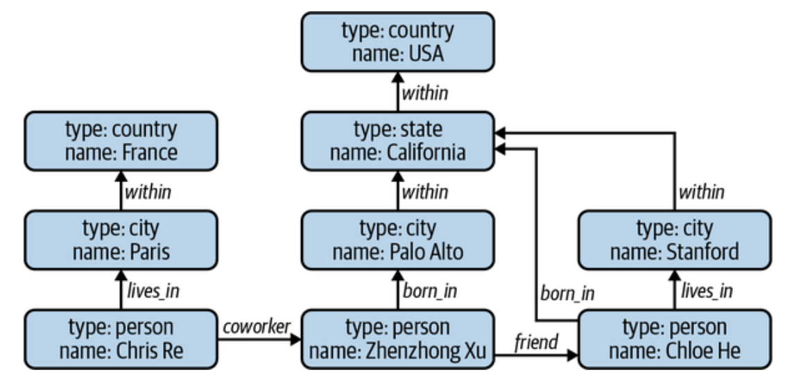
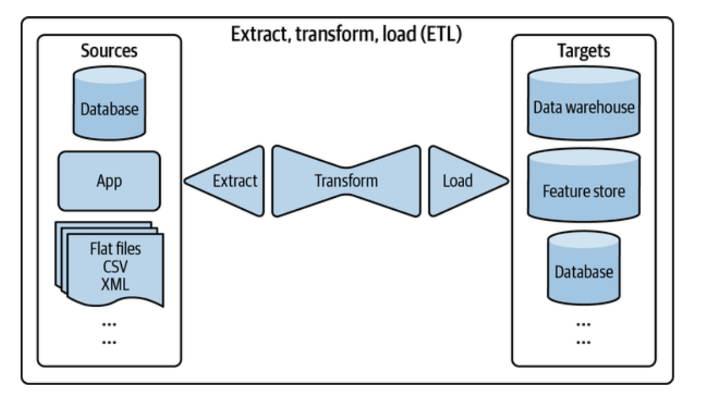

# Designing Machine Learning Systems: Data Formats (JSON, Parquet & Binary Format), Data Models (Relational & NoSQL), and Data Storage Engines (ETL)

 

## Data Engineering Fundamentals

*Building a stable foundation for machine learning systems*

Machine learning (ML) has surged forward in the last decade,  and that progress is tightly tied to the rise of **big data**. But building ML systems in production is not just about tuning models or training with more GPUs. The most challenging part, and often the most time-consuming, is the **data engineering** that underpins it all.

 

### Understanding Your Data Sources

In production, ML systems ingest data from many sources, each with distinct characteristics and challenges.

1. **User Input Data**: This encompasses text, images, uploaded documents, and other multimedia content. It’s prone to errors and inconsistencies—people can enter the wrong format, miss fields, or submit overly long or short content. <u>Since users expect immediate feedback, this data must be processed quickly and accurately, often requiring strict validation logic.</u>
2. **System-Generated Data**: This includes logs, event streams, model predictions, and diagnostic signals. These are less error-prone but often large in volume. <u>Logs are crucial for debugging and performance monitoring and are typically processed in batches</u> (e.g., hourly or daily).
3. **Behavioral Data**: Systems track user interactions—clicks, scrolls, page views. While technically system-generated, it remains personal and is often subject to **privacy regulations**.
4. **Internal Databases**: Structured datasets managed by enterprise applications (e.g., customer databases, inventory systems). These are <u>useful for personalization, product ranking, and more.</u>
5. **Third-Party Data**: Purchased or licensed from vendors, this includes demographic trends, purchase histories, or behavioral data. It’s <u>often processed and anonymized, but as privacy policies tighten</u> (e.g., Apple’s opt-in IDFA), its availability is shrinking.

Each source requires different ingestion strategies, cleaning protocols, and storage solutions.

 

### Data Formats: Text vs. Binary, Row vs. Column

Once collected, data needs to be stored, but choosing the proper **format** depends on access patterns and performance needs.

- **Text-based formats**, such as JSON and CSV, are <u>human-readable and easy to debu</u>g. But they’re verbose and inefficient in terms of space and speed.
- **Binary formats** like Parquet and Avro are <u>compact and faster for computation, but less intuitive</u> to inspect directly.

There’s also a key distinction between **row-major** (e.g., CSV) and **column-major** (e.g., Parquet) formats:

- **Row-major** is excellent for <u>writing new records and retrieving complete examples.</u>
- **Column-major** is ideal for reading specific features across many examples, which <u>is common in feature selection and statistical analysis.</u>

    
    <I>Image Source: TextBook: Designing Machine Learning Systems</I>  
  

Understanding the trade-offs between formats can drastically improve performance and reduce storage costs. *For example, converting a 14 MB CSV to Parquet may reduce it to 6 MB while speeding up queries. This is why AWS recommends using Parquet format files as their input.*  

 

### Data Models: Relational vs. NoSQL

> How you <b>model</b> your data determines how you can retrieve and update it—and <u>ultimately what your ML system can do with it.</u>

#### Relational Model

Invented in 1970, the relational model structures data in normalized tables (relations), making it ideal for:

- Reducing redundancy
- Ensuring consistency
- Enabling complex queries via SQL

*But normalization can spread data across many tables, making joins computationally expensive, especially at scale.*

#### NoSQL Models

In response to the rigidity of relational schemas, NoSQL databases emerged to offer more flexible alternatives:

- **Document Stores** (e.g., MongoDB): <u>Each data item is a self-contained document, often in JSON or BSON.</u> Useful *when the data structure varies or relationships are minimal.*

- **Graph Databases** (e.g., Neo4j): Ideal for highly <u>interconnected data</u>, such as social networks, recommendation engines, or fraud detection. Relationships are first-class citizens.

  

      
    <I>Image Source: TextBook: Designing Machine Learning Systems</I>  
  

  

NoSQL models give you flexibility and speed, especially in non-tabular or semi-structured use cases. However, they may sacrifice the power and safety of relational schemas.

 

### Structured vs. Unstructured Data

**Structured data** adheres to a defined schema. It’s <u>easy to search, query, and analyze—but inflexible to change.</u>

**Unstructured data**, such as raw logs, free text, or images, lacks a predefined structure. This makes it:

- Easier to store quickly
- More flexible across applications
- Harder to analyze without custom parsing or feature extraction

Structured data lives in **data warehouses**, while unstructured data is stored in **data lakes**. Modern systems increasingly utilize **lakehouses**, *which combine the flexibility of data lakes with the governance of data warehouses.*

 

### Data Storage Engines: OLTP vs. OLAP

Databases are <u>not one-size-fits-all.</u> Their design depends on the **type of processing** they need to support.

#### OLTP (Online Transaction Processing)

Optimized for handling **frequent, atomic operations** like purchases, uploads, or bookings. They prioritize:

- Low latency
- High availability
- Data consistency (ACID compliance)

*Common in apps and services where users expect instant feedback.*

#### OLAP (Online Analytical Processing)

Optimized for **analytical queries**—aggregating data across many records (e.g., monthly averages, churn rates). These databases often use:

- Columnar storage
- High-throughput batch queries

While traditionally separate, **new architectures blur the line**, with tools like Snowflake, BigQuery, and Apache Iceberg supporting hybrid workloads.

 

### ETL and ELT: Processing the Data Pipeline

    
  <I>Image Source: TextBook: Designing Machine Learning Systems</I>  

Once you have data, it needs to be processed for downstream use. This is where **ETL** comes in:

- **Extract**: Gather data from various sources.
- **Transform**: Clean, normalize, enrich, and join datasets.
- **Load**: Insert into the target system (e.g., a data warehouse or file system).

Modern systems also follow an **ELT** pattern, <u>where raw data is initially stored (in a data lake) and transformation occurs later.</u> This allows for faster ingestion and schema flexibility, but can lead to processing delays and inefficient querying if not managed well.

 

### Declarative Data and ML Systems

Inspired by SQL’s declarative nature, <u>declarative ML aims to simplify modeling by allowing users to **specify what they want** (features, task) without coding how to get it</u>.

- **Ludwig** allows users to define models using configuration files, such as layer counts and activation functions.
- **H2O AutoML** automates the entire pipeline, exploring multiple model variants and selecting the most effective one.

While promising, these systems mostly abstract **model development**—but overlook more challenging tasks, *such as feature engineering, monitoring, and handling data drift.* As a result, they help reduce entry barriers, but are not a silver bullet for production-grade ML.

  
