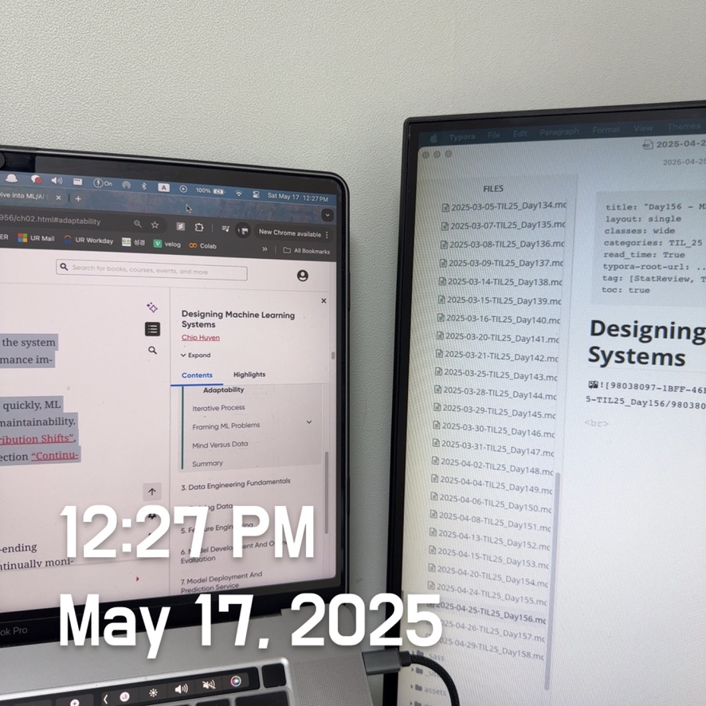
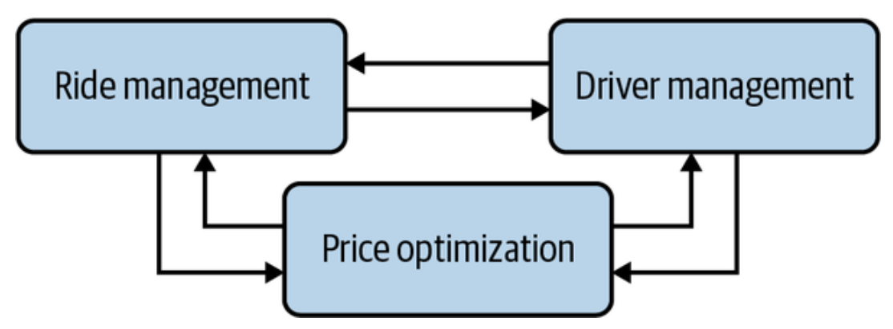

# Designing Machine Learning Systems: Modes of Dataflow & Batch / Real-Time Processing

 

## Modes of Dataflow

*How data moves between services in ML and production systems*

In modern machine learning systems, **data rarely flows through a single process.** <u>Most real-world systems are composed of multiple services, often running in separate processes or even across different machines.</u> These services need to **communicate and share data**, and how this communication happens—what we call *dataflow*—is a fundamental part of scalable system design.

 

### Data Passing through Databases

The most straightforward and familiar approach is **writing data to a database**, which another process then **reads** from—for example, processing A records customer orders in a MySQL database. Additionally, periodically processing queries in the same database to analyze recent orders.

It is beneficial <u>that it is easy to implement and suitable for batch systems and data archiving.</u> However, it is challenging since **both processes must access the same database,** which is not always practical, for example, when different companies are involved. **High latency** makes it unsuitable for real-time or low-latency applications like fraud detection or ride pricing.

This method works well for batch analytics and offline workflows, but is **too slow and rigid** for dynamic, interactive applications.

 

### Data Passing through Services (Request-Driven)

This is the most common mode in service-oriented or microservice architectures. In this model, one process **requests data** from another via a **network call**. The systrem is <u>request-driven,</u> meaning communication only happens when one service explicitly makes a request.

For instance, *in a ride-sharing app like Lyft*, the price **optimization** service must calculate the ideal fare for a ride. It sends **requests** to the driver management service t<u>o obtain supply data and to the ride management service for demand data</u>. All services can be deployed, maintained, and scaled separately, making this architecture highly modular and extensible.

#### Common Protocols 

It includes **REST** (Representational State Transfer), *which is stateless and widely used over HTTP for public APIs, and RPC (Remote Procedure Call), which mimics function calls and is more common for internal, low-latency microservice-to-microservice communication.* The **pros** of these protocols are clean **interfaces** and modularity, **ease** of documentation and testing, and **strong** support from modern development stacks *such as Flask, FastAPI, and gRPC.* 

However, they also have **cons**, including **tight coupling** between services, **synchronous communication** that can break the chain if one service is down, and **fragility under scale**, <u>where increasing the number of services can lead to tangled and hard-to-maintain request paths</u>.

 

### Data Passing Through Real-Time Transport (Event-Driven)

 

    

As systems become more complex, **real-time streaming architectures** offer a more **decoupled, scalable solution**.

Instead of services requesting data from each other, each service **broadcasts events** to a **central broker** (e.g., Kafka, Kinesis). Other services **subscribe** to these events based on topics of interest.

This setup is known as:

- **Event-driven architecture**
- **Publish-subscribe (pubsub)** model

For instance, let’s revisit our ride-sharing app. The **driver** **management** service publishes <u>the predicted number of available drivers every minute</u>. Meanwhile, the **ride management** service publishes <u>expected ride demand</u>. The **price optimization** service <u>subscribes to both topics to calculate surge pricing dynamically.</u>

The **pros** are as follows: **loose coupling**, which means that data producers and consumers don’t need to know about each other; **high availability,** as the broker retains the event for later if a consumer service goes down; and **scalability**, since more services can be added without modifying the producers.

**Broker Responsibilities** involve temporarily holding events (in memory or disk-backed), routing events to the appropriate consumers, and enforcing retention policies (e.g., deleting events after 7 days).

**PubSub** systems like *Kafka* and *Kinesis* broadcast data to all topic subscribers, while **message queues** such as *RabbitMQ* and *RocketMQ* deliver messages to specific intended recipients.

Real-time transports form the backbone of **data-intensive ML systems**, enabling real-time feature generation, model scoring, fraud detection, and more.

 

### Batch vs. Stream Processing

> How do we process data <u>from a database or stream once it is in the system?</u>

**Batch Processing:**  

Batch processing operates on **historical data** stored in data lakes or warehouses. It runs on a schedule, such as nightly aggregation jobs, and utilizes tools like ***MapReduce, Apache Spark, or Airflow.***

**Stream Processing:**  

In contrast, stream processing operates on **real-time data** as it flows through the system. It handles <u>events as they arrive, allowing for rapid responses like detecting fraudulent transactions within one second.</u> Standard tools for stream processing include ***Apache Flink, Kafka Streams, Spark Streaming, or KSQL.***

**Batch Features:**  

Batch processing features often involve slowly-changing attributes, such as user age or average driver rating. This method is <u>less sensitive to latency and typically computes values once a day, storing them in feature stores.</u>

**Streaming Features:**  

Streaming features focus on rapidly changing values, such as the number of drivers available at any moment or the current surge pricing. These features <u>require real-time computation and are essential for live model scoring and responsive machine learning systems.</u>

 

#### Stream Processing Engines

To manage complex stream computations like joins, aggregations, and windowing, you’ll need specialized stream processing engines:

- **Apache Flink**: High performance, scalable, supports event-time processing.
- **KSQL** (Kafka’s SQL engine): SQL abstraction over streaming data.
- **Spark Streaming**: Micro-batch processing of streams using Spark APIs.

**Stream** processing is <u>more complex</u> than batch processing. Because data is unbounded and arrives out of order, it must maintain state, such as tracking past events to compute real-time metrics. <u>The system must also handle variable loads and still meet latency guarantees.</u>

However, modern stream engines are **robust and scalable**, and even support **stateful streaming**, making them ideal for ML applications like:

- Real-time pricing
- Credit risk scoring
- Fraud detection
- Real-time personalization

 

In real-world ML systems, **you’ll need both batch and streaming architectures**:

| Task                  | Example                                    | Dataflow Mode            |
| --------------------- | ------------------------------------------ | ------------------------ |
| Daily model training  | Retrain fraud model with new logs          | Batch (ETL + offline DB) |
| Real-time scoring     | Predict if a transaction is fraudulent now | Stream (Kafka + Flink)   |
| Feature store updates | Update user rating once a day              | Batch                    |
| Dynamic features      | # of transactions in the last minute       | Stream                   |

Modern ML systems must be built on **flexible, scalable data infrastructure** that combines:

- **Batch and stream processing**
- **Request-driven and event-driven data passing**
- **Relational and NoSQL storage models**

  
