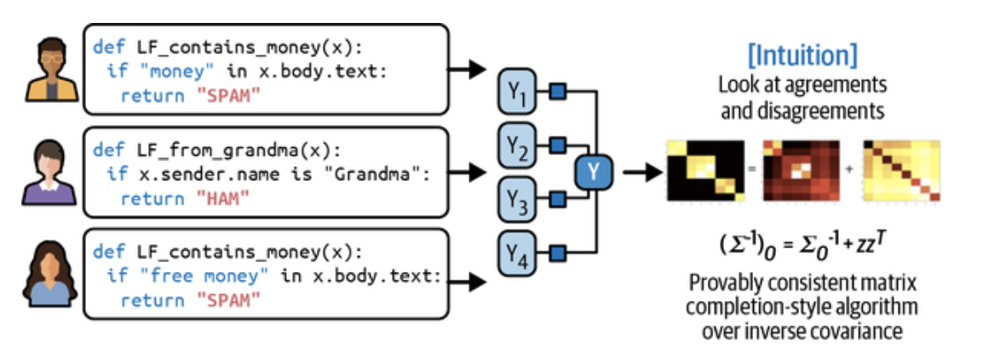

# Designing Machine Learning Systems: Labeling (Hand Labels, Natural Labels, & Addressing the Lack of Labels - Active Learning, etc.) 


<br>

## Labelling

Labeling plays a pivotal role in supervised machine learning systems. Although there is much excitement around unsupervised and self-supervised methods, <u><i>the reality in production ML today still heavily leans on supervised models, which require quality labeled data</i></u>. A model's accuracy and generalization are often bottlenecked not by architecture or hyperparameters but by how well the training data is labeled.


### The Evolution of Labeling

Labeling has evolved from a secondary task to a core component of ML workflows. As Andrej Karpathy humorously put it when asked how long Tesla would need a labeling team: ***"How long do we need an engineering team for?"*** This statement reflects the shift in mindset that data labeling is as vital as model development.

<br>

#### Hand Labeling: The Gold Standard with Practical Challenges

Hand labeling, though common, presents several practical difficulties:

- **Costly**: Hiring experts like radiologists for specialized domains is expensive.
- **Privacy Concerns**: Sensitive data, such as medical records, can't be easily outsourced.
- **Slow Iteration**: Transcribing an hour of phonetic speech can take 400 hours.

These limitations <u>hamper the speed of model iteration.</u> 

<I>Consider a sentiment analysis system that initially distinguishes only between POSITIVE and NEGATIVE sentiment. Suppose the product team later requires the model to recognize ANGRY sentiment as a new class. **In that case, existing data may need to be relabeled or new examples collected, significantly slowing adaptation**. </i>

<br>

#### Label Multiplicity and Annotator Disagreement

With multiple annotators, inconsistencies arise due to <u>varying expertise</u> and <u>interpretations</u>. For example, three annotators might mark different spans as entities in an entity recognition task. To address this, it's critical to:

- Define a **clear annotation policy**.
- Train annotators with **consistent guidelines**.

Unresolved disagreement raises the question: <u><i>if experts can't agree, what does "<b>ground truth</b>" really mean?</i></u>

<br>

#### Data Lineage: Tracing Label Quality

<u><i>Mixing labeled data from various sources can degrade model performance.</i></u> Tracking **data lineage**—where each label came from, how it was generated, and by whom—is essential for debugging. For instance, *if newly added labels reduce model accuracy, data lineage helps isolate and correct the issue.*

<br>

#### Natural Labels: Leveraging Built-In Feedback

Some tasks provide labels naturally as part of system feedback. These include:

- **ETA estimation in navigation**: The actual duration is recorded automatically. For example, when calculating the estimated arrival time for a specific route on Google Maps, if you take that route, by the end of your trip, Google Maps knows how long the trip took and can then evaluate the accuracy of the predicted arrival time.
- **Stock prediction**: Ground truth is revealed by comparing with actual future prices. 
- **Recommendation systems**: User clicks and skips serve as implicit feedback. A recommendation that receives a click can be presumed to be good; otherwise, if it doesn't get clicked on after some time, say 10 minutes, it can be assumed to be bad. (*Implicit label*, derived from **the absence of a positive label**. This differs from *explicit labels,* where users **provide direct feedback by giving low ratings or downvoting it.**)

These naturally occurring labels are called <u><b>behavioral labels</b> and are increasingly common in industrial applications.</u> Even without natural labels, you can configure your system **to collect feedback**. For instance, in a machine translation system like Google Translate, the community <u>can submit alternative translations for poor outputs; these can inform the next model iteration.</u>

<br>

#### Feedback Loop Length

> For tasks with natural ground truth labels, **the length of the feedback loop** is defined **as the time from when a prediction is served** until feedback is provided. 

The **feedback loop length** matters here:

- **Short loops** (clicks on ads) enable rapid iteration.
- **Long loops** (fraud detection) delay response, potentially increasing risk.

Understanding feedback types and their reliability is crucial in system design.

User feedback varies in type and **timing** throughout a user’s journey in an app, **influencing the amount and quality of insights gathered.** F*or example, in an e-commerce app like Amazon, users can give feedback by clicking on product recommendations, adding items to their cart, making purchases, rating products, leaving reviews, and returning items.* <u>While clicks provide frequent feedback, purchases reflect a stronger preference for a product, prompting companies to balance strategies between gathering input and focusing on revenue metrics.</u> Therefore, **discussions** among **stakeholders** are **crucial** to determine **the most effective feedback approach for their specific needs.**

<br>

### Handling the Lack of Labels

Due to the difficulty of acquiring labeled data, several alternative strategies exist:

#### 1. Weak Supervision

Use **heuristics** or **labeling functions (LFs**) to label data programmatically. Examples:

- Keyword matches

  ```python
  def labeling_function(note):
     if "pneumonia" in note:
       return "EMERGENT"
  ```

  

- Regular expressions

  - Such as if the note matches or fails to match a specific regular expression

- Database lookup

  - If the note contains a disease listed in the dangerous disease list

- Outputs from existing models

Because LFs encode heuristics and heuristics are noisy, *the labels produced by LFs are also noisy.* **Multiple** LFs may apply to the same data examples, potentially resulting in **conflicting labels**. One heuristic may be significantly more accurate than another, *which you might not realize due to the absence of ground truth labels for comparison.* It’s **crucial** <u>to combine, denoise, and reweight all LFs</u> to obtain a set of labels that are most likely correct.

<center>
  <br><br>
  <I>Image: Adapted from an image by Ratner et al & the textbook. </I><br><br>
</center>

***A small number of hand labels is recommended*** to understand how accurate your LFs are. These hand labels can help you discover patterns in your data to write better LFs.

Tools like **Snorkel** combine and denoise multiple noisy labels. Programmatic labeling offers:

- **Cost savings**
- **Faster scaling**
- **Greater privacy control**

Case studies show weak supervision can match hand-labeling performance with far fewer resources.

Weak supervision is a simple yet powerful paradigm. However, it is not perfect. In some instances, **the labels produced by weak supervision may be too noisy to be useful**. Nevertheless, even in these situations, weak supervision can serve as an **effective starting point** when you wish to explore the efficacy of ML without committing too much to hand labeling initially.

<br>

#### 2. Semi-Supervised Learning

> Leverages a small labeled dataset to train a model, which is then used to label unlabeled data. 

Techniques include:

- **Self-training**: Train a model on your labeled data to predict unlabeled samples. ***Assuming high raw probability scores indicate correctness,*** <u>add these labeled predictions to your training set and train a new model.</u> Repeat this process until satisfied with model performance.
- **Similarity-based assumptions**: Similar instances share labels. For instance, in a classification task, using Twitter hashtags. Or you can think of using a <u>clustering method or a $k$-nearest neighbors.</u>
- **Perturbation-based methods**: Slight input variations should not change the label. The perturbations can be applied directly to the samples (e.g., **adding white noise to images**) or to their representations (e.g., **adding small random values to word embeddings**).

Semi-supervision can match supervised performance effectively, especially with modern representation learning.

<br>

#### 3. Transfer Learning

Instead of training from scratch, use a **pretrained model** (e.g., BERT, GPT) and fine-tune it on your specific task. First, the <u>base model trains on a base task, typically one with cheap, abundant training data</u>. Language modeling is ideal as it doesn’t need labeled data. The trained model can **then** be <u>applied to a downstream task like sentiment analysis, intent detection, or question answering.</u>

- Reduces the amount of labeled data required
- Accelerates development

Transfer learning has democratized ML, making it accessible to teams without vast labeling budgets.

<br>

#### 4. Active Learning

Active learning is a method for improving the efficiency of data labels. It allows the model to **choose the most informative samples** to label, reducing the label volume needed:

- **Uncertainty sampling**: Choose the samples the model is least confident about. Instead of randomly labeling data samples, you <u>label the most helpful samples for your models according to some metrics or heuristics.</u> This efficient approach in dynamic or streaming environments enables continual model improvement.
- **Query-by-committee**: Use ensemble disagreement to pick ambiguous samples. A committee of candidate models, typically the same model trained with different hyperparameters or data slices, <u>votes on which samples to label next based on prediction uncertainty. Label the samples with the greatest disagreement among the committee.</u>

**Active learning in this data regime will allow your model to learn more effectively in real time and adapt faster to changing environments.**


<br><Br>

