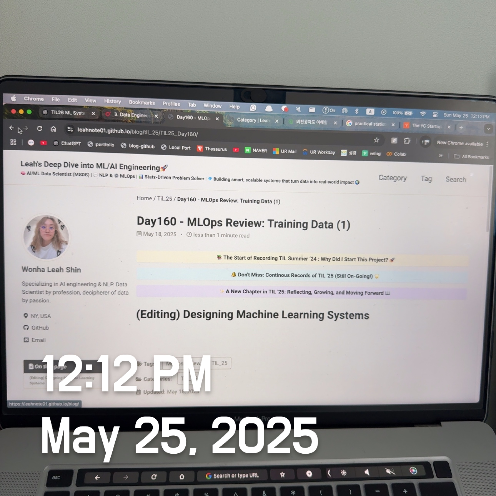

# Designing Machine Learning Systems: Class Imbalance (How to Deal with the problems: Evaluation Metrics, Over & Undersampling, Resampling and Alogrithm-level Methods)

 

## Class Imbalance

> Class imbalance is a common issue in machine learning, particularly in real-world classification and regression tasks. <u>It occurs when one class or a range of values in your target variable greatly outnumbers others, causing biased model results.</u> 

For example, in medical imaging, if 99.99% of X-ray images show healthy lungs and only 0.01% show cancer, a simple classifier might get 99.99% accuracy by always predicting "healthy," **but it would completely miss actual cancer cases.**

Class imbalance can occur in regression tasks with continuous labels, such as estimating healthcare costs. These bills are highly skewed—the median is low, but the 95th percentile is very high. When predicting hospital bills, it may be more critical to predict the 95th percentile rather than the median accurately. 

### The Challenge in Classification and Regression

In classification, class imbalance **makes it difficult for models to learn enough about the minority class.** If only a handful of samples exist for a rare class, *it becomes a few-shot learning scenario.* <u>Worse, if that class is absent from the training data, the model may assume it doesn't exist.</u> In regression, the issue appears as **skewed label distributions**. For instance, most bills may be low in predicting healthcare costs, but a few can be exorbitantly high. *Accurate predictions on outliers (e.g., top 5% most expensive bills) may matter more than on median cases, yet models tend to underperform in these extreme ranges.*

Furthermore, class imbalance can lead to models exploiting trivial heuristics. In our lung cancer example, a model predicting "no cancer" for every input would achieve high accuracy but offer no practical utility in the real world. It becomes increasingly challenging for optimization algorithms, such as gradient descent, to escape suboptimal yet high-performing plateaus. **Additionally, the cost of misclassification is often asymmetric. Misclassifying a cancerous lung as healthy is far more severe than the reverse, and loss functions must reflect this reality.**

 

#### Real World Example and Causes

Many impactful applications exhibit class imbalance:

- **Fraud detection**: Fraudulent transactions make up a small fraction of the total.
- **Churn prediction**: Most customers typically do not churn.
- **Medical diagnosis**: Serious conditions are rare but crucial to detect.
- **Resume screening**: A tiny percentage of resumes are eventually shortlisted.

Sometimes, class imbalance stems from **sampling bias** or **labeling errors**. For instance, spam detection models trained *solely on filtered company email data may not accurately represent the actual spam frequency*, as most spam never enters the dataset. Similarly, mislabeled data due to human error (e.g., missing class categories) can create artificial imbalance.

 

#### Solutions: Metrics, Data-Level, and Algorithm-Level Approaches

To handle class imbalance effectively, we focus on three strategies:

**1. Use Appropriate Evaluation Metrics**

Accuracy can be misleading in imbalanced tasks. Two models with the same accuracy may perform very differently on the minority class. Better metrics include:

- **Precision**: How many <u>predicted positives</u> are true positives?
  - Measures the proportion of **predicted positives that are actually positive.** *High precision means fewer false alarms.*

- **Recall**: How many <u>actual positives</u> are detected?
  - Measures the proportion of actual positives that are <u>correctly identified.</u> *In safety-critical domains, such as cancer diagnosis or fraud detection, recall is crucial.*

- **F1 Score**: Harmonic <u>mean of precision and recall</u>.
  - Harmonic mean of precision and recall. *Useful when there's a trade-off between missing rare positives and raising too many false alarms.*

- **ROC Curve and AUC (Area Under Curve)**: Plots <u>true positive rate (recall) against false positive rate.</u>
  - While popular, ROC can be misleading in highly imbalanced datasets *because even a large number of false positives may appear negligible.* 

- **Precision-Recall Curve**: This is especially useful <u>for imbalanced datasets.</u>
  - A better alternative for imbalanced tasks. It focuses solely on the positive class and reveals trade-offs more transparently.

- **Per-Class Metrics**: Always inspect *per-class accuracy or F1 score* to catch cases where the model performs well only <u>on the majority class.</u>

For example, in a three-class setting (POSITIVE, NEUTRAL, NEGATIVE), you might find that your model achieves **85% accuracy on NEUTRAL** (which accounts for **70%** of the data), but only 25% recall on POSITIVE — a significant issue if the goal is to detect user dissatisfaction. 

 

**2. Data-Level Methods**

Instead of changing your model, you can balance the training signal itself by manipulating the data. These modify the dataset to reduce imbalance before training:

**a. Random Undersampling**

Randomly <u>drop instances from the majority class to balance class sizes</u>. This is simple and fast, but risky: you may lose valuable diversity from the majority class.

**b. Random Oversampling**

<u>Duplicate minority class instances.</u> It preserves information but increases the risk of overfitting, particularly when the same few examples are repeatedly used.

**c. SMOTE (Synthetic Minority Oversampling Technique)**

Instead of copying, SMOTE <u>creates synthetic examples</u> by interpolating between existing examples of the minority class. This works well in <u>low-dimensional, structured data</u> but may introduce noise in high-dimensional or image/text data. 

**d. Tomek Links (for undersampling)**

Pairs of samples from opposite classes <u>that are close together can be considered ambiguous</u>. Removing the majority class sample in such pairs helps sharpen decision boundaries. 

**e. Two-phase Learning**

Train the initial model on a balanced dataset (using undersampling), then <u>fine-tune it on the original, imbalanced data to restore generality.</u> This is especially useful when you want to boost the learning signal early without permanently distorting the actual data distribution. 

**f. Dynamic Sampling**

Continuously adjust sampling probabilities during training. Undersample the majority class *only when it's already performing well,* and oversample struggling minority classes. This gives the model more "focus" where it's weak and less redundancy where it's strong. 

Remember, **never evaluate on resampled data.** <b><u>Always test on the original distribution to avoid misleading metrics.</u></b>

 

**3. Algorithm-Level Methods**

Sometimes, it's better to leave the data untouched and make <u>the model itself more aware of the imbalance.</u> These adjust the learning process to account for imbalance without altering data:

**a. Cost-sensitive Learning**

Instead of treating all errors equally, assign higher penalties to certain types of errors in your loss function. <u>Uses a cost matrix</u> to assign <u>different penalties for different kinds of misclassifications.</u>

- `C(i,j)` is the cost of predicting class j when the true class is i.
- Higher penalties for confusing rare or high-stakes classes. 

*Example*: In cancer detection,

- Cost(false negative) = 10x Cost(false positive)
  - This encourages **the model to optimize for the critical classes**, *not just overall accuracy.*

**b. Class-balanced Loss**

Weighs classes inversely to their frequency. **More sophisticated versions** also consider the adequate sample size. A simple weight   `w_c = 1 / n_c`, where `n_c` is the number of samples in class `c`.

An improved version utilizes the effective number of samples, which accounts for diminishing returns in overrepresented classes, `w_c = (1 - β) / (1 - β^n_c)`, where `β` is a tunable hyperparameter (e.g., 0.999).

**c. Focal Loss**: 

Downweights well-classified examples, focusing more on hard-to-classify ones. This helps the model **concentrate on the minority class**, especially during early training when majority examples dominate the loss landscape.

All these methods aim to shift the emphasis of learning toward rare but essential cases. For example, cost-sensitive loss might make false negatives in a cancer detection system more penalizing than false positives, aligning better with real-world consequences.

