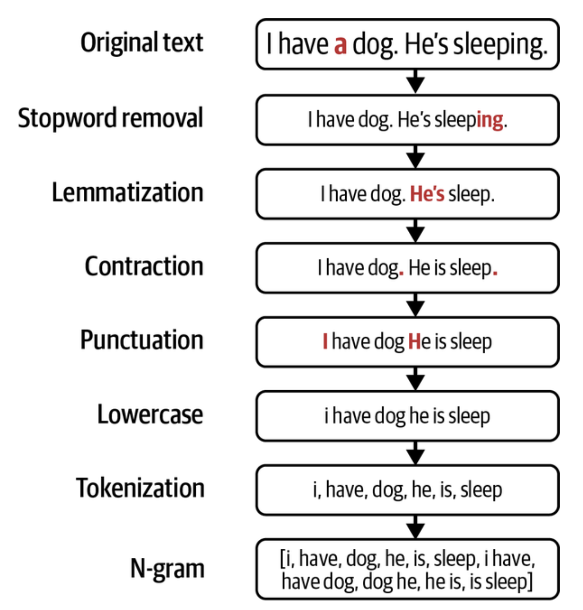
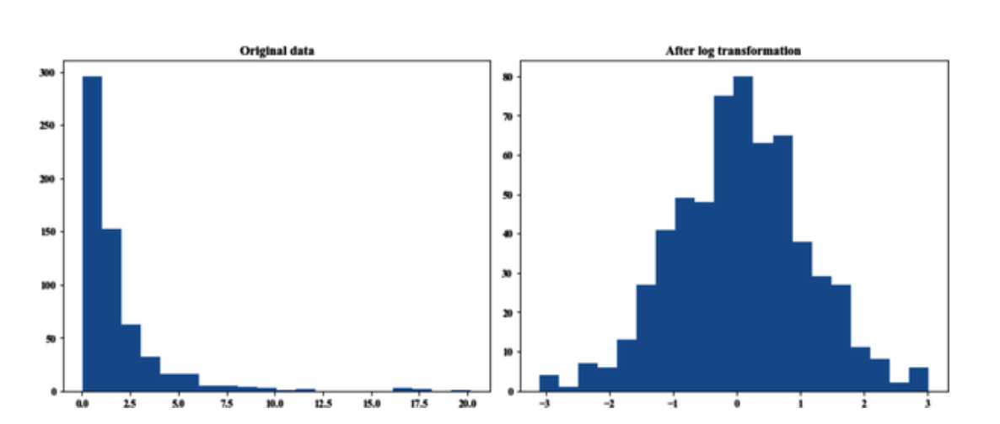

# Designing Machine Learning Systems: Feature Engineering Techniques (1) (Handling Missing Values, Scaling, Normalization, Binning, Encoding Categorical Values, and Crossing Features)

 

 

## Feature Engineering

In machine learning, the quality of features often matters more than the complexity of algorithms. As famously emphasized in Facebook's 2014 paper, "*Practical Lessons from Predicting Clicks on Ads*," the most significant performance came **from crafting better features** -- ***not tuning hyperparameters or switching to fancier models.*** Whether you're working with logistic regression or deep neural networks, **features act as the raw materials that determine what your models can learn.**

 

### Handcrafted vs. Learned Features: Do We Still Need to Engineer?

One common question, especially among deep learning practitioners, is: "***Why do we need to engineer features when deep models can learn them automatically**?*" Indeed, deep learning has significantly reduced the need for handcrafted features in areas such as computer vision and NLP. For example, convolutional layers in CNNs can learn visual hierarchies from pixels, and transformer models, such as BERT, can capture complex language dependencies without requiring feature extraction. 

However, **deep learning doesn't cover all use cases**, and even when it does, not all relevant information comes in raw image or text format. Real-world machine learning systems are powered by structured, tabular, and semi-structured data, <u><i>where user behavior logs, metadata, transaction details, and external features, such as time or location, still play crucial roles.</i></u> Feature engineering remains indispensable in such cases.

 

#### Classical Feature Engineering in NLP

Before the age of BERT, feature engineering in NLP relied on careful preprocessing. Consider spam detection on text comments. Traditional pipelines included:

    

- **Tokenization and lemmatization** (to reducee words to base forms)
- **Stopword removal** (to eliminate uninformative terms)
- **N-gram generation** (to capture local word sequences)
- **TF-IDF vectorization** (to weight rare but essential words)

For instance, the phrase "I like food" could be transformed into 1-grams, such as ["I", "like", "food"], and 2-grams, like ["I like", "like food"]. These would then be converted into **sparse vectors**, allowing classical ML algorithms such as Naive Bayes or SVMs to learn from textual data. The example 1-gram and 2-gram vocabulary follows below.

| I    | like | good | food | I like | good food | like food |
| ---- | ---- | ---- | ---- | ------ | --------- | --------- |
| 0    | 1    | 2    | 3    | 4      | 5         | 6         |

 

Each element represents **the number of times the n-gram at that position appears** in the post. “I like food” will be encoded as the vector [1, 1, 0, 1, 1, 0, 1]. This vector can then be used as input for an ML model.

Even now, in many practical applications, this approach provides a simple yet effective solution, especially when training deep models is computationally expensive or unnecessary.

 

#### Enriching Models with Tabular Metadata

In spam detection, <u>the text alone may not be enough.</u> Additional contextual features such as:

- **Number of upvotes/downvotes** on the comment,
- **Account age** and **activity level** of the user,
- **Popularity** or **controversy** level of the thread,

can all enhance predictive power. These auxiliary features provide valuable signals and often help generalize across content types, user behaviors, or platform dynamics.

For **complex tasks** like recommending **TikTok** videos, features can reach millions. For domain-specific tasks like fraud detection, expertise in banking is needed to develop useful features.

| Comment ID | Time                 | User      | Text                       | # up | # down | Link | # img | Thread Id | Reply to | # replies | ...  |
| ---------- | -------------------- | --------- | -------------------------- | ---- | ------ | ---- | ----- | --------- | -------- | --------- | ---- |
| 8293898    | 2020-10-20 10:45 UTC | username1 | Your mom is a lovely lady. | 1    | 0      | 0    | 0     | 23454     | kjdlkfj  | 1         | ...  |
| 23987498   | 2020-10-20 10:48 UTC | example1  | That is hilarious!         | 120  | 50     | 1    | 0     | 32        | 2405     | 1         | ...  |

 

### Essential Feature Engineering Techniques

Let's now review some of the most important and widely used feature engineering operations that every ML practitioner should be familiar with.

**1. Handling Missing Values**

Real-world datasets are rarely complete. **But not all missing data is created equal:**

- **MCAR (Missing Completely At Random)**: No pattern behind missingness. Rare in practice. 
- **MAR (Missing At Random)**: Missingness depends on another variable. For example, <u>people of a specific gender may be hesitant to reveal their age.</u>
- **MNAR (Missing Not At Random)**: Missing because of the value itself (e.g., higher income users may skip income fields).

**How to handle it**:

- **Deletion:** Works if missing values are few and the data are MCAR. *However, it is risky, as you may discard functional samples or introduce bias.* 
- **Imputation:** Fill missing values with:
  - Constants (e.g., "0" or "unknown")
  - Statistical Estimates (mean, median, mode),
  - Conditional Values (e.g., fill July temperatures based on monthly medians).

You must take care not to introduce **data leakage**, espeicially when using statistics derived **from the full dataset** *rather than the training set.*

 

**2. Scaling and Normalization**

Machine learning models treat all numbers equally. Without scaling, <u>features with large numeric ranges (like income) can dominate features such as age or score.</u> The standard method is as follows.

- **Min-Max Scaling**: Brings values to the range of [0, 1].

  

    $\hat{x} = \frac{x - \min(x)}{\max(x) - \min(x)}$ 
  

  You can validate that if $x$ is the maximum value, the scaled value $x^{'}$ will be 1. If $x$ is the minimum value, the scaled value $x^{'}$ will be 0.

- **Standardization**: Ensures features have a mean of zero and a variance of one.

  

    $x'= \frac{x-\bar{x}}{\sigma}$ 
  

  with $\bar{x}$ being the mean of variable $x$, and $\sigma$ being its standard deviation.

- **Log Transformation**: used to reduce skewness in highly skewed features such as income. 

  

      
  

  

Feature scaling is crucial for algorithms such as logistic regression and KNN, and it also helps tree-based models in many cases.

 

**3. Discretization (Binning)**

Sometimes, continuous variables are too granular for practical modeling. <u>Grouping them into categories makes sense:</u>

- **Income levels**: low (<35k), medium (35k–100k), high (>100k).
- **Age groups**: teen, young adult, adult, senior.

Discretization can help in models with limited data or when the variable’s actual numeric value is less informative than its group membership.

 

**4. Encoding Categorical Variables**

Categorical variables like <u>gender, job title, or product brand</u> must be encoded into numbers. Standard methods include:

- **Label Encoding**: Assigns integers to categories. Simple but imposes ordinality.
- **One-hot Encoding:** Creates binary columns for each category. Works well for low-cardinality features.
- **Hashing Trick**: Hashes categories into fixed-length vectors. useful for high-cardinality features such as *IPs, Product IDs, or user accounts.* Reduces model crash risk from unseen categories.

To manage **drift in categories** (e.g., new brands in e-commerce), hashing or unknown category handling is essential.

 

**5. Feature Crossing (Interaction Features)**

Feature crossing involves combining features to capture their joint effect. For example,

- `marital_status` = "Married" & `num_children` = 2 
- → Crossed feature: "married_with_2_kids"

This helps models learn nonlinear relationships. It's particularly effective in **logstic regression, gradient-boosted trees,** and models like **DeepFM**, which explicitly learn feature interactions.

However, excessive crossing can lead to **combinatorial explosion** i<u>n feature space and risk overfitting, especially for sparse data.</u>

  
