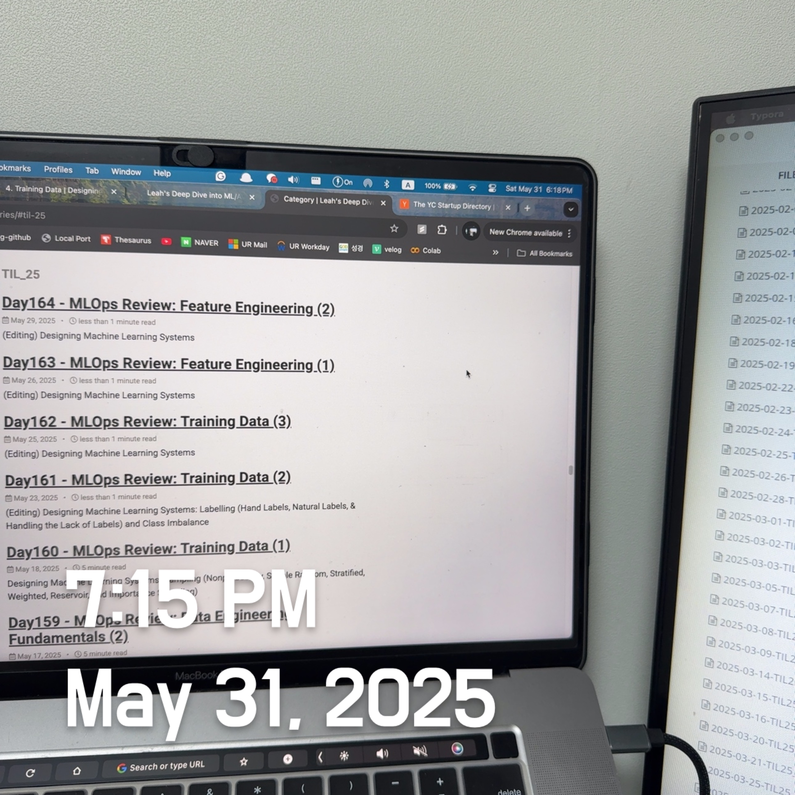

# Designing Machine Learning Systems: Feature Engineering Techniques (2) (Positional Embeddings) & Engineering Good Features

 

Continuing from the previous post... (Feature Engineering Techniques)

**6. Positional Embeddings: Discrete vs Continuous**

In tasks where the order of input elements matters — such as language modeling or sequence-based vision tasks — models need to know where each token or pixel appears. Unlike RNNs, which process sequences one step at a time and thus naturally preserve order, Transformers process all tokens simultaneously. This parallel processing makes explicit positional embeddings necessary.

There are two main approaches to embedding position information: **discrete learned embeddings** and **continuous fixed embeddings**.

 

**6.1 Discrete (Learned) Positional Embeddings**

This approach treats position indices as if they were words in a vocabulary. Each position (e.g., position 0 to position 511) gets a learned embedding vector of the same dimensionality as the token embedding. These embeddings are trained in conjunction with the rest of the model.

For example, in BERT:

- The word “food” at position 0 is encoded as
   `Embedding("food") + Embedding(position=0)`

This enables the model to distinguish between the same word appearing in different contexts, which is crucial in tasks such as sentiment analysis, translation, or summarization.

> Learned embeddings are flexible but limited to a fixed maximum sequence length, and they don’t generalize to longer sequences unless interpolated.

 

**6.2 Continuous (Fixed) Positional Embeddings – Sinusoidal / Fourier Features**

Introduced in the original Transformer paper (“Attention Is All You Need”), these embeddings are deterministic and not learned. Instead, positions are encoded using sinusoidal functions:

  $\text{PE}_{(pos, 2i)} = \sin\left(\frac{pos}{10000^{2i/d}}\right), \quad \text{PE}_{(pos, 2i+1)} = \cos\left(\frac{pos}{10000^{2i/d}}\right)$ 

- This encoding enables the model to generalize to more extended sequences.
- The sinusoidal pattern ensures each position is uniquely encoded and preserves relative distance information.
- It is also computationally more efficient and doesn’t require additional parameters.

These sinusoidal embeddings are a special case of **Fourier features**, which are commonly used for continuous domains such as images, 3D geometry, or time series. For instance, in 3D rendering, coordinates on the surface of an object (like a teapot) are continuous, and fixed embeddings can still represent their positions using such functions.

 

### Engineering Good Features: A Balancing Act

> In machine learning, more data and more features can often lead to better models, ***but not always***. Feature engineering is not just about creating more variables; it's about designing the ***right*** ones. As you scale your ML systems, the feature set tends to grow. However, adding too many features can backfire.

#### Why Too Many Features Can Be Harmful

1. **Increased Risk of Data Leakage**
    Every added feature is a potential channel for leakage — where information about the label unintentionally slips into your model through the features.
2. **Overfitting**
    More features, especially those with little signal, can lead to overfitting, where your model memorizes the training data instead of learning general patterns.
3. **Higher Memory and Cost**
    Serving models with excessive features might require more expensive hardware, especially for online predictions that demand real-time performance.
4. **Increased Latency and Technical Debt**
    Online systems may need to extract and compute features in real-time. Irrelevant or legacy features slow down predictions and become a maintenance burden when upstream data changes.

 

#### How to Know If a Feature is Worth Keeping

Two key principles guide effective feature selection:

##### 1. **Feature Importance: Does This Help the Model?**

To measure how much a feature contributes to the model’s predictive power:

- **Built-in Methods**: Tree-based models, such as XGBoost and LightGBM, provide native feature importance scores.
- **SHAP (SHapley Additive exPlanations)**: A model-agnostic approach that <u>quantifies each feature’s contribution, both globally and at the level of individual predictions.</u>

Example:

- SHAP might show that a low value for the `LSTAT` (lower status of the population) feature <u>has the most positive impact on a housing price prediction.</u>
- At Facebook, it was found that the **top 10 features** accounted for half of the model’s performance, while the **bottom 300 contributed <1%** — <u>a clear indication that many features could be pruned.</u>

Beyond model accuracy, feature importance is also critical for **interpretability**, which helps you (and others) trust and debug your model.

##### 2. **Feature Generalization: Will This Work on New Data?**

Even if a feature helps during training, it may not generalize well to new data (test or production). Generalization requires you to assess:

- **Coverage**: What fraction of examples contain this feature?
  - Suppose <u>a feature is present in only 1% of the data</u>. In that case, it’s unlikely to generalize — *unless* its presence is ***strongly correlated with the target*** (e.g., nearly all such cases have the same label).
- **Distribution Shift**: Are the feature values similar across the train and test sets?
  - If `DAY_OF_WEEK` in your train data includes only Monday–Saturday, and the test data is Sunday, <u>the model may struggle.</u>
  - A better feature might be `IS_WEEKEND`, which generalizes more cleanly.

##### Trade-Off: Specificity vs. Generalization

Suppose you create a binary feature `IS_RUSH_HOUR` instead of using the precise hour of the day. This new feature might generalize better, but it loses specificity. <u>While this abstraction can reduce variance, it might discard useful nuances, e.g., traffic at 5 PM ≠ and traffic at 8 AM, though both are rush hour.</u>

 

### Tips for Managing Features in Production

- **Remove sour or stale features** even if they technically <u>“don’t hurt” thanks to regularization — they can slow down training, increase serving latency, and complicate your pipeline.</u>
- **Save dropped features or definitions** <u>to revisit later</u>. Feature reuse across projects or teams becomes easier when you maintain a shared feature definition registry (or feature store).
- **Audit for data leakage risks** whenever features are added.
- **Monitor for coverage and distribution drift** over time — a feature that was useful at deployment may become irrelevant months later due to shifts in user behavior or system changes.
