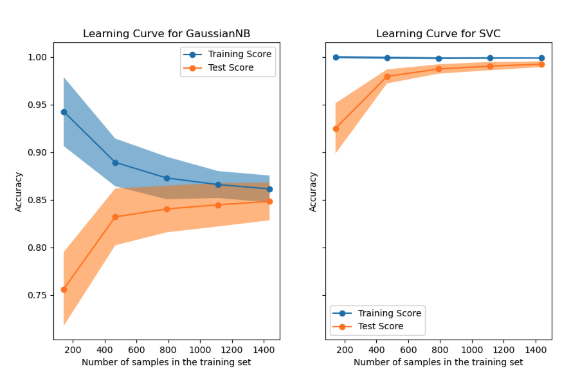
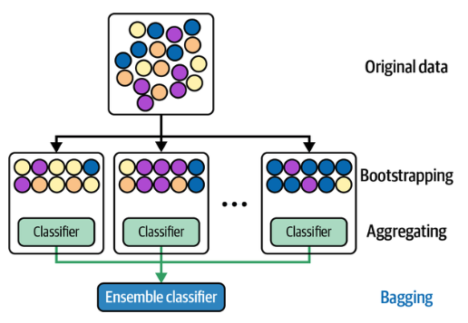
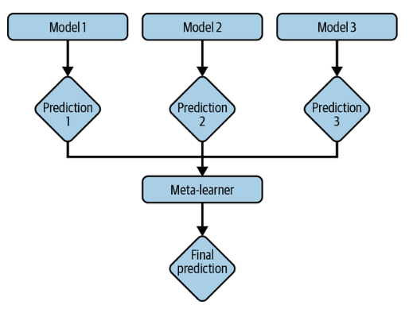

# Designing Machine Learning Systems: Model Selection, Evaluating ML Models, & Ensemble Method (Bagging, Boosting, and Stacking)

 

 

## Model Development and Training

After developing a comprehensive feature set, the next step is to choose and train a model. This step is often one of the most exciting for practitioners because it allows experimentation <u><i>with a variety of ML algorithms</i></u>—from logistic regression and gradient-boosted trees to deep neural networks and transformer-based architectures.

However, model development <u><I>isn't just about selecting the algorithm with the best accuracy</i></u>. It’s a multidimensional challenge that involves <u>compromises among interpretability, training duration, inference speed, scalability, and robustness to data shifts.</u>

 

### Evaluating ML Models

#### Choosing the Right Model: 6 Tips for Model Selection

Several key strategies should guide the selection of a model:

1. **Start with Simple Models**: Begin with something like logistic regression or a decision tree to establish a baseline. <u>Simple models are easier to debug and deploy, and they help verify that your training pipeline is sound.</u>   

2. **Avoid Chasing SOTA (State-of-the-Art)**: While it's tempting to jump into the latest deep learning models, remember that <u>SOTA models are often evaluated on academic benchmarks</u>, *not your real-world data or constraints*. The simplest model that solves your problem is usually the best one.

   - Pretrained BERT models are complex but easy to use, especially with ready-made tools like Hugging Face’s Transformer. Utilizing this community-supported solution can help you troubleshoot effectively. However, **testing simpler options can still confirm whether BERT is the best choice. While quick to start, improving pretrained BERT can be challenging.**  

3. **Understand Your Use Case and Assumptions**: Each model comes with assumptions—*linear models assume linear decision boundaries, naive Bayes assumes feature independence, and neural networks assume that data samples are independent and identically distributed (i.i.d.)*. Understanding whether your data fits these assumptions is crucial.

   - **Prediction assumption**: Every model that aims to predict an output $Y$ from an input $X$ assumes that it is possible to predict $Y$ based on $X$.
   - **IID (Independent and Identically Distributed)**: Neural networks assume that the examples are independent and identically distributed, <u>meaning all examples are drawn independently from the same joint distribution.</u>
   - **Smoothness**: Every supervised machine learning method assumes that there is a set of functions that can transform inputs into outputs so that similar inputs result in similar outputs. If an input $X$ produces an output $Y$, then an input close to $X$ would produce an output proportionally close to $Y$.
   - **Tractability**: Let $X$ be the input and $Z$ be the latent representation of $X$. Every generative model assumes it is tractable to compute $P(Z \vert X)$
   - **Boundaries**: A linear classifier assumes that <u>decision boundaries are linear.</u>
   - **Conditional independence**: A naive Bayes classifier <u>assumes that the attribute values are independent of each other given the class.</u>
   - **Normally distributed**: Many statistical methods assume that data is normally distributed.  

4. **Account for Trade-offs**: Consider <u>performance</u> versus <u>latency</u>, <u>accuracy</u> versus <u>interpretability</u>, or <u>current</u> versus <u>future</u> data availability. A neural network might offer better accuracy, but a gradient-boosted tree could be faster and more explainable.

   - A classic trade-off is <u>between false positives and false negatives:</u> reducing one can increase the other. In tasks <u>where false positives are more hazardous,</u> such as fingerprint unlocking, a model with <u>fewer false positives is preferred</u>. Conversely, when <u>false negatives are riskier</u>, such as COVID-19 screening, minimizing false negatives is essential.  

5. **Use Learning Curves**: These help visualize <u>how model performance changes as the size of the training data increases.</u> If your model is underfitting, you might not benefit from more data. If it's overfitting, a more regularized or simpler model might help.

   

     
       
     <a href="https://scikit-learn.org/stable/auto_examples/model_selection/plot_learning_curve.html" target="_blank"><i>Image Source: Scikit-Learn</i></a>
       
   

   - For example, a team evaluated a simple neural network and a collaborative filtering model for recommendations. **Offline**, the filtering model outperformed, but <u>the neural network could update continuously, unlike the filtering model, which needed all data</u>. The team deployed both: using the filtering model for predictions and training the neural network with new data. **After two weeks, the simple neural network outperformed the complex filtering model.**
   - When evaluating models, consider their potential for improvement <u>in the short term and the ease or difficulty of achieving those improvements.</u>   

6. **Mitigate Human Bias**: <u>Don’t just tune the model you like more</u>. Compare all models *under the same conditions*—same number of hyperparameter trials, same training/validation splits, and similar levels of effort.

 

### Ensemble Learning: Bagging, Boosting, and Stacking

#### Why Ensembles Matter:

An ensemble combines multiple models—called <u>base learners</u>—to generate more accurate predictions than any single model could. This works exceptionally well <u>when base learners are diverse and uncorrelated.</u> For example, if three spam detectors are each 70% accurate but make independent errors, *combining them via majority voting can achieve nearly 78.4% accuracy.*

Ensembling methods aren't the top choice for production **because they're complex to deploy and harder to manage.** Still, they're widely used for tasks *where even a slight performance improvement can result in substantial financial benefits, like predicting ad click-through rates*.

If all classifiers <u>always make the same prediction</u>, then combining them *will not improve accuracy; the ensemble will perform just as well as each classifier*. To make an ensemble **better**, it's helpful **if the classifiers are different and don't always agree.** That's why people often choose various types of models, like a transformer, a recurrent neural network, and a gradient-boosted tree, to work together.

 

#### Three Major Types of Ensembles:

1. **Bagging (Bootstrap Aggregating):**

   

       <a href="https://en.wikipedia.org/wiki/Bootstrap_aggregating#/media/File:Ensemble_Bagging.svg">Image Source: Adapted from an image by Sirakorn  </a>
   

   

   - Trains **each base learner** on a randomly sampled (with replacement) subset of the data.
     - Sampling with replacement ensures that each bootstrap is created independently from its peers.
     - If the problem is **classification**, the final prediction is <u>decided by the **majority vote** of all models.</u> *For example, if 10 classifiers vote SPAM and six models vote NOT SPAM, the final prediction is SPAM.*
     - If the problem is **regression**, the final prediction is the **average** of all models' predictions.
   - Helps reduce variance and prevent overfitting, **especially useful with high-variance models** *such as neural networks, classification and regression trees, and subset selection in linear regression.*
     - But it can mildly degrade the performance of stable methods such as $k$-nearest neighbors.
   - Example: Random Forests, where each tree is trained on a bootstrap sample and uses a random subset of features.

2. **Boosting:**

   

       <a href="https://en.wikipedia.org/wiki/Bootstrap_aggregating#/media/File:Ensemble_Bagging.svg">Image Source: Adapted from an image by Sirakorn  </a>
   

   - Boosting is a family of iterative ensemble algorithms that **convert weak learners to strong ones**.
   - Models are trained sequentially. Each model learns from the mistakes of the previous one by focusing more on misclassified examples.
   - <u>Produces a strong learner by combining many weak learners.</u>
   - Example:GBM(Gradient Boosting Machine), XGBoost, LightGBM, and AdaBoost.
   - Process
     1. Start by training the *first weak classifier on the original dataset.* 
     2. Reweight the samples based on the accuracy of this classifier, **giving higher weight to misclassified samples.** 
     3. Next, train *the second classifier using this reweighted dataset,* creating an ensemble of the first and second classifiers. Reweight the samples again based on the ensemble's performance.
     4. Train the *third classifier* on the newly reweighted dataset and add it to the ensemble. 
     5. **Repeat** this process for as many iterations as necessary. 
     6. Finally, create a strong classifier by combining the classifiers in the ensemble, with higher weights assigned to those with smaller training errors.

3. **Stacking:**

   - Trains multiple base learners and **uses another model (meta-learner) to combine their outputs.**

   - The meta-learner could be a simple average or a more complex model like logistic regression.

     

         
     

     

#### **Trade-offs in Practice:**

While ensembles improve performance and generalize well, they are harder to deploy and maintain in production due to increased complexity and inference cost. <u>Still, they’re often justified in domains where performance has a high monetary value (e.g., ads, finance).</u>

  
