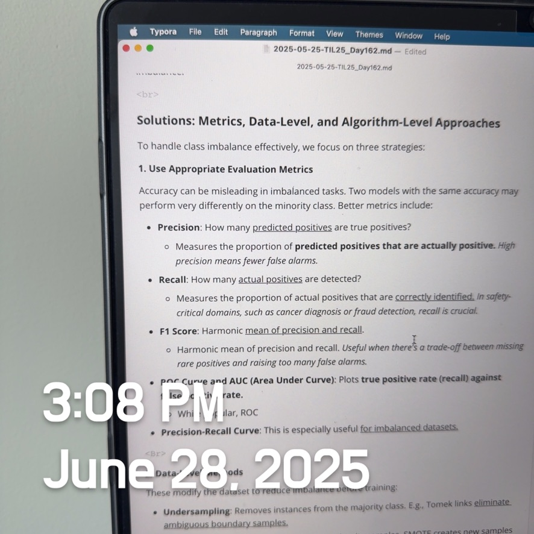
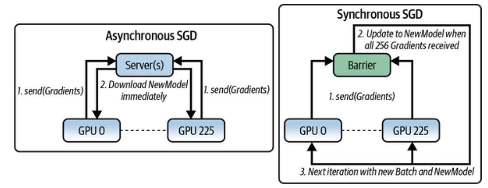
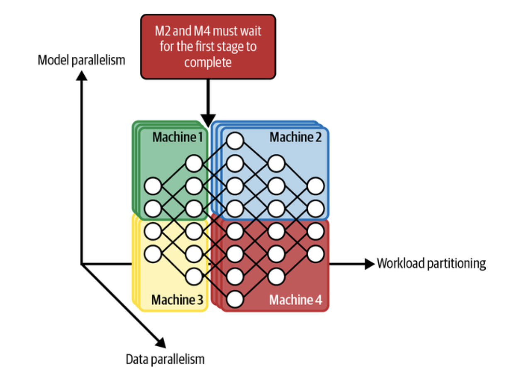

# Designing Machine Learning Systems: Experiment Tracking, Versioning, and Distributed Training (Data Parallel)

 

### Experiment Tracking

> Experiment tracking refers to the **systematic recording of model training information**—such as <u>hyperparameters, training loss, evaluation metrics, system performance, and artifacts</u>—so that experiments are reproducible, debuggable, and comparable.

Some models might appear similar and differ only in one hyperparameter—such as one using a learning rate of 0.003 and another using 0.002—and **yet their performances can be very different.** Therefore, experiment tracking is crucial because it allows you to compare different experiments and choose the most suitable one for your goals. Comparing various experiments also helps you understand how small adjustments impact your model’s performance, providing better insight into how your model works. <u>A straightforward method to monitor your experiments is to automatically copy all necessary code files and log all outputs with timestamps.</u> 

**Why It Matters:**

ML training is often unpredictable. Two models with nearly identical code can behave very differently due to a <u>slight change in learning rate, data shuffle, or even system load.</u> Without structured tracking, you’ll quickly lose track of what worked and why.

**What to Track:**

- **Loss curves:** Plot training and evaluation loss over epochs to monitor convergence or overfitting.
- **Model metrics:** Track key metrics such as accuracy, precision, recall, F1-score, and perplexity.
- **Prediction logs:** Save inputs, predicted outputs, and ground truth—helps with sanity checks and error analysis.
- **Throughput:** Record steps/sec or tokens/sec to measure efficiency.
- **System metrics:** Monitor GPU and CPU utilization, as well as memory usage, to detect bottlenecks.
- **Parameter dynamics:** Log learning rates (especially if they’re scheduled), gradient norms, and weight norms to understand training behavior.

Tools like **MLflow**, **Weights & Biases**, and **TensorBoard** can automate this process, visualize results, and even support collaborative comparison across teams.

 

### Versioning

> Versioning is **the process of tracking changes to code, data, models, and configuration files.** Unlike software engineering, ML systems depend not only on code **but also on datasets and model weights,** <u>which must all be versioned.</u>

**Why It’s Hard:**

- **Data size:** Datasets can range from gigabytes to terabytes, making duplication and tracking expensive.
- **What counts as a change?** Unlike code diffs, <u>a single value change in a binary dataset can’t be easily traced or meaningfully visualized.</u>
- **Merge conflicts:** <u>Merging data versions doesn’t make as much sense as merging code branches.</u>
- **Regulations**, such as the GDPR (<u>General Data Protection Regulation</u>) and similar laws, might require you to delete user data if asked, making it legally impossible to recover previous versions of the data. 

**Best Practices:**

- Utilize tools like <u>DVC (Data Version Control) or LakeFS to manage dataset and model versions.</u>
- Version training configurations and hyperparameters using YAML or JSON.
- Use Git for code and integrate it with your data versioning system.
- Store artifacts (such as model weights or tokenizer vocabularies) along with metadata that links them to the corresponding experiment IDs.

The goal is to **enable reproducibility.** You <u>should be able to reproduce an experiment—data, code, hyperparameters, model weights, and evaluation</u>—all from a single ID or snapshot.

 

#### **Debugging ML Models**

**Why Debugging Is Hard in ML:**

1. **Silent failure:** A model might train, loss might decrease, and no errors will be thrown—<u>yet predictions are wrong.</u>
2. **Long feedback loop:** Fixing a bug might require retraining, which could take hours.
   - Unlike traditional software programs, you may need to **retrain the model** and ***wait for it to converge to determine whether the bug has been fixed.***
   - In some cases, you can't even be sure whether the bugs are fixed until the model is deployed to the users.
3. **Cross-functional complexity:** Bugs can originate from various sources (teams), including <u>data, preprocessing, feature extraction, model architecture, infrastructure, or labeling issues.</u>
   - For example, data is handled by data engineers, labels are provided by subject matter experts, ML algorithms are developed by data scientists, and infrastructure is managed by ML engineers or the ML platform team. <u>Errors can originate from any of these components or their combination, making it difficult to pinpoint the source.</u>

**Common Failure Points Examples:**

- **Model mismatch:** Using a linear model for a non-linear task.
- **Implementation bugs:** Incorrect loss computation and missing gradient detachment during evaluation.
- **Hyperparameters:** Poor learning rate, weight decay, batch size, etc.
- **Data quality issues:** Mislabeled data, outliers, or skewed distributions.
- **Feature leakage or insufficiency:** Including future information or lacking signal.

**Three Proven Strategies:**  [“A Recipe for Training Neural Networks”](https://karpathy.github.io/2019/04/25/recipe/).

- **Start simple and add more components gradually:** Build the simplest possible model first, such as a linear model or a single-layer network.
  - For example, if you want to build a recurrent neural network (RNN), start with just one RNN cell before stacking multiple or adding more regularization. If you want to use a BERT-like model (Devlin et al. 2018), which employs both a masked language model (MLM) and next sentence prediction (NSP) loss, consider using only the MLM loss before adding the NSP loss.
- **Overfit a batch:** Ensure the model can memorize a minimal dataset—if it can’t, there’s likely a bug.
  - After implementing your model, **overfit a small dataset and evaluate it to ensure minimal loss**. *For image recognition, overfit on 10 images, aiming for 100% accuracy. For machine translation, overfit on 100 sentence pairs, aiming for a BLEU score near 100.* 
- **Set seeds:** Fix randomness (e.g., data shuffling, weight init, dropout) to ensure reproducibility across runs.

 

### Distributed Training

> As models become larger and more resource-intensive, companies are increasingly concerned with **training at scale.** Training on large-scale data or models requires **multiple GPUs/TPUs** or even multi-node clusters. Two primary parallelization strategies help achieve this.

#### **Data Parallelism**

**How It Works:**

- **Every machine gets a full copy of the model.**
- The training data is split across machines.
- Each machine computes gradients on its subset.
- <u>Gradients are aggregated (synchronously or asynchronously) to update shared model weights.</u>

**Challenges:**

Challenging problems include <u>accurately and effectively accumulating gradients</u> from different machines. 

    <I><a href="https://www.oreilly.com/content/distributed-tensorflow/">Image Source: O'Reilly Blog</a></I>

- **Stragglers:** If <u>one machine is slow, <I>synchronous training</I> delays all others.</u>
  - Grows with the number of machines, as the more workers there are, the more likely it is that at least one worker will run unusually slowly in a given iteration. 
- **Gradient staleness:** *In asynchronous training*, delayed gradients may update a model <u>based on outdated weights.</u>
  - In theory, asynchronous SGD converges, but it requires more steps than synchronous SGD. However, in practice, with many weights, **gradient updates are sparse, affecting only small parts of the parameters.** This reduces conflicts between updates from different machines, making staleness less of a problem. Consequently, **both methods converge similarly when updates are sparse.**

- **Batch size scaling:** Larger global batch sizes require adjustments to the learning rate. Beyond a point, performance gains diminish.
  - For example, if training an epoch on one machine takes <u>1M steps, using 1,000 machines might reduce it to 1,000 steps.</u>
  - In practice, ***exceeding a specific batch size results in diminishing improvements.***

**Real-World Example:**
 GPT-3 used 3.2M batch size. OpenAI had to apply a scaled learning rate and sophisticated scheduling to maintain stability.

 

#### Model Parallelism

    <I><a href="https://www.oreilly.com/content/distributed-tensorflow/">Image Source: O'Reilly Blog</a></I>

> Model parallelism occurs **when various parts of a model are trained on separate machines.** For example, <u>machine 0 handles the first two layers, machine 1 the next two,</u> or <u>some machines handle the forward pass while others handle the backward pass</u>.

**How It Works:**

- The model is split **across multiple machines.**
- Each machine handles a portion of the model, such as a subset of layers or a shard of a matrix.
- Machines pass intermediate activations between them during forward/backward passes.

**Challenges:**

- **Sequential dependency:** <u>Later layers can’t start until earlier ones finish.</u>
- **Inefficient parallelism:** <u>Can become serialized if not structured well</u>.

 

#### **Pipeline Parallelism (Optimization over Model Parallelism)**

- <u>Breaks each mini-batch into smaller micro-batches</u>. While one micro-batch is being processed on machine A, the next one starts on machine B. This creates a pipeline effect across machines.

- Improves utilization by overlapping computation across layers and machines.

 

#### **Hybrid Approaches**

Most large-scale ML systems use **hybrid training**:

- **Data parallelism** across GPUs or nodes.
- **Model/pipeline parallelism** to split layers and balance compute.

Frameworks such as **PyTorch Distributed, DeepSpeed, and TensorFlow Mesh** offer built-in tools to facilitate efficient implementation.

  
