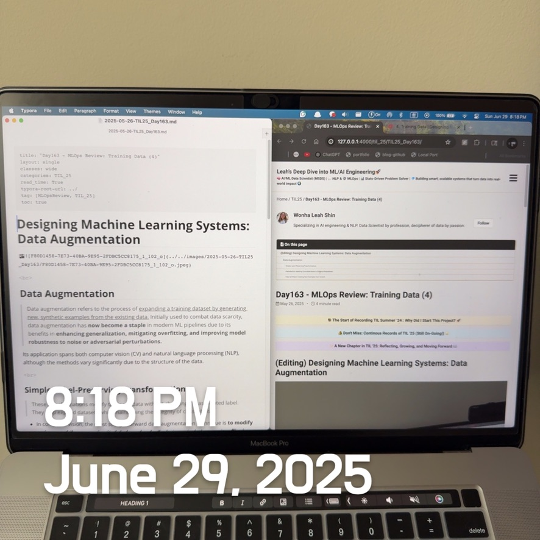

# (Editing) Designing Machine Learning Systems: Auto ML, 	

 

### Auto ML: Automating the ML Lifecycle

> AutoML (Automated Machine Learning) aims **to reduce the human effort needed to design and train machine learning models.** It attempts to <u>automate tasks like model selection, feature engineering, hyperparameter tuning, and even neural architecture design.</u>

#### Soft AutoML: Hyperparameter Tuning

This is the **most common & popular** form of AutoML and involves automatically searching for the best values of hyperparameters, such as:

- Learning rate
- Batch size
- Dropout rate
- Number of layers
- Number of hidden units
- Optimizer types and their internal parameters (e.g., $\beta_1$, $\beta_2$ in Adam)

With different hyperparameters, <u>the same model can exhibit significantly different performance on the same dataset.</u> Melis et al. (2018) demonstrated that *weaker, well-tuned models can outperform stronger, more sophisticated ones.* 

Their popular tuning methods are as follows.s

- **Grid Search**: Tries all combinations in a predefined grid. Exhaustive but expensive.
- **Random Search**: Randomly samples from the space. Often more efficient than grid search.
- **Bayesian Optimization**: Models the performance function and iteratively chooses promising hyperparameters using a probabilistic model.

Always remember that

- Always use a **validation set** for tuning—<u>never the test set, to avoid overfitting.</u>
- <u>Some hyperparameters have greater <b>sensitivity</b> (e.g., learning rate) and should be more finely searched.</u>

 

#### Hard AutoML: Neural Architecture Search (NAS) and Learned Optimizers

Some teams take hyperparameter tuning to the next level: *What if we treat other components of a model, or even the entire model, as hyperparameters?*  

<u>The size of a convolution layer or whether to have a skip layer can be considered a hyperparameter.</u> Instead of manually adding pooling after convolution or ReLU after linear, you provide your algorithm with these building blocks and let it determine **how to combine them**. This research area, known as **neural architecture search (NAS)**, seeks to identify the optimal model architecture.

##### Neural Architecture Search (NAS)

Instead of manually choosing model structures (such as the number of CNN layers or where to place pooling layers), <u>NAS automates the architecture design.</u>

- **Search Space**: Defines possible components (e.g., conv, pooling, activation) and how they can be connected.
- **Search Strategy**: <u>Reinforcement learning, evolutionary algorithms, or random search.</u>
- **Performance Estimation**: Utilizes <u>proxies</u> (e.g., training a smaller model or a few epochs) to estimate performance efficiently.

Google’s **EfficientNet** is a successful NAS result—10× better compute efficiency with top-tier performance.

In typical ML training, you have a model and a learning procedure, an algorithm that finds parameters to minimize an objective function for data. **Gradient descent** is the most common method for neural networks, utilizing an optimizer to update weights based on the gradients. Popular optimizers include Adam, Momentum, and SGD. <u>Although optimizers can be part of NAS to find the best one,</u> **it isn't easy because <u>they are sensitive to hyperparameter settings, which often don’t work well across architectures.</u>**

This leads to an exciting research direction: What if we replace the functions that specify the update rule with a neural network? How much to update the model's weights will be calculated by this neural network. This approach results in learned optimizers, as opposed to hand-designed optimizers. 

##### 🧠 Learned Optimizers

Rather than using hand-designed optimizers like SGD or Adam, learned optimizers are themselves neural networks that learn how to update weights.

- These optimizers are **meta-learned** by being trained across many tasks.
- Once trained, they generalize to unseen datasets and architectures.
- They can also train new, better learned optimizers—resulting in recursive self-improvement.

 

### 📈 Four Phases of ML Model Development

This framework helps guide the adoption of ML depending on maturity, available resources, and problem complexity:

#### Phase 1: Before ML (Baseline Heuristics)

Start with simple rules, especially if this is your first time solving a problem with ML.

- Examples: Recommend most popular items, use median values, or sort posts chronologically.
- Heuristics can surprisingly achieve 50%+ of your desired performance.

**Tip**: Avoid overcomplicating things too early. A good rule-based system may suffice for many practical tasks.

#### Phase 2: Simplest ML Models

Once a baseline is insufficient:

- Start with interpretable models: **logistic regression**, **decision trees**, or **gradient boosting**.
- These give insight into data and feature importance.
- They’re easy to debug and quick to deploy.

**Goal**: Build an end-to-end system with this simple model (including data ingestion, training, evaluation, and deployment).

#### Phase 3: Optimize Simple Models

If you’ve validated that ML works and built a pipeline:

- Apply feature engineering
- Add more data
- Use regularization
- Run a hyperparameter search
- Try ensembling (e.g., averaging predictions of multiple models)

This phase can deliver significant performance improvements with minimal extra complexity.

#### Phase 4: Complex Models

When simple models plateau, move to:

- **Deep learning architectures** (CNNs, RNNs, Transformers)
- **Pretrained models** (e.g., BERT, ResNet)
- **Multi-task learning or multi-modal models**

At this stage:

- Consider cost, latency, and inference environment
- Analyze model drift (decay in performance over time)
- Plan infrastructure for **frequent retraining and monitoring**
