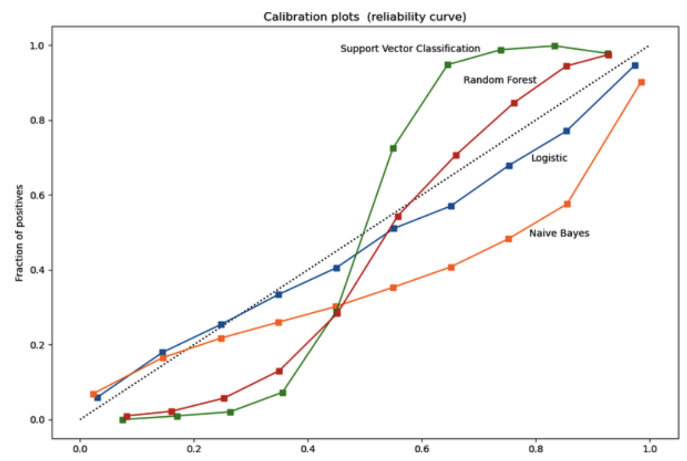

# Designing Machine Learning Systems: Model Offline Evaluation (Methods: Perturbation Tests, Invariance Tests, etc.)

 

### Evaluation Methods

> In academic settings, when evaluating ML models, people tend to fixate on their performance metrics. However, in production, we also want our models to be robust, fair, calibrated, and overall make sense. We’ll introduce some evaluation methods that help with measuring these characteristics of a model.

#### 1. Perturbation Tests (Robustness)

Ideally, your model's inputs <u>should match those in production</u>; however, **this is often not feasible due to the cost or challenges associated with data collection**, resulting in training data that differs from real-world data. *The best training performance doesn't guarantee the best real-world performance.*

- **Goal:** Understand how your model behaves <u>under noisy, real-world conditions.</u>
- **Method:** Add noise or alterations to your test data and evaluate the model.

> Example: For a cough-detection model, **simulate noise from background music or poor mic quality.** If performance drops drastically, your model is brittle.

Used in:

- Audio and speech models
- Image models (e.g., adversarial pixel perturbations)
- NLP (word shuffling, typos, etc.)

 

#### 2. Invariance Tests (Fairness)

When researchers used income and credit scores from rejected applications, **removing race-identifying features**, the applications were accepted. <u><I>Some input changes, such as those related to race, name, or gender, shouldn't affect outcomes in pay</I></u>. If they do, it indicates bias, which risks compromising the model's usability, regardless of its performance.

- **Goal:** Ensure the model's output doesn’t change when it *shouldn’t*.

> If changing the applicant's name or gender changes a resume screening result, the model is biased.

- **Approach:**
  - Hold all features constant except sensitive ones (e.g., race, gender)
  - **Check if outputs change—if yes, that’s a red flag.**

 

#### 3. Directional Expectation Tests (Sanity Checks)

If <I><u>the outputs change in a manner opposite to expectations</u></I>, the model may not be learning correctly, and further investigation is required before deployment.

- **Goal:** Ensure the model behaves as expected with *logical changes* in input.

> If increasing a house’s square footage causes the predicted price to drop, your model might be mislearning.

- Use this to:
  - Catch non-intuitive model logic.
  - Reveal data leakage or label corruption.
  - Validate interpretability.

 

#### 4. Model Calibration (Probability Quality)

Model calibration means:

> *When your model says "this will happen with X% probability", it should actually happen X% of the time in reality.*

So:

- If a model predicts an event with **70% probability**, then **out of 100 such predictions**, the event should happen **around 70 times**.
- A **well-calibrated model** gives trustworthy probability estimates.
- A **poorly calibrated model** might **overestimate** or **underestimate** probabilities, even if it ranks outcomes correctly.

 

##### Example 1: Movie Recommendation

Imagine:

- User A watches **80% romance** and **20% comedy** movies.
- Bad: **Uncalibrated recommender**
  - The recommender model picks <u>only romance movies because they are more likely.</u>
  - But this **doesn't reflect the user's actual preference distribution.**
- Better: **Calibrated recommender**
  - A calibrated system will recommend:
    - ~80% romance
    - ~20% comedy
- Although recommending *only* romance <u>might maximize immediate clicks or engagement,</u> it **underrepresents the user's broader interests,** which may lead to <u>user fatigue, missed opportunities, or a poor long-term user experience.</u> 

 

#### **Example 2: Ad Click Prediction**

Suppose:

- Model says Ad A: 10% click-through rate & Ad B: 8%. This works fine for **ranking ads** (A above B).

But what if you want to:

- *<u>Estimate total clicks?</u>*
- *<u>Allocate ad budgets or charge advertisers based on predicted clicks?</u>*

- Bad: **Uncalibrated model**
  - Predicts a 10% click rate for ad A
  - But the <u>real click rate is 5%</u>
  - → Your **estimates will be too optimistic**, causing *<u>overpayment or bad ROI</u>*

- Better: **Calibrated model**
  - Predicts **5%** for ad A (matches reality)
  - *<u>→ Helps you accurately forecast click volume and make informed business decisions</u>*

 

- <b>Goal:</b> Align predicted probabilities *<u>with real-world outcomes.</u>*

  - **Uncalibrated models can:**
    - Mislead users
    - Harm decision-making (e.g., underestimating rare events)

  - **How to check:**
    - <u>Use reliability diagrams or calibration plots</u> (e.g., from `sklearn.calibration_curve`)
    - <u>Perfectly calibrated models lie on the diagonal line (X = Y)</u>

    <a href="https://scikit-learn.org/stable/modules/calibration.html#calibration"><I>Image Source: Scikit-learn User Guide - Model's Calibration</I></a>  

- **How to fix:**
  - **Platt Scaling**
  - Isotonic Regression
  - `CalibratedClassifierCV` in Scikit-learn

 

#### 5. Confidence Thresholding (Decision Trust)

Not all predictions are equally reliable. <u>Showing all of a model’s predictions, including uncertain ones, can frustrate users and undermine trust.</u> 

> For instance, a smartwatch might falsely indicate that a user is running when they are just walking quickly. More seriously, **a predictive policing algorithm could wrongly identify an innocent person as a potential criminal.**

Key questions:

- **<u>At what confidence threshold do you show or hide predictions?</u>**
- What do you do with low-confidence cases (e.g., flag for human review)?

**Tip:** Confidence scores can be used to **route cases** (e.g., automate high-confidence, escalate low-confidence).

 

#### 6. Slice-Based Evaluation (Fairness + Critical Use Cases)

Slicing means **<u>dividing your data into subsets to assess your model’s performance on each one.</u>** Many companies mistakenly prioritize overall metrics, like F1 scores or accuracy, over these sliced metrics, which can lead to significant issues.

- One issue is that **model performance can vary across data subsets**. For example, in a dataset with a majority subgroup (90% of the data) and a minority subgroup:

  - Model A achieves 98% accuracy on the majority but only 80% on the minority, resulting in an <u>overall accuracy of 96.2%.</u>

  - Model B achieves 95% <u>accuracy on both subgroups, l</u>eading to an overall accuracy of 95%.

    |         | Major Accuracy | Minor Accuracy | Overall Accuracy |
    | ------- | -------------- | -------------- | ---------------- |
    | Model A | 98%            | 80%            | 96.2%            |
    | Model B | 95%            | 95%            | 95%              |

    Then, which one should we choose?

  - If a company only considers ***overall metrics***, they might pick model **A** <u>due to its high accuracy</u>. However, they could later discover *<u>that this model is biased against a minority subgroup from an underrepresented demographic.</u>*

  - Focusing only on overall performance **can be harmful**, as it risks public backlash and overlooks opportunities for improving individual models. 

  - Analyzing slice-based performance can lead to different enhancement strategies for each model.

- Another problem is that **some slices** (e.g., paid users, mobile users) are ***more critical.***

  - When building a churn prediction model, it's crucial <u>to prioritize paid users over non-paying users.</u> Focusing only on overall performance can diminish the model's effectiveness for these important segments.

**Examples:**

| **Slice**               | **Reason for Evaluation**          |
| ----------------------- | ---------------------------------- |
| Mobile vs Desktop users | Different UI/UX behavior           |
| Age groups              | Healthcare predictions             |
| Geography               | Language or culture variance       |
| Income                  | Credit scoring or pricing fairness |

#### Common Problems Slice Analysis Reveals:

- Hidden bias
- Simpson’s paradox (model performs worse on *both* slices but better overall due to distribution skew)

  - A phenomenon occurs when a trend is observed in multiple groups of data **but vanishes or reverses when the data groups are combined.** 
  - Model B may perform better than Model A when considering the entire dataset, but *<u>Model A may outperform Model B when looking at each subgroup individually.</u>*
  - Aggregating data can obscure and contradict the true situations present in the individual groups.
  - This can be true not only for the overall dataset but also for specific segments.

- Usability issues (e.g., bad button layout for mobile users)

  - Slice-based evaluation can give you insights to improve your model’s performance both overall and on critical data and help detect potential biases. It might also help reveal non-ML problems. 
  - Once, the writer's team discovered that their model performed great overall but very poorly on traffic from mobile users. After investigating, they realized that it was because a button was half hidden on small screens (e.g., phone screens).

   

**How to discover slices:**

- **Domain Knowledge**: When analyzing web traffic, it's important to categorize your data by factors *<u>such as mobile versus desktop usage, browser type, and geographic locations.</u>*
- **Error Analysis**: Focus on clustering and identifying misclassified samples to improve accuracy.
- **Tools**: Utilize tools like Slice Finder (Chung et al.) for effective data analysis.

 

### Best Practices for Offline Evaluation

1. **Always define a baseline** before building complex models
2. Use **multiple metrics**: including accuracy, F1 score, precision, recall, AUC, calibration, and confidence.
3. **Stress test models** with perturbation and invariance checks
4. Track **per-slice performance**, not just global metrics
5. Calibrate probabilities and use **confidence-based decision-making**
6. Avoid test data leakage — *never tune hyperparameters on test set*

  
