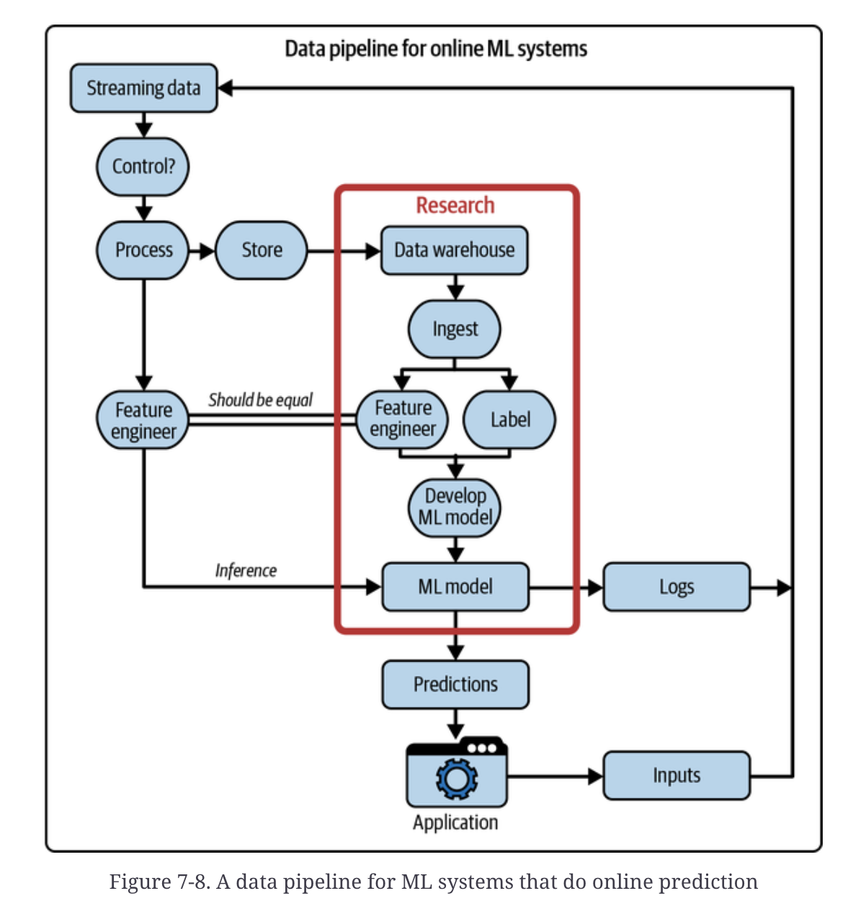

# Designing Machine Learning Systems: Model Deployment (Definition, Common Myths) and Batch Prediction Versus Online Prediction

 

## Model deployment

### What Is Deployment in ML?

So far, we've discussed how to collect and clean data, extract useful features, and train and evaluate ML models. This is the **“model logic”** — the pipeline that takes raw input and produces a trained model. It’s the part that data scientists and ML engineers typically own.

But once the model is trained, the next question is:

> **"How do I make this model usable by real users or systems?"**

That’s what **deployment** is about — <u>moving the model from development to a <b>production environment</b>,</u> where it can respond to real requests from applications or users.

 

#### What Does "Deploying" Really Mean?

- Deployment involves activating your model. '**Running**' indicates that the model is active and working; '**Accessible**' means that other systems can send requests to receive predictions.

A typical production deployment means:

- Wrapping the model's `predict()` function into an **API endpoint** (e.g., with Flask or FastAPI)
- Packaging code + dependencies into a **container** (e.g., Docker)
- Pushing the container to a **cloud service** (e.g., AWS, GCP, Azure)
- Exposing the endpoint so your app/frontend can send requests and get predictions

When moving beyond hobby projects to real-world deployment, several significant challenges arise:

- **Latency constraints:** Responses may be required within milliseconds.
- **Scalability:** Support for thousands or even millions of users is necessary.
- **Monitoring:** Alerts and logs are crucial when the model or infrastructure encounters issues.
- **Reliability:** Maintaining a 99.9% uptime standard is the goal.
- **Model updates:** Fixes, enhancements, or retraining must be implemented seamlessly.

These factors make production ML challenging and require **robust DevOps/MLOps** practices.

 

#### **Exporting Models for Deployment**

Before deployment, you need to **serialize** the trained model into a format that is portable.

##### Two parts of a model:

1. <u><b>Model Definition</b> – The architecture (e.g., number of layers, units)</u>
2. <u><b>Learned Parameters</b> – The weights learned during training</u>

##### Examples:

- **TensorFlow 2**: `model.save()` → `SavedModel` format
- **PyTorch**: `torch.onnx.export()` → `ONNX` format

Exporting ensures <u>the model can be loaded and used in <b>another environment</b> (e.g., a cloud service, mobile app, or API).</u>

 

#### **Why Deployment Often Fails in Teams**

In some orgs:

- **The ML team both builds and deploys** *<u>(a common practice in startups).</u>*
- In others:
  - The ML team builds → The deployment team handles deployment.

However, **splitting these roles** can lead to <u>increased communication overhead, slower feedback loops, and greater difficulty in debugging model issues</u> in production. A better practice is *<u>to have cross-functional teams with shared ownership and precise tooling.</u>*

 

#### Common Myths About Deployment

##### Myth 1: "You Only Deploy One or Two Models"

Wrong. In real-world companies, you often deploy **hundreds or thousands** of models.

##### Example: Uber

- Models for: demand, supply, ETA, pricing, fraud, churn, etc.
- Each **country or region** may require a separate version of the model due to local differences.

> A real app like Uber could easily have **200+ models** in production.

##### Netflix Example

The author references a chart that shows dozens of ML use cases, including personalization, search ranking, and streaming quality optimization.

##### Myth 2: "Model Performance Doesn’t Decay"

False. ML models decay over time due to <u>software rot</u>, as libraries or systems evolve, breaking compatibility, and due to <u>data distribution shift</u>, where real-world data changes, such as user behavior and market trends. So a model that performed well last month might now be **outdated or harmful**.

##### Myth 3: "We Don’t Need to Update Often"

Wrong again. <u>ML models require regular updates</u> because they tend to decay (see Myth 2), competitors advance, and business objectives evolve. 

Real-World Example:

- Weibo: **Retrains models** every 10 minutes
- ByteDance, Alibaba**: Similarly fast update cycles**
- Netflix, Etsy, AWS: **Deployed changes** dozens to thousands of times per day
- Quote: “*<u>How often can we update our models?</u>*” is a better question than “How often should we?”

##### Myth 4: "Only Big Tech Needs to Worry About Scale"

Wrong again. According to the <u>Stack Overflow Developer Survey:</u>

- More than **50%** of developers work at companies *<u>with 100 or more employees.</u>*
- At this size, ML systems often serve **large user bases.**

So if you want to work in ML in industry, you should **expect to deal with scale**, not avoid it.

 

### Batch Prediction Versus Online Prediction

One key decision you need to make, which will impact both your end users and developers working on your system, is *<u>whether it generates and delivers its predictions online or in batches.</u>* 

**Batch Prediction** and **Online Prediction** refer to **how and when** a model generates predictions for users or applications:

    <I>Image Source: The textbook (Designing Machine Learning Systems)</I>  

- **Batch Prediction (Asynchronous)**
  - **How it works:** Predictions are **precomputed** for a batch of inputs *<u>at regular intervals (e.g., every hour, every night) and stored for later retrieval.</u>*
  - **Example:** *Netflix precomputes recommendations for all users every 4 hours.*
  - **Advantages:**
    - <u>Efficient</u>: Can leverage distributed systems like Spark to compute predictions in parallel.
    - Low latency at serving time: Retrieve stored results.
  - **Disadvantages:**
    - Not real-time: Can't adapt to user behavior immediately.
    - Wasteful if only a small percentage of users log in (e.g., Grubhub’s 2% daily active users).
  - You must **predict in advance** which inputs to generate predictions for.
- **Online Prediction (Synchronous)**
  - **How it works:** Predictions are **<u>generated on demand</u>** as soon as a request arrives.
  - **Example:** *You type a sentence into Google Translate and get an instant translation.*
  - **Advantages:**
    - <u>Real-time</u>: Responds to the user’s current behavior and context.
    - Only compute predictions for actual users (no waste).
  - **Disadvantages:**
    - Requires low-latency infrastructure and fast models.
    - Computationally more expensive if not optimized.

#### Streaming Features vs. Batch Features

- **Batch Features:** Derived from <u>historical data</u> (e.g., average prep time of a restaurant over the past month).
- **Streaming Features:** Derived from <u>real-time data</u> (e.g., how many delivery drivers are currently active).
  - I’ve noticed that “*streaming features*” and “*online features*” are often used interchangeably, <u>but they're different</u>. Online features are broader, covering any feature used for online prediction, including batch features stored in memory.
- **In Batch prediction**, only batch features are used.
-  **Online prediction** can use either:
  1. Only batch features **(e.g., embedding vectors)**
  2. **<u>Both batch and streaming features</u>** are often referred to as **streaming prediction**. 

   <I>Image: A simplified architecture for online prediction  that uses both batch features and streaming features
</I>  

#### Why Use Batch Prediction?

Batch is ideal when:

- Real-time responsiveness is not critical.
- You have <u>a massive number of users or items</u> (e.g., millions of restaurant recommendations).
- You want to leverage distributed batch processing (MapReduce, Spark).

 

#### Why Use Online Prediction?

Online is necessary when:

- You need **instant feedback or decision-making** (e.g., fraud detection, real-time translation).
- Predictions must reflect the most **recent user behavior** (e.g., browsing comedy movies after browsing horror movies).
- Inputs are **unpredictable** (e.g., translating arbitrary English sentences).

 

#### From Batch to Online: Transition & Hybrid

Sometimes you start with **batch prediction** and migrate to **online** as the infrastructure matures. Many companies now use a **hybrid** approach:

- **Batch** for *frequently accessed* predictions (popular items/users).
- **Online** for *rare, personalized, or unpredictable* inputs.

In many applications, online prediction and batch prediction **<u>are used together</u>** for different purposes. *For example, food ordering apps like DoorDash and Uber Eats utilize batch prediction to generate restaurant recommendations.* It would take too long to create these suggestions online due to the high number of restaurants. <u>However, once you click on a restaurant, food item recommendations are generated using online prediction.</u>

 

#### Infrastructure Challenge: Mismatched Pipelines

> For instance, consider building a model to predict arrival times for an app like *Google Maps,* <u>with predictions updated in <b>real-time</b> during a trip</u>. A helpful feature is the average speed of all cars in your path over the last five minutes. **For training**, you might use **data from the past month**, organizing it into a dataframe to compute this feature for many samples simultaneously. <u>During inference, the feature is calculated continuously using a sliding window, either in batch mode during training or in streaming mode.</u>

Having two separate pipelines to process your data can often lead to bugs in ML production. Batch and online often require **separate pipelines**:

- <u>*Batch for training (e.g., DataFrames, Spark jobs).*</u>

- <u>*Streaming for inference (e.g., sliding windows, stream processors).*</u>

- **Problem**: Divergence between pipelines = **bugs and inconsistent features**.

  - A cause of bugs is when changes <u>in one pipeline aren’t correctly replicated in the other</u>, **<u>leading to two pipelines extracting different features.</u>** This is common if different teams maintain the pipelines, like the ML team for batch training and the deployment team for inference.

  - The figure below shows a detailed, complex data pipeline for ML systems doing online prediction. 

    

        
    

    

- **Solution**:
  - Use <u><b>stream processors</b> like Apache Flink to unify batch + stream pipelines.</u>
  - Use <u><b>feature stores</b> to ensure feature consistency during both training and serving.</u>

  
